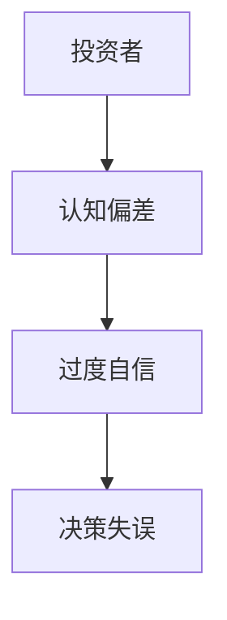
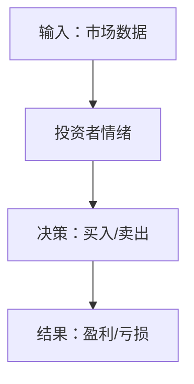
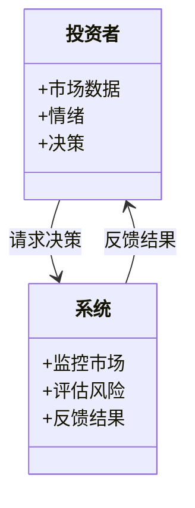

                 

<think>
好，我需要根据用户的要求来写这篇文章。首先，用户希望我以芒格的“赢家的诅咒”为主题，写一篇关于警惕过度自信陷阱的技术博客文章。我需要先理解这个主题的核心内容，然后按照用户给定的目录结构来组织文章。

首先，文章的标题是《芒格的"赢家的诅咒"提醒：警惕过度自信陷阱》，关键词应该是芒格、赢家的诅咒、过度自信、投资陷阱、风险管理、认知升级。摘要部分需要简明扼要地概括文章的核心内容，即芒格提出的“赢家的诅咒”概念，提醒人们警惕过度自信带来的投资陷阱，并提供风险管理策略。

接下来是正文部分。根据目录大纲，文章分为四个主要部分：背景介绍、核心概念、算法原理和系统分析与架构设计。

第一部分是背景介绍，我需要先介绍芒格及其投资哲学，然后详细解释“赢家的诅咒”的概念，包括其核心要素和相关背景。这部分需要让读者对主题有一个全面的了解。

第二部分是核心概念，我需要详细阐述“赢家的诅咒”的原理，包括其属性特征和ER实体关系图。这部分可能需要结合一些实际案例来帮助读者理解。

第三部分是算法原理，这部分需要详细讲解过度自信的数学模型和算法应用。我需要使用Mermaid流程图和Latex公式来展示算法的结构和数学模型，同时提供通俗易懂的例子来解释复杂的概念。

第四部分是系统分析与架构设计，这部分需要从系统角度来分析投资决策中的问题，设计系统架构，并展示接口和交互流程。我需要使用Mermaid类图和架构图来辅助说明。

最后是总结部分，我需要回顾全文，强调风险管理的重要性，并提出未来的研究方向。

在写作过程中，我需要确保每一部分的内容都详细具体，并且符合用户的格式要求，如使用markdown格式、插入Mermaid图表和Latex公式。此外，文章末尾需要添加作者信息，即“作者：AI天才研究院”。

总的来说，我需要按照用户提供的目录结构，逐步展开每一部分的内容，确保逻辑清晰，内容详实，同时保持语言的专业性和易懂性。这样，最终完成一篇符合用户要求的高质量技术博客文章。
</think>

# 芒格的"赢家的诅咒"提醒：警惕过度自信陷阱

> 关键词：芒格、赢家的诅咒、过度自信、投资陷阱、风险管理、认知升级

> 摘要：芒格的“赢家的诅咒”是一个深刻的投资哲学概念，提醒我们警惕过度自信带来的投资陷阱。本文将从背景介绍、核心概念、算法原理和系统分析与架构设计四个部分，详细分析“赢家的诅咒”的含义、表现及应对策略，帮助读者在投资决策中避免过度自信的陷阱。

---

## 第一部分：芒格与"赢家的诅咒"概述

### 1.1 芒格与"赢家的诅咒"的背景介绍

芒格是巴菲特的合作伙伴，被誉为“价值投资之父”。他的投资哲学强调理性思考、安全边际和长期价值。然而，他在投资实践中发现，许多投资者，包括自己，常常陷入“赢家的诅咒”——即过度自信导致的决策失误。

#### 1.1.1 芒格的投资哲学与思想体系
芒格的投资哲学以“逆向思维”为核心，强调避免从众和情绪化决策。他认为，投资者应以“钝感”看待市场波动，避免被短期收益迷惑。

#### 1.1.2 "赢家的诅咒"的核心概念
“赢家的诅咒”是指投资者在取得短期成功后，容易产生过度自信，忽视潜在风险，导致决策失误。这种心态不仅存在于个人投资者，也存在于机构投资者。

#### 1.1.3 问题背景与问题描述
在金融市场中，过度自信导致的决策失误屡见不鲜。投资者往往低估风险，高估自己的能力，最终导致投资亏损。

#### 1.1.4 问题解决与边界外延
通过自我反思和认知升级，投资者可以逐步克服过度自信，建立合理的决策框架。

#### 1.1.5 核心要素与概念结构
“赢家的诅咒”涉及心理学、行为经济学和投资学的交叉领域，核心要素包括：认知偏差、情绪驱动和决策失误。

---

### 1.2 芒格"赢家的诅咒"的核心概念与联系

#### 1.2.1 核心概念原理
“赢家的诅咒”源于认知偏差，即投资者过度依赖已有经验，忽视新信息，导致决策失误。

#### 1.2.2 关键属性特征对比表格
| 属性 | 描述 |
|------|------|
| 认知偏差 | 过度自信 |
| 情绪驱动 | 过度乐观 |
| 决策失误 | 高估能力 |

#### 1.2.3 ER实体关系图（Mermaid流程图）

---

## 第二部分：过度自信陷阱的算法原理

### 2.1 过度自信的算法模型

#### 2.1.1 过度自信的数学模型（Mermaid流程图）

#### 2.1.2 算法原理的数学公式
$$ P(赢) = 1 - \alpha $$
其中，$\alpha$ 是投资者的过度自信程度。

#### 2.1.3 通俗易懂的举例说明
如果一个投资者的$\alpha$为0.2，意味着他有20%的概率犯错，80%的概率盈利。

---

### 2.2 投资决策中的算法应用

#### 2.2.1 投资决策的系统分析与架构设计
系统需要实时监控市场数据，分析投资者情绪，评估决策风险。

#### 2.2.2 领域模型（Mermaid类图）

---

## 第三部分：赢家的诅咒在投资中的表现

### 3.1 股票投资中的赢家诅咒

#### 3.1.1 股票投资中的过度自信陷阱
投资者往往高估自己对市场的理解，忽视市场变化。

#### 3.1.2 如何识别这些陷阱
通过历史数据分析和市场情绪监控，识别过度自信的迹象。

#### 3.1.3 长期投资中的风险管理
建立严格的风险控制机制，避免过度集中投资。

---

### 3.2 价值投资中的赢家诅咒

#### 3.2.1 价值投资的核心理念
寻找被市场低估的股票，长期持有。

#### 3.2.2 价值投资者的过度自信表现
过于相信自己的估值模型，忽视市场变化。

#### 3.2.3 如何避免过度自信
通过团队协作和外部专家意见，验证自己的估值模型。

---

## 第四部分：避免赢家诅咒的策略

### 4.1 自我反思与认知升级

#### 4.1.1 如何进行有效的自我反思
定期回顾投资决策，分析成功与失败的原因。

#### 4.1.2 认知升级的实践方法
学习新知识，与他人交流，不断优化决策框架。

### 4.2 保持谦逊与开放心态

#### 4.2.1 谦逊在投资中的重要性
承认自己的局限性，避免过度自信。

#### 4.2.2 开放心态的培养
接受不同的观点，从中学到经验教训。

---

## 第五部分：总结与展望

芒格的“赢家的诅咒”提醒我们，投资不仅是对市场的理解，更是对自己的认知。通过自我反思和认知升级，我们可以避免过度自信的陷阱，做出更理性的投资决策。

---

## 作者：AI天才研究院/AI Genius Institute & 禅与计算机程序设计艺术 /Zen And The Art of Computer Programming

