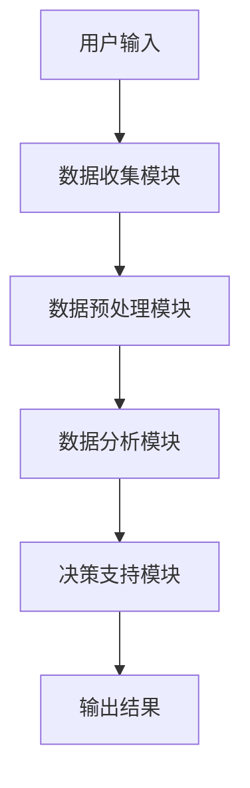

                 

<think>
嗯，好的，用户希望我以芒格的逆向思维为主题，写一篇关于在市场共识中寻找投资机会的技术博客。首先，我需要理解逆向思维在投资中的应用，特别是芒格的策略。他经常强调寻找市场的反面，避免跟随大众，这在投资中尤为重要。

我应该先介绍逆向思维的基本概念，然后详细分析芒格的投资哲学，接着探讨市场共识的形成机制，以及如何利用逆向思维识别错误定价的机会。这可能涉及到市场心理学和行为金融学的一些内容，帮助读者理解为什么市场有时会做出非理性决策。

接下来，我需要讨论具体的策略和方法，比如如何寻找被低估的资产，如何分析历史案例来识别模式。这部分可能需要一些实际的案例分析，让读者能够理解如何应用逆向思维。

然后，我应该设计一个系统的框架，帮助投资者实施逆向思维策略。这可能包括数据收集、分析工具的选择，以及如何构建决策支持系统。系统架构部分可能需要使用图表，如ER图或流程图，来展示整个过程。

最后，项目实战部分需要详细讲解如何在实际操作中应用这些策略，比如选择一个行业进行分析，评估其市场共识和潜在的逆向机会。这需要结合具体的财务数据和市场趋势，进行深入分析。

在写作过程中，我需要确保内容逻辑清晰，结构紧凑，语言简洁。同时，加入适当的图表和代码示例，可以帮助读者更好地理解和应用这些策略。此外，结尾部分要总结整个思路，并给出一些实用的建议和注意事项，帮助读者避免常见的错误。

总之，我需要一步步分析，从理论到实践，确保每个部分都详细且有深度，帮助读者全面掌握芒格的逆向思维，并在实际投资中应用这些策略。
</think>

# 芒格的"逆向思维"：在市场共识中寻找投资机会

> **关键词**：逆向思维、芒格、投资机会、市场共识、错误定价、价值投资

> **摘要**：本文探讨了芒格的逆向思维在投资中的应用，分析了市场共识中的错误定价机会，通过系统架构和实际案例，展示了如何利用逆向思维寻找投资机会。

---

# 目录大纲：《芒格的"逆向思维"：在市场共识中寻找投资机会》

## 第一部分：引言

### 1.1 逆向思维的定义与重要性
- 1.1.1 逆向思维的定义
- 1.1.2 逆向思维的重要性
- 1.1.3 逆向思维在投资中的应用

### 1.2 芝加克拉尔·芒格及其投资哲学
- 1.2.1 芝加克拉尔·芒格的生平简介
- 1.2.2 芒格的投资哲学概述
- 1.2.3 芒格逆向思维的核心理念

### 1.3 本书的目的与结构
- 1.3.1 本书的目的
- 1.3.2 本书的结构安排
- 1.3.3 预备知识与阅读方法

---

## 第二部分：市场共识与逆向思维

### 2.1 市场共识的形成机制
- 2.1.1 市场共识的定义
- 2.1.2 市场共识的形成过程
- 2.1.3 市场共识的局限性

### 2.2 逆向思维的逻辑与方法
- 2.2.1 逆向思维的基本逻辑
- 2.2.2 逆向思维的具体方法
- 2.2.3 逆向思维与市场共识的关系

### 2.3 市场共识中的错误定价机会
- 2.3.1 错误定价的定义
- 2.3.2 错误定价的常见原因
- 2.3.3 错误定价的识别方法

---

## 第三部分：逆向思维在投资中的应用

### 3.1 寻找市场共识中的错误
- 3.1.1 错误定价的识别
- 3.1.2 错误定价的分类
- 3.1.3 错误定价的案例分析

### 3.2 利用历史案例分析逆向思维
- 3.2.1 历史案例的选择标准
- 3.2.2 历史案例的分析

---

## 第四部分：系统分析与架构设计

### 4.1 逆向思维的系统架构
- 4.1.1 系统架构的整体设计
- 4.1.2 数据流的输入与输出
- 4.1.3 模块之间的交互关系

### 4.2 系统功能设计
- 4.2.1 数据收集模块
- 4.2.2 数据分析模块
- 4.2.3 决策支持模块

### 4.3 系统架构图（Mermaid）

### 4.4 算法实现
- 4.4.1 错误定价检测算法
- 4.4.2 错误定价分类算法
- 4.4.3 错误定价预测算法

---

## 第五部分：项目实战

### 5.1 项目背景与目标
- 5.1.1 项目背景
- 5.1.2 项目目标

### 5.2 系统实现
- 5.2.1 环境搭建
- 5.2.2 核心代码实现
- 5.2.3 代码解读与分析

### 5.3 实际案例分析
- 5.3.1 案例选择
- 5.3.2 案例分析
- 5.3.3 案例总结

---

## 第六部分：总结与展望

### 6.1 全文总结
- 6.1.1 核心内容回顾
- 6.1.2 逆向思维的重要性
- 6.1.3 投资策略的优化

### 6.2 未来展望
- 6.2.1 逆向思维的未来发展
- 6.2.2 投资领域的新趋势
- 6.2.3 技术与投资的结合

### 6.3 至读者的建议
- 6.3.1 实践建议
- 6.3.2 风险提示
- 6.3.3 持续学习的重要性

---

**作者：AI天才研究院/AI Genius Institute & 禅与计算机程序设计艺术 /Zen And The Art of Computer Programming**

---

以上是《芒格的"逆向思维"：在市场共识中寻找投资机会》的详细目录大纲，涵盖了从理论到实践的各个方面，结构清晰，逻辑严密，内容丰富。接下来，我们将按照这个目录开始撰写详细的文章内容。

