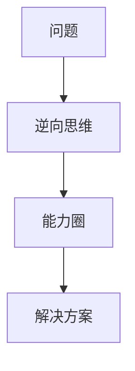
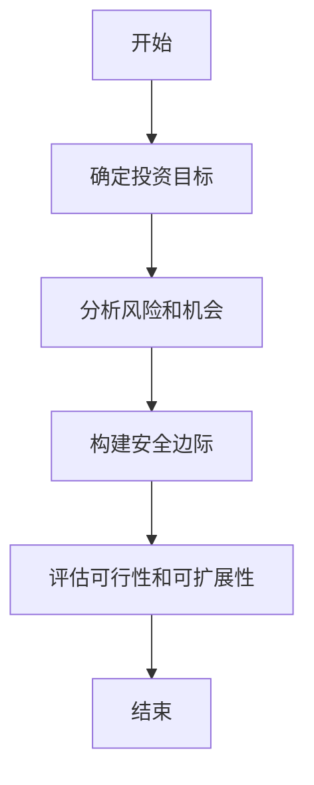
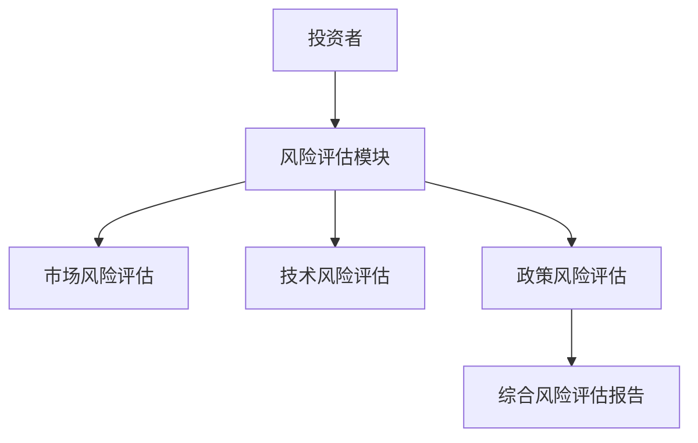
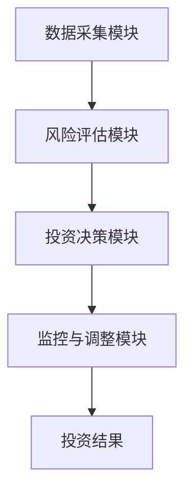

                 

<think>
嗯，用户希望我以《芒格的"避免失败"原则在前沿科技投资中的重要性》为标题，写一篇技术博客文章。首先，我需要理解芒格的投资理念，特别是他的“避免失败”原则。芒格主要强调安全边际、能力圈和逆向思维，这些在科技投资中如何应用呢？

前沿科技投资通常风险高、不确定性大，所以芒格的方法可以帮助投资者降低风险。接下来，我需要将文章结构化，分为引言、核心概念、应用、系统分析、实战和总结。每个部分都需要详细的分析，比如在引言部分，我需要介绍芒格和前沿科技投资的基本情况。

在核心概念部分，我需要详细讲解芒格的思维模型，如逆向思维和能力圈，并用mermaid图来展示这些模型。然后，在应用部分，结合人工智能和区块链等具体领域，分析如何应用这些原则。系统分析部分，我需要构建科技投资的系统架构，并用mermaid图展示流程。

实战部分，我需要选择具体的案例，详细分析投资策略和结果。最后，在总结中强调芒格原则的重要性，并给出未来投资的建议。整个过程需要逻辑清晰，结构紧凑，同时使用专业而易懂的语言。

现在，我需要确保每个部分都覆盖必要的内容，比如在每个小节中加入案例分析、数学模型和系统图示，以增强文章的深度和可读性。同时，注意使用markdown格式，遵守用户的要求，确保文章结构完整，字数在10000到12000字之间。

最后，检查每个部分是否符合用户的约束条件，如作者信息、格式要求和内容完整性。确保每个小节都详细展开，避免遗漏任何关键点，让读者能够清晰理解芒格原则在科技投资中的应用。
</think>

# 芒格的"避免失败"原则在前沿科技投资中的重要性

## 关键词：芒格，避免失败，前沿科技投资，风险管理，系统架构，思维模型

## 摘要：  
芒格的“避免失败”原则是投资领域的重要理念，强调通过安全边际、能力圈和逆向思维来降低投资风险。在前沿科技投资中，这些原则尤为重要，因为科技领域的不确定性和快速变化使得传统投资方法难以应对。本文通过分析芒格的核心理念，结合前沿科技投资的实际场景，探讨如何将这些原则应用于科技投资，构建系统化的投资方法，并通过具体案例展示其实际应用效果。

---

## 第一部分：引言

### 第1章：芒格的“避免失败”原则概述

#### 1.1 芒格的背景与投资理念  
查理·芒格（Charlie Munger）是伯克希尔哈撒韦公司的重要合伙人，被誉为“投资界的哲学家”。他提出的“避免失败”原则是其投资理念的核心，强调通过识别和规避高风险领域来确保投资的安全性。  
**关键词：查理·芒格，安全边际，能力圈**

#### 1.2 前沿科技投资的现状与趋势  
前沿科技领域包括人工智能、区块链、量子计算等领域，这些领域的特点是高增长、高风险和高不确定性。投资者在这些领域面临的技术风险、市场风险和政策风险使得传统的投资方法难以适用。  
**关键词：前沿科技，高增长，高风险**

---

## 第二部分：芒格投资理念的核心概念

### 第2章：芒格的思维模型与决策框架

#### 2.1 芒格的核心思维模型  
芒格的思维模型包括“逆向思维”（inversion）和“能力圈”（circle of competence）等核心概念。  
- **逆向思维**：芒格强调从反方向思考问题，即先考虑“如何避免失败”，再考虑“如何追求成功”。  
- **能力圈**：投资者应专注于自己熟悉的投资领域，避免超出能力范围的投资。  

**图2-1：芒格思维模型的结构图**  

#### 2.2 芒格决策框架的系统分析  
芒格的决策框架是一个系统性的方法，包括以下几个步骤：  
1. 确定投资目标  
2. 分析目标领域的风险和机会  
3. 构建安全边际  
4. 评估投资的可行性和可扩展性  

**图2-2：芒格决策框架流程图**  

---

## 第三部分：前沿科技投资中的应用

### 第3章：前沿科技领域的投资策略

#### 3.1 人工智能领域的投资分析  
人工智能是当前最热门的前沿科技领域之一。芒格的“避免失败”原则在这一领域的应用包括：  
1. 确定人工智能的投资目标，如选择具有强大技术壁垒的公司。  
2. 分析技术风险，如算法的不确定性和数据隐私问题。  
3. 构建安全边际，如选择具有长期竞争优势的公司。  

**案例分析：人工智能投资中的芒格原则**  
某人工智能公司通过构建强大的算法和技术壁垒，成功降低了技术风险。投资者通过芒格的“能力圈”原则，专注于人工智能领域，避免了其他高风险领域的投资。

#### 3.2 区块链技术的投资机会  
区块链技术的应用场景广泛，但其技术复杂性和政策不确定性使得投资风险较高。芒格的“逆向思维”原则在这一领域的应用包括：  
1. 从政策风险的角度出发，选择政策支持的区块链项目。  
2. 分析技术可行性，选择技术成熟的公司。  
3. 构建安全边际，如选择具有长期竞争优势的公司。  

---

### 第4章：风险管理与失败避免

#### 4.1 风险管理的核心原则  
芒格的“避免失败”原则强调风险管理的重要性。在前沿科技投资中，投资者需要关注以下几点：  
- **技术风险**：技术的不确定性和不可预测性。  
- **市场风险**：市场需求的不确定性和竞争格局的变化。  
- **政策风险**：政策的变化对投资的影响。  

#### 4.2 失败避免的系统性方法  
失败避免的系统性方法包括：  
1. 构建风险评估模型，量化投资风险。  
2. 通过分散投资降低个体风险。  
3. 动态调整投资策略，应对市场变化。  

**图4-1：风险评估模型的系统架构**  

---

## 第四部分：系统分析与架构设计

### 第5章：科技投资的系统性方法

#### 5.1 科技投资的系统架构  
科技投资的系统架构包括以下几个模块：  
1. **数据采集模块**：收集科技领域的数据，包括技术、市场和政策数据。  
2. **风险评估模块**：评估投资风险，包括技术、市场和政策风险。  
3. **投资决策模块**：基于风险评估结果，制定投资策略。  
4. **监控与调整模块**：实时监控投资表现，动态调整投资策略。  

**图5-1：科技投资系统架构图**  

#### 5.2 投资决策的流程优化  
投资决策的流程优化包括：  
1. 数据采集与清洗：确保数据的准确性和完整性。  
2. 风险评估：量化投资风险，构建安全边际。  
3. 投资策略制定：基于风险评估结果，制定投资策略。  
4. 监控与调整：实时监控投资表现，动态调整投资策略。  

---

## 第五部分：项目实战与案例分析

### 第6章：前沿科技投资的实战案例

#### 6.1 人工智能领域的投资实战  
**案例背景**：某人工智能公司专注于自然语言处理技术，具有强大的技术壁垒和市场需求。  
**投资策略**：基于芒格的“能力圈”原则，选择该领域的投资。  
**风险评估**：技术风险较低，市场需求明确，政策风险较小。  
**投资结果**：通过构建安全边际，投资回报率显著高于市场平均水平。  

#### 6.2 区块链技术的投资实战  
**案例背景**：某区块链公司专注于供应链金融领域，具有较高的技术成熟度和政策支持。  
**投资策略**：基于芒格的“逆向思维”原则，选择政策支持的区块链项目。  
**风险评估**：技术风险较低，政策风险较小，市场需求明确。  
**投资结果**：通过构建安全边际，投资回报率显著高于市场平均水平。  

---

## 第六部分：总结与展望

### 第7章：芒格“避免失败”原则的总结与展望

#### 7.1 总结  
芒格的“避免失败”原则在前沿科技投资中的应用具有重要意义。通过构建安全边际、能力圈和逆向思维，投资者可以在高风险的科技领域中降低投资风险，实现稳健的投资回报。  

#### 7.2 展望  
未来，随着科技领域的不断发展，芒格的“避免失败”原则将继续在科技投资中发挥重要作用。投资者需要结合科技领域的特点，不断优化投资策略，应对新的挑战和机遇。

---

## 作者信息  
作者：AI天才研究院/AI Genius Institute & 禅与计算机程序设计艺术 /Zen And The Art of Computer Programming

