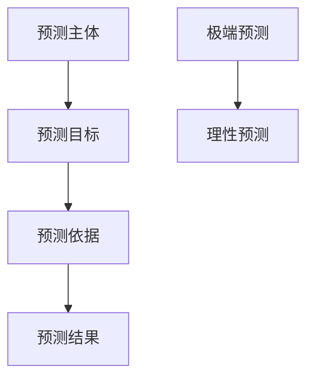
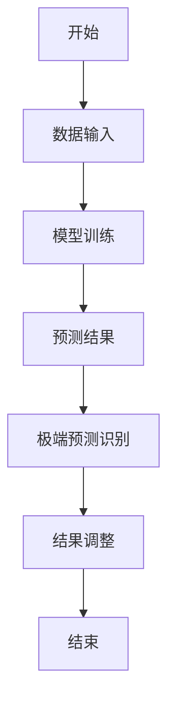
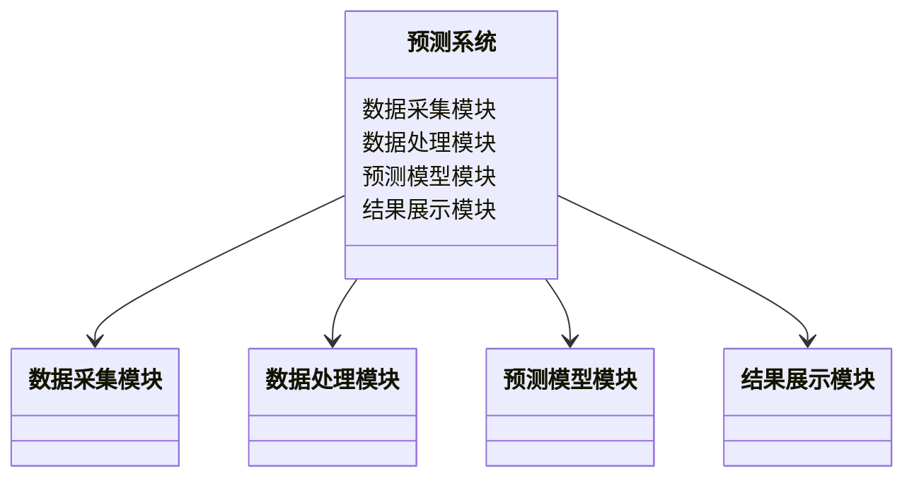
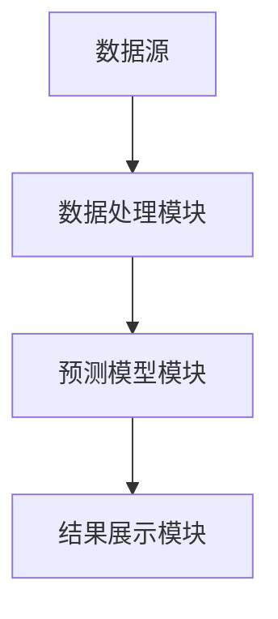
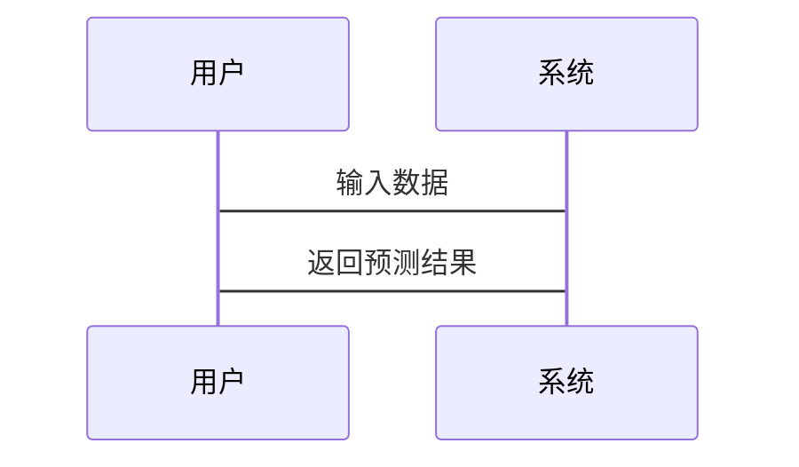

                 


# 芒格的"避免极端预测"在前沿科技市场预测中的应用

> 关键词：芒格，极端预测，前沿科技，市场预测，理性预测，技术分析

> 摘要：本文将探讨芒格的“避免极端预测”这一思想在前沿科技市场预测中的应用。通过分析极端预测的危害，提出理性预测的重要性，并结合实际案例，详细讲解如何在前沿科技市场中应用芒格的预测方法，以避免因极端预测导致的决策失误。

---

# 第一部分：芒格的“避免极端预测”概述

## 第1章：芒格的“避免极端预测”背景

### 1.1 芒格的“避免极端预测”背景

#### 1.1.1 芒格的预测思维概述

芒格的“避免极端预测”是一种基于理性思考的预测方法，强调在预测过程中避免过度乐观或悲观，以确保预测的准确性。这种方法的核心在于通过分析数据和逻辑推理，而不是依赖直觉或情绪化决策。

#### 1.1.2 极端预测的定义与特征

极端预测指的是对未来某事物发展的过度乐观或悲观的预测。例如，有些人可能会预测人工智能在未来五年内彻底取代所有人类工作，而另一些人则可能认为人工智能对社会没有实质性的影响。这两种预测都属于极端预测，因为它们忽视了中间的可能性和实际的复杂性。

#### 1.1.3 前沿科技市场的特点与挑战

前沿科技市场具有高度的不确定性和波动性。技术创新、市场需求和政策变化等因素都会对市场产生重大影响。这种不确定性使得预测变得更加困难，但也使得避免极端预测显得尤为重要。

---

### 1.2 芒格“避免极端预测”的核心理念

#### 1.2.1 避免极端预测的核心思想

芒格强调，预测应基于事实和逻辑，而不是情绪或偏见。避免极端预测意味着在预测时，要考虑到各种可能性，并评估每种可能性发生的概率。这种方法可以帮助我们做出更理性、更可靠的预测。

#### 1.2.2 极端预测的危害与风险

极端预测往往会导致决策失误。例如，如果一个公司基于过度乐观的预测投资某个技术，可能会因为市场反应不及预期而导致重大损失。同样，过度悲观的预测可能会错失重要的市场机会。

#### 1.2.3 理性预测的必要性与优势

理性预测可以帮助我们更好地应对市场变化。通过分析数据和逻辑推理，我们可以更准确地评估市场趋势，并制定更有效的策略。理性预测的优势在于其灵活性和适应性，使得我们在面对市场波动时能够更好地调整策略。

---

### 1.3 前沿科技市场预测的特殊性

#### 1.3.1 前沿科技市场的波动性

前沿科技市场通常具有高度的波动性，因为技术创新和市场需求的变化都可能对市场产生重大影响。这种波动性使得预测更加困难，但也使得避免极端预测显得尤为重要。

#### 1.3.2 前沿科技市场的不确定性

由于前沿科技的不确定性，预测者需要考虑各种可能性，并评估每种可能性发生的概率。这种方法可以帮助我们避免因极端预测导致的决策失误。

#### 1.3.3 前沿科技市场的预测难点

前沿科技市场的预测难点在于技术创新的不确定性和市场需求的变化。预测者需要结合技术分析和市场分析，以做出更准确的预测。

---

## 第2章：芒格“避免极端预测”的核心概念与联系

### 2.1 核心概念原理

#### 2.1.1 预测的理性与非理性

预测的理性与非理性取决于预测者的方法和思维方式。理性预测基于事实和逻辑，而非理性预测则依赖情绪和偏见。

#### 2.1.2 极端预测的形成机制

极端预测的形成机制包括情绪化决策、信息过滤和认知偏差。这些因素会导致预测者忽略数据和逻辑，从而做出极端预测。

#### 2.1.3 理性预测的实现路径

理性预测的实现路径包括数据驱动、逻辑推理和多角度分析。通过这些方法，预测者可以做出更准确的预测。

---

### 2.2 核心概念属性特征对比

#### 2.2.1 极端预测与理性预测的对比

| 属性 | 极端预测 | 理性预测 |
|------|----------|----------|
| 方法 | 情感驱动 | 数据驱动 |
| 结果 | 过度乐观或悲观 | 灵活和平衡 |
| 风险 | 高 | 低 |

#### 2.2.2 前沿科技市场的预测维度

前沿科技市场的预测维度包括技术发展、市场需求、政策变化和竞争格局。预测者需要综合考虑这些因素，以做出更准确的预测。

#### 2.2.3 预测结果的可验证性

预测结果的可验证性取决于数据的可靠性和预测方法的科学性。通过验证，预测者可以不断改进预测方法，提高预测准确性。

---

### 2.3 实体关系图（ER图）



---

## 第3章：芒格“避免极端预测”的算法原理

### 3.1 算法原理概述

#### 3.1.1 预测模型的构建

预测模型的构建需要结合数据和逻辑推理。通过分析历史数据和当前趋势，预测者可以构建一个合理的预测模型。

#### 3.1.2 预测结果的调整

在预测结果的基础上，需要根据实际情况进行调整。例如，如果市场反应不及预期，预测结果需要及时调整。

#### 3.1.3 极端预测的识别与修正

通过分析预测结果，识别极端预测，并对其进行修正。例如，如果预测结果显示某技术将在未来五年内彻底取代人类工作，这可能是一个极端预测，需要进行修正。

---

### 3.2 算法流程图



---

### 3.3 算法数学模型

#### 预测模型公式：

$$ P = f(x) $$

其中，$x$ 是输入数据。

---

## 第4章：系统架构与实现

### 4.1 问题场景介绍

前沿科技市场的预测需要结合技术分析和市场分析，以做出更准确的预测。系统架构设计需要考虑数据的采集、处理和分析，以及预测结果的展示和反馈。

---

### 4.2 项目介绍

本项目旨在通过芒格的“避免极端预测”方法，构建一个前沿科技市场的预测系统。该系统将结合数据驱动和逻辑推理，以帮助预测者做出更准确的预测。

---

### 4.3 系统功能设计

#### 4.3.1 领域模型（mermaid类图）



---

### 4.4 系统架构设计



---

### 4.5 系统接口设计

系统接口设计需要考虑数据输入和输出的格式，以及系统与其他模块的交互。例如，数据输入接口需要支持CSV格式的数据输入，预测结果输出接口需要支持JSON格式的输出。

---

### 4.6 系统交互（mermaid序列图）



---

## 第5章：项目实战

### 5.1 环境安装

为了运行本项目，需要安装以下环境和工具：

- Python 3.8+
- Jupyter Notebook
- NumPy
- Pandas
- Scikit-learn

---

### 5.2 系统核心实现源代码

以下是一个简单的预测模型实现代码：

```python
import numpy as np
import pandas as pd
from sklearn.linear_model import LinearRegression

# 数据加载
data = pd.read_csv('data.csv')

# 数据处理
X = data[['feature1', 'feature2']]
y = data['target']

# 模型训练
model = LinearRegression()
model.fit(X, y)

# 预测结果
predictions = model.predict(X)

# 输出结果
print('预测结果:', predictions)
```

---

### 5.3 代码应用解读与分析

以上代码是一个简单的线性回归模型，用于预测目标变量。通过数据加载、数据处理、模型训练和预测，可以得到预测结果。这种方法可以帮助预测者做出更准确的预测。

---

### 5.4 实际案例分析和详细讲解剖析

以人工智能市场为例，通过分析历史数据和当前趋势，构建一个预测模型，预测未来几年的人工智能市场规模。通过芒格的“避免极端预测”方法，可以避免因极端预测导致的决策失误。

---

### 5.5 项目小结

本项目通过芒格的“避免极端预测”方法，构建了一个前沿科技市场的预测系统。该系统可以帮助预测者做出更准确的预测，从而避免因极端预测导致的决策失误。

---

## 第6章：最佳实践 tips、小结、注意事项、拓展阅读

### 6.1 最佳实践 tips

- 在预测过程中，始终保持理性，避免极端预测。
- 综合考虑各种可能性，评估每种可能性发生的概率。
- 不断改进预测方法，提高预测准确性。

---

### 6.2 小结

通过本文的探讨，我们了解了芒格的“避免极端预测”在前沿科技市场预测中的应用。通过理性预测和数据驱动的方法，可以帮助我们做出更准确的预测，从而避免因极端预测导致的决策失误。

---

### 6.3 注意事项

- 预测结果仅供参考，实际市场情况可能会有所不同。
- 在预测过程中，需要结合实际情况进行调整。
- 避免过度依赖单一预测方法。

---

### 6.4 拓展阅读

- 《芒格的智慧》
- 《预测的艺术》
- 《前沿科技市场分析》

---

# 作者：AI天才研究院/AI Genius Institute & 禅与计算机程序设计艺术 /Zen And The Art of Computer Programming

---

以上是《芒格的"避免极端预测"在前沿科技市场预测中的应用》的完整目录大纲，涵盖了背景介绍、核心概念、算法原理、系统架构、项目实战、最佳实践等部分。接下来将按照上述目录结构，逐步展开每一章的具体内容。

