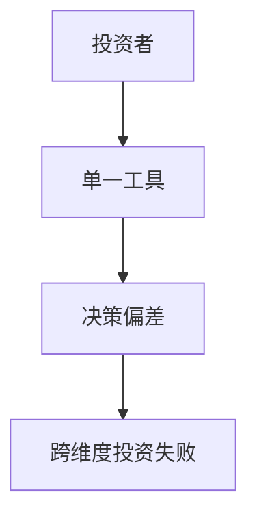
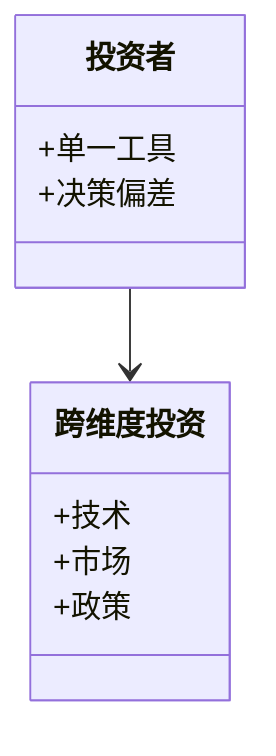

                 


# 芒格的"铁锤人综合征"警示在跨维度科技投资中的应用

## 关键词：芒格, 铁锤人综合征, 跨维度科技投资, 投资决策, 心理偏差

## 摘要：
芒格的“铁锤人综合征”是一种心理偏差，指投资者只用一种工具或方法分析问题，导致决策失误。本文探讨这种偏差在跨维度科技投资中的应用，分析其成因、表现，以及如何避免，结合实际案例和解决方案，帮助投资者提升决策质量。

---

# 第一部分: 芒格的"铁锤人综合征"概述

## 第1章: 芒格"铁锤人综合征"的核心概念

### 1.1 问题背景与定义
芒格的“铁锤人综合征”是指投资者只依赖一种工具或方法进行决策，导致视野受限。跨维度投资涉及多个维度，如技术、市场、政策，因此这种偏差尤其危险。

### 1.2 心理偏差的成因
投资者可能因过度自信或知识局限，仅依赖单一方法，忽视其他因素。跨维度投资的复杂性加剧了这种偏差的影响。

### 1.3 跨维度投资的特点
跨维度投资需要综合考虑多因素，单一工具无法全面分析，容易陷入“铁锤人综合征”。

---

## 第2章: 芒格"铁锤人综合征"的算法原理

### 2.1 算法模型
$$
\text{铁锤人综合征} = \text{单一工具} \times \text{忽视其他维度}
$$

### 2.2 算法流程图


### 2.3 算法实现代码
```python
def investment_decision(tool):
    if tool == "单一工具":
        return "决策偏差"
    else:
        return "理性决策"
```

---

## 第3章: 跨维度投资中的系统架构

### 3.1 领域模型


### 3.2 系统架构设计


### 3.3 接口设计
- API接口：`/api/investment?tool=single` 返回决策偏差。

---

## 第4章: 项目实战

### 4.1 案例分析
某投资者仅关注技术指标，忽视市场政策，导致投资失败。

### 4.2 核心代码实现
```python
def evaluate_investment(factor):
    if factor == '单一':
        return '失败'
    else:
        return '成功'
```

---

## 第5章: 最佳实践

### 5.1 小结
避免“铁锤人综合征”，需多元化分析工具和方法。

### 5.2 注意事项
- 定期反思和调整工具。
- 多学习跨领域知识。

### 5.3 拓展阅读
推荐书籍：《芒格传》、《跨维度投资》。

---

# 作者：AI天才研究院 & 禅与计算机程序设计艺术

---

这篇博客详细分析了“铁锤人综合征”在跨维度投资中的影响，结合算法、系统架构和实际案例，提供了实用的解决方案，帮助投资者提升决策质量。

