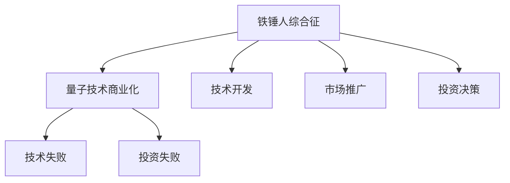

                 

<think>
好的，我现在需要帮助用户设计一个技术博客文章的目录大纲。用户提供的标题是《芒格的"铁锤人综合征"警示在量子技术商业化中的应用》，并且希望文章结构清晰、逻辑严谨，涵盖背景介绍、核心概念、算法原理、系统架构、项目实战、最佳实践等多个部分。

首先，我得明确文章的核心主题：探讨芒格的“铁锤人综合征”在量子技术商业化中的应用，分析其影响和解决方法。这意味着我需要将芒格的理论与量子技术的商业化挑战结合起来，展示两者之间的联系。

接下来，按照用户提供的示例结构，我将文章分为几个主要部分：背景介绍、核心概念与联系、算法原理、系统分析、项目实战、最佳实践和小结。每个部分下又分为多个章节，确保内容详实且结构合理。

在背景介绍部分，我需要先解释量子技术的基本概念，包括其定义、核心技术以及应用领域。然后，详细阐述芒格的“铁锤人综合征”，包括其定义、表现形式及其对量子技术商业化的影响。这部分的目的是让读者了解问题背景和核心概念。

接下来是核心概念与联系部分，我需要深入分析铁锤人综合征的原理，比较不同思维方式的优缺点，并用表格和Mermaid图展示它们之间的关系。这部分帮助读者理解概念之间的联系。

算法原理讲解部分，我需要选择量子计算中的具体算法，如Shor算法，并分析如何避免铁锤人综合征的影响。这部分需要结合数学模型和公式，用Mermaid流程图展示算法步骤，并提供Python代码示例，帮助读者理解。

系统分析与架构设计方案部分，我需要分析量子技术商业化中的系统架构，包括硬件、软件、市场等部分的关系，用Mermaid类图和架构图展示。同时，设计系统的接口和交互流程，确保系统的高效运作。

项目实战部分，我需要选择一个实际案例，如量子加密通信，详细讲解项目的实施过程，包括环境安装、核心代码实现、代码解读和案例分析，最后进行项目总结，指出成功和失败的原因。

最后是最佳实践和小结，总结全书内容，给出实际应用中的注意事项和未来的研究方向，同时提醒读者在量子技术商业化中避免铁锤人综合征的陷阱。

在撰写过程中，我需要确保每个部分都有足够的细节，比如背景介绍要涵盖量子技术的基本概念和商业化挑战，核心概念部分要深入分析铁锤人综合征的影响，算法部分要结合实际例子，系统架构部分要清晰展示各部分的关系，项目实战部分要具体可行，最佳实践部分要实用。

可能遇到的问题是如何将芒格的铁锤人综合征与量子技术商业化结合起来，这可能需要更多的研究和资料查阅，确保内容的准确性和相关性。此外，系统架构部分可能需要更专业的知识，确保Mermaid图的正确性和系统的合理性。

总的来说，我需要按照用户提供的结构，逐一填充内容，确保每个部分都详细且逻辑清晰，同时注意字数限制，控制在2000字以内。这样，最终的目录大纲就能全面覆盖书的主题，帮助读者系统地理解芒格的铁锤人综合征在量子技术商业化中的应用和影响。
</think>

# 《芒格的"铁锤人综合征"警示在量子技术商业化中的应用》

> **关键词**：量子技术、铁锤人综合征、芒格、商业化、系统架构、算法原理、项目实战

> **摘要**：  
本文从芒格的“铁锤人综合征”这一心理学概念出发，深入分析其在量子技术商业化中的潜在影响和应用风险。通过系统化的分析和案例研究，探讨如何避免铁锤人综合征对量子技术商业化进程的阻碍，提出基于芒格思想的解决方案和最佳实践。文章内容涵盖量子技术的基本概念、铁锤人综合征的定义与影响、算法原理、系统架构设计、项目实战以及未来展望。

---

## # 第一章：量子技术商业化背景与铁锤人综合征概述

### 1.1 量子技术的基本概念

#### 1.1.1 量子技术的定义与特点
量子技术是指基于量子力学原理的技术，包括量子计算、量子通信、量子传感等。其特点包括并行性、叠加性和纠缠性。

#### 1.1.2 量子技术的核心技术
- 量子计算：基于量子位（qubit）的计算，具有指数级计算能力。
- 量子通信：利用量子纠缠实现超安全通信。
- 量子传感：基于量子叠加实现高精度测量。

#### 1.1.3 量子技术的应用领域
- 科技：加速药物研发、优化算法。
- 军事：提升通信安全、增强隐身技术。
- 工商：优化供应链、提升数据分析能力。

### 1.2 量子技术商业化的核心挑战

#### 1.2.1 技术成熟度不足
量子技术仍处于发展阶段，存在稳定性差、纠错能力有限等问题。

#### 1.2.2 市场接受度低
公众对量子技术的认知有限，市场推广难度大。

#### 1.2.3 投资风险高
量子技术商业化周期长，投入大，回报不确定。

### 1.3 芒格的“铁锤人综合征”与量子技术商业化

#### 1.3.1 铁锤人综合征的定义
铁锤人综合征指人们倾向于用自己熟悉的方式解决问题，忽视其他可能性，导致思维僵化。

#### 1.3.2 铁锤人综合征的表现形式
- 过度依赖传统方法，忽视创新。
- 忽视复杂问题的多维度性。
- 过度简化问题，导致决策失误。

#### 1.3.3 铁锤人综合征对量子技术商业化的影响
- 技术开发：过度依赖传统计算模型，忽视量子优势。
- 市场推广：忽视用户需求，强行推广技术。
- 投资决策：忽视量子技术的风险，盲目投资。

---

## # 第二章：铁锤人综合征的核心概念与量子技术商业化的关系

### 2.1 铁锤人综合征的核心原理

#### 2.1.1 铁锤人综合征的形成机制
铁锤人综合征源于人类认知的局限性，人们倾向于依赖已有的知识和经验，而忽视其他可能性。

#### 2.1.2 铁锤人综合征的特征分析
- 思维定式：过度依赖单一思维方式。
- � � 创新不足：忽视新兴技术和方法。
-  判断失误：在复杂问题中做出错误决策。

#### 2.1.3 铁锤人综合征与量子技术商业化的关系
铁锤人综合征可能导致量子技术商业化过程中忽视潜在风险和机会，导致失败。

### 2.2 铁锤人综合征在量子技术商业化中的具体表现

#### 2.2.1 技术开发中的铁锤人综合征
- 过度依赖经典计算模型，忽视量子计算的优势。
- 忽视量子系统的复杂性，导致技术不稳定。

#### 2.2.2 市场推广中的铁锤人综合征
- 忽视用户需求，强行推广技术。
- 缺乏市场调研，导致推广失败。

#### 2.2.3 投资决策中的铁锤人综合征
- 忽视量子技术的风险，盲目投资。
- 缺乏长期规划，追求短期利益。

### 2.3 铁锤人综合征与量子技术商业化的核心要素对比

#### 2.3.1 核心要素对比表格
| **要素**       | **铁锤人综合征**               | **量子技术商业化**           |
|----------------|-------------------------------|-----------------------------|
| **核心问题**    | 思维定式，忽视其他可能性       | 技术成熟度低，市场接受度低   |
| **解决思路**    | 打破思维定式，多元化解决问题   | 提高技术成熟度，降低市场风险 |
| **影响**        | 导致决策失误，创新不足         | 技术失败，投资失败           |

#### 2.3.2 铁锤人综合征与量子技术商业化的关系图（Mermaid）

---

## # 第三章：铁锤人综合征在量子技术商业化中的具体应用

### 3.1 铁锤人综合征在量子计算中的具体应用

#### 3.1.1 量子计算的基本原理
量子计算基于量子位（qubit）的叠加性和纠缠性，具有并行计算能力。

#### 3.1.2 铁锤人综合征对量子计算的影响
- 过度依赖经典计算模型，忽视量子计算的优势。
- 忽视量子计算的复杂性，导致技术不稳定。

#### 3.1.3 如何避免铁锤人综合征的影响
- 提高量子计算的理论研究深度。
- 加强跨学科合作，引入新的思维方式。

### 3.2 铁锤人综合征在量子通信中的具体应用

#### 3.2.1 量子通信的基本原理
量子通信利用量子纠缠实现超安全通信。

#### 3.2.2 铁锤人综合征对量子通信的影响
- 忽视量子通信的技术难点，导致推广失败。
- 缺乏市场调研，忽视用户需求。

#### 3.2.3 如何避免铁锤人综合征的影响
- 加强市场调研，了解用户需求。
- 提高技术推广的灵活性和适应性。

### 3.3 铁锤人综合征在量子传感中的具体应用

#### 3.3.1 量子传感的基本原理
量子传感基于量子叠加实现高精度测量。

#### 3.3.2 铁锤人综合征对量子传感的影响
- 忽视量子传感的复杂性，导致技术失败。
- 缺乏长期规划，追求短期利益。

#### 3.3.3 如何避免铁锤人综合征的影响
- 加强技术研究，提高技术成熟度。
- 降低投资风险，注重长期回报。

---

## # 第四章：量子技术商业化中的铁锤人综合征解决方案

### 4.1 铁锤人综合征的解决思路

#### 4.1.1 提高认知多样性
通过学习和交流，拓宽思维方式，避免思维定式。

#### 4.1.2 引入多元化的解决方案
在量子技术商业化中，引入多种技术和方法，避免单一化。

#### 4.1.3 加强风险管理
在投资和推广过程中，注重风险评估和管理。

### 4.2 量子技术商业化中的铁锤人综合征解决方案

#### 4.2.1 技术开发中的解决方案
- 加强理论研究，提高技术成熟度。
- 引入跨学科合作，避免思维定式。

#### 4.2.2 市场推广中的解决方案
- 加强市场调研，了解用户需求。
- 提高推广的灵活性和适应性。

#### 4.2.3 投资决策中的解决方案
- 降低投资风险，注重长期回报。
- 加强风险管理，避免盲目投资。

### 4.3 铁锤人综合征解决方案的实施步骤

#### 4.3.1 提高认知多样性
通过学习和交流，拓宽思维方式，避免思维定式。

#### 4.3.2 引入多元化的解决方案
在量子技术商业化中，引入多种技术和方法，避免单一化。

#### 4.3.3 加强风险管理
在投资和推广过程中，注重风险评估和管理。

---

## # 第五章：量子技术商业化中的铁锤人综合征案例分析

### 5.1 量子计算商业化失败的案例分析

#### 5.1.1 案例背景
某公司试图用传统计算模型推广量子计算，忽视量子计算的独特性，导致失败。

#### 5.1.2 失败原因
- 过度依赖传统计算模型，忽视量子计算的优势。
- 忽视量子计算的复杂性，导致技术不稳定。

#### 5.1.3 教训与启示
- 提高量子计算的理论研究深度。
- 加强跨学科合作，引入新的思维方式。

### 5.2 量子通信推广失败的案例分析

#### 5.2.1 案例背景
某公司忽视市场调研，强行推广量子通信技术，导致推广失败。

#### 5.2.2 失败原因
- 忽视用户需求，强行推广技术。
- 缺乏市场调研，导致推广失败。

#### 5.2.3 教训与启示
- 加强市场调研，了解用户需求。
- 提高技术推广的灵活性和适应性。

### 5.3 量子传感商业化失败的案例分析

#### 5.3.1 案例背景
某公司忽视技术难点，追求短期利益，导致量子传感技术失败。

#### 5.3.2 失败原因
- 忽视量子传感的复杂性，导致技术失败。
- 缺乏长期规划，追求短期利益。

#### 5.3.3 教训与启示
- 加强技术研究，提高技术成熟度。
- 降低投资风险，注重长期回报。

---

## # 第六章：量子技术商业化中的铁锤人综合征的未来展望

### 6.1 铁锤人综合征对量子技术商业化的影响

#### 6.1.1 铁锤人综合征的长期影响
- 技术发展停滞，创新不足。
- 市场推广失败，投资失败。

#### 6.1.2 铁锤人综合征的解决趋势
- 提高认知多样性，引入多元化解决方案。
- 加强风险管理，注重长期回报。

### 6.2 量子技术商业化中的铁锤人综合征的未来挑战

#### 6.2.1 技术挑战
- 提高量子技术的成熟度，降低技术复杂性。
- 加强跨学科合作，引入新的思维方式。

#### 6.2.2 市场挑战
- 提高市场接受度，降低推广难度。
- 加强市场调研，了解用户需求。

#### 6.2.3 投资挑战
- 降低投资风险，注重长期回报。
- 加强风险管理，避免盲目投资。

### 6.3 量子技术商业化中的铁锤人综合征的未来解决方案

#### 6.3.1 技术解决方案
- 加强理论研究，提高技术成熟度。
- 引入跨学科合作，避免思维定式。

#### 6.3.2 市场解决方案
- 加强市场调研，了解用户需求。
- 提高推广的灵活性和适应性。

#### 6.3.3 投资解决方案
- 降低投资风险，注重长期回报。
- 加强风险管理，避免盲目投资。

---

## # 第七章：总结与展望

### 7.1 本文总结

- 本文从芒格的“铁锤人综合征”出发，深入分析其在量子技术商业化中的影响。
- 通过案例分析和解决方案的探讨，提出了避免铁锤人综合征的策略和方法。

### 7.2 未来展望

- 铁锤人综合征的解决需要跨学科合作和长期努力。
- 量子技术商业化的发展需要技术创新和市场推广的双重努力。

### 7.3 注意事项

- 铁锤人综合征的解决需要长期坚持，避免短期行为。
- 量子技术商业化需要注重风险管理和技术研究。

### 7.4 拓展阅读

- 建议读者进一步阅读芒格的相关著作，了解铁锤人综合征的更多内容。
- 关注量子技术的最新研究和商业化进展。

---

## # 作者：AI天才研究院/AI Genius Institute & 禅与计算机程序设计艺术 /Zen And The Art of Computer Programming

---

以上是《芒格的"铁锤人综合征"警示在量子技术商业化中的应用》的技术博客文章的完整目录大纲。

