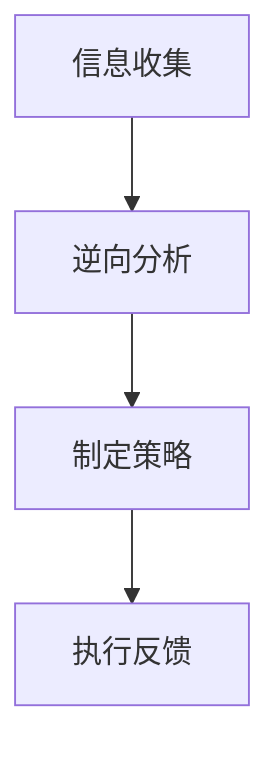

                 

# 《芒格的"颠倒思考"：在投资中应用逆向思维》

---

## 关键词：
- 逆向思维
- 投资策略
- 价值投资
- 芒格思想
- 投资决策
- 系统化投资

---

## 摘要：
芒格的“颠倒思考”是一种独特的投资思维方式，通过从反面分析问题，寻找市场忽视的机会或风险。本文系统地探讨了逆向思维在投资中的应用，从理论基础到实际操作，结合经典案例和数学模型，详细分析了如何通过逆向思维优化投资决策、降低风险、发现低估资产。文章还结合价值投资模型和风险控制模型，提出了系统化的投资架构，并通过实际案例展示了逆向思维在投资实践中的具体应用。

---

## 第一部分：芒格的逆向思维概述

### 第1章：芒格的生平与思想体系

#### 1.1 查理·芒格的生平简介
查理·芒格（Charlie Munger）是世界著名投资家、作家和思想家，与沃伦·巴菲特共同创立了伯克希尔哈撒韦公司。芒格以其独特的思维方式和投资哲学闻名，其思想体系强调“颠倒思考”，即通过逆向思维寻找投资机会。

**关键点：**
- 芒格的“颠倒思考”是一种从反面分析问题的思维方式，其核心在于通过寻找“非共识性机会”来实现超额收益。
- 他的思想体系融合了心理学、经济学和投资学的原理，强调对人性的深刻理解以及对市场规律的洞察。

#### 1.2 逆向思维的定义与特点
逆向思维是一种与传统正向思维相反的思维方式，它通过分析问题的反面来寻找解决方案。在投资中，逆向思维的核心在于寻找市场忽视的机会或风险。

**关键点：**
- 逆向思维的关键在于“反向思考”，即从市场的对立面出发，寻找被低估的资产或被忽视的风险。
- 与正向思维相比，逆向思维更注重逆境分析，强调在市场恐慌时寻找机会，在市场狂热时保持冷静。

#### 1.3 逆向思维在投资中的重要性
逆向思维在投资中的重要性体现在以下几个方面：
1. **避免市场情绪干扰**：逆向思维帮助投资者在市场狂热时保持冷静，在市场恐慌时发现机会。
2. **发现低估资产**：通过逆向思维，投资者可以发现市场忽视的低估资产，从而实现超额收益。
3. **优化投资策略**：逆向思维可以帮助投资者构建更稳健的投资组合，降低风险敞口。

---

### 第2章：逆向思维的核心原理

#### 2.1 逆向思维的逻辑框架
逆向思维的逻辑框架可以总结为以下步骤：
1. **识别问题**：明确需要解决的问题。
2. **反向思考**：从问题的对立面出发，寻找解决方案。
3. **验证假设**：通过数据和案例验证逆向思维的有效性。

**关键点：**
- 逆向思维的核心在于“反向思考”，即从市场的对立面出发，寻找解决问题的方法。
- 逆向思维需要结合具体案例进行验证，以确保其科学性和可行性。

#### 2.2 逆向思维在投资中的关键应用
逆向思维在投资中的关键应用包括：
1. **寻找市场的非共识性机会**：通过逆向思维，投资者可以发现市场忽视的机会。
2. **避免市场情绪的干扰**：逆向思维帮助投资者在市场狂热时保持冷静，在市场恐慌时发现机会。
3. **通过逆向思维发现低估资产**：逆向思维可以帮助投资者发现被市场低估的资产。

---

### 第3章：逆向思维与价值投资的结合

#### 3.1 价值投资的核心理念
价值投资的核心理念是寻找市场低估的资产，通过长期持有实现超额收益。芒格的逆向思维与价值投资的核心理念高度契合，两者共同强调对市场规律的深刻理解以及对资产内在价值的准确判断。

**关键点：**
- 价值投资的核心理念是寻找市场低估的资产，通过长期持有实现超额收益。
- 逆向思维与价值投资的核心理念高度契合，两者共同强调对市场规律的深刻理解以及对资产内在价值的准确判断。

#### 3.2 逆向思维如何优化价值投资策略
逆向思维可以通过以下方式优化价值投资策略：
1. **寻找市场的非共识性机会**：通过逆向思维，投资者可以发现市场忽视的机会。
2. **避免市场情绪的干扰**：逆向思维帮助投资者在市场狂热时保持冷静，在市场恐慌时发现机会。
3. **通过逆向思维发现低估资产**：逆向思维可以帮助投资者发现被市场低估的资产。

---

## 第二部分：逆向思维的核心概念与原理

### 第4章：逆向思维与行为金融学

#### 4.1 行为金融学的基本原理
行为金融学是研究市场参与者行为偏差的一门学科，其核心在于揭示市场参与者在决策过程中存在的认知偏差和行为偏差。

**关键点：**
- 行为金融学研究表明，市场参与者在决策过程中存在多种认知偏差和行为偏差，这些偏差会影响市场定价。
- 逆向思维可以帮助投资者识别这些偏差，从而避免被市场情绪干扰。

#### 4.2 逆向思维与认知偏差的对抗
逆向思维可以通过以下方式对抗认知偏差：
1. **避免从众心理**：通过逆向思维，投资者可以避免从众心理，发现市场的非共识性机会。
2. **克服过度自信**：逆向思维可以帮助投资者克服过度自信，保持谦逊和谨慎。
3. **减少损失厌恶**：通过逆向思维，投资者可以减少损失厌恶，更好地面对市场波动。

---

### 第5章：逆向思维与投资决策的系统化

#### 5.1 投资决策的系统化流程
投资决策的系统化流程可以总结为以下步骤：
1. **信息收集**：通过多种渠道收集市场信息。
2. **分析决策**：通过逆向思维分析问题，寻找市场忽视的机会或风险。
3. **制定策略**：根据分析结果制定投资策略。
4. **执行反馈**：通过市场反馈不断优化投资策略。

---

## 第三部分：算法原理

### 第6章：逆向思维的算法实现

#### 6.1 价值投资模型
价值投资模型可以通过以下公式计算资产的内在价值：

$$
\text{内在价值} = \sum_{t=1}^{n} \frac{\text{现金流}}{(1 + r)^t}
$$

其中，$r$ 是折现率，$t$ 是时间跨度。

---

## 第四部分：系统分析与架构设计

### 第7章：投资决策的系统化架构

#### 7.1 系统架构设计
投资决策的系统化架构可以表示为以下流程：

---

## 第五部分：项目实战

### 第8章：逆向思维在实际投资中的应用

#### 8.1 环境分析与投资机会识别
环境分析与投资机会识别可以通过以下步骤进行：
1. **市场环境分析**：分析市场整体环境，寻找市场忽视的机会。
2. **行业分析**：分析行业竞争格局，寻找具有竞争优势的企业。
3. **企业基本面分析**：分析企业的财务状况，寻找被低估的资产。

---

## 第六部分：总结与展望

### 第9章：逆向思维的投资智慧

#### 9.1 逆向思维的核心要点
- **寻找市场的非共识性机会**：逆向思维的核心在于寻找市场忽视的机会。
- **避免市场情绪的干扰**：逆向思维帮助投资者在市场狂热时保持冷静，在市场恐慌时发现机会。
- **通过逆向思维发现低估资产**：逆向思维可以帮助投资者发现被市场低估的资产。

---

### 作者：AI天才研究院/AI Genius Institute & 禅与计算机程序设计艺术 /Zen And The Art of Computer Programming

