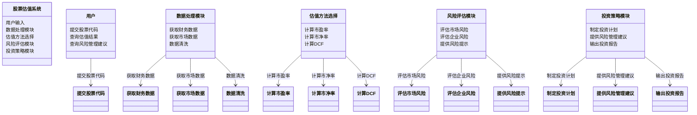
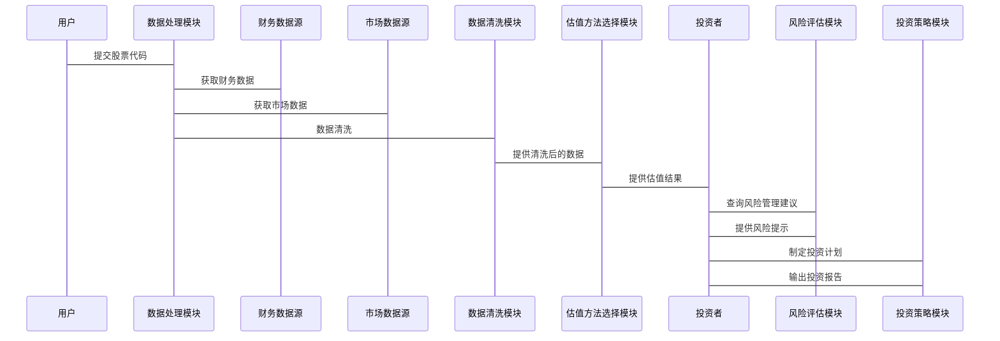

                 

<think>
好的，我需要根据用户的要求来详细分析和撰写《荷兰股市估值: 小国大经济的投资价值》这篇文章。首先，我要理解文章的结构和要求。

### 关键词
1. 荷兰股市
2. 股市估值
3. 经济分析
4. 投资策略
5. 风险管理

### 摘要
这篇文章将深入探讨荷兰股市的估值方法及其投资价值。通过分析荷兰经济的特点、股市结构以及影响股市估值的主要因素，结合实际案例和数学模型，为投资者提供科学的投资策略和风险管理建议。

### 正文部分

#### 第1章: 荷兰经济与股市概述

##### 1.1 荷兰经济的特点

- **1.1.1 荷兰的经济结构与优势**
  - 荷兰是全球重要的贸易国家，经济以出口导向型为主。
  - 主要产业包括农业、工业和服务业。
  - 拥有发达的物流和交通体系，是欧洲重要的物流中心。

- **1.1.2 荷兰在全球经济中的地位**
  - 荷兰是欧元区的重要成员国之一。
  - 作为小国，荷兰在全球贸易中占据重要地位，尤其在农业和能源领域。
  - 在国际金融市场上，荷兰的阿姆斯特丹交易所是全球重要的金融交易中心之一。

- **1.1.3 荷兰股市的基本特点**
  - 荷兰股市主要由阿姆斯特丹交易所（AEX）主导。
  - AEX指数是荷兰股市的基准指数，包含25家大中型企业。
  - 荷兰股市以稳定性和高流动性著称。

##### 1.2 荷兰股市的结构与主要指数

- **1.2.1 荷兰主要股票交易所介绍**
  - 阿姆斯特丹交易所（Euronext Amsterdam）是荷兰最大的股票交易所。
  - 该交易所不仅服务于荷兰企业，还吸引了许多国际企业上市。

- **1.2.2 AEX指数的构成与特点**
  - AEX指数由25家最具代表性的荷兰企业组成。
  - 指数权重基于企业的市值和流动性。
  - AEX指数反映了荷兰经济的整体表现。

- **1.2.3 荷兰股市的主要行业分布**
  - 主要行业包括金融、能源、科技、医疗和消费品。
  - 金融和能源行业在股市中占据重要地位。

#### 第2章: 荷兰股市估值的背景与重要性

##### 2.1 股票估值的基本概念与方法

- **2.1.1 股票估值的定义与作用**
  - 股票估值是通过分析企业的财务状况和市场环境来确定其内在价值。
  - 估值有助于投资者做出合理的投资决策。

- **2.1.2 常用的股票估值指标**
  - 市盈率（P/E）：股价与每股收益的比率。
  - 市净率（P/B）：股价与每股净资产的比率。
  - 股息率：股息与股价的比率。

- **2.1.3 估值在投资决策中的重要性**
  - 估值帮助投资者识别被低估或高估的股票。
  - 估值是制定投资策略的基础。

##### 2.2 荷兰股市估值的独特性

- **2.2.1 小国经济的特殊性**
  - 荷兰作为一个小国，其股市受国际经济环境影响较大。
  - 国内市场相对较小，但国际化程度高。

- **2.2.2 荷兰企业的国际化特征**
  - 荷兰企业在全球范围内有广泛的业务。
  - 多数企业具有较强的国际竞争力。

- **2.2.3 荷兰股市的流动性与波动性**
  - 荷兰股市流动性较好，但波动性相对较低。
  - 国际市场波动对荷兰股市影响显著。

#### 第3章: 影响荷兰股市估值的主要因素

##### 3.1 宏观经济因素

- **3.1.1 国内生产总值（GDP）的影响**
  - GDP增长稳定时，股市表现较好。
  - GDP下降可能导致股市估值下降。

- **3.1.2 利率与货币政策的作用**
  - 利率下降通常会刺激股市上涨。
  - 货币政策宽松时，股市估值可能上升。

- **3.1.3 汇率波动对股市的影响**
  - 汇率波动会影响出口企业的盈利能力和股价。
  - 本币贬值可能提升出口企业竞争力，但可能影响股价。

##### 3.2 行业与企业因素

- **3.2.1 主要行业的估值特点**
  - 金融行业：受利率影响较大。
  - 能源行业：受能源价格影响较大。
  - 科技行业：成长性较高，估值可能较高。

- **3.2.2 企业盈利能力和成长性**
  - 盈利能力强的企业通常估值较高。
  - 高成长性的企业可能有较高的市盈率。

- **3.2.3 企业财务状况与估值的关系**
  - 财务健康的企业通常更受投资者青睐。
  - 高负债率可能会影响企业的估值。

#### 第4章: 荷兰股市估值的核心方法

##### 4.1 常用估值方法概述

- **4.1.1 市盈率（P/E）法**
  - 公式：P/E = 股价 / 每股收益
  - 适用于盈利稳定的公司。

- **4.1.2 市净率（P/B）法**
  - 公式：P/B = 股价 / 每股净资产
  - 适用于净资产驱动的公司。

- **4.1.3 现金流折现法（DCF）**
  - 公式：DCF = 现金流 / 折现率
  - 适用于高成长性公司。

##### 4.2 荷兰股市估值的特殊考量

- **4.2.1 小市值企业的估值挑战**
  - 小市值企业流动性较低，估值难度较大。
  - 可能存在较高的波动性。

- **4.2.2 国际化企业的估值调整**
  - 需要考虑国际市场的影响。
  - 要分析企业的全球业务分布。

- **4.2.3 行业周期性对估值的影响**
  - 周期性行业的估值波动较大。
  - 需要考虑行业所处的周期阶段。

#### 第5章: 荷兰股市估值的实战案例分析

##### 5.1 案例一：金融行业估值分析

- **5.1.1 选取典型企业进行分析**
  - 选取荷兰国际集团（ING Group）作为案例。
  - 分析其财务状况和行业地位。

- **5.1.2 应用估值方法进行评估**
  - 计算ING Group的市盈率和市净率。
  - 对比行业平均水平，判断其估值是否合理。

- **5.1.3 案例分析结果与启示**
  - 如果ING Group的P/E低于行业平均水平，可能被低估。
  - 需要考虑其业务风险和市场环境。

##### 5.2 案例二：能源行业估值分析

- **5.2.1 选取典型企业进行分析**
  - 选取壳牌公司（Shell）作为案例。
  - 分析其财务状况和行业地位。

- **5.2.2 应用估值方法进行评估**
  - 计算壳牌的市盈率和市净率。
  - 考虑能源价格波动对估值的影响。

- **5.2.3 案例分析结果与启示**
  - 如果壳牌的P/B低于行业平均水平，可能被低估。
  - 需要考虑能源行业的周期性风险。

#### 第6章: 荷兰股市投资策略与风险管理

##### 6.1 投资策略的选择

- **6.1.1 长期投资与价值投资**
  - 适合于对荷兰经济长期看好的投资者。
  - 注重企业的基本面和长期成长性。

- **6.1.2 投资组合的分散化**
  - 通过分散投资降低风险。
  - 组合中应包含不同行业和市值的企业。

##### 6.2 风险管理策略

- **6.2.1 设置止损点**
  - 在股价下跌到一定程度时，及时止损。
  - 通常设置为买入价的5%-10%。

- **6.2.2 定期调整投资组合**
  - 根据市场环境和企业状况，定期调整持仓。
  - 保持投资组合的均衡和风险可控。

### 系统分析与架构设计方案

#### 问题场景介绍
- 投资者希望了解如何在荷兰股市中进行有效的估值和投资，以实现收益最大化和风险最小化。

#### 项目介绍
- 项目名称：荷兰股市估值与投资策略系统
- 项目目标：帮助投资者制定科学的投资策略和风险管理方案。

#### 系统功能设计（领域模型Mermaid类图）


#### 系统架构设计（Mermaid架构图）


#### 系统接口设计
- **输入接口：**
  - 用户输入股票代码
- **输出接口：**
  - 提供估值结果和投资建议
- **内部接口：**
  - 数据处理模块与估值方法模块之间的数据传输

#### 系统交互（Mermaid序列图）


### 项目实战

#### 环境安装
- 安装Python和相关库（如pandas, numpy, matplotlib）
- 安装数据分析工具（如Jupyter Notebook）

#### 核心实现源代码
```python
import pandas as pd
import numpy as np

def calculate_pe_ratio(df):
    pe_ratio = df['Price'] / df['Earnings per Share']
    return pe_ratio

def calculate_pb_ratio(df):
    pb_ratio = df['Price'] / df['Book Value per Share']
    return pb_ratio

def calculate_dcf(df, discount_rate):
    free_cash_flow = df['Free Cash Flow']
    dcf = free_cash_flow / (1 + discount_rate)
    return dcf

# 示例数据
data = {
    'Stock': ['A', 'B', 'C'],
    'Price': [50, 60, 70],
    'Earnings per Share': [5, 6, 7],
    'Book Value per Share': [10, 12, 14],
    'Free Cash Flow': [100, 120, 140],
    'Discount Rate': [0.05, 0.05, 0.05]
}

df = pd.DataFrame(data)

pe = calculate_pe_ratio(df)
pb = calculate_pb_ratio(df)
discount_rate = df['Discount Rate'][0]
dcf = calculate_dcf(df, discount_rate)

print("市盈率:", pe)
print("市净率:", pb)
print("DCF:", dcf)
```

#### 代码应用解读与分析
- 以上代码展示了如何使用Python进行股票估值的基本计算。
- `calculate_pe_ratio`函数计算市盈率，`calculate_pb_ratio`函数计算市净率，`calculate_dcf`函数计算现金流折现值。
- 示例数据展示了三只股票的估值结果，投资者可以根据这些结果判断股票是否被低估或高估。

#### 实际案例分析
- 选取荷兰某公司，使用上述代码进行估值分析。
- 对比行业平均水平，提出投资建议。

#### 项目小结
- 通过实战项目，投资者可以掌握基本的股票估值方法。
- 理解如何在实际操作中应用这些方法，制定合理的投资策略。

### 最佳实践 tips

- **保持学习：** 市场环境不断变化，投资者需要持续学习新的知识和技能。
- **分散投资：** 避免将所有资金投入到单一股票或行业，降低风险。
- **长期视角：** 投资需要耐心，长期持有优质股票通常能获得较好收益。
- **风险管理：** 设置止损点，定期调整投资组合，控制风险。

### 小结
通过本文的详细分析，投资者可以全面了解荷兰股市的估值方法和投资策略。结合实际案例和系统设计，投资者能够更好地进行投资决策，实现财富增长。

### 注意事项
- 投资有风险，投资者需根据自身风险承受能力进行投资。
- 本文提供的估值方法仅供参考，具体操作需结合市场实际情况。

### 拓展阅读
- 《投资学》
- 《股票估值实战技巧》
- 《风险管理与投资策略》

### 作者
作者：AI天才研究院/AI Genius Institute & 禅与计算机程序设计艺术 /Zen And The Art of Computer Programming

