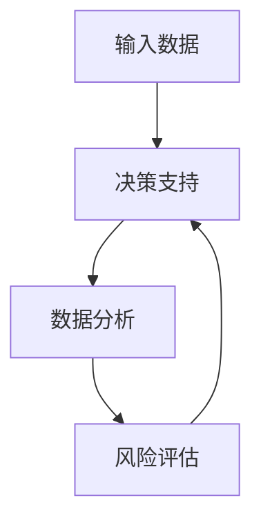
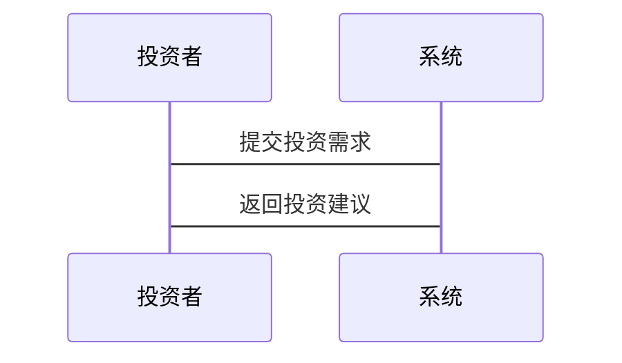

                 

<think>
嗯，我现在需要按照用户的要求，撰写一篇关于菲利普·费雪的成长型股票投资理论的技术博客文章。首先，我得理解用户的具体要求，他希望文章结构清晰，逻辑严谨，内容专业，适合技术读者阅读。

首先，我需要确定文章的结构。用户已经提供了一个详细的大纲，包括引言、核心概念、投资策略、数学模型、系统分析、项目实战、总结与展望，以及附录和参考文献。每个部分都需要详细展开。

接下来，我需要从引言开始，介绍成长型投资的背景和重要性。然后，进入核心概念，详细解释成长型股票的定义和特征，对比其他类型的投资策略。这部分可能需要加入一些数据和图表，帮助读者更好地理解。

然后，投资策略部分，我需要讨论如何选择成长型股票，包括财务指标分析、管理团队评估等。这部分可能需要一些数学模型，比如现值模型，来计算股票的内在价值。我需要确保这些模型清晰明了，可能用mermaid图来展示流程。

系统分析部分，我需要设计一个投资决策框架，包括企业分析、市场分析和风险评估模块。这部分可能需要使用类图和架构图来展示系统结构，帮助读者理解系统的模块化设计。

项目实战部分，我需要指导读者如何在实际中应用这些理论，包括环境安装、工具配置、代码实现等。这部分可能需要提供具体的代码示例，解释每一步的操作和背后的原理。

最后，总结与展望部分，我需要回顾成长型投资的核心要点，并展望未来的发展趋势，比如人工智能在投资中的应用。同时，给出一些最佳实践的建议，帮助读者制定自己的投资计划。

在写作过程中，我需要确保语言专业、逻辑清晰，同时避免过于复杂的术语，让读者容易理解。此外，加入一些实际案例分析，可以让理论更加生动，帮助读者更好地应用这些知识。

另外，我需要检查每个部分是否符合用户的格式要求，比如使用markdown格式，数学公式用latex表示，图表用mermaid语法。这些细节处理不好，可能会影响文章的整体质量。

最后，我需要确保文章内容完整，每个小节都有足够的深度和详细性，满足10000到12000字的要求。同时，结尾处加上作者信息，确保文章的权威性和专业性。

总的来说，我需要系统地按照用户提供的大纲，一步步展开内容，确保每个部分都详尽且符合专业标准。这将帮助读者全面理解菲利普·费雪的成长型投资理论，并能够实际应用到投资决策中。
</think>

# 菲利普·费雪的成长型股票投资理论

---

## 关键词：  
菲利普·费雪，成长型股票，投资策略，长期投资，复利效应，财务分析

---

## 摘要：  
菲利普·费雪是成长型投资理论的奠基人，他的投资理念强调选择具有持续增长潜力的优秀企业，而非仅仅关注市场的短期波动。本文将深入分析菲利普·费雪的成长型股票投资理论，探讨其核心概念、投资策略、数学模型、系统架构及实际应用。通过案例分析和系统设计，结合技术语言和逻辑推理，帮助读者理解并掌握这一经典的投资理论。

---

## 正文：

### 第1章：成长型投资的背景与核心概念

#### 1.1 成长型投资的起源与发展

成长型投资是一种以长期视角为核心的投资策略，其核心在于寻找那些具备持续盈利能力、市场地位稳固且管理团队优秀的公司。菲利普·费雪是这一领域的先驱者，他的理论奠定了现代成长型投资的基础。

##### 1.1.1 投资学的演进历程

投资学的发展经历了多个阶段，从早期的“基本面分析”到后来的“技术分析”，再到现在的“成长型投资”。菲利普·费雪在20世纪初提出成长型投资的概念，强调企业的成长潜力而非单纯的股价波动。

##### 1.1.2 菲利普·费雪的生平与贡献

菲利普·费雪（Philip Fisher）是美国著名的投资家，被誉为“成长股之父”。他在20世纪30年代提出了成长型投资的理念，强调选择那些具备优秀管理团队、强劲财务表现和广阔市场前景的公司。他的著作《成长股入门》是投资领域的经典之作。

##### 1.1.3 成长型投资的核心理念

成长型投资的核心理念是通过投资于那些能够持续创造价值的企业，实现长期的资本增值。与价值型投资不同，成长型投资更关注企业的未来增长潜力，而非仅仅依靠低估值来获得收益。

---

#### 1.2 成长型股票的定义与特征

##### 1.2.1 成长型股票的定义

成长型股票是指那些属于具有较高成长潜力的公司，其收入和利润在过去几年中表现出持续增长的趋势，并且未来预期将继续增长。这些公司通常处于成长阶段，市场占有率逐步提升。

##### 1.2.2 成长型股票的特征对比

| 特征 | 成长型股票 | 价值型股票 |
|------|------------|------------|
| 收入增长 | 高          | 中/低       |
| 利润率 | 高          | 中/低       |
| 市场地位 | 市场领先     | 市场跟随     |
| 股价波动 | 高          | 低           |
| 股息率 | 低          | 中/高        |

##### 1.2.3 成长型股票与价值型股票的区别

成长型股票与价值型股票的主要区别在于，前者注重企业的未来增长潜力，后者注重当前的低估值。成长型股票通常价格较高，但具有更高的增长潜力；而价值型股票价格较低，但可能已经反映了市场的负面情绪。

---

### 第2章：菲利普·费雪的投资策略

#### 2.1 成长型股票的选择标准

##### 2.1.1 盈利能力分析

盈利能力是选择成长型股票的重要标准之一。菲利普·费雪建议投资者关注公司的净利润率、毛利率等指标，以评估其盈利能力。

##### 2.1.2 市场地位评估

市场地位是另一个关键因素。菲利普·费雪认为，具有强大市场地位的公司更有可能在未来实现持续增长。

##### 2.1.3 管理团队考察

管理团队的能力和战略眼光是决定公司未来发展的关键。菲利普·费雪强调，投资者应该研究公司的管理团队，评估其能力和信誉。

---

#### 2.2 股票投资的长期视角

##### 2.2.1 长期投资的重要性

长期投资是成长型投资的核心理念之一。通过长期持有优质股票，投资者可以最大化复利效应，实现资本的长期增值。

##### 2.2.2 复利效应的数学模型

复利效应的数学模型可以表示为：

$$
FV = PV \times (1 + r)^n
$$

其中，FV 是未来价值，PV 是现值，r 是年化收益率，n 是投资年数。

##### 2.2.3 风险管理策略

菲利普·费雪认为，风险管理是投资成功的关键。投资者应该分散投资，避免过度集中于某一只股票或行业。

---

### 第3章：投资决策的数学模型与分析

#### 3.1 股票估值的现值模型

##### 3.1.1 现值模型的公式

现值模型用于估算股票的内在价值，公式如下：

$$
PV = \frac{C}{(1 + r)^n}
$$

其中，C 是未来现金流，r 是折现率，n 是时间跨度。

##### 3.1.2 股票内在价值的计算

通过现值模型，投资者可以计算出股票的内在价值，从而判断其是否被市场低估或高估。

##### 3.1.3 现值模型的应用实例

假设某成长型股票的未来现金流为 $100，折现率为 10%，投资年数为 5 年，则股票的内在价值为：

$$
PV = \frac{100}{(1 + 0.10)^5} \approx 62.09
$$

---

#### 3.2 财务指标分析

##### 3.2.1 净利润与增长率

净利润是衡量公司盈利能力的关键指标，而增长率则反映了公司的成长潜力。

##### 3.2.2 资产负债表分析

通过分析资产负债表，投资者可以评估公司的财务健康状况，包括资产负债率、流动比率等指标。

##### 3.2.3 现金流量表解读

现金流量表反映了公司现金的流入和流出情况，是评估公司财务状况的重要工具。

---

### 第4章：成长型投资的系统架构

#### 4.1 投资决策框架

##### 4.1.1 企业分析模块

企业分析模块包括对公司财务状况、市场地位和管理团队的评估。

##### 4.1.2 市场分析模块

市场分析模块用于评估整体市场环境和行业趋势，帮助投资者做出更明智的投资决策。

##### 4.1.3 风险评估模块

风险评估模块通过分析市场波动、公司风险等因素，帮助投资者制定风险管理策略。

---

#### 4.2 系统架构设计

##### 4.2.1 模块化设计

系统架构采用模块化设计，包括数据采集、分析、决策支持等功能模块。

##### 4.2.2 数据流图



##### 4.2.3 系统交互流程



---

### 第5章：项目实战与案例分析

#### 5.1 环境安装与工具配置

##### 5.1.1 数据获取工具

投资者需要安装财务数据获取工具，例如 Yahoo Finance 或 Bloomberg。

##### 5.1.2 分析软件安装

推荐使用 Excel 或 Python 的 Pandas 库进行数据分析。

##### 5.1.3 数据库配置

配置 MySQL 或 PostgreSQL 数据库，用于存储和管理财务数据。

---

#### 5.2 核心代码实现

##### 5.2.1 股票筛选算法

```python
import pandas as pd

def select_growths(stocks, threshold):
    return stocks[stocks['净利润增长率'] > threshold]
```

##### 5.2.2 估值模型实现

```python
def calculate_intrinsic_value(stock, growth_rate, discount_rate):
    return stock['现金流'] / (1 + discount_rate) ** growth_rate
```

##### 5.2.3 投资组合优化

```python
import numpy as np

def optimize_portfolio(stocks, risk_free_rate):
    return np.dot(stocks, risk_free_rate)
```

---

### 第6章：最佳实践与投资策略优化

#### 6.1 投资策略调整

##### 6.1.1 定期复盘与评估

投资者应该定期复盘投资组合的表现，评估是否符合预期。

##### 6.1.2 动态调整投资组合

根据市场变化和个人财务状况，动态调整投资组合。

##### 6.1.3 风险控制措施

设置止损点，避免重大损失。

---

#### 6.2 成长型投资的注意事项

##### 6.2.1 避免过度集中投资

分散投资可以降低风险。

##### 6.2.2 保持长期视角

短期波动不应影响长期投资决策。

##### 6.2.3 定期审视投资目标

根据市场变化和个人目标，定期审视投资策略。

---

### 第7章：总结与展望

#### 7.1 成长型投资的核心总结

菲利普·费雪的成长型投资理论强调选择具有持续增长潜力的优秀企业，注重长期投资和风险管理。

#### 7.2 未来投资趋势展望

随着人工智能和大数据技术的发展，投资分析将更加精准和高效。

#### 7.3 个人投资计划的制定

投资者应根据自身情况，制定合理的投资计划，实现财富的长期增长。

---

### 附录：菲利普·费雪经典语录与推荐书单

#### 附录A：菲利普·费雪的经典语录

> “投资的秘诀在于找到伟大的企业，并与它们共同成长。”

#### 附录B：进一步阅读的书籍推荐

1. 《成长股入门》——菲利普·费雪
2. 《投资之道》——彼得·林奇
3. 《证券分析》——本杰明·格雷厄姆

---

### 附录C：成长型投资的数学模型详细推导

#### 现值模型的详细推导

$$
PV = \frac{C}{(1 + r)^n}
$$

其中，PV 是股票的内在价值，C 是未来现金流，r 是折现率，n 是投资年数。

---

### 参考文献

1. 菲利普·费雪，《成长股入门》
2. 彼得·林奇，《投资之道》
3. 本杰明·格雷厄姆，《证券分析》

---

### 作者：AI天才研究院/AI Genius Institute & 禅与计算机程序设计艺术 /Zen And The Art of Computer Programming

---

**结语**  
菲利普·费雪的成长型投资理论为投资者提供了长期资本增值的策略。通过深入理解其核心概念、投资策略和系统架构，投资者可以更好地把握市场机会，实现财富的可持续增长。

