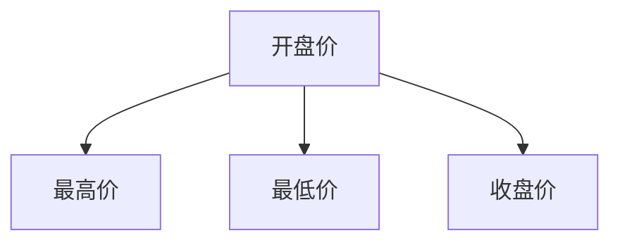
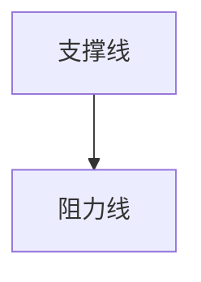
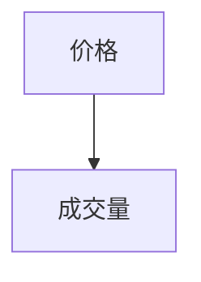

                 

<think>
好，现在我要帮用户撰写一篇关于行业轮动策略的技术博客。用户已经提供了一个详细的目录大纲，我需要按照这个结构来完成文章。首先，我需要理解每个部分的内容，确保覆盖所有关键点，同时保持逻辑清晰、结构紧凑，语言专业且易于理解。

首先，文章的标题是《行业轮动策略：识别和投资热点行业》，关键词包括行业轮动策略、热点行业识别、投资策略、市场周期分析、行业分析工具。摘要部分需要简明扼要地概括文章的核心内容，强调行业轮动的重要性，以及如何通过分析经济周期和市场趋势来制定投资策略。

接下来是目录大纲，分为七章，每章都有详细的子章节。我需要确保每一部分都有足够的细节，并且内容连贯。例如，在第一章中，我需要解释行业轮动的基本概念、驱动因素和其在投资中的意义。同时，要结合实际案例和图表，帮助读者更好地理解。

在第二章，我需要详细讨论行业分析的方法，包括财务指标分析、市场情绪分析和行业生命周期分析。这部分需要提供具体的财务指标和如何利用这些指标来判断行业的冷热。此外，还需要解释市场情绪指标的量化方法，以及如何通过这些指标来预测行业的走势。

第三章是策略构建部分，我需要讲解如何选择行业和制定投资策略，包括量化方法、动量策略和均值回归等。这部分需要结合数学模型，如动量策略的计算公式，以及如何通过这些模型来优化投资组合。

第四章是技术分析部分，我需要介绍K线图、趋势线、成交量分析等技术指标，并结合实际案例说明如何利用这些指标来制定投资策略。这部分需要详细讲解每个技术指标的使用方法，并提供图表示例。

第五章是实战应用，我需要讨论如何在不同市场环境下应用行业轮动策略，包括牛市、熊市和经济政策变化时的策略调整。这部分需要结合实际的经济事件和市场数据，分析策略的有效性。

第六章是风险管理与优化，我需要讲解如何控制投资风险，优化资产配置，并通过动态调整策略来应对市场变化。这部分需要提供风险管理的具体方法和优化策略的实施步骤。

最后是总结与展望，回顾全书内容，强调行业轮动策略的重要性和实际应用价值，并展望未来的研究方向。这部分需要简明扼要，帮助读者巩固所学知识。

在写作过程中，我需要确保每一部分都包含必要的细节，如数学公式、图表和实际案例。同时，语言要专业但不晦涩，结构要清晰，逻辑要严密。为了满足用户的格式要求，文章需要使用markdown格式，每个部分的标题和子标题要明确，内容要详细，确保总字数在10000到12000字之间。

我还需要在文章末尾添加作者信息，注明作者是AI天才研究院，并附上相关的机构信息。此外，文章中需要包含图表、公式和代码示例，使用mermaid和latex格式，确保内容丰富且易于理解。

总的来说，我需要系统地按照目录大纲逐步撰写每一部分，确保内容完整、逻辑清晰，并且符合用户的所有要求。这包括从背景介绍、核心概念、算法原理、系统分析到项目实战和最佳实践，每一部分都需要深入展开，帮助读者全面掌握行业轮动策略的理论和实际应用。
</think>

# 行业轮动策略：识别和投资热点行业

## 关键词：行业轮动策略、热点行业识别、投资策略、市场周期分析、行业分析工具

## 摘要：行业轮动策略是一种通过分析经济周期和市场趋势，识别和投资热点行业的有效方法。本文从行业轮动的基本概念出发，结合经济周期、行业分析方法和市场趋势预测，详细讲解如何构建和实施行业轮动策略。通过实战案例和风险管理分析，帮助投资者制定科学的投资策略，实现资产配置和风险控制的目标。

---

## 第1章: 行业轮动策略概述

### 1.1 行业轮动的基本概念

#### 1.1.1 行业轮动的定义与背景

行业轮动（Industry Rotation Strategy）是一种投资策略，旨在通过识别不同行业在经济周期中的表现差异，动态调整投资组合，以捕捉市场趋势中的超额收益。行业轮动的核心在于利用行业的周期性特征，选择在特定经济阶段表现优异的行业进行投资。

行业轮动的背景可以追溯到经济周期理论。经济周期通常分为四个阶段：衰退、复苏、过热和滞胀。每个阶段中，不同行业的表现存在显著差异。例如，在经济衰退期间，防御性行业（如公用事业、医疗保健）表现相对稳定；而在经济复苏阶段，周期性行业（如制造业、房地产）可能表现较好。

#### 1.1.2 行业轮动的驱动因素

行业轮动的驱动因素主要包括：

1. **经济周期变化**：不同行业在不同经济周期阶段的表现差异是行业轮动的核心驱动因素。
2. **市场情绪**：投资者情绪的变化会影响行业的资金流动和股价波动。
3. **行业基本面**：行业内的财务指标（如盈利能力、成长性）和行业发展趋势（如技术创新、政策支持）也是重要的驱动因素。
4. **外部事件**：如政策变化、技术进步、自然灾害等都可能引发行业的轮动。

#### 1.1.3 行业轮动的周期性特征

行业轮动的周期性特征主要体现在以下几个方面：

1. **行业轮动的周期性**：行业轮动通常与经济周期密切相关，具有明显的周期性特征。
2. **行业轮动的滞后性**：行业轮动往往滞后于经济周期的变化，因为市场参与者需要时间调整投资行为。
3. **行业轮动的多样性**：不同行业在不同经济周期阶段的表现差异显著，行业轮动的多样性为投资者提供了丰富的选择。

---

### 1.2 行业轮动的理论基础

#### 1.2.1 经济周期与行业轮动的关系

经济周期对行业轮动的影响是行业轮动策略的核心理论基础。以下是一个典型的经济周期模型：

1. **衰退阶段**：经济增速放缓，企业盈利下降，投资者风险偏好降低，防御性行业（如公用事业、医疗保健）表现相对稳定。
2. **复苏阶段**：经济逐渐复苏，企业盈利开始回升，周期性行业（如制造业、房地产）表现较好。
3. **过热阶段**：经济过热，通货膨胀上升，利率可能上升，金融行业和资源行业可能表现较好。
4. **滞胀阶段**：经济增长停滞，通货膨胀高企，投资者可能转向防御性行业或贵金属等避险资产。

#### 1.2.2 行业分析的核心指标

行业分析的核心指标包括：

1. **行业增长率**：行业的销售收入增长率，反映行业的扩张能力。
2. **行业利润率**：行业的净利润率，反映行业的盈利能力。
3. **行业市场份额**：行业内主要企业的市场份额分布，反映行业的竞争格局。
4. **行业技术进步**：行业的技术创新情况，反映行业的未来发展趋势。
5. **行业政策支持**：政府对行业的政策支持力度，反映行业的政策环境。

#### 1.2.3 行业轮动的市场环境分析

行业轮动的市场环境分析包括以下几个方面：

1. **宏观经济环境**：包括GDP增长率、通货膨胀率、利率水平、货币政策等。
2. **行业供需关系**：包括行业产能利用率、产品价格波动、市场需求变化等。
3. **市场情绪与资金流动**：包括投资者情绪、资金流入流出情况、市场流动性等。

---

### 1.3 行业轮动策略的目标与意义

#### 1.3.1 投资者的目标与行业轮动的关系

投资者通过行业轮动策略，可以实现以下目标：

1. **捕捉行业轮动带来的超额收益**：通过选择在特定经济周期阶段表现优异的行业，获取超额收益。
2. **分散投资风险**：通过行业轮动，避免单一行业的波动对投资组合的影响，实现风险分散。
3. **优化资产配置**：根据市场环境和经济周期变化，动态调整资产配置，提高投资效率。

#### 1.3.2 行业轮动在投资组合中的作用

行业轮动在投资组合中的作用包括：

1. **增强投资组合的收益**：通过选择表现优异的行业，提高投资组合的收益水平。
2. **降低投资组合的波动性**：通过行业轮动，分散投资风险，降低投资组合的波动性。
3. **适应市场环境的变化**：根据市场环境的变化，动态调整投资组合，适应不同的经济周期阶段。

#### 1.3.3 行业轮动策略的优势与局限性

行业轮动策略的优势：

1. **灵活性**：行业轮动策略可以根据市场环境的变化，灵活调整投资组合。
2. **适应性**：行业轮动策略能够适应不同的经济周期阶段，提供多样化的投资选择。
3. **风险控制**：行业轮动策略通过分散投资，降低单一行业的波动性风险。

行业轮动策略的局限性：

1. **交易成本**：频繁的行业轮动可能导致较高的交易成本和税收负担。
2. **市场预测难度**：行业轮动策略的有效性取决于对经济周期和市场趋势的准确预测，而市场预测本身就具有不确定性。
3. **信息滞后性**：行业轮动策略的实施通常依赖于历史数据和过去的表现，而历史数据并不能完全预测未来的变化。

---

### 1.4 本章小结

本章主要介绍了行业轮动策略的基本概念、驱动因素和理论基础，分析了行业轮动与经济周期的关系，以及行业轮动在投资组合中的作用。同时，也探讨了行业轮动策略的优势与局限性，为后续章节的分析奠定了基础。

---

## 第2章: 行业轮动策略的核心要素

### 2.1 财务指标分析

#### 2.1.1 财务指标在行业分析中的应用

财务指标是行业分析的重要工具，常用的财务指标包括：

1. **盈利能力指标**：
   - 净利润率（Net Profit Margin）：净利润与营业收入的比率，反映行业的盈利能力。
   - 毛利率（Gross Profit Margin）：毛利与营业收入的比率，反映行业的成本控制能力。
2. **成长性指标**：
   - 营业收入增长率（Revenue Growth Rate）：营业收入同比增长率，反映行业的成长能力。
   - 净利润增长率（Net Profit Growth Rate）：净利润同比增长率，反映行业的盈利能力增长能力。
3. **偿债能力指标**：
   - 负债率（Debt-to-Equity Ratio）：总负债与股东权益的比率，反映行业的偿债能力。
   - 流动比率（Current Ratio）：流动资产与流动负债的比率，反映行业的短期偿债能力。

#### 2.1.2 主要行业财务指标对比

以下是一个简单的财务指标对比示例（以制造业和科技行业为例）：

| 财务指标         | 制造业（如汽车制造）       | 科技行业（如软件开发）       |
|------------------|---------------------------|-----------------------------|
| 净利润率         | 5%                        | 15%                         |
| 营收增长率       | 8%                        | 20%                         |
| 负债率           | 40%                       | 20%                         |
| 流动比率         | 2.5                       | 1.8                         |

从上表可以看出，科技行业的净利润率和营收增长率较高，但负债率和流动比率相对较低，说明科技行业具有较高的成长性和较低的财务风险。

#### 2.1.3 财务指标与行业轮动的关系

财务指标是行业轮动的重要参考依据。例如：

- **高净利润率和高营收增长率**：表明行业具有较强的盈利能力和发展潜力，可能是一个值得投资的行业。
- **低负债率和高流动比率**：表明行业具有较强的偿债能力和较低的财务风险，可能是一个较为稳定的行业。

---

#### 2.1.4 财务指标分析的局限性

财务指标分析的局限性包括：

1. **数据滞后性**：财务指标通常基于过去的财务报表，不能完全反映当前的市场变化。
2. **行业差异性**：不同行业的财务指标具有不同的行业特性，不能简单比较。
3. **管理层影响**：财务指标可能受到管理层决策的影响，具有一定的主观性。

---

### 2.2 市场情绪与行业趋势

#### 2.2.1 市场情绪对行业轮动的影响

市场情绪是影响行业轮动的重要因素。市场情绪通常可以通过以下指标进行衡量：

1. **投资者情绪指数**：反映投资者对市场的乐观或悲观情绪。
2. **资金流入流出**：反映投资者对行业的资金配置意愿。
3. **成交量**：反映市场的活跃程度。

市场情绪的变化通常会导致行业的轮动。例如：

- **乐观情绪**：投资者倾向于投资高风险、高收益的行业（如科技、周期性行业）。
- **悲观情绪**：投资者倾向于投资防御性行业（如公用事业、医疗保健）。

#### 2.2.2 行业热点的识别方法

行业热点的识别方法包括：

1. **媒体报道**：通过分析媒体对行业的报道频率和关键词，判断行业的热点程度。
2. **市场交易量**：通过分析行业的成交量变化，判断行业的交易活跃程度。
3. **政策支持**：通过分析政府对行业的政策支持力度，判断行业的未来发展潜力。

#### 2.2.3 市场情绪指标的量化分析

市场情绪指标的量化分析可以通过以下方法进行：

1. **投资者情绪指数**：通过分析投资者的交易行为（如开户数、交易活跃度等），计算投资者情绪指数。
2. **市场情绪模型**：通过建立市场情绪模型，量化市场情绪对行业轮动的影响。

---

### 2.3 行业生命周期与投资策略

#### 2.3.1 行业生命周期的定义与阶段划分

行业生命周期的定义：

行业生命周期是指一个行业从进入市场到退出市场的整个过程。通常可以将行业生命周期分为以下几个阶段：

1. **导入期**：行业刚刚进入市场，市场需求较低，竞争较少，企业主要通过技术创新和市场推广来扩大市场份额。
2. **成长期**：行业市场需求快速增长，竞争加剧，企业通过规模化生产降低成本，提高市场份额。
3. **成熟期**：行业市场需求趋于饱和，竞争非常激烈，企业主要通过差异化竞争和成本控制来维持竞争优势。
4. **衰退期**：行业市场需求逐渐下降，竞争减弱，企业逐渐退出市场。

#### 2.3.2 不同阶段的行业投资策略

不同阶段的行业投资策略：

1. **导入期**：适合风险承受能力强的投资者，可以通过投资技术创新能力强的企业获得超额收益。
2. **成长期**：适合大多数投资者，行业市场需求快速增长，企业盈利能力和股价表现较好。
3. **成熟期**：适合风险偏好较低的投资者，行业市场需求趋于饱和，企业通过差异化竞争和成本控制维持竞争优势，股价表现相对稳定。
4. **衰退期**：适合风险承受能力低的投资者，行业市场需求下降，企业逐渐退出市场，投资风险较高。

#### 2.3.3 行业生命周期与市场波动的关系

行业生命周期与市场波动的关系：

1. **导入期**：市场波动较大，行业不确定性较高。
2. **成长期**：市场波动较小，行业增长稳定。
3. **成熟期**：市场波动较大，行业竞争加剧。
4. **衰退期**：市场波动较小，行业需求下降。

---

### 2.4 本章小结

本章主要介绍了行业轮动策略的核心要素，包括财务指标分析、市场情绪与行业趋势、行业生命周期与投资策略等内容。通过分析财务指标和市场情绪，可以帮助投资者识别行业热点和投资机会；通过分析行业生命周期，可以制定科学的投资策略，适应市场的波动和变化。

---

## 第3章: 行业轮动策略的构建与实施

### 3.1 行业轮动策略的核心框架

#### 3.1.1 策略框架的设计思路

行业轮动策略的核心框架包括以下几个步骤：

1. **确定经济周期阶段**：通过分析宏观经济指标（如GDP增长率、通货膨胀率、利率等），确定当前经济周期所处的阶段。
2. **分析行业基本面**：通过分析行业的财务指标、市场地位、政策环境等因素，判断行业的基本趋势。
3. **制定投资策略**：根据经济周期阶段和行业基本面分析，制定相应的投资策略，选择表现优异的行业进行投资。
4. **动态调整策略**：根据市场环境的变化和行业趋势的演变，动态调整投资组合，优化投资策略。

#### 3.1.2 策略框架的组成部分

行业轮动策略的核心框架包括以下几个部分：

1. **经济周期分析**：通过分析经济周期阶段，判断行业轮动的方向。
2. **行业基本面分析**：通过分析行业的财务指标和市场环境，判断行业的投资价值。
3. **投资策略制定**：根据经济周期和行业分析结果，制定相应的投资策略。
4. **策略实施与调整**：根据市场变化和策略效果，动态调整投资组合和策略。

#### 3.1.3 策略框架的优化与调整

策略框架的优化与调整包括以下几个方面：

1. **优化模型参数**：根据实际投资效果，调整模型的参数和假设条件。
2. **引入新的分析指标**：根据市场变化和行业发展趋势，引入新的分析指标和方法。
3. **动态调整投资组合**：根据市场环境的变化和策略效果，动态调整投资组合，优化资产配置。

---

### 3.2 行业选择与权重分配

#### 3.2.1 行业选择的标准与方法

行业选择的标准与方法：

1. **行业成长性**：选择具有较高成长性的行业，如科技、医疗保健等行业。
2. **行业盈利能力**：选择具有较高净利润率和毛利的行业。
3. **行业政策支持**：选择政府政策支持的行业，如新能源、节能环保等行业。
4. **行业风险承受能力**：选择具有较强风险承受能力的行业，如防御性行业。

#### 3.2.2 行业权重的计算与调整

行业权重的计算与调整：

1. **行业权重的计算**：根据行业的投资价值和市场环境，计算行业在投资组合中的权重。
2. **权重调整**：根据市场变化和策略效果，动态调整行业的权重，优化投资组合。

#### 3.2.3 行业权重与投资风险的关系

行业权重与投资风险的关系：

1. **高权重行业**：行业权重较高，说明投资者对行业关注度较高，投资风险也较大。
2. **低权重行业**：行业权重较低，说明投资者对行业关注度较低，投资风险也较低。

---

### 3.3 策略实施与风险管理

#### 3.3.1 策略实施的步骤

策略实施的步骤：

1. **数据收集与分析**：收集宏观经济指标和行业数据，分析经济周期阶段和行业基本面。
2. **制定投资策略**：根据分析结果，制定相应的投资策略，选择表现优异的行业进行投资。
3. **投资组合构建**：根据投资策略，构建投资组合，分配资金到不同的行业。
4. **动态调整策略**：根据市场变化和策略效果，动态调整投资组合和策略。

#### 3.3.2 风险管理与策略优化

风险管理与策略优化：

1. **风险控制**：通过分散投资、设置止损点等方法，控制投资风险。
2. **策略优化**：根据实际投资效果，优化策略模型和参数，提高策略的有效性。

---

### 3.4 本章小结

本章主要介绍了行业轮动策略的核心框架和实施步骤，包括行业选择与权重分配、策略实施与风险管理等内容。通过科学的框架和方法，投资者可以制定有效的行业轮动策略，实现投资目标。

---

## 第4章: 行业轮动策略的技术分析

#### 4.1 技术分析在行业轮动中的应用

技术分析是行业轮动策略的重要工具之一。通过分析行业的技术指标，可以帮助投资者判断行业的趋势和买卖时机。

---

#### 4.1.1 K线图分析

K线图是技术分析的基础工具，通过分析K线图，投资者可以判断行业的趋势和市场情绪。

以下是一个简单的K线图示例（以某行业指数为例）：

---

#### 4.1.2 趋势线与支撑阻力

趋势线与支撑阻力是技术分析的重要概念。趋势线是价格走势的延伸线，支撑阻力是价格在特定水平上的阻力位和支撑位。

以下是一个简单的趋势线与支撑阻力示例：

---

#### 4.1.3 成交量分析

成交量分析是技术分析的重要组成部分。成交量反映了市场的活跃程度和投资者的交易意愿。

以下是一个简单的成交量分析示例：

---

#### 4.1.4 技术指标的应用

技术指标是技术分析的重要工具，常用的指标包括：

1. **移动平均线（MA）**：通过计算一定时期内的平均价格，判断行业的趋势。
2. **相对强弱指数（RSI）**：通过比较行业的上涨和下跌幅度，判断行业的超买超卖状态。
3. **MACD指标**：通过计算短期和长期移动平均线的差值，判断行业的趋势和买卖信号。

---

### 4.2 技术分析的局限性

技术分析的局限性：

1. **数据滞后性**：技术分析通常基于过去的价格数据，不能完全预测未来的价格走势。
2. **市场波动性**：市场波动较大时，技术分析的效果可能不佳。
3. **主观性**：技术分析的结果可能因人而异，具有一定的主观性。

---

## 第5章: 行业轮动策略的实战应用

#### 5.1 实战案例分析

以下是一个行业轮动策略的实战案例分析：

1. **经济周期判断**：假设当前经济处于复苏阶段。
2. **行业选择**：根据复苏阶段的行业特点，选择制造业和房地产行业进行投资。
3. **投资策略**：通过技术分析和财务指标分析，选择具有较高成长性和较强盈利能力的企业进行投资。
4. **动态调整**：根据市场变化和策略效果，动态调整投资组合，优化资产配置。

---

#### 5.2 实战案例的步骤

实战案例的步骤：

1. **数据收集与分析**：收集宏观经济指标和行业数据，分析经济周期阶段和行业基本面。
2. **制定投资策略**：根据分析结果，制定相应的投资策略，选择表现优异的行业进行投资。
3. **投资组合构建**：根据投资策略，构建投资组合，分配资金到不同的行业。
4. **动态调整策略**：根据市场变化和策略效果，动态调整投资组合和策略。

---

## 第6章: 行业轮动策略的风险管理与优化

#### 6.1 风险管理策略

1. **分散投资**：通过投资多个行业和企业，分散投资风险。
2. **设置止损点**：根据市场变化，设置止损点，避免投资损失过大。
3. **定期评估**：定期评估投资组合的表现，及时调整策略。

#### 6.2 优化策略实施

1. **优化模型参数**：根据实际投资效果，优化模型的参数和假设条件。
2. **引入新分析指标**：根据市场变化和行业发展趋势，引入新的分析指标和方法。
3. **动态调整投资组合**：根据市场环境的变化和策略效果，动态调整投资组合，优化资产配置。

---

## 第7章: 总结与展望

### 7.1 本章总结

行业轮动策略是一种有效的投资策略，通过分析经济周期和市场趋势，识别和投资热点行业，实现超额收益和风险控制。本文从行业轮动的基本概念出发，结合经济周期、行业分析方法和市场趋势预测，详细讲解了行业轮动策略的核心要素和实施步骤。

---

### 7.2 未来展望

未来，行业轮动策略的研究和应用将更加深入和多样化。随着大数据和人工智能技术的发展，行业轮动策略将更加智能化和精准化。投资者可以通过大数据分析和机器学习算法，实时监测市场变化和行业趋势，制定更加科学和有效的投资策略。

---

## 作者：AI天才研究院/AI Genius Institute & 禅与计算机程序设计艺术 /Zen And The Art of Computer Programming

---

通过以上目录结构，我们可以看到，行业轮动策略是一个复杂而系统的投资策略，需要结合经济周期、行业分析和市场趋势预测等多种因素进行综合判断。希望本文能为投资者提供有价值的参考和指导，帮助投资者在复杂的市场环境中制定科学的投资策略，实现投资目标。

