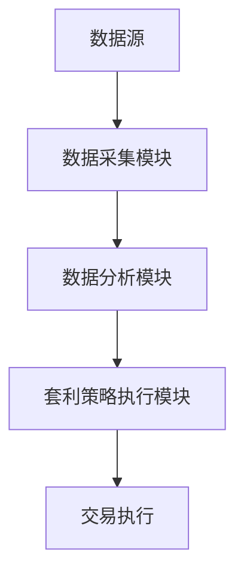

                 


# 行为偏差套利：利用市场非理性行为获取收益

## 关键词：
行为偏差、套利、金融市场、投资者心理、非理性行为

## 摘要：
本文深入探讨了行为偏差套利的概念、策略和实施方法。通过分析投资者心理中的行为偏差，如认知偏差、情绪偏差和社会偏差，揭示这些偏差如何影响市场价格和市场行为。结合套利的基本原理，本文提出了多种基于行为偏差的套利策略，包括跨市场套利、统计套利和算法交易，并通过数学模型和系统架构图详细阐述了这些策略的实现方法。最后，通过实际案例分析和代码实现，展示了如何利用行为偏差套利在实际市场中获取收益。

---

# 第一部分：行为偏差套利的背景与概念

## 第1章：行为偏差套利的背景与概念

### 1.1 行为偏差的基本概念

#### 1.1.1 行为偏差的定义与分类
行为偏差是指投资者在决策过程中由于心理因素或认知局限导致的非理性行为。这些偏差可以分为三大类：
1. **认知偏差**：如确认偏差、过度自信偏差、锚定效应等。
2. **情绪偏差**：如乐观情绪偏差、悲观情绪偏差等。
3. **社会偏差**：如羊群效应、从众心理等。

#### 1.1.2 行为偏差在金融市场中的表现
行为偏差在金融市场中主要表现为价格异常波动、投资者决策失误和市场非有效性。例如，投资者在面对市场下跌时可能会过度恐慌，导致抛售行为加剧。

#### 1.1.3 行为偏差与套利机会的关系
行为偏差是套利机会的重要来源。当市场中存在非理性行为时，套利者可以通过发现价格差异并进行对冲交易来获利。

---

### 1.2 套利的基本原理

#### 1.2.1 套利的定义与特点
套利是指利用两个或多个市场中同一资产价格差异进行交易以获利的策略。其特点包括低风险、高流动性、依赖市场不完全性等。

#### 1.2.2 套利在金融市场中的作用
套利有助于市场价格趋同，减少市场摩擦，提高市场效率。同时，套利也是套利者利用市场不完全性进行获利的重要手段。

#### 1.2.3 行为偏差套利的特殊性
行为偏差套利是基于投资者非理性行为的套利策略。与传统套利不同，行为偏差套利更依赖于市场参与者的心理因素和行为模式。

---

## 第2章：行为偏差的分类与分析

### 2.1 认知偏差

#### 2.1.1 确认偏差
确认偏差是指投资者倾向于寻找支持自己观点的信息，而忽视与自己观点相矛盾的信息。例如，投资者可能只关注支持自己投资决策的信息，导致判断失误。

#### 2.1.2 过度自信偏差
过度自信偏差是指投资者对自己判断的过度自信，导致决策失误。例如，投资者可能过度自信于自己的选股能力，忽视市场整体风险。

#### 2.1.3 锚定效应
锚定效应是指投资者在决策时过于依赖某个初始信息（如参考点），导致判断失误。例如，投资者可能在买入股票时过于依赖历史价格，忽视当前市场环境。

---

### 2.2 情绪偏差

#### 2.2.1 悲观情绪偏差
悲观情绪偏差是指投资者在市场下跌时过于恐慌，导致抛售行为加剧。例如，2008年全球金融危机期间，许多投资者因悲观情绪导致市场进一步下跌。

#### 2.2.2 乐观情绪偏差
乐观情绪偏差是指投资者在市场上涨时过于乐观，导致追涨行为。例如，2015年A股市场的杠杆牛市中，投资者因过度乐观导致市场泡沫破裂。

#### 2.2.3 从众心理
从众心理是指投资者因害怕被市场抛弃而跟随市场趋势。例如，当市场出现大幅上涨时，投资者可能因从众心理而盲目跟风。

---

### 2.3 社会偏差

#### 2.3.1 羊群效应
羊群效应是指投资者因模仿他人行为而导致市场趋势的形成。例如，当某只股票被市场热炒时，其他投资者可能因羊群效应而跟风买入。

#### 2.3.2 影响者效应
影响者效应是指投资者因受权威人士或机构的影响而导致决策失误。例如，当知名投资机构发布看多报告时，投资者可能因影响者效应而盲目买入。

#### 2.3.3 信息 cascading
信息 cascading是指投资者因依赖他人判断而导致信息失真。例如，当市场中出现某种谣言时，投资者可能因信息 cascading而引发市场恐慌。

---

## 第3章：行为偏差对市场的影响

### 3.1 投资者心理与市场波动

#### 3.1.1 情绪波动对价格的影响
投资者的情绪波动会导致市场价格的异常波动。例如，当市场情绪从乐观转向悲观时，股票价格可能大幅下跌。

#### 3.1.2 认知偏差对交易决策的影响
认知偏差会影响投资者的交易决策。例如，确认偏差可能导致投资者忽视市场风险，过度自信偏差可能导致投资者过度冒险。

#### 3.1.3 社会偏差对市场趋势的影响
社会偏差会影响市场趋势。例如，羊群效应可能导致市场趋势的强化，信息 cascading可能导致市场信息失真。

---

### 3.2 市场异象与套利机会

#### 3.2.1 市场异象的定义与分类
市场异象是指市场价格与 fundamentals不匹配的现象。常见的市场异象包括股票溢价、债券溢价等。

#### 3.2.2 行为偏差导致的市场异象
行为偏差是导致市场异象的重要原因。例如，过度自信偏差可能导致投资者高估某些资产的价值，从而引发市场异象。

#### 3.2.3 异象与套利机会的关系
市场异象为套利者提供了套利机会。例如，当某种资产的价格被高估时，套利者可以通过做空该资产来获利。

---

# 第二部分：行为偏差套利的策略与方法

## 第4章：行为偏差套利的核心策略

### 4.1 跨市场套利策略

#### 4.1.1 跨市场套利的定义与原理
跨市场套利是指利用同一资产在不同市场中的价格差异进行交易。例如，当A股和港股中的同一只股票价格出现差异时，套利者可以进行跨市场套利。

#### 4.1.2 基于行为偏差的跨市场套利机会
行为偏差可能导致不同市场中的资产价格出现差异。例如，当某市场中投资者因悲观情绪导致价格下跌时，套利者可以在另一个市场中买入该资产。

#### 4.1.3 跨市场套利的风险与挑战
跨市场套利的风险包括市场风险、汇率风险和流动性风险。此外，跨市场套利还可能受到监管政策的影响。

---

### 4.2 统计套利策略

#### 4.2.1 统计套利的定义与特点
统计套利是指利用资产价格的统计规律进行套利。例如，利用资产价格的均值回归特性进行套利。

#### 4.2.2 行为偏差在统计套利中的应用
行为偏差可以影响资产价格的统计规律。例如，投资者的非理性行为可能导致资产价格的波动性增加，从而为统计套利提供机会。

#### 4.2.3 统计套利与行为套利的区别与联系
统计套利依赖于资产价格的统计规律，而行为套利依赖于投资者的心理因素。两者可以结合使用，例如利用行为偏差导致的统计规律变化进行套利。

---

### 4.3 算法交易策略

#### 4.3.1 算法交易的定义与特点
算法交易是指利用计算机算法自动执行交易指令。例如，利用算法交易捕捉短期价格波动。

#### 4.3.2 行为偏差在算法交易中的应用
行为偏差可以影响市场中的短期价格波动，从而为算法交易提供机会。例如，算法交易可以利用投资者的非理性行为进行高频交易。

#### 4.3.3 算法交易的优势与劣势
算法交易的优势包括高效性、低延迟和高频率。劣势包括高风险、高成本和对技术的依赖。

---

## 第5章：行为偏差套利的数学模型

### 5.1 基于行为偏差的套利模型

#### 5.1.1 模型的构建与假设
基于行为偏差的套利模型假设投资者存在认知偏差、情绪偏差和社会偏差，并利用这些偏差进行套利。

#### 5.1.2 模型的输入变量与输出变量
输入变量包括资产价格、市场情绪、投资者行为等；输出变量包括套利机会、套利收益等。

#### 5.1.3 模型的数学表达式
套利收益可以表示为：
$$
\text{套利收益} = \text{资产价格差异} \times \text{交易量}
$$

---

### 5.2 套利定价理论

#### 5.2.1 套利定价定理的定义与公式
套利定价定理指出，任何资产的预期收益可以表示为风险因子的线性组合。公式为：
$$
E(r_i) = r_f + \beta_i (E(r_m) - r_f)
$$
其中，$r_f$ 是无风险利率，$E(r_m)$ 是市场预期收益，$\beta_i$ 是资产的贝塔系数。

#### 5.2.2 行为偏差对套利定价的影响
行为偏差会影响资产的贝塔系数，从而影响套利定价。例如，投资者的非理性行为可能导致资产的贝塔系数偏离其 fundamentals。

#### 5.2.3 套利定价理论的实际应用
套利定价理论可以用于评估资产的预期收益，并指导套利者的投资决策。

---

## 第6章：行为偏差套利的系统架构

### 6.1 系统设计与功能模块

#### 6.1.1 数据采集模块
数据采集模块负责收集市场数据，包括资产价格、市场情绪等。

#### 6.1.2 数据分析模块
数据分析模块负责分析市场数据，识别行为偏差导致的套利机会。

#### 6.1.3 套利策略执行模块
套利策略执行模块负责根据分析结果执行套利交易。

---

### 6.2 系统架构图



---

## 第三部分：行为偏差套利的项目实战

## 第7章：行为偏差套利的实战案例

### 7.1 项目介绍

#### 7.1.1 项目背景
本项目旨在利用行为偏差套利策略，在实际市场中寻找套利机会。

#### 7.1.2 项目目标
通过分析市场数据，识别行为偏差导致的套利机会，并实现套利交易。

---

### 7.2 系统实现

#### 7.2.1 环境配置
- 操作系统：Linux
- 编程语言：Python
- 库：pandas、numpy、matplotlib、backtrader

#### 7.2.2 数据处理
```python
import pandas as pd
import numpy as np

# 数据加载
data = pd.read_csv('market_data.csv')

# 数据清洗
data.dropna(inplace=True)
data = data[~data['price'].isnull()]
```

#### 7.2.3 策略实现
```python
class BehavioralArbitrageStrategy:
    def __init__(self):
        self.position = 0
        self.entry_price = 0

    def on_data(self, data):
        # 计算行为偏差指标
        self.data = data
        self.compute_behavioral_indicators()

    def compute_behavioral_indicators(self):
        # 具体计算逻辑
        pass

    def on_bar(self):
        # 执行套利交易
        if self.position == 0:
            self.entry_price = self.data['price']
            self.position = 1
        else:
            if self.data['price'] < self.entry_price:
                self.position = 0
                self.entry_price = 0
```

#### 7.2.4 策略优化
```python
import backtrader as bt

class BehavioralArbitrageStrategy(bt.Strategy):
    def __init__(self):
        self.position = 0
        self.entry_price = 0

    def next(self):
        if self.position == 0:
            self.buy()
        else:
            if self.data.close[0] < self.entry_price:
                self.sell()
```

---

### 7.3 实际案例分析

#### 7.3.1 案例背景
假设某股票在A股和港股市场中存在价格差异，且A股市场中投资者因悲观情绪导致价格下跌。

#### 7.3.2 数据分析
通过分析市场数据，发现A股和港股市场的同一只股票存在价格差异，且A股市场的价格被低估。

#### 7.3.3 策略执行
套利者在A股市场买入该股票，并在港股市场卖出该股票，利用价格差异进行套利。

---

## 第8章：行为偏差套利的风险管理与优化

### 8.1 风险管理

#### 8.1.1 风险来源
行为偏差套利的风险包括市场风险、流动性风险和模型风险。

#### 8.1.2 风险控制措施
套利者可以通过设置止损、分散投资和监控市场数据来控制风险。

---

### 8.2 策略优化

#### 8.2.1 策略优化方法
套利者可以通过优化算法、改进模型和引入新的数据源来提高套利收益。

#### 8.2.2 持续改进
套利策略需要根据市场变化和投资者行为的动态调整。

---

## 第9章：行为偏差套利的法律与合规

### 9.1 行为偏差套利的法律框架

#### 9.1.1 套利的合法性
套利在大多数国家是合法的，但某些套利行为可能违反相关法律法规。

#### 9.1.2 合规要求
套利者需要遵守相关法律法规，避免操纵市场和内幕交易。

---

### 9.2 行为偏差套利的道德与伦理

#### 9.2.1 套利的道德争议
套利者利用市场不完全性进行获利，可能被认为是一种不公平的行为。

#### 9.2.2 伦理考量
套利者需要在追求收益的同时，遵守道德规范，避免对市场造成过度影响。

---

## 第10章：行为偏差套利的未来展望

### 10.1 未来趋势

#### 10.1.1 技术进步
人工智能和大数据技术的进步将为行为偏差套利提供新的机会。

#### 10.1.2 市场变化
随着市场的发展，行为偏差套利的策略和方法将不断创新。

---

## 作者：AI天才研究院/AI Genius Institute & 禅与计算机程序设计艺术 /Zen And The Art of Computer Programming

---

以上是基于行为偏差套利的完整思考过程和详细目录大纲。

