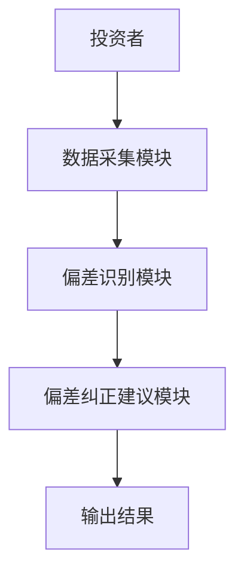
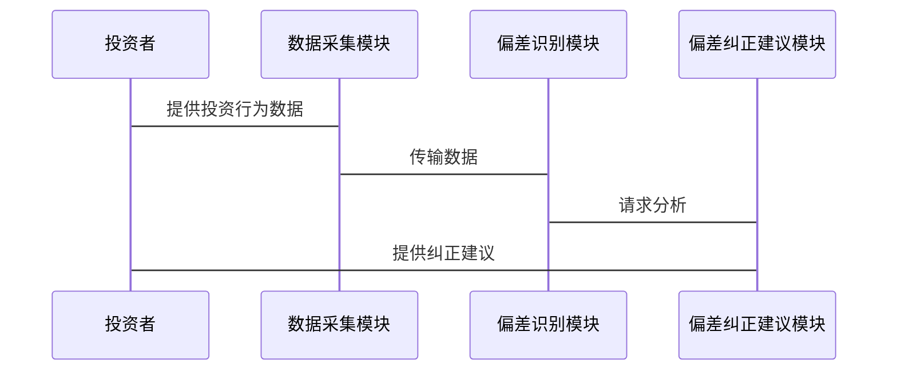

                 

<think>
好的，我现在需要帮用户撰写一篇关于行为金融学的博客文章，标题是《行为金融学：理解并克服投资中的心理偏差》。首先，我需要理解用户的需求，他们希望文章结构清晰，内容专业且有深度，使用技术语言，适合CTO级别的读者。

用户提供了详细的目录大纲，分为七个章节，每一章都有三级小节。我需要按照这个大纲逐步展开，确保每个部分都详细且有逻辑性。首先，我得从第一章开始，介绍行为金融学的基本概念，包括定义、与其他学科的对比以及其重要性。

接下来，第二章要详细讨论常见的心理偏差，如过度自信、损失厌恶和羊群效应。我需要为每个偏差定义、表现和影响做详细的分析，可能还要加入一些实际案例，让读者更容易理解。

第三章需要探讨这些心理偏差如何影响投资决策，分析它们导致的非理性交易和资产定价偏差，这里可能需要加入一些图表或流程图，帮助读者理解。

第四章重点介绍克服这些偏差的策略，包括自我认知、制定合理的投资策略和情绪管理。这里可能需要一些实用的建议，帮助读者在实际操作中应用。

第五章通过实际案例分析，展示心理偏差如何影响投资结果，这能增强文章的说服力。我需要找到一些经典的案例，详细分析其中的心理偏差因素。

第六章则从系统角度分析，设计一个心理偏差评估与管理系统，帮助投资者识别和纠正偏差。这可能涉及系统架构图和流程图，展示系统的运作机制。

最后，第七章总结全文，并提出未来的投资趋势和行为金融学的发展方向。这里需要回顾主要观点，并给出对未来研究的建议。

在写作过程中，我需要确保每一章节都有足够的细节，但又不显得冗长。同时，要使用技术术语，但保持语言的清晰和易懂。可能还需要加入一些数学公式或图表，但用户没有特别要求，所以暂时不考虑。

现在，我需要按照大纲开始撰写每一部分，确保逻辑连贯，内容全面。可能遇到的挑战是如何在有限的字数内详细展开每个部分，同时保持结构的清晰。我会尽量使用简洁的语言，突出重点，确保读者能够理解和应用这些知识。

总的来说，我需要构建一个从基础到应用，从理论到实践的结构，帮助读者全面理解行为金融学，并在实际投资中克服心理偏差，做出更理性的决策。
</think>

# 行为金融学：理解并克服投资中的心理偏差

> 关键词：行为金融学、心理偏差、投资决策、情绪管理、理性投资

> 摘要：行为金融学研究投资者心理偏差对投资决策的影响，帮助投资者克服非理性行为，实现更理性的投资决策。本文系统分析了常见的心理偏差，如过度自信、损失厌恶和羊群效应，并提出了克服这些偏差的策略，包括自我认知、制定合理投资策略和情绪管理。结合实际案例和系统设计，本文为投资者提供了实用的建议。

---

## 第1章: 行为金融学概述

### 1.1 行为金融学的定义与核心概念

行为金融学（Behavioral Finance）是研究投资者心理行为如何影响金融市场的学科。它结合心理学和经济学，分析投资者决策中的情绪、认知偏差及其对市场的影响。

#### 1.1.1 行为金融学的定义

行为金融学关注投资者心理行为对金融市场的影响，强调情绪、认知偏差和非理性决策在投资中的作用。它挑战了传统金融学的假设，认为市场参与者并非总是理性的。

#### 1.1.2 行为金融学的核心概念

- **心理偏差**：投资者在决策中常见的系统性错误，如过度自信、损失厌恶等。
- **情绪影响**：投资者情绪波动如何影响投资决策和市场走势。
- **非理性行为**：投资者在极端市场条件下表现出的非理性行为。

#### 1.1.3 行为金融学与传统金融学的区别

- **假设基础**：传统金融学假设投资者理性，行为金融学考虑情绪和偏差。
- **研究方法**：传统金融学注重数学模型，行为金融学结合心理学实验。
- **结论差异**：传统金融学认为市场有效，行为金融学发现市场失灵。

### 1.2 投资中的心理偏差概述

心理偏差是投资者在决策中常见的认知错误，导致非理性行为。

#### 1.2.1 心理偏差的定义

心理偏差是指个体在信息处理和决策过程中产生的系统性错误，影响判断和选择。

#### 1.2.2 心理偏差在投资中的表现

- **过度自信**：高估自身判断能力，忽视不确定性。
- **损失厌恶**：对损失的敏感性高于对收益。
- **羊群效应**：跟随大众决策，缺乏独立判断。

#### 1.2.3 心理偏差对投资决策的影响

- **决策失误**：偏差导致错误的投资决策，如高位买入、低位卖出。
- **市场波动**：心理偏差引发非理性交易，加剧市场波动。

---

## 第2章: 投资中的常见心理偏差

### 2.1 过度自信偏差

#### 2.1.1 过度自信的定义

过度自信是指投资者高估自身判断能力，认为自己能够准确预测市场走势。

#### 2.1.2 过度自信的表现

- **过度交易**：频繁买卖，试图通过短期操作获利。
- **忽略不确定性**：忽视市场的不确定性和风险。

#### 2.1.3 过度自信对投资决策的影响

- **决策失误**：过度自信导致错误判断，如高位买入。
- **交易成本增加**：频繁交易增加佣金和税收成本。

### 2.2 损失厌恶

#### 2.2.1 损失厌恶的定义

损失厌恶是指投资者对损失的敏感性高于对收益的敏感性，倾向于避免损失。

#### 2.2.2 损失厌恶的表现

- **避免卖出亏损股票**：投资者宁愿持有亏损股票，也不愿割肉。
- **规避风险**：过度保守，错失收益机会。

#### 2.2.3 损失厌恶对投资决策的影响

- **错失收益**：过度规避风险导致错过潜在收益。
- **决策延迟**：犹豫不决，错失投资机会。

### 2.3 羊群效应

#### 2.3.1 羊群效应的定义

羊群效应是指投资者跟随市场趋势，缺乏独立判断，表现出从众心理。

#### 2.3.2 羊群效应的表现

- **跟风投资**：盲目跟随市场潮流，如追涨杀跌。
- **情绪驱动决策**：受市场情绪影响，而非理性分析。

#### 2.3.3 羊群效应对投资决策的影响

- **市场泡沫**：羊群效应导致资产价格偏离 fundamentals。
- **市场波动加剧**：从众行为引发市场剧烈波动。

---

## 第3章: 心理偏差对投资决策的影响

### 3.1 心理偏差与投资决策的关系

#### 3.1.1 心理偏差如何影响投资决策

心理偏差通过影响情绪和判断，改变投资者的决策过程。

#### 3.1.2 心理偏差与投资结果的关系

心理偏差导致错误决策，影响投资收益和风险。

### 3.2 心理偏差导致的非理性交易

#### 3.2.1 非理性交易的定义

非理性交易指投资者基于情绪而非理性分析做出的交易决策。

#### 3.2.2 非理性交易的表现

- **高位买入**：在市场高点买入，追求短期收益。
- **低位卖出**：在市场低点卖出，避免短期损失。

#### 3.2.3 非理性交易的案例分析

案例：2008年金融危机中，投资者因恐慌性抛售，导致市场进一步下跌。

### 3.3 心理偏差对资产定价的影响

#### 3.3.1 资产定价的定义

资产定价指根据资产的风险和收益确定其市场价格。

#### 3.3.2 心理偏差对资产定价的影响

- **价格泡沫**：过度乐观导致资产价格虚高。
- **价格低估**：过度悲观导致资产价格被低估。

#### 3.3.3 资产定价偏差的案例分析

案例：互联网泡沫期间，过度自信的投资者推高互联网公司股价，随后泡沫破裂导致股价暴跌。

---

## 第4章: 克服心理偏差的策略

### 4.1 提高自我认知

#### 4.1.1 自我认知的定义

自我认知指个体对自己心理状态和行为的了解。

#### 4.1.2 提高自我认知的方法

- **反思**：定期回顾投资决策，识别偏差。
- **教育**：学习行为金融学知识，了解常见偏差。

#### 4.1.3 自我认知对投资决策的影响

- **减少偏差**：了解偏差有助于避免犯错。
- **提高决策质量**：自我认知增强理性决策能力。

### 4.2 建立合理的投资策略

#### 4.2.1 投资策略的定义

投资策略指为实现投资目标而制定的行动计划。

#### 4.2.2 常见的投资策略

- **价值投资**：寻找被低估的资产。
- **长期投资**：坚持投资优质资产，避免短期波动干扰。

#### 4.2.3 投资策略的制定与执行

- **目标设定**：明确投资目标，制定长期计划。
- **纪律执行**：坚持策略，避免情绪干扰。

### 4.3 管理情绪与压力

#### 4.3.1 情绪管理的定义

情绪管理指识别和控制情绪，避免影响决策。

#### 4.3.2 情绪管理的方法

- **冥想**：通过冥想放松，减少情绪干扰。
- **记录情绪**：记录情绪变化，识别触发点。

#### 4.3.3 情绪管理对投资决策的影响

- **减少冲动交易**：情绪管理降低非理性交易。
- **提高决策质量**：情绪稳定有助于理性分析。

---

## 第5章: 行为金融学的实际案例分析

### 5.1 投资者心理偏差的典型案例

#### 5.1.1 过度自信的案例

2000年互联网泡沫期间，投资者过度自信，盲目投资科技股，导致泡沫破裂后损失惨重。

#### 5.1.2 损失厌恶的案例

2008年金融危机后，许多投资者因损失厌恶不愿卖出股票，错过反弹机会。

#### 5.1.3 羊群效应的案例

2017年比特币价格暴涨期间，大量投资者盲目跟风，导致价格剧烈波动。

### 5.2 心理偏差对市场的影响

#### 5.2.1 市场波动

心理偏差加剧市场波动，如恐慌性抛售引发市场 crash。

#### 5.2.2 市场失灵

心理偏差导致市场失灵，如价格泡沫和崩盘。

---

## 第6章: 系统分析与架构设计方案

### 6.1 问题场景介绍

心理偏差影响投资决策，导致非理性交易和市场波动。

### 6.2 项目介绍

设计一个心理偏差评估与管理系统，帮助投资者识别和纠正偏差。

### 6.3 系统功能设计

- **心理偏差识别**：分析投资者行为，识别偏差。
- **偏差纠正建议**：提供个性化建议，帮助纠正偏差。

### 6.4 系统架构设计

使用 mermaid 绘制系统架构图：

### 6.5 系统交互设计

使用 mermaid 绘制交互序列图：

---

## 第7章: 总结与展望

### 7.1 全文总结

行为金融学揭示了心理偏差对投资决策的影响，帮助投资者克服非理性行为，实现更理性的投资决策。

### 7.2 未来展望

未来，行为金融学将结合人工智能和大数据，提供更精准的投资者行为分析和偏差纠正方案。

### 7.3 最佳实践 Tips

- **定期反思**：定期回顾投资决策，识别偏差。
- **制定计划**：制定投资计划，避免情绪干扰。
- **保持学习**：持续学习，提升投资能力。

### 7.4 小结

克服心理偏差需要自我认知、合理策略和情绪管理。通过行为金融学的理论和实践，投资者可以做出更理性的决策，实现长期收益。

---

## 作者：AI天才研究院/AI Genius Institute & 禅与计算机程序设计艺术 /Zen And The Art of Computer Programming

