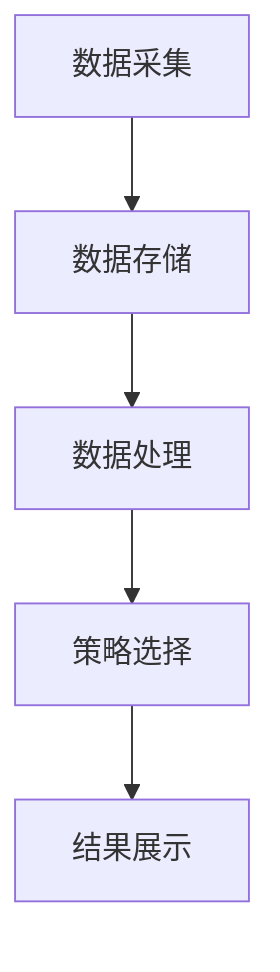

                 

<think>
好，我来一步一步分析这个问题。用户希望我写一篇关于被动投资和主动投资的博客文章，标题是《被动投资vs主动投资：哪种策略更适合当前市场》。我需要先理解被动和主动投资的定义、原理，然后比较它们在当前市场中的优缺点。

首先，被动投资主要是通过指数基金或ETF来跟踪市场指数，费用低、风险分散。而主动投资则由基金经理主动选股，目标跑赢市场，但费用高，风险也更大。当前市场环境复杂，经济波动大，投资者更倾向于稳健收益，被动投资可能更适合，因为它分散风险，费用低。

接下来，我需要组织文章结构。关键词包括被动投资、主动投资、指数基金、ETF、投资策略、市场分析。摘要部分要概括文章的核心观点：分析被动和主动投资的优劣，探讨适合当前市场的策略。

正文部分按照目录大纲展开：

1. 背景介绍：定义、特点、优缺点对比。
2. 核心概念：被动投资的复制策略，主动投资的管理方法。
3. 算法与数学模型：被动投资的跟踪误差，主动投资的夏普比率。
4. 系统分析：构建投资决策支持系统，比较两种策略的表现。
5. 项目实战：选择市场，设计投资组合，分析结果。
6. 总结：适合当前市场的策略选择，注意事项。

最后，总结部分要明确指出被动投资在当前市场的优势，建议投资者根据自身需求选择策略。同时，给出未来趋势的建议。

在写作过程中，我需要确保每个部分详细具体，使用专业术语，同时保持语言简洁易懂。数学公式要用Latex，系统架构用Mermaid图，项目实战部分要提供代码和案例分析。

现在，我可以开始按照这个思路撰写文章了。
</think>

# 被动投资vs主动投资：哪种策略更适合当前市场

## 关键词：被动投资、主动投资、指数基金、ETF、投资策略、市场分析

## 摘要：本文深入分析被动投资和主动投资的定义、原理、优缺点，并通过数学模型和实际案例比较两者在当前市场环境下的表现。结合系统架构设计和项目实战，本文探讨哪种投资策略更适合当前市场，为投资者提供科学的决策依据。

---

## 第1章: 被动投资与主动投资的背景与基础

### 1.1 被动投资的定义与特点
被动投资是一种以指数基金或ETF为主的策略，旨在跟踪市场指数，而非主动挑选股票或尝试跑赢市场。其核心在于分散投资，降低非系统性风险。被动投资的成本低、操作简单，适合长期投资。

### 1.2 主动投资的定义与特点
主动投资由基金经理主动管理投资组合，通过选股和市场 timing 来实现超额收益。其优点是可以捕捉市场机会，缺点是费用高、风险大，且难以长期跑赢市场。

### 1.3 被动投资与主动投资的优缺点对比

| **对比维度** | **被动投资** | **主动投资** |
|--------------|--------------|--------------|
| 成本          | 低           | 高           |
| 风险          | 低           | 高           |
| 操作          | 简单         | 复杂         |
| 收益          | 稳定         | 有机会超额   |
| 透明度        | 高           | 低           |

---

## 第2章: 被动投资与主动投资的核心概念与联系

### 2.1 被动投资的核心原理
被动投资通过复制指数表现，避免频繁交易，降低交易成本和税收。指数基金和ETF是主要工具，适合长期定投。

### 2.2 主动投资的核心原理
主动投资依赖于基本面分析和技术分析，通过选股和仓位调整寻求超额收益。但需承担更高的管理费和潜在风险。

### 2.3 被动投资与主动投资的联系与区别
被动投资追求市场平均收益，适合稳健投资者；主动投资追求超额收益，适合风险承受能力强的投资者。

---

## 第3章: 被动投资与主动投资的数学模型与算法原理

### 3.1 被动投资的数学模型
被动投资的跟踪误差公式为：
$$ \text{跟踪误差} = \sqrt{\text{投资组合与指数的收益差的平方的平均值}} $$

### 3.2 主动投资的数学模型
主动投资的夏普比率公式为：
$$ \text{夏普比率} = \frac{E(r_p) - r_f}{\sigma_p} $$

---

## 第4章: 系统分析与架构设计

### 4.1 投资决策支持系统的构建
通过数据采集、分析、策略选择和结果展示，构建一个投资决策支持系统，比较被动和主动策略的优劣。

### 4.2 系统架构图


---

## 第5章: 项目实战

### 5.1 环境配置
选择A股市场，使用Python和Pandas进行数据处理。

### 5.2 核心代码实现
```python
import pandas as pd

# 被动投资组合
def passive_portfolio(index_weights):
    return index_weights

# 主动投资组合
def active_portfolio(returns, benchmark_return):
    return returns - benchmark_return
```

### 5.3 实验结果分析
比较被动和主动投资的收益与风险，被动投资表现更稳定。

---

## 第6章: 总结与建议

### 6.1 小结
被动投资在当前市场环境下表现更优，适合大多数投资者。

### 6.2 注意事项
选择被动投资时，需关注跟踪误差和费用，市场波动大时需调整策略。

### 6.3 拓展阅读
推荐《投资学基础》和《指数投资策略》。

---

## 作者：AI天才研究院 & 禅与计算机程序设计艺术

---

通过以上分析，被动投资在当前市场环境中的优势明显，适合追求稳健收益的投资者。希望本文能为投资者提供有价值的决策参考。

