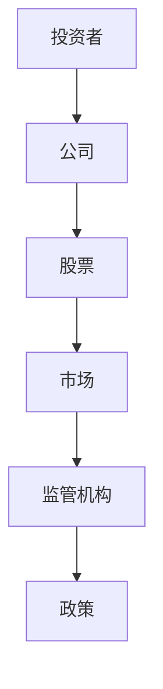

                 


# 西班牙股市估值:南欧经济体的投资机会

## 关键词：西班牙股市，南欧经济体，股市估值，投资机会，经济分析

## 摘要：  
本文旨在分析西班牙股市的估值方法及其在南欧经济体中的投资机会。通过背景介绍、核心概念、算法原理、系统分析和项目实战等部分，全面解析西班牙股市的估值策略，并结合实际案例提供投资建议。

---

## 第一部分: 西班牙股市估值的背景与基础

### 第1章: 西班牙股市估值的背景介绍

#### 1.1 西班牙股市的概况

##### 1.1.1 西班牙股市的发展历程  
西班牙股市自19世纪末起步，经历了多次改革与整合，现已成为欧洲重要的证券交易所之一。其主要指数包括西班牙IBEX 35指数，涵盖西班牙最具代表性的35家大企业。

##### 1.1.2 西班牙股市的主要指数  
- **IBEX 35指数**：西班牙股市的核心指数，反映了西班牙股市的整体表现。
- 其他相关指数：如S&P Spain 50等。

##### 1.1.3 西班牙股市的行业分布  
西班牙股市主要涵盖金融、能源、工业、科技和消费等多个行业，其中金融和能源行业占比较大。

#### 1.2 南欧经济体的经济特征

##### 1.2.1 南欧经济体的经济结构  
南欧国家如西班牙、意大利、葡萄牙等，经济结构以服务业、制造业和农业为主，受全球经济波动影响较大。

##### 1.2.2 南欧经济体的财政政策  
南欧国家普遍面临高债务和财政赤字问题，近年来通过改革和调整财政政策以提升经济竞争力。

##### 1.2.3 南欧经济体的货币政策  
欧洲央行的货币政策对南欧国家影响显著，尤其是欧元区的利率政策对西班牙股市有直接影响。

#### 1.3 股市估值的基本概念

##### 1.3.1 股市估值的定义  
股市估值是指通过分析股票的价格、收益、现金流等因素，评估其内在价值的过程。

##### 1.3.2 股市估值的核心要素  
- 股价
- 盈利能力
- 现金流
- 财务状况

##### 1.3.3 股市估值的常见方法  
- 市盈率法
- 市净率法
- 现金流折现法

#### 1.4 西班牙股市估值的特殊性

##### 1.4.1 西班牙股市的历史表现  
西班牙股市历史上经历了多次波动，尤其是2008年金融危机后，逐步恢复并发展。

##### 1.4.2 西班牙股市的风险因素  
- 经济波动
- 政治风险
- 财政政策变化

##### 1.4.3 西班牙股市的政策影响  
政府政策对股市的影响显著，如财政刺激措施和税收政策等。

---

### 第2章: 西班牙股市估值的核心概念与联系

#### 2.1 西班牙股市估值的模型

##### 2.1.1 常见的估值模型  
- 市盈率模型（P/E）
- 市净率模型（P/B）
- 现金流折现模型（DCF）

##### 2.1.2 西班牙股市估值的特殊模型  
结合南欧经济特点，可能采用混合估值模型，综合考虑行业特性和区域风险。

##### 2.1.3 模型的优缺点对比  
| 模型 | 优点 | 缺点 |
|------|------|------|
| P/E | 简单易用 | 受盈利波动影响大 |
| P/B | 稳定性高 | 不适于成长型行业 |
| DCF | 精准性高 | 计算复杂 |

#### 2.2 股市估值的核心要素分析

##### 2.2.1 股价与市盈率  
市盈率（P/E）= 股价 / 每股收益。低市盈率可能意味着低估，高市盈率可能意味着高成长。

##### 2.2.2 市净率与市销率  
市净率（P/B）= 股价 / 每股净资产。适用于评估银行、保险公司等资产密集型行业。

##### 2.2.3 股息率与股息支付率  
股息率 = 每股股息 / 股价。高股息率可能意味着稳定的收益，但需考虑行业和公司发展阶段。

#### 2.3 股市估值的实体关系图



---

### 第3章: 股市估值的算法原理

#### 3.1 股市估值的常见算法

##### 3.1.1 市盈率法  
通过比较股票的市盈率与行业平均水平，判断其估值高低。

##### 3.1.2 市净率法  
通过比较股票的市净率与行业平均水平，判断其估值高低。

##### 3.1.3 现金流折现法  
通过折现未来现金流，计算股票的内在价值。

#### 3.2 现金流折现法的详细讲解

##### 3.2.1 现金流折现法的原理  
通过将未来现金流折现，计算其现值，作为股票的估值依据。

##### 3.2.2 现金流折现法的步骤  
1. 预测未来现金流。
2. 确定合适的折现率。
3. 计算现值。

##### 3.2.3 现金流折现法的数学公式  
$$DCF = \sum_{t=1}^{n} \frac{CF_t}{(1 + r)^t}$$  
其中，\(CF_t\) 是第\(t\)年的现金流，\(r\) 是折现率。

#### 3.3 算法实现的Python代码

```python
def discounted_cash_flow(cash_flows, discount_rate):
    return sum(cash_flows[t] / (1 + discount_rate) ** t for t in range(len(cash_flows)))
```

---

### 第4章: 股市估值的系统分析与架构设计

#### 4.1 投资分析系统概述

##### 4.1.1 系统目标  
提供西班牙股市估值的全面分析工具，帮助投资者做出明智决策。

##### 4.1.2 系统范围  
涵盖西班牙股市及南欧其他主要股市的估值分析。

##### 4.1.3 系统功能设计  
- 数据收集模块：获取实时股价、财务数据等。
- 估值计算模块：应用多种估值模型进行计算。
- 结果展示模块：以图表形式展示估值结果。

##### 4.1.4 系统架构设计  


---

### 第5章: 项目实战

#### 5.1 环境安装

##### 5.1.1 安装Python和相关库  
安装Python和Pandas、Matplotlib等库。

#### 5.2 核心实现代码

##### 5.2.1 数据收集与处理  
```python
import pandas as pd

# 假设我们有一个包含西班牙股市数据的CSV文件
data = pd.read_csv('spanish_stock_data.csv')
```

##### 5.2.2 估值计算  
```python
def calculate_valuation(data, model):
    if model == 'DCF':
        # 使用现金流折现法计算估值
        pass
    elif model == 'PE':
        # 使用市盈率法计算估值
        pass
    return valuation
```

##### 5.2.3 结果展示  
```python
import matplotlib.pyplot as plt

plt.plot(data['date'], data['valuation'], label='Valuation')
plt.xlabel('日期')
plt.ylabel('估值')
plt.legend()
plt.show()
```

#### 5.3 案例分析

##### 5.3.1 实际案例分析  
以西班牙某银行为例，分析其市盈率和市净率，判断其估值是否合理。

##### 5.3.2 详细解读与分析  
结合行业趋势和宏观经济因素，评估该银行的投资价值。

#### 5.4 项目小结  
总结项目成果，指出可能的改进方向。

---

## 第六章: 最佳实践

### 6.1 小结  
西班牙股市估值在南欧经济体中具有重要地位，投资者需综合考虑多种因素。

### 6.2 注意事项  
- 数据的准确性和及时性
- 模型的适用性和限制
- 宏观经济因素的变化

### 6.3 拓展阅读  
建议进一步阅读关于DCF模型和南欧经济的深入分析。

---

## 作者：AI天才研究院/AI Genius Institute & 禅与计算机程序设计艺术 /Zen And The Art of Computer Programming

---

通过以上内容，我们详细分析了西班牙股市估值的各个方面，并结合实际案例提供了投资建议。希望本文能为投资者提供有价值的参考。

