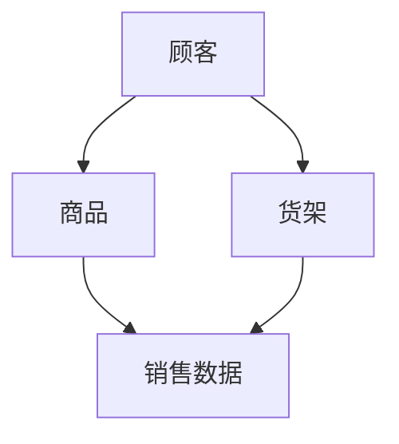
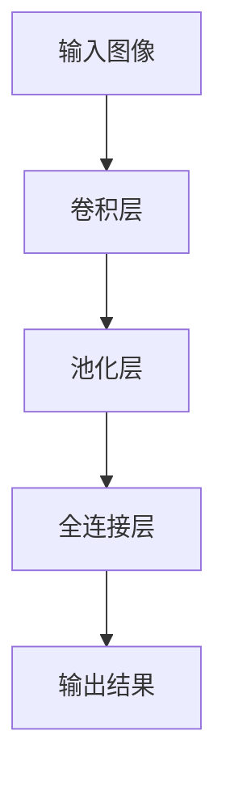
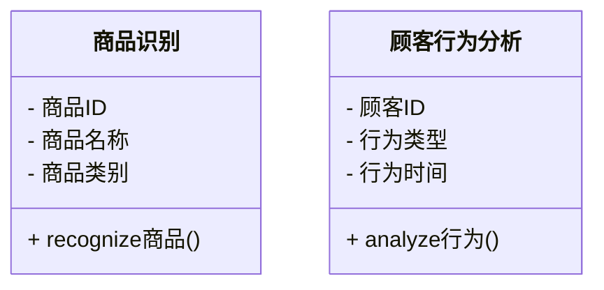

                 


# 计算机视觉技术在零售业的应用与投资机会

> 关键词：计算机视觉，零售业，人工智能，投资机会，技术应用，深度学习

> 摘要：本文探讨了计算机视觉技术在零售业中的应用，分析了其在商品识别、顾客行为分析、智能货架管理等领域的具体应用场景，并结合技术原理、市场前景和商业模式，深入挖掘投资机会，为投资者和相关从业者提供参考。

---

# 第一部分: 计算机视觉技术基础

## 第1章: 计算机视觉技术概述

### 1.1 计算机视觉的基本概念

#### 1.1.1 计算机视觉的定义
计算机视觉（Computer Vision）是利用计算机对图像或视频进行分析和理解的技术。通过算法处理图像数据，计算机能够识别、分析和理解图像中的内容，例如识别物体、场景分割、目标检测等。

#### 1.1.2 计算机视觉的核心技术
- 图像处理：包括图像增强、滤波、边缘检测等技术。
- 目标检测：通过算法在图像中定位和识别目标物体。
- 语义分割：将图像中的每个像素进行分类，识别出物体及其背景。
- 行为分析：分析视频中的动态行为，例如人体姿态、动作识别等。

#### 1.1.3 计算机视觉在零售业中的应用前景
随着技术的成熟，计算机视觉在零售业的应用越来越广泛，例如商品识别、顾客行为分析、智能货架管理等。这些应用能够提高零售效率，降低成本，提升顾客体验。

### 1.2 零售业的现状与挑战

#### 1.2.1 零售业的传统模式与痛点
传统零售业面临以下痛点：
- 人工成本高：需要大量员工进行商品陈列、库存管理等工作。
- 营销效率低：难以精准识别顾客需求，进行个性化推荐。
- 客户体验差：缺乏智能化的服务，顾客体验不佳。

#### 1.2.2 数字化转型的必要性
随着互联网和人工智能技术的发展，零售业需要通过数字化转型来提高效率、降低成本、提升顾客体验。数字化转型包括引入智能技术、数据分析、在线零售等。

#### 1.2.3 计算机视觉技术如何解决零售业问题
计算机视觉技术可以通过自动化识别商品、分析顾客行为、优化货架布局等方式，帮助零售业解决传统模式中的痛点。

### 1.3 计算机视觉与零售业的结合背景

#### 1.3.1 技术发展的推动
近年来，计算机视觉技术取得了显著进展，尤其是深度学习技术的应用，使得计算机视觉在目标检测、语义分割等方面取得了突破性进展。

#### 1.3.2 市场需求的变化
消费者对个性化服务和高效购物体验的需求日益增长，推动了零售业对智能化技术的需求。

#### 1.3.3 商业模式的创新
通过引入计算机视觉技术，零售业可以实现更精准的营销、更高效的库存管理，从而推动商业模式的创新。

### 1.4 本章小结
本章介绍了计算机视觉技术的基本概念、零售业的现状与挑战，以及计算机视觉技术在零售业中的应用前景。通过技术与零售业的结合，可以解决传统零售业的痛点，推动行业数字化转型。

---

## 第2章: 计算机视觉的核心概念

### 2.1 计算机视觉的核心原理

#### 2.1.1 图像处理与特征提取
图像处理是计算机视觉的基础，包括对图像的预处理和特征提取。特征提取是通过算法从图像中提取出具有代表性的特征，例如边缘、纹理、形状等。

#### 2.1.2 目标检测与识别
目标检测是通过算法在图像中定位目标物体，并识别其类别。目标识别则是进一步对目标物体进行分类，例如识别出图像中的“苹果”或“香蕉”。

#### 2.1.3 语义分割与场景理解
语义分割是将图像中的每个像素进行分类，识别出物体及其背景。场景理解是通过语义分割和目标检测等技术，理解图像中的整体场景。

### 2.2 计算机视觉的关键技术对比

#### 2.2.1 基于传统算法的技术
基于传统算法的计算机视觉技术包括图像处理、特征提取等技术，这些技术在简单场景下表现良好，但在复杂场景下可能存在局限性。

#### 2.2.2 基于深度学习的技术
基于深度学习的计算机视觉技术通过卷积神经网络（CNN）等模型，能够自动提取图像特征，适用于复杂场景下的目标检测和识别。

#### 2.2.3 技术优劣势分析
- 传统算法：优点是实现简单、计算效率高，缺点是难以处理复杂场景。
- 深度学习：优点是能够处理复杂场景，缺点是需要大量数据和计算资源。

### 2.3 计算机视觉的实体关系图



通过实体关系图可以清晰地看到顾客、商品、货架和销售数据之间的关系。

### 2.4 本章小结
本章详细介绍了计算机视觉的核心原理，对比了传统算法和深度学习技术的优劣势，并通过实体关系图展示了计算机视觉在零售业中的应用架构。

---

## 第3章: 计算机视觉技术的算法原理

### 3.1 基于深度学习的计算机视觉算法

#### 3.1.1 卷积神经网络（CNN）的原理
卷积神经网络（CNN）是一种常用的深度学习模型，通过卷积层、池化层、全连接层等结构，能够自动提取图像特征。

#### 3.1.2 模型训练与优化
模型训练是通过大量标注数据对CNN模型进行训练，优化模型参数以提高识别准确率。模型优化包括调整网络结构、优化算法等。

#### 3.1.3 模型部署与应用
模型部署是将训练好的模型应用于实际场景中，例如商品识别、目标检测等。

### 3.2 计算机视觉算法的数学模型

#### 3.2.1 卷积层的数学表达
卷积层的数学表达式如下：
$$ y_{i,j} = \sum_{k=1}^{K} \sum_{l=1}^{L} w_{k,l} \cdot x_{i+k,j+l} + b_k $$
其中，$w$ 是卷积核权重，$b$ 是偏置项，$x$ 是输入图像的像素值。

#### 3.2.2 激活函数的作用
激活函数用于引入非线性特性，常用的激活函数包括ReLU（$f(x) = \max(0, x)$）、Sigmoid（$f(x) = \frac{1}{1+e^{-x}}$）等。

#### 3.2.3 损失函数的计算
常用损失函数包括均方误差（MSE）、交叉熵损失等。

### 3.3 算法流程图



### 3.4 本章小结
本章详细介绍了基于深度学习的计算机视觉算法，包括CNN的原理、模型训练与优化、部署与应用等内容。

---

## 第4章: 计算机视觉在零售业中的应用场景

### 4.1 智能货架与商品识别

#### 4.1.1 商品识别的实现原理
通过计算机视觉技术，可以实现商品的自动识别和分类，例如通过目标检测技术识别货架上的商品。

#### 4.1.2 智能货架的应用案例
智能货架可以实现商品的自动库存管理，例如通过图像识别技术实时监控货架上的商品状态。

#### 4.1.3 商品识别的优化方向
优化方向包括提高识别准确率、降低计算资源消耗等。

### 4.2 顾客行为分析

#### 4.2.1 顾客行为识别的技术实现
通过计算机视觉技术，可以实现顾客的行为识别，例如通过人体姿态识别技术识别顾客的站立、行走等动作。

#### 4.2.2 顾客行为分析的应用场景
顾客行为分析可以应用于商场的顾客流量分析、购物路径分析等。

#### 4.2.3 行为分析的隐私保护问题
顾客行为分析可能会涉及到隐私问题，需要在技术实现中注意保护顾客隐私。

### 4.3 店内导航与

---

## 第5章: 计算机视觉技术在零售业中的投资机会

### 5.1 市场现状与技术壁垒

#### 5.1.1 市场需求
随着零售业的数字化转型，计算机视觉技术的需求不断增长。

#### 5.1.2 技术壁垒
计算机视觉技术需要较高的技术门槛，包括算法开发、数据处理等。

### 5.2 商业模式与投资策略

#### 5.2.1 技术服务模式
通过提供计算机视觉技术服务，例如商品识别API、行为分析服务等。

#### 5.2.2 产品销售模式
开发基于计算机视觉技术的硬件产品，例如智能摄像头、智能货架等。

#### 5.2.3 合作伙伴模式
与零售企业合作，提供定制化的计算机视觉解决方案。

### 5.3 未来趋势与风险提示

#### 5.3.1 未来趋势
随着技术的不断进步，计算机视觉在零售业中的应用将更加广泛，例如实现全场景智能化。

#### 5.3.2 风险提示
需要关注技术风险、市场需求变化、竞争格局等。

### 5.4 本章小结
本章分析了计算机视觉技术在零售业中的投资机会，包括市场需求、技术壁垒、商业模式等，并对未来趋势和风险进行了探讨。

---

## 第6章: 系统分析与架构设计方案

### 6.1 问题场景介绍

#### 6.1.1 零售场景描述
以商场为例，需要实现商品识别、顾客行为分析等功能。

#### 6.1.2 项目目标
通过计算机视觉技术实现智能货架管理、顾客行为分析等。

### 6.2 系统功能设计

#### 6.2.1 领域模型设计



#### 6.2.2 系统架构设计

```mermaid
container 客户端 {
    接收图像数据
    发送识别请求
    显示识别结果
}
container 服务端 {
    处理识别请求
    返回识别结果
}
```

#### 6.2.3 系统接口设计
系统接口包括图像数据接口、识别结果接口等。

#### 6.2.4 系统交互设计

```mermaid
sequenceDiagram
客户 → 服务端: 发送图像数据
服务端 → 客户: 返回识别结果
```

### 6.3 本章小结
本章详细设计了计算机视觉技术在零售业中的系统架构，包括功能设计、架构设计、接口设计和交互设计。

---

## 第7章: 项目实战

### 7.1 环境安装

#### 7.1.1 安装Python
安装Python 3.8及以上版本。

#### 7.1.2 安装深度学习框架
安装TensorFlow或PyTorch框架。

#### 7.1.3 安装图像处理库
安装OpenCV、 PIL等图像处理库。

### 7.2 系统核心实现源代码

#### 7.2.1 商品识别代码

```python
import cv2
import tensorflow as tf
import numpy as np

# 加载预训练模型
model = tf.keras.models.load_model('商品识别模型.h5')

# 读取图像
image = cv2.imread('商品.jpg')
image = cv2.resize(image, (224, 224))
image = image / 255.0
image = np.expand_dims(image, axis=0)

# 预测结果
预测结果 = model.predict(image)
print(预测结果)
```

#### 7.2.2 顾客行为分析代码

```python
import cv2
import numpy as np

# 加载预训练模型
model = tf.keras.models.load_model('行为分析模型.h5')

# 读取视频流
cap = cv2.VideoCapture(0)
while cap.isOpened():
    ret, frame = cap.read()
    if not ret:
        break
    # 处理帧
    帧处理
    # 分析行为
    行为分析
    # 显示结果
    cv2.imshow('行为分析', frame)
    if cv2.waitKey(1) == ord('q'):
        break
cap.release()
cv2.destroyAllWindows()
```

### 7.3 代码应用解读与分析

#### 7.3.1 商品识别代码解读
商品识别代码通过加载预训练模型，读取图像并进行预测，输出识别结果。

#### 7.3.2 顾客行为分析代码解读
顾客行为分析代码通过读取视频流，实时分析顾客行为，并显示结果。

### 7.4 实际案例分析

#### 7.4.1 商品识别案例
通过商品识别代码，可以实现货架上商品的自动识别和分类。

#### 7.4.2 顾客行为分析案例
通过行为分析代码，可以实现顾客行为的实时分析，例如识别顾客在货架前的停留时间。

### 7.5 项目小结
本章通过实际案例分析，详细展示了计算机视觉技术在零售业中的应用，并提供了具体的代码实现。

---

## 第8章: 总结与展望

### 8.1 本章总结
通过本文的分析，计算机视觉技术在零售业中的应用前景广阔，能够实现商品识别、顾客行为分析等功能，为零售业的数字化转型提供有力支持。

### 8.2 投资建议与注意事项

#### 8.2.1 投资建议
投资者可以关注计算机视觉技术在零售业中的应用，尤其是智能货架、顾客行为分析等领域。

#### 8.2.2 注意事项
需要关注技术风险、市场需求变化、竞争格局等因素。

### 8.3 未来展望
随着技术的不断进步，计算机视觉在零售业中的应用将更加广泛，例如实现全场景智能化。

---

## 作者：AI天才研究院 & 禅与计算机程序设计艺术

---

以上是《计算机视觉技术在零售业的应用与投资机会》的完整目录和内容概要，涵盖了从基础概念到实际应用的各个方面，结合了技术深度和实际案例，为读者提供了全面的视角。

