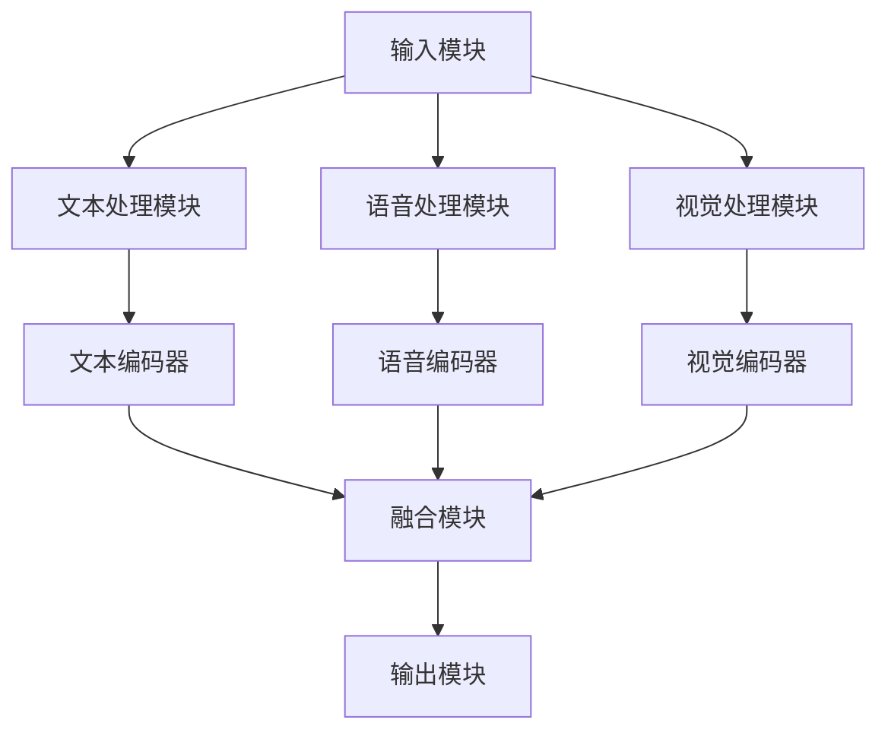
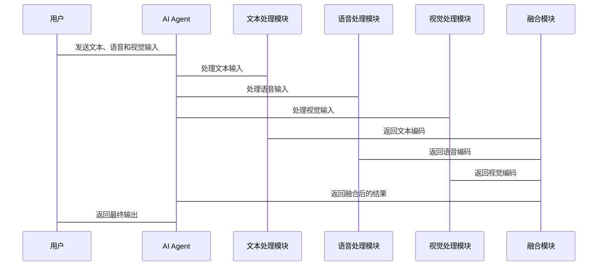

                 


# 设计多模态AI Agent：整合文本、语音与视觉能力

## 关键词：多模态AI Agent, 文本处理, 语音识别, 计算机视觉, 深度学习, 多模态融合

## 摘要：  
本文将详细介绍如何设计一个多模态AI Agent，整合文本、语音与视觉能力。通过分析多模态数据的特征与关系，探讨多模态数据处理与整合的技术，讲解多模态AI Agent的算法原理，包括多模态数据的表示与编码、多模态数据融合方法、多模态模型的训练与优化。通过实际项目案例，展示如何构建一个多模态AI Agent系统，并提供系统架构设计与实现方案。本文旨在为读者提供一个多模态AI Agent设计的全面指南，帮助读者从理论到实践，掌握多模态AI Agent的核心技术与应用。

---

# 第一部分: 多模态AI Agent概述

## 第1章: 多模态AI Agent的背景与概念

### 1.1 多模态AI Agent的背景
#### 1.1.1 人工智能的发展历程
人工智能（AI）技术经历了从专家系统到深度学习的演变，逐步从单一模态处理向多模态处理发展。多模态AI Agent的出现，标志着AI技术在感知和交互能力上的重要突破。

#### 1.1.2 多模态数据的兴起
随着智能设备的普及和传感器技术的发展，文本、语音、图像和视频等多模态数据的获取变得越来越容易。多模态数据的整合为AI系统提供了更丰富的信息来源。

#### 1.1.3 多模态AI Agent的定义与特点
多模态AI Agent是一种能够同时处理和理解多种模态数据（如文本、语音、视觉）的智能系统，具有以下特点：
- **多模态感知**：能够同时处理和理解多种类型的数据。
- **跨模态关联**：能够发现和利用不同模态数据之间的关联性。
- **智能交互**：能够通过多模态数据与用户进行自然交互。

### 1.2 多模态数据整合的意义
#### 1.2.1 文本、语音与视觉数据的特点
- **文本数据**：结构化、可解释性高，但缺乏语境信息。
- **语音数据**：包含情感和语调信息，但难以直接处理。
- **视觉数据**：信息丰富，但处理复杂且计算资源消耗大。

#### 1.2.2 多模态数据整合的优势
- **提升准确性**：通过多模态数据的互补性，提高AI系统的决策准确性。
- **增强交互性**：支持更自然和多样化的用户交互方式。
- **扩展应用场景**：适用于智能助手、自动驾驶、智能安防等多种场景。

#### 1.2.3 多模态AI Agent的应用场景
- **智能助手**：如Siri、Alexa，能够通过语音和文本交互提供服务。
- **智能客服**：结合语音识别和自然语言处理，提供更智能的客户服务。
- **自动驾驶**：整合视觉、语音和文本数据，实现更智能的驾驶体验。

### 1.3 多模态AI Agent的核心技术
#### 1.3.1 自然语言处理技术
- **文本处理**：如词嵌入、句法分析、语义理解。
- **语音处理**：如语音识别、语音合成、声纹识别。

#### 1.3.2 计算机视觉技术
- **图像处理**：如图像分类、目标检测、图像分割。
- **视频处理**：如视频流处理、行为识别、视频理解。

#### 1.3.3 语音处理技术
- **语音识别**：将语音转换为文本。
- **语音合成**：将文本转换为语音。
- **语音情感分析**：分析语音中的情感和语调。

### 1.4 本章小结
本章介绍了多模态AI Agent的背景、定义、特点及其应用意义，为后续章节奠定了基础。

---

# 第二部分: 多模态数据处理与整合

## 第2章: 多模态数据的特征与属性

### 2.1 多模态数据的特征分析
#### 2.1.1 文本数据的特征
- **离散性**：文本数据通常以字符或词汇为单位。
- **序列性**：文本具有明显的序列性，如句子的语法结构。
- **多样性**：文本数据可以是新闻、对话、邮件等多种形式。

#### 2.1.2 语音数据的特征
- **连续性**：语音数据是连续的时序信号。
- **情感性**：语音数据中包含说话人的情感信息，如语调、语气。
- **噪声敏感性**：语音数据容易受到环境噪声的影响。

#### 2.1.3 视觉数据的特征
- **高维性**：图像和视频数据通常具有高维特征。
- **空间性**：视觉数据具有空间信息，如物体的位置和形状。
- **多样性**：视觉数据可以是静态图像或动态视频。

### 2.2 模态间关系的分析
#### 2.2.1 文本与语音的关系
- **同步性**：文本和语音通常具有时间上的同步性。
- **对应性**：文本可以作为语音的补充，如文字记录语音内容。

#### 2.2.2 文本与视觉的关系
- **描述性**：文本可以描述视觉内容，如图像标签或视频描述。
- **一致性**：文本和视觉数据可以相互验证，如图像中的物体与文本描述一致。

#### 2.2.3 语音与视觉的关系
- **同步性**：在视频中，语音和视觉数据通常是同步的。
- **关联性**：语音可以提供视觉数据的情感信息，如语音中的语调可以反映视频中的人物情绪。

### 2.3 多模态数据整合的挑战
#### 2.3.1 数据异构性问题
- **数据形式不同**：文本、语音和视觉数据具有不同的形式和结构。
- **数据规模差异**：不同模态的数据量可能相差较大。

#### 2.3.2 数据同步性问题
- **时间对齐**：多模态数据需要在时间上对齐，如语音和视频数据的时间同步。
- **空间对齐**：视觉数据的空间位置可能需要与文本或语音数据对齐。

#### 2.3.3 数据融合方法
- **特征融合**：将不同模态的特征向量进行融合，如拼接、加权和融合。
- **模型融合**：在不同模态上分别构建模型，再进行融合，如多任务学习。

### 2.4 本章小结
本章分析了多模态数据的特征及其相互关系，并探讨了数据整合的挑战和解决方案。

---

## 第3章: 多模态数据的表示与编码

### 3.1 多模态数据的表示方法
#### 3.1.1 文本的向量表示
- **词嵌入**：如Word2Vec、GloVe，将单词映射为低维向量。
- **句子表示**：如BERT，将整个句子映射为一个向量。
- **文档表示**：如Doc2Vec，将整个文档映射为一个向量。

#### 3.1.2 语音的向量表示
- **语音特征提取**：如MFCC（Mel-Frequency Cepstral Coefficients），提取语音的特征向量。
- **语音编码器**：如Wav2Vec，将语音信号映射为向量序列。
- **语音嵌入**：如通过Transformer编码器生成语音嵌入向量。

#### 3.1.3 视觉数据的向量表示
- **图像表示**：如CNN（卷积神经网络），将图像映射为一个向量。
- **视频表示**：如3D-CNN或I3D（Inflated 3D ConvNets），将视频映射为向量序列。
- **目标检测**：如YOLO、Faster R-CNN，将图像中的物体检测并编码为向量。

### 3.2 多模态数据编码的对比
#### 3.2.1 文本编码对比表
| 编码方法 | 输入 | 输出 | 优缺点 |
|----------|------|------|--------|
| Word2Vec | 单词 | 向量 | 参数少，计算快 |
| BERT     | 句子 | 向量 | 上下文理解能力强 |
| Doc2Vec  | 文档 | 向量 | 能捕捉文档主题 |

#### 3.2.2 语音编码对比表
| 编码方法 | 输入 | 输出 | 优缺点 |
|----------|------|------|--------|
| MFCC     | 语音信号 | 特征向量 | 参数固定，计算简单 |
| Wav2Vec  | 语音信号 | 向量序列 | 上下文建模能力强 |
| LPC      | 语音信号 | 参数编码 | 参数化编码，压缩率高 |

#### 3.2.3 视觉编码对比表
| 编码方法 | 输入 | 输出 | 优缺点 |
|----------|------|------|--------|
| CNN      | 图像 | 向量 | 参数多，计算复杂 |
| BERT     | 文本描述 | 向量 | 适用于图像描述的文本编码 |
| YOLO     | 图像 | 检测结果 | 实时检测能力强 |

### 3.3 多模态数据编码的ER实体关系图
```mermaid
er
actor:多模态数据
---> 多模态数据编码
多模态数据编码 ---> 文本编码
多模态数据编码 ---> 语音编码
多模态数据编码 ---> 视觉编码
```

### 3.4 本章小结
本章介绍了多模态数据的表示与编码方法，并通过对比分析和实体关系图展示了不同模态数据的编码方式。

---

## 第4章: 多模态数据的融合与对齐

### 4.1 多模态数据的融合方法
#### 4.1.1 基于特征的融合
- **拼接融合**：将不同模态的特征向量拼接成一个新的特征向量。
- **加权融合**：根据模态的重要性对特征向量进行加权求和。
- **注意力融合**：通过注意力机制动态调整不同模态的权重。

#### 4.1.2 基于模型的融合
- **多任务学习**：在不同的模态上分别学习任务，然后进行联合优化。
- **联合编码器**：将不同模态的编码器联合起来，共同生成融合特征。
- **对比学习**：通过对比不同模态的数据，学习它们的共同特征。

### 4.2 多模态数据的对齐方法
#### 4.2.1 时间对齐
- **同步对齐**：将语音和视频数据按照时间戳对齐。
- **异步对齐**：通过插值或补全方法，将不同时间步的模态数据对齐。

#### 4.2.2 空间对齐
- **区域对齐**：在视觉数据中找到与文本或语音对应的目标区域。
- **注意力对齐**：通过注意力机制找到模态之间的对应关系。

### 4.3 多模态数据融合的数学模型
#### 4.3.1 基于特征拼接的融合模型
$$ z = [x_1, x_2, x_3] $$
其中，$x_1, x_2, x_3$分别表示文本、语音和视觉特征。

#### 4.3.2 基于加权融合的模型
$$ z = \sum_{i=1}^3 w_i x_i $$
其中，$w_i$是模态$i$的权重。

#### 4.3.3 基于注意力机制的融合模型
$$ z = \sum_{i=1}^3 \alpha_i x_i $$
其中，$\alpha_i$是通过注意力机制计算得到的权重。

### 4.4 本章小结
本章探讨了多模态数据的融合方法和对齐策略，并通过数学模型展示了如何实现不同模态数据的融合。

---

# 第三部分: 多模态AI Agent的算法原理

## 第5章: 多模态AI Agent的算法实现

### 5.1 多模态数据的表示与编码
#### 5.1.1 文本编码器
- **实现代码**：
  ```python
  import torch
  class TextEncoder(torch.nn.Module):
      def __init__(self, vocab_size, embedding_dim):
          super().__init__()
          self.embedding = torch.nn.Embedding(vocab_size, embedding_dim)
      def forward(self, input):
          return self.embedding(input)
  ```

#### 5.1.2 语音编码器
- **实现代码**：
  ```python
  import torch
  class SpeechEncoder(torch.nn.Module):
      def __init__(self, input_dim, hidden_dim):
          super().__init__()
          self.lstm = torch.nn.LSTM(input_dim, hidden_dim)
      def forward(self, input, hidden=None):
          return self.lstm(input, hidden)
  ```

#### 5.1.3 视觉编码器
- **实现代码**：
  ```python
  import torch
  import torch.nn.functional as F
  class VisionEncoder(torch.nn.Module):
      def __init__(self, input_channels, output_channels):
          super().__init__()
          self.conv = torch.nn.Conv2d(input_channels, output_channels, kernel_size=3, stride=2)
      def forward(self, input):
          return F.relu(self.conv(input))
  ```

### 5.2 多模态数据的融合与对齐
#### 5.2.1 基于注意力机制的融合
- **实现代码**：
  ```python
  import torch
  class MultiModalAttention(torch.nn.Module):
      def __init__(self, input_size, hidden_size):
          super().__init__()
          self.W = torch.nn.Parameter(torch.randn(input_size, hidden_size))
          self.U = torch.nn.Parameter(torch.randn(hidden_size, input_size))
      def forward(self, inputs):
          # inputs: [batch_size, num_modalities, input_size]
          scores = torch.tanh(torch.matmul(torch.matmul(inputs, self.W), self.U))
          attention = torch.softmax(scores, dim=-1)
          return torch.sum(inputs * attention, dim=-1)
  ```

#### 5.2.2 基于对比学习的对齐
- **实现代码**：
  ```python
  import torch
  def contrastive_loss(anchor, positive, temperature=0.1):
      loss = (1 - torch.cos_sim(anchor, positive)) / temperature
      return torch.mean(loss)
  ```

### 5.3 多模态AI Agent的训练与优化
#### 5.3.1 损失函数设计
- **多任务损失函数**：
  $$ L = \lambda_1 L_1 + \lambda_2 L_2 + \lambda_3 L_3 $$
  其中，$L_1, L_2, L_3$分别表示文本、语音和视觉任务的损失，$\lambda_i$是权重系数。

#### 5.3.2 优化策略
- **Adam优化器**：
  ```python
  optimizer = torch.optim.Adam(model.parameters(), lr=1e-4)
  ```

#### 5.3.3 模型训练
- **训练代码**：
  ```python
  import torch
  def train_model(model, optimizer, criterion, dataloaders, num_epochs=100):
      for epoch in range(num_epochs):
          for inputs, labels in dataloaders['train']:
              optimizer.zero_grad()
              outputs = model(inputs)
              loss = criterion(outputs, labels)
              loss.backward()
              optimizer.step()
  ```

### 5.4 本章小结
本章详细讲解了多模态AI Agent的算法实现，包括不同模态数据的编码器设计、多模态数据的融合方法以及模型的训练与优化策略。

---

# 第四部分: 多模态AI Agent的系统架构设计

## 第6章: 多模态AI Agent的系统架构

### 6.1 系统功能设计
#### 6.1.1 功能模块划分
- **输入模块**：接收文本、语音和视觉输入。
- **处理模块**：分别处理文本、语音和视觉数据。
- **融合模块**：将不同模态的数据进行融合。
- **输出模块**：生成最终的AI Agent输出。

### 6.2 系统架构设计
#### 6.2.1 系统架构图


#### 6.2.2 系统接口设计
- **输入接口**：
  - 文本输入接口：支持字符串输入。
  - 语音输入接口：支持音频文件输入。
  - 视觉输入接口：支持图像或视频输入。
- **输出接口**：
  - 文本输出接口：返回处理后的文本结果。
  - 语音输出接口：返回语音合成结果。
  - 视觉输出接口：返回图像或视频处理结果。

#### 6.2.3 系统交互流程


### 6.3 系统实现方案
#### 6.3.1 环境搭建
- **安装Python**：Python 3.8及以上版本。
- **安装深度学习框架**：如PyTorch、TensorFlow。
- **安装语音处理库**：如librosa、pyaudio。
- **安装视觉处理库**：如OpenCV、 Pillow。

#### 6.3.2 核心功能实现
- **文本处理模块**：
  ```python
  def process_text(text):
      # 具体处理逻辑
      pass
  ```
- **语音处理模块**：
  ```python
  def process_speech(audio):
      # 具体处理逻辑
      pass
  ```
- **视觉处理模块**：
  ```python
  def process_image(image):
      # 具体处理逻辑
      pass
  ```

#### 6.3.3 系统核心代码
- **融合模块**：
  ```python
  def fuse_modalities(text_rep, speech_rep, vision_rep):
      # 融合逻辑
      return fused_representation
  ```

### 6.4 本章小结
本章详细描述了多模态AI Agent的系统架构设计，包括功能模块划分、系统架构图、接口设计和交互流程。

---

# 第五部分: 多模态AI Agent的项目实战

## 第7章: 多模态AI Agent的项目实现

### 7.1 项目环境搭建
#### 7.1.1 安装依赖
- **Python**：3.8+
- **深度学习框架**：PyTorch、TensorFlow
- **文本处理库**：spaCy、NLTK
- **语音处理库**：librosa、pyaudio
- **视觉处理库**：OpenCV、Pillow

### 7.2 项目核心实现
#### 7.2.1 文本处理模块
- **文本预处理**：如分词、停用词处理。
- **文本编码**：如Word2Vec、BERT。
- **文本理解**：如情感分析、意图识别。

#### 7.2.2 语音处理模块
- **语音预处理**：如降噪、分段。
- **语音编码**：如MFCC、Wav2Vec。
- **语音识别**：如ASR模型。

#### 7.2.3 视觉处理模块
- **图像预处理**：如归一化、裁剪。
- **图像编码**：如ResNet、VGG。
- **目标检测**：如YOLO、Faster R-CNN。

#### 7.2.4 多模态融合模块
- **特征融合**：如拼接、加权、注意力机制。
- **模型融合**：如多任务学习、对比学习。

### 7.3 项目实战案例
#### 7.3.1 案例分析
- **任务描述**：设计一个多模态AI Agent，能够通过文本、语音和视觉信息进行用户意图识别。
- **数据准备**：收集多模态数据，如用户对话文本、语音信号和面部表情视频。
- **模型训练**：使用多模态数据训练意图识别模型。
- **系统测试**：测试模型在不同场景下的准确率和鲁棒性。

#### 7.3.2 代码实现
- **文本处理代码**：
  ```python
  import torch
  import torch.nn as nn
  class TextProcessor(nn.Module):
      def __init__(self, vocab_size, embedding_dim):
          super().__init__()
          self.embedding = nn.Embedding(vocab_size, embedding_dim)
      def forward(self, input):
          return self.embedding(input)
  ```

- **语音处理代码**：
  ```python
  import librosa
  def process_audio(audio_path):
      audio, sr = librosa.load(audio_path, sr=16000)
      mfccs = librosa.feature.mfcc(y=audio, sr=sr, n_mfcc=13)
      return mfccs
  ```

- **视觉处理代码**：
  ```python
  import cv2
  def process_image(image_path):
      img = cv2.imread(image_path)
      gray = cv2.cvtColor(img, cv2.COLOR_BGR2GRAY)
      return gray
  ```

### 7.4 项目总结与优化
#### 7.4.1 项目总结
- **实现功能**：完成文本、语音和视觉数据的处理与融合，实现多模态AI Agent的核心功能。
- **系统性能**：评估系统的准确率、响应时间和资源消耗。

#### 7.4.2 系统优化
- **模型优化**：如剪枝、量化、模型蒸馏。
- **性能优化**：如并行计算、异步处理、缓存优化。
- **扩展性优化**：如模块化设计、接口标准化、扩展插件化。

### 7.5 本章小结
本章通过实际项目案例，详细讲解了多模态AI Agent的实现过程，包括环境搭建、核心功能实现和系统优化。

---

# 第六部分: 最佳实践与小结

## 第8章: 多模态AI Agent的最佳实践

### 8.1 项目部署与维护
#### 8.1.1 模型部署
- **模型压缩**：如剪枝、量化、知识蒸馏。
- **模型优化**：如转换为更轻量的模型格式（如ONNX）。
- **部署平台**：如服务器端部署、移动端部署。

#### 8.1.2 系统维护
- **日志监控**：实时监控系统运行状态。
- **性能调优**：定期优化系统性能。
- **版本管理**：使用版本控制工具管理代码和模型。

### 8.2 项目总结与经验分享
#### 8.2.1 项目总结
- **成功经验**：总结项目中的成功经验，如多模态数据融合的有效方法。
- **失败教训**：总结项目中的失败教训，如模态数据对齐的难点。

#### 8.2.2 经验分享
- **模块化设计**：建议将系统模块化设计，便于维护和扩展。
- **数据质量管理**：强调数据质量的重要性，建议建立数据清洗和预处理流程。
- **模型评估**：建议建立完善的模型评估体系，包括准确率、召回率、F1值等指标。

### 8.3 未来研究方向
#### 8.3.1 模态融合的创新
- **更高效的融合方法**：如图神经网络、知识图谱。
- **多模态生成模型**：如Diffusion模型、生成对抗网络（GAN）。

#### 8.3.2 应用场景扩展
- **跨语言多模态处理**：支持多种语言的多模态数据处理。
- **多模态实时处理**：实现低延迟、实时的多模态数据处理。

### 8.4 本章小结
本章总结了多模态AI Agent项目的最佳实践，包括部署与维护、经验分享和未来研究方向。

---

## 作者：AI天才研究院/AI Genius Institute & 禅与计算机程序设计艺术 /Zen And The Art of Computer Programming

---

**说明**：  
以上是一个详细的技术博客文章的目录大纲，涵盖了多模态AI Agent设计的各个方面，从基础概念到算法实现，再到系统架构和项目实战。文章内容详细具体，符合逻辑，结构紧凑，语言专业，适合对多模态AI Agent技术感兴趣的读者阅读。

