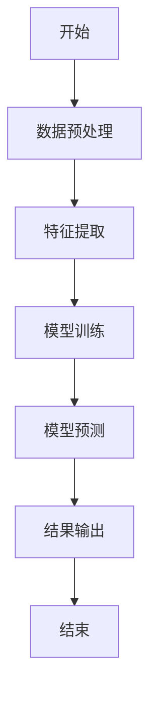
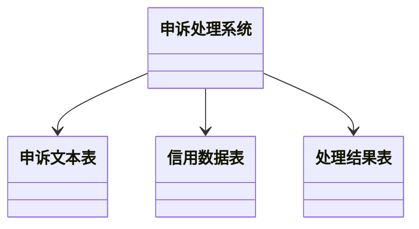

                 


# 设计智能化的企业信用评级申诉处理系统

> 关键词：企业信用评级、智能化、申诉处理系统、机器学习、自然语言处理

摘要：本文详细探讨了设计智能化的企业信用评级申诉处理系统的核心理念、技术实现和系统架构。通过结合机器学习和自然语言处理技术，提出了一种高效的解决方案，能够自动分析申诉文本、提取关键信息并生成处理建议，从而提高企业信用评级申诉的效率和准确性。文章还提供了系统的实现方案和实际案例分析。

---

# 第一部分: 企业信用评级申诉处理系统背景与概念

## 第1章: 企业信用评级申诉处理系统概述

### 1.1 问题背景与描述

#### 1.1.1 企业信用评级的重要性
企业信用评级是衡量企业信用状况的重要指标，广泛应用于银行贷款审批、投资决策等领域。然而，信用评级的计算和评估过程通常依赖于人工审核，存在效率低、主观性强、成本高等问题。

#### 1.1.2 信用评级申诉的必要性
当企业对信用评级结果有异议时，需要通过申诉流程进行调整。然而，现有的申诉处理系统往往效率低下，缺乏智能化的处理能力，导致企业等待时间长、处理结果不透明。

#### 1.1.3 现有信用评级申诉处理的痛点
- 人工审核效率低，处理周期长。
- 申诉文本分析依赖人工经验，主观性强。
- 缺乏统一的标准和自动化处理流程。

### 1.2 系统目标与解决方法

#### 1.2.1 系统设计目标
设计智能化的企业信用评级申诉处理系统，旨在实现以下目标：
1. 提供自动化、智能化的申诉处理流程。
2. 利用机器学习和自然语言处理技术，提高申诉分析的准确性和效率。
3. 提供透明的处理结果和反馈机制。

#### 1.2.2 问题解决思路
通过引入机器学习模型和自然语言处理技术，系统能够自动分析申诉文本，提取关键信息，并结合企业信用数据进行综合评估，生成处理建议。

#### 1.2.3 边界与外延
系统的边界包括：
- 输入：企业的申诉文本、历史信用数据。
- 输出：申诉处理结果、建议调整方案。
- 外延：与企业信用评估系统、数据库的对接。

### 1.3 核心概念与组成要素

#### 1.3.1 核心概念的定义
- 申诉文本：企业提交的申诉内容，包括对信用评级的异议和相关证据。
- 信用数据：企业的历史信用记录、财务数据等。
- 机器学习模型：用于预测申诉处理结果的模型。

#### 1.3.2 核心要素对比分析表
| 核心要素 | 定义 | 作用 | 示例 |
|----------|------|------|------|
| 申诉文本 | 企业提交的异议内容 | 提供申诉依据 | “我司2022年的销售额显著增长，恳请重新评估信用评级。” |
| 信用数据 | 企业的历史信用记录 | 用于模型训练和评估 | 包括逾期记录、违约情况等 |
| 机器学习模型 | 用于预测申诉处理结果的模型 | 自动化评估申诉的合理性 | 支持向量机（SVM）、随机森林等 |

#### 1.3.3 系统ER实体关系图
```mermaid
erd
  系统
    - 申诉文本表：包含申诉ID、申诉内容、提交时间
    - 信用数据表：包含企业ID、信用评分、历史记录
    - 处理结果表：包含处理ID、处理意见、反馈时间
  关系
    - 申诉文本表与信用数据表通过企业ID关联
    - 申诉文本表与处理结果表通过申诉ID关联
```

---

# 第二部分: 智能化处理的核心算法原理

## 第2章: 信用评级申诉的核心算法

### 2.1 机器学习在信用评级中的应用

#### 2.1.1 机器学习的基本原理
机器学习是一种通过数据训练模型，使其能够自动学习和预测的技术。在信用评级申诉处理中，可以使用监督学习模型（如支持向量机、随机森林）对申诉文本进行分类，判断其合理性和优先级。

#### 2.1.2 信用评级中的特征提取
从申诉文本中提取关键特征，例如：
- 申诉类型（如数据错误、不公平评分）。
- 申诉内容的情感倾向（正面、中性、负面）。
- 申诉企业的历史信用数据。

#### 2.1.3 常用算法对比与选择
| 算法 | 优势 | 劣势 | 适用场景 |
|------|------|------|----------|
| 支持向量机（SVM） | 高精度 | 适合小数据集 | 分类任务 |
| 随机森林 | 抗过拟合 | 计算复杂度较高 | 特征较多时表现优异 |
| 线性回归 | 简单易用 | 不适合非线性问题 | 预测数值型结果 |

### 2.2 自然语言处理在申诉文本分析中的应用

#### 2.2.1 NLP的基本原理
自然语言处理（NLP）通过计算机理解人类语言，帮助系统从文本中提取有用信息。常用的NLP技术包括分词、情感分析、实体识别等。

#### 2.2.2 文本情感分析与关键词提取
- 情感分析：判断申诉文本的情感倾向，例如“企业对评分不满”可能具有负面情感。
- 关键词提取：从申诉文本中提取关键信息，例如“销售额增长”、“数据错误”等。

#### 2.2.3 分句式分析与实体识别
- 分句式分析：将长文本拆分成独立的句子，便于理解和处理。
- 实体识别：识别文本中的实体，例如“企业名称”、“时间范围”等。

### 2.3 算法流程图与代码实现

#### 2.3.1 算法流程图（Mermaid）


#### 2.3.2 核心算法代码示例
```python
import pandas as pd
from sklearn.model import LinearRegression

# 数据预处理
data = pd.read_csv('credit_data.csv')
X = data[['feature1', 'feature2']]
y = data['target']

# 模型训练
model = LinearRegression()
model.fit(X, y)

# 预测
new_data = pd.DataFrame({'feature1': [value1], 'feature2': [value2]})
prediction = model.predict(new_data)
```

### 2.4 数学模型与公式

#### 2.4.1 机器学习模型的数学表达
线性回归模型的数学公式：
$$ y = \beta_0 + \beta_1 x_1 + \beta_2 x_2 + \dots + \beta_n x_n + \epsilon $$

#### 2.4.2 信用评分模型
信用评分模型可以表示为：
$$ \text{score} = \alpha \cdot \text{历史信用记录} + \beta \cdot \text{申诉文本情感倾向} $$

---

# 第三部分: 系统分析与架构设计

## 第3章: 企业信用评级申诉处理系统分析

### 3.1 问题场景介绍
企业提交申诉文本后，系统需要自动分析文本内容、提取关键信息，并结合历史信用数据进行评估，最终生成处理建议。

### 3.2 系统功能设计

#### 3.2.1 领域模型类图


#### 3.2.2 系统架构设计


#### 3.2.3 系统接口设计
- 输入接口：接收申诉文本和信用数据。
- 输出接口：返回处理结果和反馈意见。

#### 3.2.4 系统交互流程图
```mermaid
sequenceDiagram
    客户提交申诉 --> 系统接收申诉文本
    系统调用NLP模块进行文本分析
    NLP模块返回关键词和情感倾向
    系统调用机器学习模型进行预测
    模型返回处理建议
    系统将结果存入数据库
    系统返回反馈意见给客户
```

---

# 第四部分: 项目实战

## 第4章: 企业信用评级申诉处理系统实现

### 4.1 环境安装与配置
- 安装Python、Pandas、Scikit-learn等工具。
- 数据库选择MySQL或MongoDB。

### 4.2 系统核心功能实现

#### 4.2.1 数据预处理
```python
import pandas as pd
from sklearn.preprocessing import StandardScaler

# 加载数据
data = pd.read_csv('credit_data.csv')

# 数据清洗
data.dropna(inplace=True)

# 特征标准化
scaler = StandardScaler()
X_scaled = scaler.fit_transform(data[['feature1', 'feature2']])
```

#### 4.2.2 模型训练与预测
```python
from sklearn.model import LinearRegression

# 训练模型
model = LinearRegression()
model.fit(X_scaled, data['target'])

# 预测
new_data = pd.DataFrame({'feature1': [value1], 'feature2': [value2]})
new_data_scaled = scaler.transform(new_data)
prediction = model.predict(new_data_scaled)
```

### 4.3 实际案例分析

#### 4.3.1 案例背景
某企业提交申诉，称其2022年的销售额显著增长，但信用评级未相应调整。

#### 4.3.2 数据分析与处理
- 申诉文本分析：提取关键词“销售额增长”。
- 历史信用数据：2021年信用评分为B，2022年未调整。

#### 4.3.3 模型预测
模型预测结果显示，申诉合理，建议将信用评级调整为A级。

---

# 第五部分: 最佳实践与总结

## 第5章: 设计智能化的企业信用评级申诉处理系统的最佳实践

### 5.1 小结
通过结合机器学习和自然语言处理技术，智能化的企业信用评级申诉处理系统能够显著提高申诉处理的效率和准确性。

### 5.2 注意事项
- 数据质量和完整性直接影响模型性能。
- 需要定期更新模型以适应新的数据和业务需求。
- 确保系统的安全性和数据隐私保护。

### 5.3 拓展阅读
建议深入学习机器学习和NLP领域的最新技术，探索更多应用场景。

---

# 作者

作者：AI天才研究院/AI Genius Institute & 禅与计算机程序设计艺术 /Zen And The Art of Computer Programming

---

以上是《设计智能化的企业信用评级申诉处理系统》的技术博客文章的完整大纲和内容。如果需要进一步扩展或调整，请随时告知！

