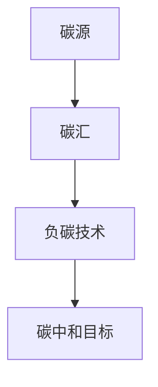
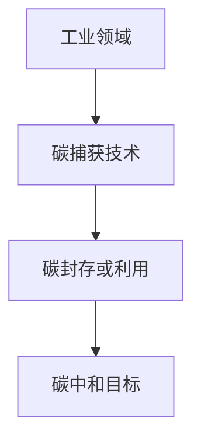
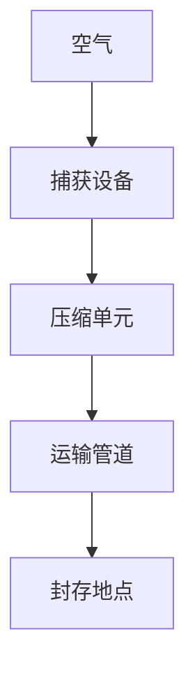
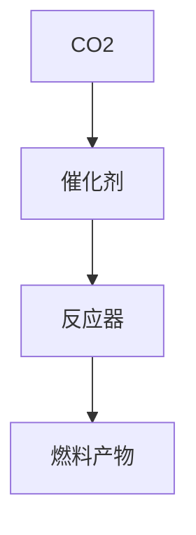

                 

<think>
好，我现在需要帮用户撰写一篇关于负碳技术发展前景与投资风险分析的技术博客文章。首先，我需要理解用户的需求。用户希望文章结构清晰，章节吸引人，内容专业且深入，同时要包括背景、技术原理、应用、经济性分析、投资风险、未来展望和结论等部分。

接下来，我得确定文章的结构。用户已经给出了一个详细的大纲，我需要按照这个大纲逐步展开每个部分。首先，标题和关键词要明确，然后是摘要，概述文章的核心内容。

在写背景部分时，我需要介绍负碳技术的重要性，当前的气候变化问题，以及为什么负碳技术是必要的。这部分要吸引读者，让他们明白问题的严重性和负碳技术的必要性。

然后是技术原理，这里需要详细讲解碳捕获和封存的数学模型，以及碳利用的技术路径。我得用mermaid流程图和Python代码来说明这些过程，让读者更容易理解。

接下来是应用案例，我需要列举具体的项目，比如碳捕获工厂或碳转化为燃料的项目，分析它们的成功之处和遇到的挑战，以及对其他地区的借鉴意义。

在经济性分析部分，我需要比较不同负碳技术的成本和收益，给出经济模型，帮助投资者理解哪种技术更划算。同时，政策支持的影响也不能忽视，因为补贴和税收优惠对投资决策有很大影响。

投资风险分析是关键部分，我需要详细讨论技术风险、市场风险和政策风险。通过实例分析，说明这些风险如何影响投资回报，比如某项目因技术瓶颈导致成本超支，或者政策变化影响盈利能力。

未来展望部分，我需要预测负碳技术的发展趋势，可能的技术突破，成本下降的可能性，以及商业化应用的潜力。同时，指出可能的挑战，如技术瓶颈和政策不确定性。

最后是结论，总结全文，强调负碳技术的重要性，投资潜力和风险，以及未来的发展方向。

在写作过程中，我需要确保每个部分都详细展开，使用专业而易懂的语言，同时插入图表和代码示例，使文章更具可读性和技术深度。此外，我还要注意文章的逻辑连贯，每个章节之间有良好的衔接，确保读者能够顺畅地理解内容。

现在，我需要按照这个思路，一步步撰写每个部分，确保涵盖所有关键点，并满足用户的格式和内容要求。
</think>

# 负碳技术的发展前景与投资风险分析

## 关键词：负碳技术、碳中和、碳捕获、碳利用、投资风险

## 摘要：  
负碳技术作为一种能够从大气中去除二氧化碳的技术，是实现全球碳中和目标的关键手段之一。本文将详细分析负碳技术的发展前景，探讨其在不同领域的应用潜力，同时结合实际案例，评估投资负碳技术可能面临的风险，并提出相应的建议。

---

# 第1章: 负碳技术的背景与定义

## 1.1 负碳技术的背景与问题背景

### 1.1.1 气候变化与碳中和的目标  
全球气候变化问题日益严峻，联合国政府间气候变化专门委员会（IPCC）的报告显示，全球气温上升速度远超预期，极端天气事件频发。为了应对气候变化，全球多个国家和地区提出了碳中和目标，即在一定时间内，通过减少温室气体排放或增加碳汇，实现净零排放。

然而，仅仅通过减少碳排放（如使用可再生能源、提高能效等）往往难以实现碳中和目标，特别是在工业、交通等领域，碳排放仍然难以完全消除。因此，负碳技术的出现为实现碳中和提供了新的可能性。

### 1.1.2 当前碳排放与碳中和的矛盾  
尽管全球范围内已经采取了多种措施来减少碳排放，但现有的技术手段和政策措施仍然不足以实现碳中和目标。特别是在一些高碳排放行业（如化工、钢铁、水泥等），减少碳排放的难度较大，而负碳技术可以通过主动去除大气中的二氧化碳，帮助实现碳中和。

### 1.1.3 负碳技术的提出与必要性  
负碳技术的核心目标是通过技术手段将大气中的二氧化碳捕获并储存或再利用，从而减少大气中的碳浓度。这一技术的提出，填补了现有低碳技术的空白，为解决全球气候变化问题提供了新的思路。

---

## 1.2 负碳技术的核心概念与问题描述

### 1.2.1 负碳技术的定义与内涵  
负碳技术（Negative Carbon Technology，简称NCT）是指能够从大气中去除二氧化碳，并将其长期储存或转化为其他物质的技术。与传统的低碳技术（如节能、可再生能源等）不同，负碳技术不仅能够减少碳排放，还能通过主动去除大气中的二氧化碳，实现碳中和甚至负碳排放。

### 1.2.2 负碳技术与碳中和的关系  
碳中和是指在一定时间内，通过减少碳排放和增加碳汇，实现碳排放的净零。负碳技术是实现碳中和的重要手段之一，特别是在碳排放难以完全消除的领域，负碳技术能够帮助实现净零排放甚至净负排放。

### 1.2.3 负碳技术的边界与外延  
负碳技术的核心是二氧化碳的捕获、储存和利用。其边界包括：  
1. **碳捕获**：从大气中捕获二氧化碳。  
2. **碳储存**：将捕获的二氧化碳长期储存，防止其重新释放到大气中。  
3. **碳利用**：将捕获的二氧化碳转化为其他物质或能源，实现资源化利用。  

---

## 1.3 负碳技术的核心要素与组成

### 1.3.1 碳捕获与封存技术  
碳捕获技术包括燃烧后捕获（Post-combustion）、燃烧前捕获（Pre-combustion）和氧气燃烧捕获（Oxy-fuel）三种主要技术路径。碳封存技术则包括地质封存、海洋封存和地下咸水层封存等方式。

### 1.3.2 碳利用技术  
碳利用技术包括：  
1. **化学利用**：将二氧化碳转化为化工产品（如尿素、碳酸盐等）。  
2. **能源利用**：将二氧化碳转化为燃料（如合成燃料）。  
3. **材料利用**：将二氧化碳用于生产建筑材料（如碳化混凝土）。  

### 1.3.3 负碳技术的系统架构  
负碳技术的系统架构通常包括以下三个主要部分：  
1. **碳源**：二氧化碳的来源，如工业尾气、空气中的二氧化碳等。  
2. **碳捕获与转化系统**：捕获二氧化碳并将其转化为其他物质或能源。  
3. **碳储存或利用系统**：将二氧化碳长期储存或转化为其他用途。  

---

## 1.4 本章小结  
本章主要介绍了负碳技术的背景、定义、核心概念以及系统架构。通过分析负碳技术与碳中和的关系，明确了负碳技术在全球气候变化应对中的重要性。接下来的章节将详细探讨负碳技术的原理、应用案例以及投资风险。

---

# 第2章: 负碳技术的核心概念与联系

## 2.1 负碳技术的核心原理

### 2.1.1 碳捕获与封存的原理  
碳捕获技术通过化学反应或物理分离的方法，将二氧化碳从烟气或其他气体混合物中分离出来。捕获的二氧化碳随后通过压缩、运输和储存，确保其长期稳定封存，不会再次进入大气。

### 2.1.2 碳利用的技术路径  
碳利用技术的核心是将捕获的二氧化碳转化为高价值的产品或能源。例如，通过催化反应将二氧化碳转化为合成燃料（如合成汽油或柴油），或将其用于生产建筑材料（如碳化混凝土）。

### 2.1.3 负碳技术的系统性特征  
负碳技术是一个复杂的系统工程，涉及碳源、碳捕获、碳储存和碳利用等多个环节。这些环节之间的协同作用是实现负碳排放的关键。

---

## 2.2 负碳技术与相关概念的对比

### 2.2.1 负碳技术与低碳技术的对比  
低碳技术主要是通过减少碳排放（如提高能效、使用可再生能源）来实现低碳目标，而负碳技术则是通过主动去除大气中的二氧化碳来实现负碳排放。

### 2.2.2 负碳技术与碳中和的关系  
碳中和是负碳技术的目标之一，但负碳技术的应用范围更广，不仅可以帮助实现碳中和，还可以通过长期储存二氧化碳来减少大气中的碳浓度。

### 2.2.3 负碳技术与可再生能源的关系  
可再生能源是减少碳排放的重要手段，而负碳技术则是实现碳中和的重要补充。两者结合使用，可以更有效地应对气候变化。

---

## 2.3 负碳技术的实体关系图

### 2.3.1 碳源与碳汇的关系  


### 2.3.2 技术与应用场景的关联  


### 2.3.3 经济性与技术性的平衡  
负碳技术的经济性是其大规模应用的关键。通过技术创新降低成本，同时通过政策支持和市场机制（如碳交易）来提高其经济可行性。

---

## 2.4 本章小结  
本章通过对比分析，明确了负碳技术的核心原理及其与相关概念的关系。负碳技术不仅是一个技术问题，更是一个系统工程，需要多领域的协同合作。

---

# 第3章: 负碳技术的算法原理与数学模型

## 3.1 碳捕获与封存的算法原理

### 3.1.1 碳捕获的流程图  


### 3.1.2 碳封存的数学模型  
碳封存的效率可以通过以下公式计算：  
$$C_{capture} = \alpha \cdot P + \beta \cdot T$$  
其中，$\alpha$ 和 $\beta$ 是捕获效率的系数，$P$ 是压力，$T$ 是温度。

---

## 3.2 碳利用的算法流程

### 3.2.1 碳转化为燃料的流程图  


### 3.2.2 碳利用的经济模型  
碳利用的经济性可以通过以下公式进行评估：  
$$E_{economic} = \gamma \cdot Q - \delta \cdot C$$  
其中，$\gamma$ 是单位收益，$Q$ 是产量，$\delta$ 是单位成本，$C$ 是总成本。

---

## 3.3 算法实现与代码示例

### 3.3.1 碳捕获效率计算代码  
```python
def carbon_capture_efficiency(pressure, temperature):
    alpha = 0.8
    beta = 0.2
    return alpha * pressure + beta * temperature
```

### 3.3.2 碳利用收益计算代码  
```python
def carbon_utility_profit(production, cost):
    gamma = 1.5  # 单位收益
    delta = 0.8  # 单位成本
    return gamma * production - delta * cost
```

---

## 3.4 本章小结  
本章通过算法和数学模型，详细分析了负碳技术的核心原理。通过代码示例，读者可以更好地理解负碳技术的实现过程和经济性评估。

---

# 第4章: 负碳技术的应用案例与经济性分析

## 4.1 负碳技术的应用场景

### 4.1.1 工业领域  
负碳技术在化工、钢铁、水泥等行业中有广泛的应用潜力。例如，水泥生产过程中会产生大量的二氧化碳，通过碳捕获技术可以将这些二氧化碳捕获并封存或再利用。

### 4.1.2 能源领域  
在能源领域，负碳技术可以用于合成燃料的生产。例如，通过电解水和二氧化碳加成反应，可以将二氧化碳转化为合成燃料，从而实现碳的循环利用。

### 4.1.3 建筑领域  
负碳技术可以用于生产碳化混凝土等建筑材料。通过将二氧化碳封存于建筑材料中，可以实现碳的长期储存。

---

## 4.2 负碳技术的经济性分析

### 4.2.1 不同负碳技术的经济性对比  
| 技术类型       | 成本（$/吨CO2） | 收益（$/吨CO2） |
|----------------|-----------------|-----------------|
| 碳封存         | 50-80           | 0-20            |
| 碳转化为燃料   | 80-120          | 50-100          |
| 碳转化为材料   | 60-100          | 30-60           |

### 4.2.2 政策支持的影响  
政策支持是负碳技术经济性的重要影响因素。例如，通过碳交易机制，负碳技术可以为企业带来额外的收益。此外，政府的补贴和税收优惠政策也可以降低负碳技术的实施成本。

---

## 4.3 本章小结  
本章通过实际案例分析，探讨了负碳技术在不同领域的应用潜力，并对不同技术的经济性进行了对比分析。政策支持是负碳技术大规模应用的重要推动力。

---

# 第5章: 负碳技术的投资风险与应对策略

## 5.1 负碳技术的投资风险

### 5.1.1 技术风险  
负碳技术目前仍处于技术研发和示范阶段，技术成熟度较低。例如，碳捕获技术的成本较高，且捕获效率有待提高。

### 5.1.2 市场风险  
负碳技术的市场需求目前较为有限，尤其是在缺乏政策支持的情况下，企业可能面临市场需求不足的风险。

### 5.1.3 政策风险  
政策的不确定性和支持力度直接影响负碳技术的投资回报。例如，如果政府减少对负碳技术的补贴或税收优惠政策，可能会影响企业的盈利能力。

---

## 5.2 负碳技术投资风险的应对策略

### 5.2.1 技术创新与成本降低  
通过技术研发和工艺优化，降低负碳技术的实施成本。例如，改进碳捕获技术，提高捕获效率，降低能耗。

### 5.2.2 政策支持与市场培育  
积极争取政府政策支持，推动负碳技术的市场培育。例如，通过碳交易机制，提高负碳技术的经济性。

### 5.2.3 产业链协同与国际合作  
负碳技术的实施需要多领域的协同合作，因此加强产业链上下游的协同合作，同时积极参与国际合作，分享技术和经验，也是降低投资风险的重要途径。

---

## 5.3 本章小结  
本章分析了负碳技术投资的主要风险，并提出了相应的应对策略。技术创新、政策支持和国际合作是降低投资风险的关键。

---

# 第6章: 负碳技术的未来展望与投资建议

## 6.1 负碳技术的发展趋势

### 6.1.1 技术突破与成本下降  
随着技术的不断进步，负碳技术的实施成本有望进一步下降。例如，新型碳捕获技术的研发可能带来成本的显著降低。

### 6.1.2 商业化应用的潜力  
未来，负碳技术的商业化应用潜力巨大。特别是在碳交易机制完善的地区，负碳技术可以通过碳交易获得可观的收益。

### 6.1.3 全球合作与技术共享  
负碳技术的研发和应用需要全球范围内的合作。通过技术共享和经验交流，可以加速负碳技术的推广和应用。

---

## 6.2 负碳技术的投资建议

### 6.2.1 关注技术研发与创新  
投资者应关注负碳技术领域的技术研发和创新，选择具有技术优势的企业进行投资。

### 6.2.2 重视政策支持与市场潜力  
在选择投资项目时，应充分考虑政策支持和市场需求，选择具有政策支持和技术优势的项目。

### 6.2.3 加强风险管理与多元投资  
投资者应加强风险管理，通过多元化的投资组合降低投资风险。同时，应密切关注政策变化和技术进步，及时调整投资策略。

---

## 6.3 本章小结  
本章对负碳技术的未来发展趋势进行了展望，并提出了相应的投资建议。技术创新和政策支持是负碳技术未来发展的关键。

---

# 第7章: 结论与展望

## 7.1 结论

### 7.1.1 负碳技术的重要性  
负碳技术是实现全球碳中和目标的重要手段之一，其应用可以帮助减少大气中的二氧化碳浓度，应对气候变化。

### 7.1.2 投资负碳技术的潜力与风险  
负碳技术的投资潜力巨大，但同时也面临技术、市场和政策等多方面的风险。投资者在选择投资项目时，应充分考虑这些因素。

---

## 7.2 展望

### 7.2.1 技术突破的希望  
随着技术的不断进步，负碳技术的实施成本有望进一步降低，技术成熟度也将提高。

### 7.2.2 全球合作的必要性  
负碳技术的研发和应用需要全球范围内的合作，只有通过技术共享和经验交流，才能加速负碳技术的推广和应用。

### 7.2.3 可持续发展的路径  
负碳技术不仅是应对气候变化的手段，也是实现可持续发展的重要组成部分。未来，负碳技术将在更广泛的领域得到应用，为全球可持续发展做出贡献。

---

# 作者：AI天才研究院/AI Genius Institute & 禅与计算机程序设计艺术 /Zen And The Art of Computer Programming

