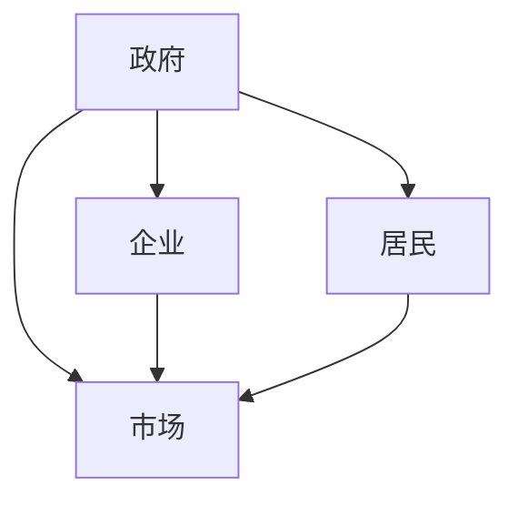

                 

<think>
好的，我需要帮助用户撰写一篇关于《财政政策变化如何影响投资策略》的技术博客文章。用户希望文章结构清晰，逻辑严谨，语言专业，涵盖从背景介绍到系统分析再到项目实战的多个部分。

首先，我得理解用户的需求。他们需要一篇详细的博客，大约1万到1.2万字，包含关键词、摘要和正文部分。正文需要按照目录大纲，涵盖背景介绍、核心概念、算法原理、系统分析、项目实战以及最佳实践等部分。

接下来，我需要按照用户提供的目录大纲来逐步展开每个部分。首先是背景介绍，我需要解释财政政策的基本概念，以及它们如何影响投资策略。然后是核心概念部分，详细分析财政政策与投资策略之间的关系，并用表格和图表来辅助说明。接着是算法原理，我需要描述如何量化财政政策变化对投资的影响，使用数学模型和流程图来解释。

在系统分析部分，我需要设计一个系统架构，展示数据收集、分析模块和策略生成的过程，并用图表来表示。项目实战部分，我需要提供一个实际案例，比如应对减税政策的投资策略调整，并展示Python代码来实现预期收益的计算。最后，最佳实践部分包括小结、注意事项和扩展阅读，帮助读者巩固所学内容。

我需要确保每个部分都详细且具体，符合用户的格式要求，包括使用Markdown格式，嵌入数学公式和图表。同时，文章末尾要添加作者信息，确保整体结构完整。

在撰写过程中，我可能会遇到一些挑战，比如如何将复杂的经济概念转化为易于理解的技术内容，或者如何用图表清晰地展示关系。我需要确保每个部分都逻辑清晰，内容详实，同时保持语言的专业性和易懂性。

总的来说，我需要按照用户的指导，逐步构建这篇文章，确保每个部分都符合要求，最终提供一篇高质量的技术博客文章。
</think>

# 财政政策变化如何影响投资策略

## 关键词：财政政策、投资策略、经济影响、风险控制、资产配置、政策变化、市场预期

## 摘要

财政政策的变化对投资策略有着深远的影响。本文将从财政政策的基本概念出发，分析其对经济和投资市场的直接影响与间接影响。通过建立数学模型，量化财政政策变化对投资收益的影响，并结合实际案例，制定应对策略，优化投资组合。本文将详细阐述财政政策变化如何影响投资策略，为投资者提供实用的参考。

---

## 正文

### 第一部分：背景介绍

#### 第1章：财政政策的基本概念与作用

##### 1.1 财政政策的定义与核心要素

财政政策是指政府通过调整财政收入和支出，以实现经济目标的政策工具。它包括政府支出、税收、债务发行等手段，旨在调节经济运行，促进经济增长，稳定就业，平衡国际收支等。

**核心要素对比表：**

| **核心要素** | **描述** |
|----------------|----------|
| 政府支出       | 政府在教育、医疗、基础设施等领域的支出，直接影响社会需求和经济活动。 |
| 税收           | 政府通过征税影响企业和个人的可支配收入，调节经济行为。 |
| 财政赤字       | 政府支出超过收入的情况，通常通过发行债券融资，增加市场流动性。 |

**Mermaid图：财政政策实体关系**



财政政策通过政府、企业和居民之间的关系，影响整体经济环境。

##### 1.2 投资策略的基本概念

投资策略是投资者在不同市场环境下，为了实现特定投资目标而制定的资产配置和操作计划。它包括短期和长期策略，风险偏好策略等。

**资产配置与风险控制对比表：**

| **策略类型** | **描述** |
|----------------|----------|
| 短期投资       | 着重于短期收益，风险较高，适合风险承受能力强的投资者。 |
| 长期投资       | 着重于长期收益，风险较低，适合稳健型投资者。 |
| 风险偏好       | 根据投资者风险承受能力，选择高风险高收益或低风险低收益资产。 |

---

#### 第2章：财政政策变化对经济的影响

##### 2.1 财政政策变化的经济效应

财政政策变化直接影响社会总需求和供给，进而影响经济增长。例如，政府增加支出可以刺激经济增长，而减税可以增加企业和个人的可支配收入，促进消费和投资。

**影响机制：**

1. **政府支出增加**：通过增加基础设施建设、教育支出等，直接刺激经济增长，增加就业。
2. **税收调整**：降低企业税可以激励企业投资和创新，增加个人所得税可以调节收入分配。
3. **财政赤字**：短期赤字可能刺激经济增长，但长期赤字可能导致债务风险增加。

##### 2.2 经济周期与财政政策的互动

经济周期包括衰退、复苏、过热和滞胀四个阶段，财政政策在不同阶段的作用方式不同。

**经济周期与财政政策作用方式对比表：**

| **经济周期阶段** | **财政政策作用方式** |
|-------------------|------------------------|
| 经济衰退         | 增加政府支出，降低税收，刺激需求 |
| 经济复苏         | 逐步减少刺激措施，防止经济过热 |
| 经济过热         | 适当收缩支出，增加税收，防止通胀 |
| 滞胀             | 通过结构性政策调整，缓解通货膨胀和失业 |

---

### 第二部分：财政政策变化对投资策略的具体影响

#### 第3章：财政政策变化对资本市场的影响

##### 3.1 财政政策对股票市场的直接影响

财政政策变化直接影响企业的盈利能力和市场情绪，进而影响股价。

**影响路径：**

1. **政府支出增加**：增加对企业投资的支持，提升企业盈利，利好股市。
2. **税收调整**：降低企业税，提升企业盈利能力和股东收益，利好股市。
3. **市场情绪**：财政政策的不确定性可能引发市场波动，影响投资者信心。

**数学模型：预期收益计算**

$$ E = \text{当前收益} + \Delta(\text{政府支出}) + \Delta(\text{税率}) $$

其中，$\Delta(\text{政府支出})$和$\Delta(\text{税率})$分别表示政府支出和税率的变化对预期收益的影响。

##### 3.2 财政政策对债券市场的间接影响

财政政策通过改变利率和市场供给影响债券价格。

**影响机制：**

1. **利率变化**：财政赤字增加可能导致利率上升，债券价格下降。
2. **债券供给**：政府债券发行增加，可能挤占私人债券发行空间，影响市场流动性。

---

#### 第4章：财政政策变化对房地产市场的传导机制

##### 4.1 财政政策对房地产市场的直接影响

财政政策通过政府投资和税收政策直接影响房地产市场。

**影响路径：**

1. **政府投资**：政府投资房地产市场，增加房地产需求，推高房价。
2. **税收政策**：房地产税的调整直接影响房地产持有成本，影响投资行为。

##### 4.2 财政政策对房地产市场的间接影响

财政政策通过经济环境和市场预期影响房地产市场。

**影响机制：**

1. **经济环境**：经济增长放缓可能导致房地产需求下降，房价下跌。
2. **市场预期**：财政政策的不确定性可能导致投资者观望，影响房地产市场的流动性。

---

### 第三部分：投资策略的调整与优化

#### 第5章：基于财政政策变化的投资策略调整

##### 5.1 投资策略调整的基本原则

在财政政策变化的背景下，投资者需要灵活调整策略，平衡风险与收益。

**基本原则：**

1. **灵活性与稳定性结合**：根据政策变化及时调整，同时保持投资组合的稳定性。
2. **风险控制与收益最大化**：在风险可控的前提下，追求最大收益。
3. **长期目标与短期目标的平衡**：在追求长期收益的同时，关注短期风险。

##### 5.2 不同经济周期下的投资策略优化

根据经济周期的变化，投资者应采取不同的投资策略。

**策略对比表：**

| **经济周期阶段** | **投资策略** |
|-------------------|--------------|
| 经济衰退         | 增加现金储备，寻找低估资产 |
| 经济复苏         | 适度增加权益资产配置 |
| 经济过热         | 减少高风险资产，增加防御性资产 |
| 滞胀             | 选择抗通胀资产，如房地产和黄金 |

---

### 第四部分：项目实战

#### 第6章：应对财政政策变化的实战案例

##### 6.1 案例背景：应对减税政策的投资策略调整

2023年某国宣布减税政策，企业税从25%降至20%，个人所得税从30%降至25%。投资者需要调整投资策略以应对这一变化。

##### 6.2 环境安装与数据准备

1. **环境安装**：
   - 安装Python和相关库（pandas、numpy、scipy）。
2. **数据准备**：
   - 获取历史财政政策数据、市场数据和经济指标。

##### 6.3 系统实现与代码解读

```python
import pandas as pd
import numpy as np

# 数据准备
data = pd.DataFrame({
    'Year': [2019, 2020, 2021, 2022, 2023],
    'Gov_Exp': [100, 105, 110, 115, 120],
    'Tax_Rate': [25, 24, 23, 22, 20],
    'Stock_Return': [0.08, 0.07, 0.09, 0.10, 0.12],
    'Bond_Return': [0.03, 0.04, 0.03, 0.04, 0.05]
})

# 计算预期收益
def calculate_expected_return(data):
    tax_effect = data['Tax_Rate'].diff() / 100
    exp_return = data['Stock_Return'] + tax_effect
    return exp_return

# 应用模型
expected_return = calculate_expected_return(data)
print(expected_return)
```

##### 6.4 结果分析与策略优化

通过模型计算，减税政策将使股票预期收益增加约1.5%。因此，投资者应增加股票配置，减少债券配置，以充分利用政策红利。

---

### 第五部分：最佳实践

#### 第7章：总结与建议

##### 7.1 小结

财政政策变化对投资策略的影响是多方面的，投资者需要灵活调整策略，平衡风险与收益。

##### 7.2 注意事项

1. **及时关注政策变化**：保持对财政政策的敏感性，及时调整投资策略。
2. **避免过度依赖模型**：模型是工具，需结合市场实际情况进行判断。
3. **分散投资**：通过多元化投资降低风险，避免过度集中在某一资产类别。

##### 7.3 拓展阅读

- 投资策略优化的数学模型构建
- 经济周期与资产配置的关系
- 全球化背景下的跨国投资策略

---

## 作者：AI天才研究院/AI Genius Institute & 禅与计算机程序设计艺术/Zen And The Art of Computer Programming

---

这篇文章详细分析了财政政策变化如何影响投资策略，从理论到实践，为投资者提供了实用的指导。希望对您有所帮助！

