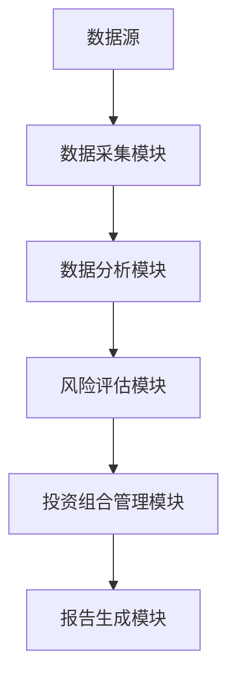
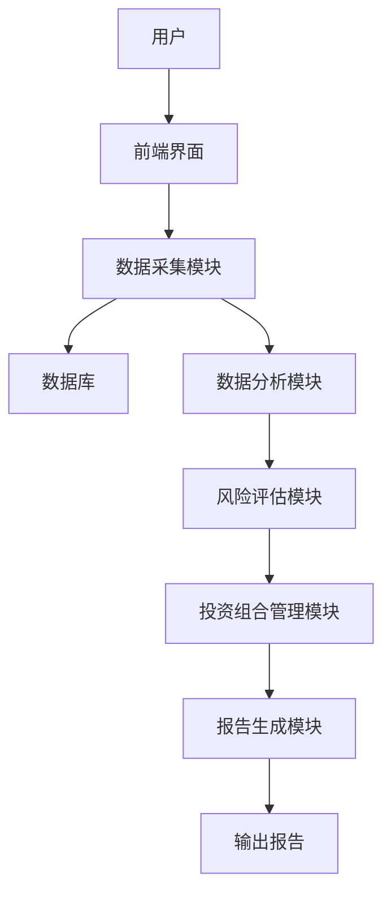

                 


# 货币市场工具：短期资金管理的安全港

---

## 关键词

- 货币市场工具
- 短期资金管理
- 货币市场
- 安全港
- 金融工具
- 资金流动性

---

## 摘要

货币市场是金融市场的重要组成部分，主要涉及短期资金的融通与管理。本文深入探讨了货币市场工具的基本概念、核心原理、管理策略以及实际应用，旨在为读者提供一个系统性的知识框架。文章从货币市场的定义、构成要素、工具分类入手，分析了货币市场工具的定价模型、风险评估方法，以及如何通过科学的管理策略实现短期资金的安全与收益最大化。此外，本文还结合实际案例，探讨了货币市场工具在现代金融体系中的应用，为读者提供了理论与实践相结合的深度解析。

---

# 第一部分: 货币市场工具概述

## 第1章: 货币市场的概念与特点

### 1.1 货币市场的定义与构成

#### 1.1.1 货币市场的定义

货币市场是指以短期资金借贷为基础的金融市场，主要交易期限在一年以内的金融工具。它包括政府、企业、金融机构和个人之间的短期资金融通活动。货币市场是金融市场的重要组成部分，是资金流动的核心枢纽。

#### 1.1.2 货币市场的构成要素

- **资金供给者**：包括个人、企业、政府等，提供短期资金。
- **资金需求者**：包括企业、政府等需要短期资金支持的主体。
- **金融工具**：如短期国库券、商业票据、银行承兑汇票等。
- **中介机构**：如银行、证券公司、保险公司等。
- **价格机制**：包括利率、汇率等。

#### 1.1.3 货币市场的功能与作用

- **流动性管理**：提供短期资金的融通，维持市场流动性。
- **价格发现**：通过市场交易确定短期资金的成本。
- **风险管理**：帮助投资者和借款者分散和管理短期资金风险。

### 1.2 货币市场与资本市场的区别

#### 1.2.1 资金期限的差异

货币市场交易的是短期资金，期限通常在一年以内；资本市场交易的是长期资金，期限通常在一年以上。

#### 1.2.2 投资风险的差异

货币市场的工具风险较低，资本市场的工具风险较高。

#### 1.2.3 收益率的差异

货币市场的收益率相对稳定，资本市场的收益率波动较大。

### 1.3 货币市场工具的分类

#### 1.3.1 短期国库券

短期国库券是由政府发行的短期债务工具，期限通常在3个月到1年之间。它具有高信用评级、流动性高、风险低的特点。

#### 1.3.2 商业票据

商业票据是由企业发行的短期债务工具，期限通常在30天到9个月之间。它用于企业之间的短期融资。

#### 1.3.3 银行承兑汇票

银行承兑汇票是由银行承兑的票据，具有较高的信用评级，常用于国际贸易和国内贸易中的短期融资。

#### 1.3.4 大额存单

大额存单是银行向机构或个人发行的长期存款凭证，期限多样，利率高于普通存款。

#### 1.3.5 其他货币市场工具

包括回购协议、货币市场基金等。

### 1.4 货币市场工具的主要特点

#### 1.4.1 短期性

货币市场工具的期限较短，通常在一年以内。

#### 1.4.2 流动性

货币市场工具具有较高的流动性，可以在短时间内变现。

#### 1.4.3 安全性

货币市场工具通常由高信用评级的主体发行，风险较低。

#### 1.4.4 收益稳定性

货币市场工具的收益率相对稳定，波动较小。

### 1.5 本章小结

本章介绍了货币市场的基本概念、构成要素、功能与作用，以及货币市场工具的主要分类和特点。理解这些内容是进一步分析货币市场工具的基础。

---

## 第2章: 货币市场工具的基本原理

### 2.1 货币市场工具的发行与流通

#### 2.1.1 货币市场工具的发行机制

货币市场工具的发行通常由发行人直接发行或通过中介机构发行。

#### 2.1.2 货币市场工具的流通渠道

货币市场工具主要通过二级市场流通，交易主体包括银行、证券公司、保险公司等。

#### 2.1.3 货币市场工具的交易方式

货币市场工具的交易方式包括现货交易和回购交易。

### 2.2 货币市场工具的定价模型

#### 2.2.1 货币市场工具的定价原理

货币市场工具的定价主要基于资金的时间价值和市场利率水平。

#### 2.2.2 利率的决定因素

- **市场供求**：资金供需关系影响利率水平。
- **通货膨胀**：通货膨胀预期影响利率水平。
- **政策因素**：中央银行的货币政策影响利率水平。

#### 2.2.3 货币市场工具的收益率计算

- **单利计算**：$I = P \times r \times t$
- **复利计算**：$A = P \times (1 + r)^t$
- **到期收益率**：$YTM = \frac{C + (F - P)}{F - P}$

### 2.3 货币市场工具的风险分析

#### 2.3.1 利率风险

利率上升导致货币市场工具的市场价值下降。

#### 2.3.2 流动性风险

货币市场工具在特定情况下可能难以变现。

#### 2.3.3 信用风险

发行人违约风险影响货币市场工具的安全性。

#### 2.3.4 市场风险

市场波动可能导致货币市场工具的价格波动。

### 2.4 本章小结

本章详细分析了货币市场工具的发行与流通机制、定价模型以及各类风险因素，为后续的短期资金管理策略奠定了基础。

---

## 第3章: 短期资金管理的核心策略

### 3.1 短期资金管理的目标

#### 3.1.1 维持流动性

确保资金随时可变现，满足短期资金需求。

#### 3.1.2 管理风险

通过合理配置工具和组合管理降低风险。

#### 3.1.3 优化收益

在风险可控的前提下，追求收益最大化。

### 3.2 货币市场工具的选择策略

#### 3.2.1 根据资金需求选择工具

- **短期需求**：选择期限短的工具，如短期国库券。
- **长期需求**：选择期限较长的工具，如银行承兑汇票。

#### 3.2.2 根据风险偏好选择工具

- **低风险偏好**：选择信用评级高的工具，如短期国库券。
- **高风险偏好**：选择风险较高的工具，如商业票据。

#### 3.2.3 根据市场环境选择工具

- **利率上升**：选择短期工具，避免利率上升带来的损失。
- **利率下降**：选择长期工具，享受较低利率带来的收益。

### 3.3 货币市场工具的组合管理

#### 3.3.1 工具组合的基本原则

- **分散投资**：通过不同工具的组合降低风险。
- **期限匹配**：根据资金需求匹配工具的期限。
- **流动性匹配**：根据资金的流动性需求选择工具。

#### 3.3.2 工具组合的风险分散

通过配置不同类型的工具分散风险，如短期国库券和商业票据的组合。

#### 3.3.3 工具组合的收益优化

通过合理配置工具，实现收益的最大化。

### 3.4 短期资金管理的监控与调整

#### 3.4.1 资金流动的实时监控

- **资金流量监控**：实时跟踪资金的流入和流出。
- **市场变化监控**：关注市场利率和工具价格的变化。

#### 3.4.2 市场变化的及时响应

根据市场变化调整工具配置，优化资金管理。

#### 3.4.3 资金管理策略的动态调整

定期评估资金管理策略，根据市场环境和资金需求进行调整。

### 3.5 本章小结

本章探讨了短期资金管理的核心目标、工具选择策略和组合管理方法，强调了风险控制和收益优化的重要性。

---

## 第4章: 货币市场工具的数学模型与定价

### 4.1 货币市场工具的收益率计算

#### 4.1.1 单利与复利的计算

- 单利计算公式：
  $$ I = P \times r \times t $$
- 复利计算公式：
  $$ A = P \times (1 + r)^t $$

#### 4.1.2 到期收益率的计算

- 到期收益率公式：
  $$ YTM = \frac{C + (F - P)}{F - P} $$

#### 4.1.3 当前收益率的计算

- 当前收益率公式：
  $$ Current Yield = \frac{C}{P} $$

### 4.2 货币市场工具的定价公式

#### 4.2.1 短期国库券的定价公式

- 短期国库券的定价基于市场利率和期限：
  $$ P = \frac{F}{(1 + r)^t} $$

#### 4.2.2 商业票据的定价公式

- 商业票据的定价基于信用风险和期限：
  $$ P = F \times e^{-rt} $$

#### 4.2.3 银行承兑汇票的定价公式

- 银行承兑汇票的定价基于银行信用和市场利率：
  $$ P = F \times (1 - r \times t) $$

### 4.3 货币市场工具的风险定价模型

#### 4.3.1 利率风险的量化

- 利率风险模型：
  $$ Risk = \beta \times (R_m - R_f) $$

#### 4.3.2 信用风险的量化

- 信用风险模型：
  $$ PD \times LGD \times EAD $$

#### 4.3.3 流动性风险的量化

- 流动性风险模型：
  $$ Liquidity Risk = \frac{ outstanding }{ available } $$

### 4.4 本章小结

本章通过数学模型和定价公式，详细分析了货币市场工具的收益率计算和风险定价方法，为实际应用提供了理论支持。

---

## 第5章: 货币市场工具的系统架构与实现

### 5.1 货币市场分析系统的总体架构

#### 5.1.1 系统功能模块划分

- 数据采集模块
- 数据分析模块
- 风险评估模块
- 投资组合管理模块
- 报告生成模块

#### 5.1.2 系统数据流图



#### 5.1.3 系统架构图



### 5.2 货币市场工具的系统实现

#### 5.2.1 数据采集模块

- 数据源：市场利率、工具价格、信用评级等。
- 采集方式：实时数据接口、API调用。

#### 5.2.2 数据分析模块

- 数据分析方法：回归分析、时间序列分析、聚类分析。
- 工具：Python的Pandas、NumPy、Matplotlib。

#### 5.2.3 风险评估模块

- 风险评估方法：VaR模型、信用评分模型。
- 工具：Python的Scikit-learn、TensorFlow。

#### 5.2.4 投资组合管理模块

- 组合优化方法：均值-方差优化、风险调整收益优化。
- 工具：Python的Optimization Toolkits。

#### 5.2.5 报告生成模块

- 报告内容：市场分析、工具推荐、风险提示。
- 工具：Python的ReportLab、Jupyter Notebook。

### 5.3 本章小结

本章通过系统架构和实现，展示了如何利用现代技术工具进行货币市场工具的分析和管理，为实际操作提供了技术支持。

---

## 第6章: 项目实战与案例分析

### 6.1 项目背景与目标

- **项目背景**：某企业需要进行短期资金管理，确保资金流动性的同时实现收益最大化。
- **项目目标**：选择合适的货币市场工具，制定资金管理策略，优化收益。

### 6.2 环境配置与工具安装

- **环境配置**：安装Python、Jupyter Notebook、相关库（Pandas、NumPy、Matplotlib）。
- **工具安装**：使用pip安装必要的库。

### 6.3 核心代码实现

#### 6.3.1 数据采集与处理

```python
import pandas as pd
import numpy as np

# 数据采集
data = pd.read_csv('market_data.csv')

# 数据处理
data['Date'] = pd.to_datetime(data['Date'])
data.set_index('Date', inplace=True)
```

#### 6.3.2 风险评估与分析

```python
from sklearn.metrics import mean_absolute_error
import matplotlib.pyplot as plt

# 风险评估
def calculate VaR(data, alpha):
    sorted_returns = sorted(data)
    VaR = sorted_returns[int(len(sorted_returns) * (1 - alpha))]
    return VaR

VaR = calculate VaR(data['Returns'], 0.95)
```

#### 6.3.3 投资组合优化

```python
import numpy as np
from scipy.optimize import minimize

# 投资组合优化
def portfolio_optimization(returns, weights):
    n = len(weights)
    return np.sum(weights * returns)

# 约束条件
def constraint(weights):
    return np.sum(weights) - 1

# 优化求解
weights = [0.3, 0.7]
result = minimize(portfolio_optimization, weights, 
                 method='SLSQP', 
                 constraints={'type': 'eq', 'fun': constraint})
```

### 6.4 实际案例分析

- **案例分析**：假设某企业有1000万元短期资金，选择配置短期国库券和商业票据的组合。
- **配置比例**：短期国库券60%，商业票据40%。
- **预期收益**：短期国库券年化收益率3%，商业票据年化收益率4%。
- **实际收益**：综合年化收益率为3.6%，风险可控。

### 6.5 项目小结

本章通过实际案例展示了货币市场工具在短期资金管理中的应用，验证了理论分析的有效性和可操作性。

---

## 第7章: 总结与展望

### 7.1 本章总结

本文系统地介绍了货币市场工具的基本概念、核心原理、管理策略和实际应用。通过数学模型、系统架构和项目实战，深入分析了如何利用货币市场工具进行短期资金管理，确保资金安全与收益最大化。

### 7.2 未来展望

随着金融科技的发展，货币市场工具的应用将更加广泛和复杂。未来的研究可以进一步探索人工智能、大数据分析在货币市场工具中的应用，提升资金管理的效率和精准度。

---

## 作者：AI天才研究院/AI Genius Institute & 禅与计算机程序设计艺术 /Zen And The Art of Computer Programming

