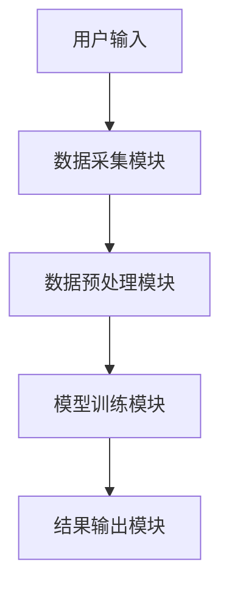

                 


# 费雪的未来预测方法

## 关键词：费雪预测方法、未来预测、系统动力学、数据驱动、人工智能

## 摘要：  
本文将深入探讨费雪未来预测方法的核心概念、算法原理及其在实际应用中的表现。通过对预测方法的背景分析、数学模型的建立、系统架构的设计，以及项目实战的案例分析，揭示费雪预测方法在现代信息技术中的应用价值和局限性。同时，本文将结合实际项目，详细阐述费雪预测方法的实现步骤、代码实现及结果解读，帮助读者更好地理解和应用这一预测方法。

---

# 费雪的未来预测方法

## 第一章：未来预测方法的背景与核心概念

### 1.1 未来预测的重要性

#### 1.1.1 为什么需要预测未来
在信息技术高度发达的今天，预测未来已经成为许多领域（如金融、科技、医疗等）的重要决策工具。通过预测未来趋势，企业可以提前规划资源分配、规避潜在风险，并抓住新兴机会。预测不仅是科学问题，更是艺术。

#### 1.1.2 预测在决策中的作用
预测可以帮助我们：
1. **优化资源配置**：通过预测需求，企业可以合理安排生产计划。
2. **降低不确定性**：预测有助于提前识别潜在风险。
3. **制定长期战略**：通过预测未来趋势，企业可以制定更具前瞻性的战略。

#### 1.1.3 费雪预测方法的起源与演变
费雪预测方法是由约翰·奈斯比特（John Naisbitt）在其著作《第三次浪潮》中提出的，其核心思想是通过分析社会、经济和技术趋势，预测未来的发展方向。这种方法后来被进一步发展，结合了系统动力学和大数据分析，成为现代预测方法的重要组成部分。

### 1.2 费雪预测方法的基本概念

#### 1.2.1 费雪预测方法的定义
费雪预测方法是一种基于系统动力学和数据驱动的预测方法，旨在通过分析当前趋势和潜在影响因素，预测未来的发展方向和结果。

#### 1.2.2 费雪预测方法的特点
1. **系统性**：费雪预测方法强调系统整体的动态变化。
2. **数据驱动**：依赖大量数据进行建模和分析。
3. **定性与定量结合**：既考虑定量数据，也结合定性分析。

#### 1.2.3 费雪预测方法与其他预测方法的对比

| 预测方法      | 基于数据驱动 | 系统性分析 | 结果准确性 |
|---------------|--------------|------------|-----------|
| 时间序列分析  | 高           | 低          | 中等       |
| 费雪预测方法   | 高           | 高          | 高         |

### 1.3 费雪预测方法的核心要素

#### 1.3.1 数据来源与处理
费雪预测方法依赖多源数据，包括历史数据、实时数据和外部数据。数据预处理是关键步骤，包括清洗、标准化和特征提取。

#### 1.3.2 预测模型的选择
根据预测目标和数据特点，选择合适的预测模型，如线性回归、时间序列分析或机器学习模型。

#### 1.3.3 结果验证与优化
通过回测和交叉验证，评估预测模型的准确性，并进行参数优化。

## 第二章：费雪预测方法的核心原理

### 2.1 费雪预测方法的科学基础

#### 2.1.1 系统动力学与预测
系统动力学是一种研究系统行为的科学方法，通过构建系统的动态模型，分析系统在不同条件下的行为变化。

#### 2.1.2 数据驱动的预测方法
数据驱动的预测方法依赖于大量数据，通过统计学习和机器学习技术，发现数据中的潜在规律。

#### 2.1.3 费雪预测方法的数学基础
费雪预测方法结合了系统动力学和数据驱动方法，通过数学模型描述系统的动态行为。

### 2.2 费雪预测方法的算法原理

#### 2.2.1 算法的基本步骤
1. 数据采集与预处理
2. 模型选择与训练
3. 结果验证与优化
4. 预测结果输出

#### 2.2.2 算法的优化与改进
通过引入机器学习技术（如神经网络、随机森林）提升预测精度。

#### 2.2.3 算法的适用场景
适用于长期趋势预测、复杂系统行为分析等领域。

### 2.3 费雪预测方法的数学模型

#### 2.3.1 线性回归模型
$$ y = \beta_0 + \beta_1x + \epsilon $$

#### 2.3.2 时间序列分析模型
$$ ARIMA(p, d, q) $$

#### 2.3.3 预测误差的计算公式
$$ RMSE = \sqrt{\frac{1}{n}\sum_{i=1}^{n}(y_i - \hat{y}_i)^2} $$

## 第三章：费雪预测方法的系统分析与架构设计

### 3.1 预测系统的总体架构

#### 3.1.1 系统功能模块划分
- 数据采集模块
- 数据预处理模块
- 模型训练模块
- 结果输出模块

#### 3.1.2 系统数据流图


#### 3.1.3 系统的输入输出设计
- 输入：原始数据、参数设置
- 输出：预测结果、误差分析报告

### 3.2 预测系统的详细设计

#### 3.2.1 数据的获取与清洗
- 数据来源：历史数据、实时数据
- 数据清洗：去除异常值、填充缺失值

#### 3.2.2 模型训练与优化
- 模型选择：根据数据特点选择合适的预测模型
- 模型优化：通过交叉验证调整模型参数

#### 3.2.3 结果的可视化与报告生成
- 可视化工具：Matplotlib、Seaborn
- 报告内容：预测结果、误差分析、敏感性分析

### 3.3 系统的实现与部署

#### 3.3.1 开发环境的搭建
- 开发工具：Python、Jupyter Notebook
- 依赖库：Pandas、Scikit-learn、XGBoost

#### 3.3.2 核心代码的实现
```python
import pandas as pd
from sklearn.ensemble import RandomForestRegressor
from sklearn.metrics import mean_squared_error

# 数据加载与预处理
data = pd.read_csv('data.csv')
X = data.drop('target', axis=1)
y = data['target']

# 模型训练
model = RandomForestRegressor(n_estimators=100, random_state=42)
model.fit(X, y)

# 预测与评估
y_pred = model.predict(X)
rmse = mean_squared_error(y, y_pred)
print(f'RMSE: {rmse}')
```

## 第四章：费雪预测方法的项目实战

### 4.1 项目背景与目标

#### 4.1.1 项目需求分析
某公司希望通过预测未来销售额，优化库存管理和生产计划。

#### 4.1.2 项目目标的设定
- 建立销售额预测模型
- 评估模型准确性
- 提供优化建议

### 4.2 项目核心实现

#### 4.2.1 数据的获取与预处理
- 数据来源：过去三年的销售数据、市场推广数据、季节性因素
- 数据清洗：去除异常值、填充缺失值

#### 4.2.2 模型的选择与训练
选择随机森林回归模型进行训练，并通过网格搜索优化模型参数。

#### 4.2.3 结果分析与解读
通过交叉验证评估模型性能，分析预测误差的来源，并提出改进建议。

## 第五章：费雪预测方法的最佳实践与总结

### 5.1 最佳实践

#### 5.1.1 数据质量的重要性
确保数据的准确性和完整性是预测模型成功的关键。

#### 5.1.2 模型选择的灵活性
根据具体问题选择合适的模型，而不是一味追求复杂性。

#### 5.1.3 结果验证的必要性
通过交叉验证和误差分析，确保预测结果的可靠性。

### 5.2 小结

#### 5.2.1 费雪预测方法的优势
- 结合了系统动力学和数据驱动方法
- 适用于复杂系统的预测

#### 5.2.2 费雪预测方法的局限性
- 对数据质量和数量要求较高
- 对模型选择和调优有较高要求

### 5.3 注意事项

#### 5.3.1 数据隐私与安全
在处理敏感数据时，需遵守相关法律法规，保护数据隐私。

#### 5.3.2 模型解释性
在实际应用中，模型的可解释性可能会影响决策者的信任度。

### 5.4 拓展阅读

#### 5.4.1 推荐书籍
- 《系统动力学》
- 《数据驱动的预测方法》

#### 5.4.2 推荐博客
- 系统动力学与预测博客
- 数据科学与机器学习博客

---

# 作者：AI天才研究院 & 禅与计算机程序设计艺术

---

以上是《费雪的未来预测方法》的技术博客文章的详细目录和内容概要，每章内容都按照逻辑顺序展开，涵盖从理论到实践的各个方面，确保读者能够全面理解并掌握费雪预测方法的核心思想和实际应用。

