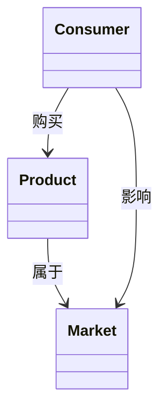
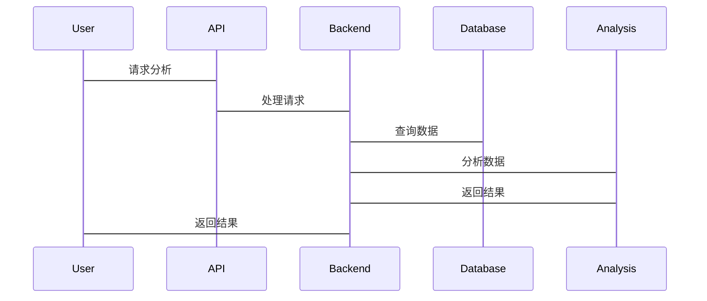

                 


# 费雪的消费者取向分析：把握市场脉搏

## 关键词：
费雪分析法、消费者取向分析、市场分析、消费者行为、数据分析、算法实现

## 摘要：
费雪的消费者取向分析是一种基于消费者行为和偏好的分析方法，用于帮助企业更好地理解市场动态和消费者需求。本文从理论基础、算法实现、系统设计到项目实战，详细阐述了费雪分析法的各个方面，帮助读者掌握这一强大的市场分析工具。

---

# 第1章: 费雪的消费者取向分析概述

## 1.1 费雪的消费者取向分析的背景介绍

### 1.1.1 消费者取向分析的起源与演变
消费者取向分析是一种研究消费者行为和偏好的方法，起源于20世纪初。随着市场营销的发展，分析方法不断演变，从简单的问卷调查到复杂的算法模型。

### 1.1.2 费雪分析法的核心概念与问题背景
费雪分析法由英国统计学家R.A. Fisher提出，主要用于分类和分析数据。将其应用于消费者取向分析，可以帮助企业识别消费者群体的特征和偏好。

### 1.1.3 消费者取向分析的理论基础与应用价值
费雪分析法基于统计学原理，通过分析消费者数据，帮助企业制定精准的市场策略。

---

## 1.2 费雪分析法的基本原理与框架

### 1.2.1 消费者取向分析的核心概念
消费者取向分析关注消费者的购买决策、偏好和行为模式，通过数据分析提取有价值的信息。

### 1.2.2 费雪分析法的分析维度与指标
包括消费者属性、产品属性、市场细分等多个维度，通过指标分析消费者行为。

### 1.2.3 消费者取向分析的边界与外延
明确分析的范围和限制，确保结果的有效性和准确性。

---

# 第2章: 费雪分析法的核心概念与联系

## 2.1 消费者取向分析的理论框架

### 2.1.1 消费者决策过程的模型化
通过模型化分析消费者决策过程，理解其背后的心理和行为因素。

### 2.1.2 费雪分析法的核心要素与关系
分析消费者行为的核心要素及其相互关系，构建理论模型。

## 2.2 费雪分析法的属性特征对比

### 2.2.1 消费者取向分析的属性特征表格
通过表格对比不同分析方法的属性特征。

### 2.2.2 费雪分析法的独特性与优势
费雪分析法在准确性、可解释性和可操作性方面的优势。

## 2.3 费雪分析法的ER实体关系图

### 2.3.1 实体关系图的构建
使用mermaid语法绘制ER图，展示消费者、产品、市场等实体的关系。

### 2.3.2 实体关系图的解释与应用
通过ER图理解数据结构，为后续分析提供基础。

---

# 第3章: 费雪分析法的算法原理与实现

## 3.1 费雪分析法的算法流程

### 3.1.1 数据收集与预处理
通过问卷、数据库等方式收集消费者数据，并进行清洗和标准化。

### 3.1.2 数据分析与特征提取
使用统计方法提取关键特征，识别影响消费者行为的主要因素。

### 3.1.3 结果解读与优化
根据分析结果优化市场策略，调整产品和服务。

## 3.2 费雪分析法的数学模型

### 3.2.1 加权评分计算公式
$$ \text{评分} = \sum_{i=1}^{n} w_i x_i $$
其中，\( w_i \) 是权重，\( x_i \) 是特征值。

### 3.2.2 消费者取向分析的数学模型
构建多元回归模型，分析变量之间的关系。

## 3.3 费雪分析法的 Python 实现

### 3.3.1 环境安装与配置
安装必要的Python库，如pandas、numpy、scikit-learn。

### 3.3.2 核心代码实现
```python
import pandas as pd
from sklearn.decomposition import PCA

data = pd.read_csv('consumer_data.csv')
# 数据预处理
# 特征提取与建模
model = PCA(n_components=2)
principal_components = model.fit_transform(data)
# 结果分析
print(principal_components)
```

### 3.3.3 代码解读与优化建议
解释代码功能，提出优化建议，如增加交叉验证。

---

# 第4章: 系统分析与架构设计方案

## 4.1 问题场景介绍

### 4.1.1 消费者取向分析的典型应用场景
分析消费者对新产品的偏好，优化市场策略。

### 4.1.2 系统目标与范围
构建一个基于费雪分析法的消费者取向分析系统。

## 4.2 系统功能设计

### 4.2.1 领域模型的 mermaid 类图


### 4.2.2 系统功能模块划分
包括数据采集、分析模块、结果展示模块。

## 4.3 系统架构设计

### 4.3.1 系统架构图


## 4.4 系统接口设计

### 4.4.1 API 接口
定义API接口，如`/api/consumer_analysis`。

### 4.4.2 系统交互序列图


---

# 第5章: 项目实战

## 5.1 环境安装与配置

### 5.1.1 安装 Python 和相关库
安装Python，pandas，numpy，scikit-learn。

## 5.2 核心代码实现

### 5.2.1 数据预处理代码
```python
import pandas as pd
data = pd.read_csv('consumer_data.csv')
data = data.dropna()
```

### 5.2.2 特征提取与建模代码
```python
from sklearn.decomposition import PCA
model = PCA(n_components=2)
principal_components = model.fit_transform(data)
```

### 5.2.3 结果分析代码
```python
print(principal_components)
```

## 5.3 实际案例分析与解读

### 5.3.1 案例背景
分析消费者对某产品的偏好。

### 5.3.2 数据分析过程
提取关键特征，构建模型，分析结果。

### 5.3.3 分析结果解读
根据结果调整市场策略，优化产品设计。

## 5.4 项目小结

### 5.4.1 项目总结
总结项目成果，提出改进建议。

### 5.4.2 经验与教训
分享项目中的经验教训，优化后续项目。

---

# 第6章: 最佳实践与小结

## 6.1 费雪分析法的最佳实践

### 6.1.1 小结
回顾文章内容，总结关键点。

### 6.1.2 注意事项
避免常见错误，确保数据质量和分析准确性。

### 6.1.3 拓展阅读
推荐相关书籍和资源，进一步学习。

---

# 作者：AI天才研究院 & 禅与计算机程序设计艺术

通过以上结构，您可以系统地撰写一篇关于费雪的消费者取向分析的技术博客文章，涵盖背景、理论、算法、系统设计、项目实战和最佳实践等部分。

