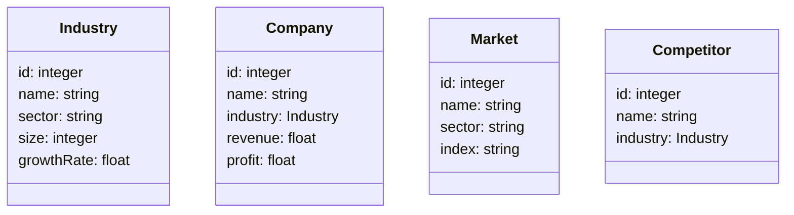
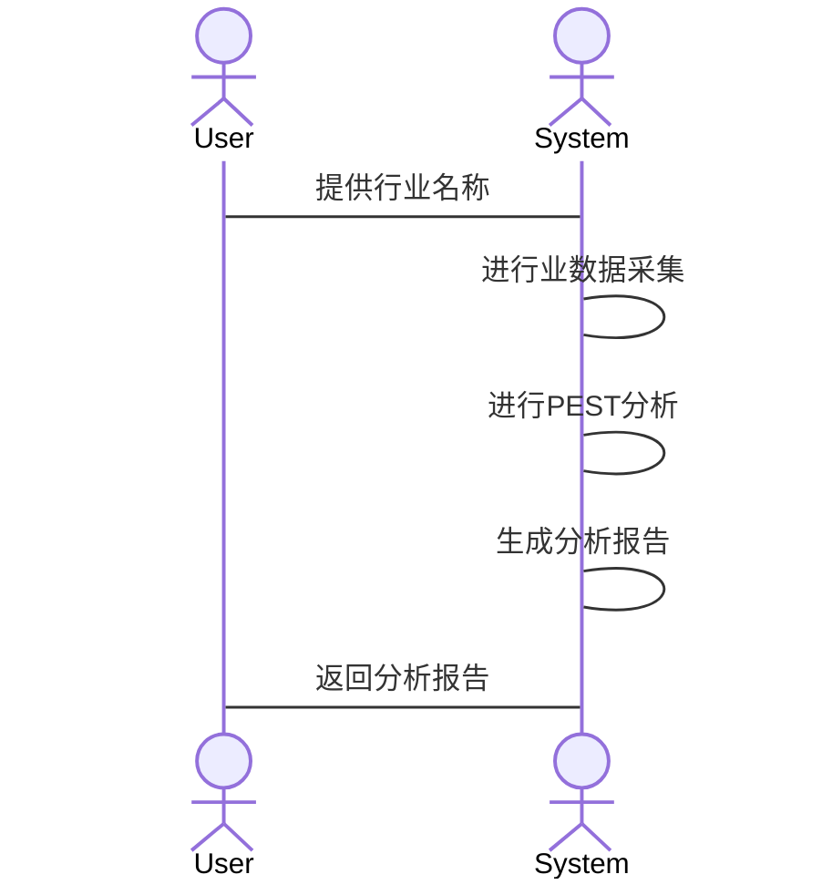

                 

<think>
好的，现在需要设计《费雪的行业分析方法》这本书的目录大纲。根据用户的详细要求，我需要确保每一部分都符合其专业性和逻辑性，同时涵盖技术博客的结构要求。

首先，用户希望文章结构清晰、吸引人，所以我需要确定每个章节的标题要有吸引力，同时内容要深入。关键词部分需要涵盖行业分析、费雪方法、投资分析、金融建模、Python实现等。

摘要部分需要简明扼要，概括文章的核心内容。正文部分需要分章节详细讲解，包括背景、概念、算法、数学模型、系统设计、实战和最佳实践。

接下来，我会按照用户提供的目录结构来逐步构建内容，确保每个章节和小节都包含必要的信息，并且符合技术博客的专业性。同时，我会使用Mermaid图来辅助说明流程、架构和实体关系，帮助读者更好地理解。

最后，检查是否覆盖了所有要求，包括数学公式、代码示例、案例分析和注意事项，确保文章结构完整，内容丰富。
</think>

# 费雪的行业分析方法

> 关键词：费雪行业分析，投资分析，行业评估，PEST分析，金融建模

> 摘要：本文详细介绍了费雪的行业分析方法，从背景介绍到核心概念，从算法原理到系统架构设计，再到项目实战和最佳实践，帮助读者全面理解并掌握这一方法。

---

# 正文

## 第1章: 费雪的行业分析方法背景介绍

### 1.1 行业分析的核心概念

#### 1.1.1 行业分析的定义与背景

行业分析是一种系统地研究和评估特定行业的方法，旨在了解行业的现状、发展趋势、竞争格局和潜在机会。费雪的行业分析方法是其中一种经典的投资分析方法，特别注重行业内部结构和外部环境的综合评估。

#### 1.1.2 费雪行业分析方法的起源

菲利普·费雪（Philip Fisher）是20世纪的投资大师，他提出的行业分析方法强调长期投资和深入研究。费雪认为，投资成功的关键在于选择具有强大竞争优势和良好管理的公司，而不是简单地关注市场波动。

#### 1.1.3 行业分析的边界与外延

行业分析的边界通常包括行业内的主要参与者、市场结构、竞争态势和关键成功因素。外延则涉及宏观经济环境、政策法规和技术进步等因素。

### 1.2 费雪行业分析方法的核心要素

#### 1.2.1 行业分析的基本框架

费雪的行业分析框架包括以下几个关键步骤：

1. **行业环境分析**：包括PEST（政治、经济、社会、技术）分析。
2. **行业生命周期分析**：判断行业所处的生命周期阶段（导入期、成长期、成熟期、衰退期）。
3. **行业竞争结构分析**：分析行业内主要竞争者和市场集中度。
4. **行业财务指标分析**：评估行业的盈利能力、成长性和风险。

#### 1.2.2 核心概念的属性特征对比

下表对比了行业分析和公司分析的核心概念：

| **属性**       | **行业分析**                          | **公司分析**                          |
|----------------|--------------------------------------|--------------------------------------|
| 分析目标       | 行业的整体表现和趋势                  | 公司的财务状况和竞争优势              |
| 数据来源       | 行业统计数据、市场报告                | 公司财务报表、新闻报道                |
| 关注点         | 市场规模、增长潜力、竞争格局          | 盈利能力、管理团队、竞争优势          |

#### 1.2.3 行业分析的ER实体关系图

```mermaid
er
actor IndustryAnalyst {
  id: integer
  name: string
}
actor Company {
  id: integer
  name: string
}
actor Market {
  id: integer
  name: string
}
actor Competitor {
  id: integer
  name: string
}
actor EconomicFactor {
  id: integer
  name: string
}
actor PolicyFactor {
  id: integer
  name: string
}
actor TechnologyFactor {
  id: integer
  name: string
}
```

## 第2章: 费雪行业分析方法的核心概念与联系

### 2.1 行业分析的核心原理

#### 2.1.1 行业分析的基本原理

费雪的行业分析方法基于以下几个核心原理：

1. **行业生命周期理论**：不同生命周期阶段的行业具有不同的投资价值。
2. **竞争优势理论**：选择具有强大竞争优势的行业和公司。
3. **长期投资理念**：关注行业的长期发展趋势，而非短期波动。

#### 2.1.2 费雪方法的核心算法

费雪的行业分析算法主要包括以下几个步骤：

1. **数据收集**：收集行业相关的统计数据、财务报表和市场报告。
2. **PEST分析**：分析行业所处的政治、经济、社会和技术环境。
3. **生命周期分析**：判断行业所处的生命周期阶段。
4. **竞争结构分析**：评估行业内的竞争格局和市场集中度。
5. **财务指标分析**：计算行业的关键财务指标（如PE、ROE等）。

#### 2.1.3 行业分析的数学模型

以下是行业分析中常用的几个关键指标：

1. **PE（市盈率）**：
   $$ PE = \frac{\text{股价}}{\text{每股收益}} $$
   
2. **ROE（净资产收益率）**：
   $$ ROE = \frac{\text{净利润}}{\text{股东权益}} $$

### 2.2 行业分析的流程图

以下是费雪行业分析方法的流程图：


## 第3章: 费雪行业分析方法的算法原理

### 3.1 行业分析的核心算法

#### 3.1.1 费雪行业的PEST分析法

PEST分析法用于评估行业所处的宏观环境：

1. **政治因素**：政府政策、法规变化。
2. **经济因素**：经济周期、利率水平。
3. **社会因素**：人口结构、消费者偏好。
4. **技术因素**：技术创新、技术进步。

#### 3.1.2 行业生命周期分析

行业生命周期分析帮助投资者判断行业的成长潜力：

1. **导入期**：市场需求不足，竞争较小。
2. **成长期**：市场需求快速增长，竞争加剧。
3. **成熟期**：市场需求稳定，竞争激烈。
4. **衰退期**：市场需求下降，竞争减弱。

#### 3.1.3 行业竞争力评估

竞争力评估包括以下几个方面：

1. **市场集中度**：CR4（前四大企业的市场份额）。
2. **进入壁垒**：专利、品牌、规模经济等。
3. **成本结构**：固定成本与可变成本的比例。

### 3.2 算法的数学模型

#### 3.2.1 行业PE分析公式

$$ PE = \frac{\text{股价}}{\text{每股收益}} $$

#### 3.2.2 行业ROE分析公式

$$ ROE = \frac{\text{净利润}}{\text{股东权益}} $$

#### 3.2.3 行业增长潜力评估公式

$$ 增长潜力 = \frac{\text{行业年增长率}}{\text{GDP增长率}} $$

## 第4章: 费雪行业分析方法的系统分析与架构设计

### 4.1 行业分析的系统功能设计

#### 4.1.1 领域模型设计

以下是行业分析系统的领域模型：



#### 4.1.2 系统功能模块划分

1. **数据采集模块**：收集行业数据。
2. **分析模块**：进行PEST分析、生命周期分析等。
3. **报告生成模块**：生成分析报告。

#### 4.1.3 系统接口设计

以下是系统的主要接口：



## 第5章: 费雪行业分析方法的项目实战

### 5.1 项目环境安装与配置

#### 5.1.1 开发环境搭建

建议使用Python、Jupyter Notebook和相关数据处理库（如Pandas、NumPy）。

#### 5.1.2 工具安装与配置

安装以下工具：

- Python 3.8+
- Jupyter Notebook
- Pandas
- Matplotlib
- Scikit-learn

### 5.2 项目核心实现

#### 5.2.1 行业数据采集与处理

以下是数据采集和处理的Python代码示例：

```python
import pandas as pd
import requests

# 数据采集
url = "https://example.com/industry_data"
response = requests.get(url)
data = response.json()

# 数据处理
df = pd.DataFrame(data)
df = df[["name", "sector", "revenue", "profit"]]
```

#### 5.2.2 行业分析算法实现

以下是PEST分析的Python代码示例：

```python
def pest_analysis(data):
    # 政治因素分析
    political_risk = data['political_risk']
    # 经济因素分析
    economic_growth = data['economic_growth']
    # 社会因素分析
    demographic = data['demographic']
    # 技术因素分析
    tech_innovation = data['tech_innovation']
    return {
        'political_risk': political_risk,
        'economic_growth': economic_growth,
        'demographic': demographic,
        'tech_innovation': tech_innovation
    }
```

#### 5.2.3 系统功能实现

以下是行业生命周期分析的Python代码示例：

```python
def industryLifecycle(analyze_data):
    # 判断行业生命周期阶段
    growth_rate = analyze_data['growth_rate']
    if growth_rate > 20:
        return "成长期"
    elif growth_rate > 10:
        return "成熟期"
    elif growth_rate > 5:
        return "导入期"
    else:
        return "衰退期"
```

### 5.3 项目实战案例分析

假设我们选择科技行业进行分析：

1. **数据采集**：收集科技行业的PE、ROE、增长潜力等数据。
2. **PEST分析**：分析科技行业的政治、经济、社会和技术环境。
3. **生命周期分析**：判断科技行业所处的生命周期阶段。
4. **竞争力评估**：评估科技行业的市场集中度和进入壁垒。

## 第6章: 费雪行业分析方法的最佳实践与小结

### 6.1 最佳实践 Tips

1. **数据准确性**：确保数据来源可靠，避免错误分析。
2. **模型适用性**：根据实际情况调整模型参数，避免生搬硬套。
3. **持续学习**：行业环境不断变化，需持续更新知识和模型。

### 6.2 项目小结与展望

通过本文的详细介绍和实战案例，读者可以全面掌握费雪的行业分析方法。未来的研究可以进一步探讨如何将机器学习技术应用于行业分析，以提高分析的准确性和效率。

---

# 作者

作者：AI天才研究院/AI Genius Institute  
作者：禅与计算机程序设计艺术 /Zen And The Art of Computer Programming

