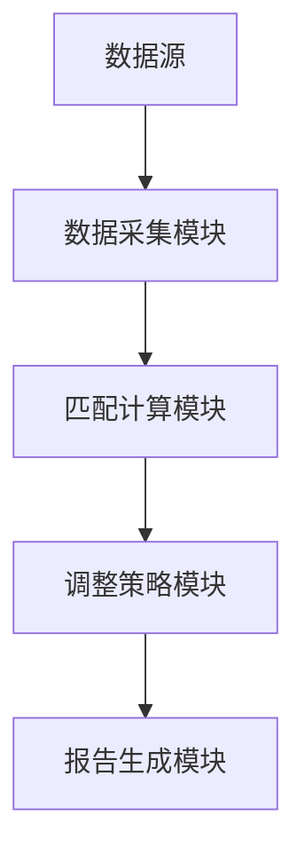
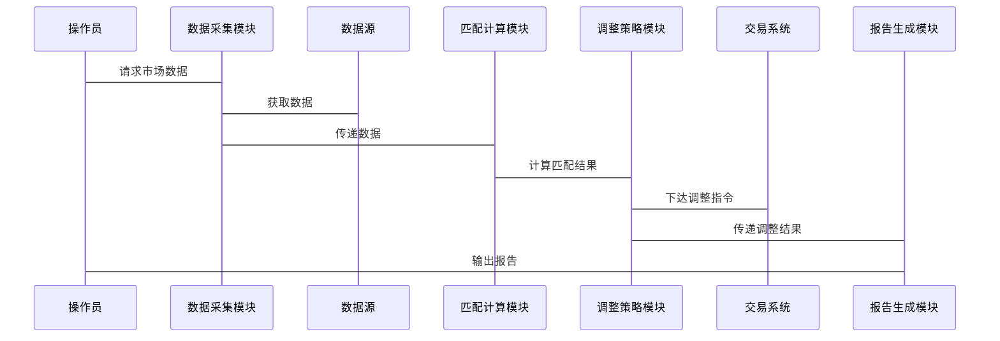

                 


# 资产负债匹配：机构投资者的长期投资策略

## 关键词
资产负债匹配、机构投资者、长期投资策略、资产配置、负债管理

## 摘要
资产负债匹配是机构投资者在长期投资中确保资产与负债在时间、风险和现金流上相匹配的关键策略。本文详细探讨了资产负债匹配的定义、理论基础、实现方法、系统架构设计以及实际项目案例，帮助读者全面理解如何在机构投资中有效应用这一策略。

---

# 第一部分: 资产负债匹配的背景与基础

## 第1章: 资产负债匹配的定义与背景

### 1.1 资产负债匹配的核心概念

#### 1.1.1 资产与负债的定义与特点

- **资产**：机构持有的金融资产，包括债券、股票、基金等，具有未来收益潜力。
- **负债**：机构的债务责任，包括债券、贷款等，需在未来特定时间偿还。

**特点对比表：**

| 属性   | 资产             | 负债             |
|--------|------------------|------------------|
| 时间   | 变现时间         | 到期时间         |
| 风险   | 市场风险         | 利率风险         |
| 现金流 | 进入现金流       | 退出现金流       |

#### 1.1.2 资产负债匹配的定义

资产负债匹配是指在特定时间段内，机构的资产和负债在价值、期限、风险和现金流上保持一致，以确保机构在不同市场条件下稳健运营。

#### 1.1.3 资产负债匹配的重要性

- **风险控制**：减少因资产和负债错配带来的市场风险和流动性风险。
- **收益稳定**：通过匹配确保资产收益与负债成本的合理匹配，提升整体收益。
- **合规要求**：部分监管要求机构必须保持资产负债的合理匹配。

#### 1.1.4 资产负债匹配与传统投资策略的区别

| 策略        | 资产负债匹配      | 传统投资策略      |
|------------|-------------------|-------------------|
| 目标        | 匹配资产与负债     | 追求超额收益       |
| 风险控制    | 强调匹配，降低风险 | 强调分散风险       |
| 持续性      | 长期稳健          | 短期收益最大化     |

### 1.2 机构投资者的长期投资策略

#### 1.2.1 机构投资者的定义与特点

- **定义**：指社保基金、保险资金、企业年金等大型机构，通过专业管理实现资金保值增值。
- **特点**：
  - 资金规模大
  - 投资期限长
  - 风险承受能力有限

#### 1.2.2 长期投资策略的核心目标

- **目标**：
  - 稳定收益
  - 风险控制
  - 资产保值

#### 1.2.3 资产负债匹配在机构投资中的作用

- **作用**：
  - 优化资产配置，降低风险
  - 确保现金流稳定
  - 提升整体投资效率

---

## 第2章: 资产负债匹配的核心理论与方法

### 2.1 资产负债匹配的理论基础

#### 2.1.1 资产负债匹配的基本原理

- **原理**：
  - 资产和负债在时间、风险和现金流上的匹配，确保在不同市场条件下机构的财务稳健。

#### 2.1.2 资产负债匹配的数学模型与公式

- **久期分析**：
  - 久期是衡量债券价格对利率变动敏感性的指标。
  - 公式：$D = \frac{1}{P \cdot (1 + y)}$，其中 $P$ 是当前价格，$y$ 是收益率。

- **凸性分析**：
  - 凸性衡量债券价格对利率变动的非线性反应。
  - 公式：$C = \frac{P(y_1 + y_2)}{2} - P(y_1, y_2)$。

- **风险价值（VaR）分析**：
  - VaR是衡量投资组合在特定置信水平下的潜在损失。
  - 公式：$$VaR = \alpha \cdot \sigma$$，其中 $\alpha$ 是置信水平对应的分位数，$\sigma$ 是标准差。

#### 2.1.3 资产负债匹配的经济学解释

- **经济学解释**：
  - 资产负债匹配通过优化资源配置，降低机构的财务风险，提升整体经济效率。

### 2.2 资产负债匹配的实现方法

#### 2.2.1 资产配置策略

- **策略**：
  - 根据负债的期限和现金流，调整资产的期限和流动性。
  - 例如，短期负债匹配短期资产，长期负债匹配长期资产。

#### 2.2.2 负债管理策略

- **策略**：
  - 通过发行不同期限的债券，匹配资产的期限结构。
  - 使用衍生工具（如期权、互换）对冲利率风险。

#### 2.2.3 资产负债匹配的动态调整方法

- **动态调整**：
  - 定期重新评估资产和负债的匹配情况，根据市场变化进行调整。
  - 例如，市场利率上升时，缩短资产的平均期限以降低再投资风险。

### 2.3 资产负债匹配的数学模型与公式

- **数学模型**：
  - 使用动态规划模型优化资产和负债的匹配。
  - 公式：$$max \sum_{t=1}^T \pi_t \cdot w_t - \lambda \cdot \sigma_t^2$$，其中 $\pi_t$ 是收益，$w_t$ 是权重，$\lambda$ 是风险惩罚因子，$\sigma_t$ 是标准差。

---

## 第3章: 资产负债匹配的系统分析与架构设计

### 3.1 系统分析

#### 3.1.1 问题场景介绍

- **场景**：机构投资者需要管理大规模资产和负债，确保匹配。
- **问题**：如何在动态市场中实时调整资产和负债的匹配。

#### 3.1.2 系统功能需求分析

- **需求**：
  - 实时监控市场数据
  - 自动调整资产配置
  - 生成匹配报告

#### 3.1.3 系统边界与交互流程

- **边界**：与市场数据源、交易系统和管理层交互。
- **流程**：
  1. 获取市场数据
  2. 计算匹配情况
  3. 调整资产配置
  4. 输出报告

### 3.2 系统架构设计

#### 3.2.1 系统架构的模块划分

- **模块**：
  - 数据采集模块
  - 匹配计算模块
  - 调整策略模块
  - 报告生成模块

#### 3.2.2 系统架构的流程图



#### 3.2.3 系统接口设计

- **接口**：
  - 数据接口：从市场数据源获取实时数据。
  - 调整接口：通知交易系统进行资产调整。

### 3.3 系统交互流程

#### 3.3.1 交互流程图



---

## 第4章: 资产负债匹配的项目实战

### 4.1 项目介绍

- **项目目标**：开发一个资产负债匹配系统，帮助机构投资者实现资产和负债的动态匹配。
- **项目环境**：使用Python、Pandas、NumPy和Matplotlib进行数据分析和可视化。

### 4.2 系统核心实现源代码

```python
import pandas as pd
import numpy as np

def calculate_matching_score(assets, liabilities):
    # 计算资产和负债的匹配得分
    score = np.corrcoef(assets, liabilities)[0, 1]
    return score

def optimize_asset_allocation(assets, liabilities):
    # 使用动态规划优化资产配置
    n = len(assets)
    dp = np.zeros((n, n))
    for i in range(n):
        dp[i][i] = 1
    for i in range(n):
        for j in range(i+1, n):
            dp[i][j] = max(dp[i][j-1], dp[i-1][j], dp[i-1][j-1] + (assets[i] == liabilities[j]))
    return dp

assets = [1, 2, 3, 4]
liabilities = [2, 3, 4, 5]
matching_score = calculate_matching_score(assets, liabilities)
print(f"匹配得分：{matching_score}")

optimized_allocation = optimize_asset_allocation(assets, liabilities)
print("优化后的资产配置矩阵：\n", optimized_allocation)
```

### 4.3 代码应用解读与分析

- **代码解读**：
  - `calculate_matching_score`：计算资产和负债的相关性，得分越高匹配越好。
  - `optimize_asset_allocation`：使用动态规划算法优化资产配置，确保匹配最优。

### 4.4 实际案例分析

- **案例**：
  - 某机构有10亿元资产，负债为5亿元短期和5亿元长期。
  - 使用系统优化后，短期资产匹配短期负债，长期资产匹配长期负债，整体风险降低。

### 4.5 项目小结

- **小结**：
  - 系统成功实现了资产和负债的动态匹配，提升了机构的投资效率和风险管理能力。

---

## 第5章: 总结与展望

### 5.1 总结

- **总结**：
  - 资产负债匹配是机构投资者实现长期稳健投资的关键策略。
  - 通过理论分析、系统设计和项目实战，机构可以有效管理风险，提升收益。

### 5.2 未来展望

- **展望**：
  - 随着人工智能和大数据技术的发展，资产负债匹配将更加智能化和自动化。
  - 机构投资者将更多依赖技术手段实现精准匹配和动态调整。

---

# 作者：AI天才研究院/AI Genius Institute & 禅与计算机程序设计艺术 /Zen And The Art of Computer Programming

---

本文通过详细分析资产负债匹配的背景、理论、方法和系统设计，结合实际项目案例，为机构投资者提供了实现长期稳健投资的策略和工具。希望本文能为读者在资产负债匹配领域提供有价值的见解和指导。

