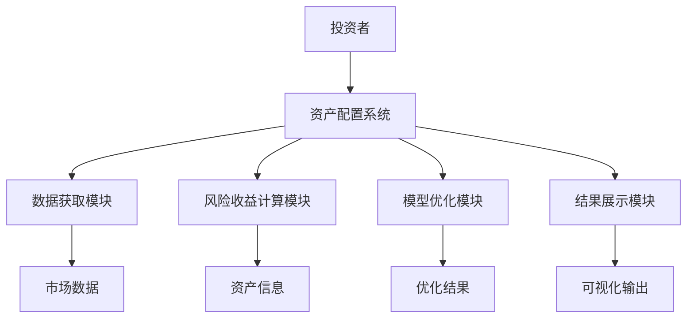
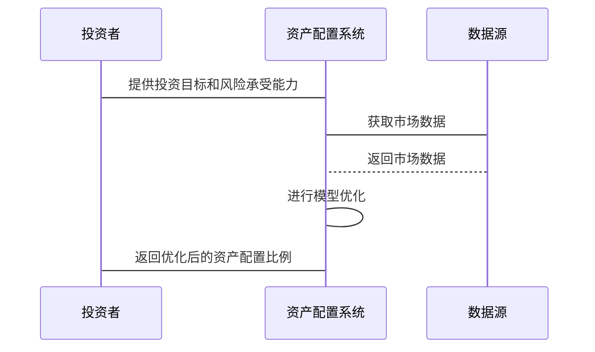

                 


# 资产配置模型：优化风险收益比的科学方法

## 关键词：资产配置模型，风险收益比，投资组合优化，现代投资组合理论，系统架构设计

## 摘要：
资产配置模型是金融投资领域中的核心工具，旨在通过科学的方法优化投资组合的风险与收益比。本文将从资产配置的基本概念出发，深入探讨其数学模型、系统架构设计以及实际应用中的最佳实践。通过详细分析现代投资组合理论（MPT）的原理、资产配置的实体关系图、系统架构设计、数学模型的实现以及项目实战，本文为读者提供一个全面的视角，帮助其理解如何通过资产配置模型实现最优投资策略。

---

# 第1章: 资产配置模型概述

## 1.1 资产配置的基本概念
### 1.1.1 什么是资产配置
资产配置是指根据投资目标，将资金分配到不同的资产类别（如股票、债券、房地产等）中，以实现风险与收益的最佳平衡。它是一种分散投资的策略，旨在通过优化资产组合来降低风险，同时最大化收益。

### 1.1.2 资产配置的重要性
资产配置的重要性体现在以下几个方面：
1. **风险分散**：通过将资金分配到不同的资产类别，降低单一资产带来的风险。
2. **收益优化**：通过科学的配置比例，最大化投资组合的收益。
3. **适应市场变化**：根据市场环境的变化，动态调整资产配置比例，以应对不同的经济周期。

### 1.1.3 资产配置的目标与意义
资产配置的目标是通过优化资产组合，实现以下几点：
1. 在给定风险下，追求最大收益。
2. 在给定收益下，追求最小风险。
3. 平衡短期与长期投资目标。

---

## 1.2 资产配置的核心问题
### 1.2.1 风险与收益的平衡
资产配置的核心问题是如何在风险与收益之间找到最佳平衡点。这需要考虑资产的波动性、相关性以及它们在组合中的权重。

### 1.2.2 资产配置的边界与外延
资产配置的边界是指在可行的收益-风险组合中，找到最优前沿。外延则包括动态调整资产配置比例以适应市场变化。

### 1.2.3 资产配置的核心要素组成
资产配置的核心要素包括：
1. **资产类别**：股票、债券、现金等。
2. **权重分配**：各类资产在组合中的权重。
3. **时间跨度**：投资的短期或长期目标。

---

## 1.3 资产配置的科学方法
### 1.3.1 现代投资组合理论（MPT）简介
现代投资组合理论（MPT）由哈里·马科维茨提出，是资产配置的理论基础。MPT认为，通过分散投资可以降低组合的整体风险。

### 1.3.2 资产配置的基本原理
资产配置的基本原理包括：
1. **风险分散**：通过投资不同类型的资产，降低组合的整体波动性。
2. **有效前沿**：在给定风险下，找到收益最大的组合；在给定收益下，找到风险最小的组合。

### 1.3.3 资产配置的实践应用
资产配置的实践应用包括：
1. **战略资产配置**：根据长期投资目标确定资产比例。
2. **战术资产配置**：根据市场环境动态调整资产比例。

---

## 1.4 本章小结
本章介绍了资产配置的基本概念、重要性、核心问题以及科学方法。通过理解这些内容，读者可以初步掌握资产配置的基本原理和应用场景。

---

# 第2章: 资产配置的核心概念

## 2.1 资产配置的核心要素
### 2.1.1 风险与收益的关系
风险与收益呈正相关关系，即收益越高，风险越大。资产配置的目标是在两者之间找到最佳平衡点。

### 2.1.2 资产类别与权重分配
不同资产类别的风险收益特征不同，权重分配需要根据投资目标和市场环境进行调整。

### 2.1.3 时间跨度与流动性
投资的长期性要求资产配置具有较高的流动性，以应对短期资金需求。

---

## 2.2 资产配置的属性特征对比
### 2.2.1 不同资产类别的风险收益特征
| 资产类别 | 风险 | 收益 |
|----------|------|------|
| 股票     | 高   | 高   |
| 债券     | 中   | 中   |
| 现金     | 低   | 低   |

### 2.2.2 资产配置的稳定性与灵活性
稳定性：资产配置需要保持长期稳定，以实现投资目标。  
灵活性：根据市场变化，动态调整资产比例。

### 2.2.3 资产配置的可扩展性与可调整性
可扩展性：资产配置可以随着资金规模的增加而扩展。  
可调整性：根据市场变化，及时调整资产比例。

---

## 2.3 资产配置的ER实体关系图
```mermaid
erDiagram
    actor 投资者 {
        <属性> 投资目标
        <属性> 风险承受能力
    }
    actor 市场环境 {
        <属性> 经济状况
        <属性> 行业趋势
    }
    actor 资产类别 {
        <属性> 风险
        <属性> 收益
    }
    investor --> 资产配置模型 : 提供投资目标和风险承受能力
    市场环境 --> 资产配置模型 : 提供市场数据
    资产配置模型 --> 资产类别 : 分配权重
```

---

## 2.4 本章小结
本章通过对比不同资产类别的风险收益特征，分析了资产配置的稳定性与灵活性，并通过ER实体关系图展示了资产配置的核心要素及其相互关系。

---

# 第3章: 资产配置的数学模型与算法原理

## 3.1 现代投资组合理论（MPT）模型
### 3.1.1 均值-方差模型的数学表达
$$\text{目标函数：} \quad \min_w \sigma^2 = w^T \Sigma w$$
$$\text{约束条件：} \quad w^T \mu = \text{目标收益}$$

### 3.1.2 马科维茨有效前沿的推导
有效前沿定义：在给定风险下，收益最大化；在给定收益下，风险最小化。

---

## 3.2 资产配置的数学实现
### 3.2.1 均值-方差模型的优化算法
使用二次规划求解器进行优化，目标是最小化方差，约束是收益和权重之和为1。

### 3.2.2 风险平价模型
风险平价模型将风险在不同资产类别之间分配，以实现风险的均衡。

---

## 3.3 资产配置的算法实现
### 3.3.1 Python实现
```python
import numpy as np
from scipy.optimize import minimize

# 示例数据：资产的预期收益和协方差矩阵
mu = np.array([0.1, 0.05, 0.02])
Sigma = np.array([[0.2, 0.1, 0], [0.1, 0.3, 0.05], [0, 0.05, 0.1]])

# 定义优化函数
def portfoliooptimize(w, mu, Sigma):
    return (w.T @ Sigma @ w).item()

# 约束条件：权重之和为1
def constraint(w):
    return np.sum(w) - 1

# 初始权重
w0 = np.array([1/3, 1/3, 1/3])

# 使用 scipy.optimize.minimize 进行优化
result = minimize(portfoliooptimize, w0, args=(mu, Sigma), method='SLSQP', constraints={'type': 'eq', 'fun': constraint})

# 输出最优权重和最小方差
print("最优权重：", result.x)
print("最小方差：", result.fun)
```

---

## 3.4 本章小结
本章通过数学模型和算法原理，详细讲解了资产配置的核心方法，包括均值-方差模型和风险平价模型，并通过Python代码展示了如何实现这些模型。

---

# 第4章: 资产配置的系统架构设计

## 4.1 系统功能设计
### 4.1.1 系统功能模块
1. 数据获取模块：获取市场数据和资产信息。
2. 风险收益计算模块：计算资产的风险和收益。
3. 模型优化模块：实现资产配置的数学模型。
4. 结果展示模块：输出优化后的资产配置比例。

---

## 4.2 系统架构设计


---

## 4.3 系统接口设计
1. 数据接口：提供市场数据和资产信息的接口。
2. 优化接口：接收投资目标和风险承受能力，返回优化后的资产配置比例。

---

## 4.4 系统交互流程


---

## 4.5 本章小结
本章通过系统架构设计，展示了资产配置系统的功能模块、数据流和交互流程，为实际应用提供了参考。

---

# 第5章: 资产配置的项目实战

## 5.1 环境安装
### 5.1.1 安装Python环境
```bash
pip install numpy pandas scipy matplotlib
```

### 5.1.2 安装优化库
```bash
pip install scikit-learn
```

---

## 5.2 核心代码实现
### 5.2.1 数据获取
```python
import pandas as pd
import numpy as np

# 获取市场数据
data = pd.read_csv('market_data.csv')
returns = data.pct_change().dropna()
```

### 5.2.2 计算协方差矩阵
```python
cov_matrix = returns.cov()
```

### 5.2.3 优化函数
```python
def optimize(w, mu, Sigma):
    return (w.T @ Sigma @ w).item()
```

### 5.2.4 约束条件
```python
def constraint(w):
    return np.sum(w) - 1
```

### 5.2.5 运行优化
```python
from scipy.optimize import minimize

w0 = np.array([1/3, 1/3, 1/3])
result = minimize(optimize, w0, args=(mu, cov_matrix), method='SLSQP', constraints={'type': 'eq', 'fun': constraint})
```

---

## 5.3 案例分析
### 5.3.1 投资目标
假设投资目标是年化收益5%，风险承受能力为中等。

### 5.3.2 优化结果
```python
print("最优权重：", result.x)
print("最小方差：", result.fun)
```

---

## 5.4 本章小结
本章通过项目实战，详细讲解了资产配置的环境安装、核心代码实现和案例分析，帮助读者掌握资产配置的实际操作方法。

---

# 第6章: 资产配置的优化与扩展

## 6.1 模型优化方法
### 6.1.1 引入机器学习
使用机器学习算法（如聚类和分类）对市场数据进行预测，优化资产配置模型。

### 6.1.2 动态调整模型
根据市场变化，实时调整资产配置比例。

---

## 6.2 模型扩展
### 6.2.1 多目标优化
考虑多个优化目标，如收益、风险、流动性等。

### 6.2.2 多阶段优化
根据不同的经济周期，制定不同的资产配置策略。

---

## 6.3 本章小结
本章通过模型优化方法和扩展，展示了如何进一步提升资产配置模型的性能和适应性。

---

# 第7章: 总结与展望

## 7.1 全文总结
资产配置模型是优化风险收益比的重要工具。通过现代投资组合理论、数学模型和系统架构设计，可以实现科学的资产配置。

## 7.2 未来展望
未来，随着人工智能和大数据技术的发展，资产配置模型将更加智能化和个性化。

---

# 作者：AI天才研究院 & 禅与计算机程序设计艺术

---

这篇文章通过系统化的分析和详细的案例讲解，全面介绍了资产配置模型的理论与实践。希望读者通过本文能够掌握资产配置的核心方法，并在实际投资中应用这些知识。

