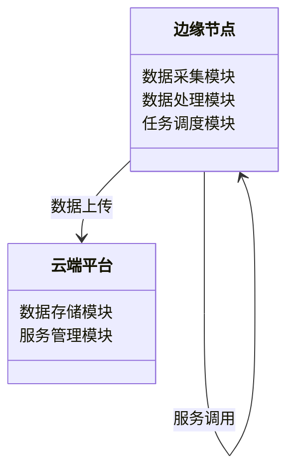
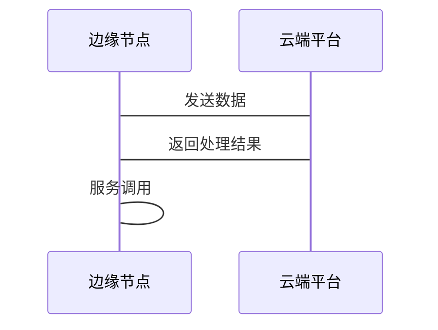

                 

# 边缘计算技术带来的新一轮IT革命与投资机会

> 关键词：边缘计算、IT革命、投资机会、分布式计算、物联网、实时性

> 摘要：边缘计算作为一种新兴的计算范式，正在改变传统的IT架构和商业模式。本文将从边缘计算的起源与发展、技术原理与算法基础、系统架构与设计、项目实战、投资机会与风险分析、未来展望等方面展开详细分析，探讨边缘计算技术如何引发新一轮的IT革命，并为投资者提供潜在的机会。

---

## 第1章: 边缘计算的起源与发展

### 1.1 边缘计算的起源
#### 1.1.1 从传统IT架构到边缘计算的演进
- 传统中心化计算的局限性
- 分布式计算的兴起
- 边缘计算的起源与驱动因素

#### 1.1.2 边缘计算的定义与核心理念
- 边缘计算的定义
- 边缘计算的核心理念：分布式计算、实时性、数据隐私

#### 1.1.3 边缘计算与云计算的对比分析
- 云计算的优缺点
- 边缘计算的独特优势
- 云计算与边缘计算的协同关系

### 1.2 边缘计算的发展与应用
#### 1.2.1 边缘计算的发展历程
- 边缘计算的萌芽阶段
- 边缘计算的快速发展阶段
- 边缘计算的未来趋势

#### 1.2.2 边缘计算的应用场景
- 工业自动化
- 智慧城市
- 智能交通
- 智能医疗

#### 1.2.3 边缘计算的核心概念与技术特征
- 边缘计算的核心概念
- 边缘计算的技术特征对比
- 边缘计算的边界与外延

---

## 第2章: 边缘计算的技术原理与算法基础

### 2.1 边缘计算的架构原理
#### 2.1.1 边缘计算的分层架构
- 边缘设备层
- 边缘计算层
- 云端协调层

#### 2.1.2 边缘计算的节点通信机制
- 边缘节点间的通信协议
- 边缘节点与云端的交互机制

#### 2.1.3 边缘计算的数据处理流程
- 数据采集与预处理
- 数据传输与存储
- 数据分析与计算
- 结果反馈与应用

### 2.2 边缘计算的核心算法
#### 2.2.1 边缘计算中的分布式计算模型
- 分布式计算的定义与特点
- 边缘计算中的分布式算法
- 分布式计算的实现挑战

#### 2.2.2 边缘计算中的数据压缩与编码算法
- 数据压缩的必要性
- 常见数据压缩算法
- 数据编码与序列化技术

#### 2.2.3 边缘计算中的任务调度算法
- 任务调度的定义与目标
- 常见任务调度算法
- 边缘计算中的动态任务调度

---

## 第3章: 边缘计算的系统架构与设计

### 3.1 边缘计算系统的功能模块
#### 3.1.1 数据采集与处理模块
- 数据采集的实现方式
- 数据预处理与清洗
- 数据存储与管理

#### 3.1.2 任务调度与分配模块
- 任务调度算法的选择与实现
- 资源分配策略
- 负载均衡技术

#### 3.1.3 数据存储与管理模块
- 边缘侧数据存储方案
- 数据同步与一致性维护
- 数据安全与隐私保护

### 3.2 边缘计算系统的架构设计
#### 3.2.1 分层架构设计
- 分层架构的优势
- 各层功能与交互设计

#### 3.2.2 微服务架构设计
- 微服务架构的定义与特点
- 边缘计算中的微服务实现
- 服务发现与通信机制

#### 3.2.3 边缘计算系统的容错与容灾设计
- 系统容错机制
- 灾备与恢复策略
- 故障自愈技术

### 3.3 边缘计算系统的接口设计
#### 3.3.1 边缘节点与云端接口
- RESTful API设计
- 消息队列与事件驱动
- gRPC通信协议

#### 3.3.2 边缘节点间接口
- 边缘节点间通信协议
- 数据共享与交换机制
- 服务调用与协作

---

## 第4章: 边缘计算的项目实战与案例分析

### 4.1 智能工厂边缘计算项目实战
#### 4.1.1 项目背景与目标
- 智能工厂的定义与需求
- 边缘计算在智能工厂中的应用

#### 4.1.2 环境安装与配置
- 边缘计算平台的选择与安装
- 边缘设备的配置与部署
- 云端平台的对接

#### 4.1.3 核心代码实现
- 边缘节点数据采集代码
- 任务调度算法实现
- 数据分析与可视化代码

#### 4.1.4 实验结果与分析
- 系统性能测试
- 数据处理效率分析
- 系统稳定性与可扩展性评估

### 4.2 边缘计算系统架构的详细分析
#### 4.2.1 系统功能模块的类图设计

#### 4.2.2 系统交互的序列图设计

---

## 第5章: 边缘计算的投资机会与风险分析

### 5.1 边缘计算的市场潜力与投资机会
#### 5.1.1 边缘计算的市场现状
- 全球边缘计算市场分析
- 中国边缘计算市场分析

#### 5.1.2 边缘计算的主要应用场景
- 智能制造
- 智慧城市
- 智能交通
- 智能医疗

#### 5.1.3 边缘计算的投资策略
- 技术驱动型投资
- 市场需求驱动型投资
- 生态合作型投资

### 5.2 边缘计算的投资风险与应对策略
#### 5.2.1 技术风险
- 技术成熟度
- 技术更新换代快

#### 5.2.2 市场风险
- 市场接受度
- 行业标准的不确定性

#### 5.2.3 运营风险
- 系统维护成本
- 安全风险

---

## 第6章: 边缘计算的未来展望与总结

### 6.1 边缘计算的未来发展趋势
#### 6.1.1 技术融合趋势
- 与人工智能的深度融合
- 与5G通信的协同发展

#### 6.1.2 应用场景的扩展
- 更多行业的应用探索
- 新兴领域的创新应用

#### 6.1.3 标准化与生态建设
- 行业标准的制定
- 开源社区的建设

### 6.2 边缘计算的总结与启示
- 边缘计算的技术价值
- 边缘计算的商业价值
- 边缘计算对IT产业的深远影响

---

## 作者信息

作者：AI天才研究院/AI Genius Institute & 禅与计算机程序设计艺术 /Zen And The Art of Computer Programming

---

**本文为AI天才研究院原创文章，转载请注明出处。**

