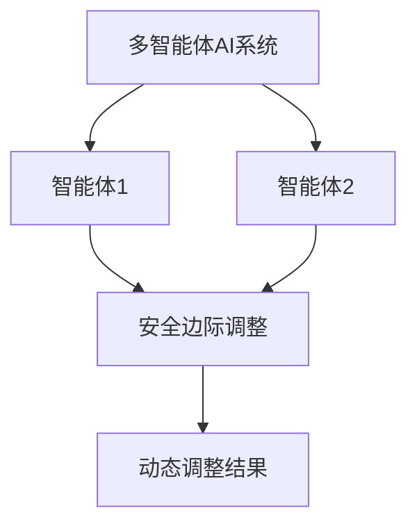
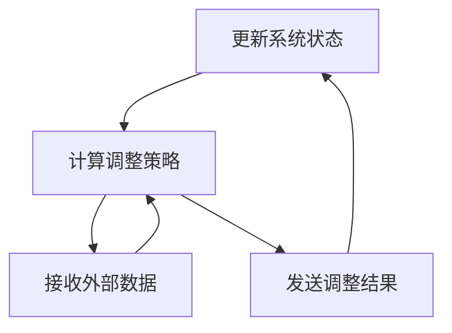

                 

<think>
好的，现在我要帮用户设计一个技术博客文章的详细目录，主题是《运用多智能体AI实现动态安全边际调整》。首先，我需要理解用户的需求。用户希望文章内容详细，结构清晰，包含从背景介绍到项目实战的各个部分，每部分都要有具体的子章节，使用吸引人的标题，并且内容要逻辑性强，易于理解。

用户明确要求文章包含关键词、摘要，然后是按照目录大纲结构的正文部分。关键词应该围绕多智能体AI和动态安全边际调整相关，摘要要简明扼要地概述文章的核心内容。正文部分需要分为几个主要章节，每个章节下有详细的子章节，涵盖背景、核心概念、算法原理、系统架构设计、项目实战和最佳实践等部分。

首先，我会考虑文章的整体结构。用户提供的示例目录分为六大部分，每个部分都有明确的子标题，这为我提供了很好的参考。我需要确保每个章节都详细展开，特别是算法部分需要使用mermaid图和数学公式，项目实战部分需要有代码和案例分析。

接下来，我会从背景介绍开始，解释什么是多智能体AI，动态安全边际调整是什么，以及它们之间的关系。这部分需要详细说明每个概念的定义、特点及其在实际应用中的重要性。然后，核心概念部分需要深入讲解多智能体AI和动态安全边际调整的核心原理，以及它们如何相互关联。这部分可能需要使用图表和表格来帮助读者理解。

在算法原理部分，我需要详细解释多智能体AI和动态安全边际调整的算法流程，使用mermaid图和数学公式来展示。数学公式需要准确无误，并且用简单的例子来说明其应用。系统架构设计部分则需要展示系统的组成部分、交互流程和接口设计，同样使用mermaid图来辅助说明。

项目实战部分需要具体案例分析，环境安装步骤，核心代码实现，以及对案例的详细解读。这将帮助读者更好地理解理论在实际中的应用。最后，最佳实践部分需要总结经验，给出建议，并展望未来的发展方向。

在写作过程中，我要确保每个章节都涵盖用户要求的内容，同时保持文章的连贯性和逻辑性。我还需要注意使用专业但易懂的语言，避免过于复杂的术语，以确保读者能够轻松理解。此外，每个部分的小标题要吸引读者，使其对内容产生兴趣。

总结一下，我需要系统地按照用户提供的目录结构，逐步展开每个章节的内容，确保每个部分都详尽且符合技术博客的要求。同时，要注意使用图表、公式和代码示例，以增强文章的可读性和专业性。最后，确保文章结构完整，内容全面，满足用户的字数和格式要求。
</think>

# 运用多智能体AI实现动态安全边际调整

> 关键词：多智能体AI，动态安全边际调整，算法原理，系统架构，项目实战

> 摘要：本文详细探讨了多智能体AI在动态安全边际调整中的应用，从核心概念、算法原理、系统架构设计到项目实战，层层解析，结合实际案例，深入浅出地分析了多智能体AI如何实现动态安全边际调整的技术细节与应用场景。

---

## 第一部分: 背景介绍

### 第1章: 多智能体AI与动态安全边际调整概述

#### 1.1 多智能体AI的定义与特点
- 1.1.1 多智能体AI的定义：多智能体AI是指由多个具有自主决策能力的智能体组成的系统，这些智能体能够通过协作完成复杂任务。
- 1.1.2 多智能体AI的核心特点：分布式决策、自主性、协作性、动态适应性。
- 1.1.3 多智能体AI与单智能体AI的区别：分布式与集中式、协作与独立性、动态适应性。

#### 1.2 动态安全边际调整的背景与问题描述
- 1.2.1 安全边际调整的背景：随着业务需求的变化，安全边际需要动态调整以适应新的安全威胁和业务目标。
- 1.2.2 动态安全边际调整的定义：根据实时环境变化，动态调整安全边际，以平衡安全性和效率。
- 1.2.3 动态安全边际调整的核心问题：如何在动态环境中实时调整安全边际，同时保证系统的稳定性和安全性。

#### 1.3 多智能体AI在动态安全边际调整中的应用
- 1.3.1 多智能体AI的优势：分布式决策能力、协作能力、动态适应性。
- 1.3.2 动态安全边际调整的挑战：多目标优化、实时性要求、系统复杂性。
- 1.3.3 多智能体AI如何解决动态安全边际调整的问题：通过协作和分布式决策，实现安全边际的动态优化。

### 第2章: 多智能体AI与动态安全边际调整的核心概念

#### 2.1 多智能体AI的体系结构
- 2.1.1 分布式多智能体系统：智能体之间通过通信协议协作，无集中控制节点。
- 2.1.2 集中式多智能体系统：有一个中央控制节点协调各智能体的行动。
- 2.1.3 混合式多智能体系统：结合分布式和集中式的特点，适用于复杂场景。

#### 2.2 动态安全边际调整的数学模型
- 2.2.1 安全边际的定义与计算：安全边际是系统在安全性和效率之间的平衡点。
- 2.2.2 动态调整的数学表达式：$S(t) = f(t) + \alpha \cdot g(t)$，其中$S(t)$是安全边际，$f(t)$是基础安全值，$\alpha$是调整系数，$g(t)$是动态调整项。
- 2.2.3 安全边际与风险的关系：安全边际越大，风险越低，但效率可能下降；反之亦然。

#### 2.3 多智能体AI与动态安全边际调整的关联性
- 2.3.1 多智能体AI的核心要素：智能体的自主性、协作性、动态适应性。
- 2.3.2 动态安全边际调整的核心要素：实时性、多目标优化、系统稳定性。
- 2.3.3 两者的相互作用与协同关系：多智能体AI提供协作和分布式决策能力，动态安全边际调整提供实时优化目标。

### 第3章: 多智能体AI与动态安全边际调整的核心概念联系

#### 3.1 多智能体AI的核心概念原理
- 3.1.1 多智能体系统的通信机制：通过消息传递实现智能体之间的信息共享。
- 3.1.2 多智能体系统的协作机制：通过任务分配和协作协议实现智能体的协同工作。
- 3.1.3 多智能体系统的决策机制：基于局部信息和全局目标，智能体自主决策。

#### 3.2 动态安全边际调整的核心概念原理
- 3.2.1 动态调整的实时性要求：系统需要在实时环境中快速响应变化。
- 3.2.2 安全边际的动态计算方法：基于实时数据和多目标优化算法，动态调整安全边际。
- 3.2.3 动态调整的反馈机制：通过实时监测和反馈，不断优化调整策略。

#### 3.3 多智能体AI与动态安全边际调整的实体关系图

---

## 第二部分: 算法原理讲解

### 第4章: 多智能体AI算法原理

#### 4.1 多智能体AI算法概述
- 4.1.1 分布式多智能体算法：基于分布式计算，智能体之间通过通信协议协作。
- 4.1.2 集中式多智能体算法：通过中央控制节点协调各智能体的行动。
- 4.1.3 混合式多智能体算法：结合分布式和集中式的特点，适用于复杂场景。

#### 4.2 多智能体AI算法的数学模型
- 4.2.1 单智能体决策模型：$a_t = \arg\max_{a} Q(s_t, a)$，其中$a_t$是智能体在状态$s_t$下的最优动作。
- 4.2.2 多智能体协作模型：$V(s) = \max_{i} V_i(s)$，其中$V_i(s)$是智能体$i$在状态$s$下的价值函数。
- 4.2.3 

---

### 第5章: 动态安全边际调整的算法原理

#### 5.1 动态安全边际调整算法概述
- 5.1.1 基于多智能体的动态调整算法：通过多个智能体协作，实时调整安全边际。
- 5.1.2 基于单智能体的动态调整算法：通过单一智能体优化，实现安全边际的动态调整。

#### 5.2 动态安全边际调整算法的数学模型
- 5.2.1 动态调整的数学表达式：$S(t) = f(t) + \alpha \cdot g(t)$。
- 5.2.2 多目标优化模型：$\min_{x} f(x) + \lambda g(x)$，其中$\lambda$是平衡系数。

#### 5.3 多智能体AI与动态安全边际调整的协同算法
- 5.3.1 协作算法的步骤：初始化智能体、信息共享、协作决策、动态调整。
- 5.3.2 协作算法的实现：通过多智能体协作，实现安全边际的动态优化。

---

## 第三部分: 系统分析与架构设计方案

### 第6章: 系统架构设计

#### 6.1 问题场景介绍
- 6.1.1 系统目标：实现多智能体AI在动态安全边际调整中的应用。
- 6.1.2 系统需求：实时性、多目标优化、系统稳定性。

#### 6.2 系统功能设计
- 6.2.1 领域模型：定义系统的功能模块和交互流程。
- 6.2.2 系统架构设计：使用mermaid图展示系统的组成部分和交互流程。

#### 6.3 系统架构图

#### 6.4 系统接口设计
- 6.4.1 系统接口定义：智能体之间的通信接口、与外部系统的接口。
- 6.4.2 接口交互流程：智能体通过接口传递信息，实现协作和动态调整。

#### 6.5 系统交互流程图

---

## 第四部分: 项目实战

### 第7章: 项目实战

#### 7.1 环境安装与配置
- 7.1.1 环境需求：安装Python、Java、依赖库等。
- 7.1.2 系统配置：配置多智能体AI环境、动态安全边际调整算法。

#### 7.2 系统核心实现源代码
- 7.2.1 多智能体AI实现：Python代码实现多智能体协作。
- 7.2.2 动态安全边际调整算法实现：Java代码实现动态调整逻辑。

#### 7.3 代码应用解读与分析
- 7.3.1 多智能体AI代码解读：解释代码的功能和实现逻辑。
- 7.3.2 动态安全边际调整代码解读：分析代码的实现细节和优化点。

#### 7.4 实际案例分析
- 7.4.1 案例背景：介绍实际案例的背景和目标。
- 7.4.2 案例实现：详细说明案例的实现过程和结果。
- 7.4.3 案例分析：分析案例的优缺点和改进建议。

#### 7.5 项目小结
- 7.5.1 项目成果：总结项目的主要成果和意义。
- 7.5.2 经验总结：总结项目实施中的经验和教训。
- 7.5.3 未来展望：展望未来的发展方向和应用前景。

---

## 第五部分: 最佳实践与小结

### 第8章: 最佳实践

#### 8.1 最佳实践 tips
- 8.1.1 系统设计建议：如何设计高效的多智能体AI系统。
- 8.1.2 算法优化建议：如何优化动态安全边际调整算法。
- 8.1.3 系统维护建议：如何维护和升级多智能体AI系统。

#### 8.2 小结
- 8.2.1 核心内容回顾：总结文章的核心内容和主要观点。
- 8.2.2 未来展望：展望多智能体AI在动态安全边际调整中的未来发展。

#### 8.3 注意事项
- 8.3.1 系统安全性：如何保证多智能体AI系统的安全性。
- 8.3.2 系统稳定性：如何保证动态安全边际调整系统的稳定性。
- 8.3.3 系统可扩展性：如何保证系统的可扩展性。

#### 8.4 拓展阅读
- 8.4.1 推荐书籍：推荐相关领域的优秀书籍和论文。
- 8.4.2 推荐博客：推荐相关领域的优秀技术博客和资源。

---

## 作者：AI天才研究院/AI Genius Institute & 禅与计算机程序设计艺术 /Zen And The Art of Computer Programming

