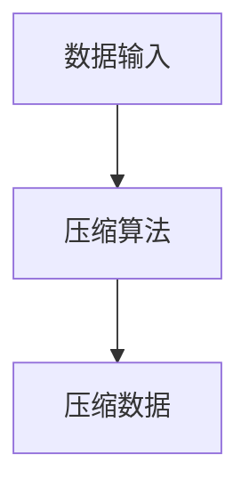
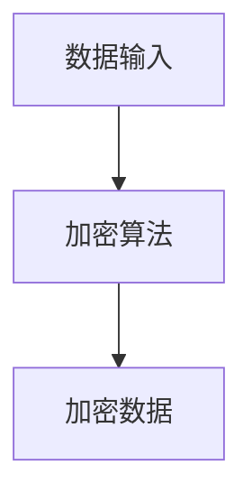
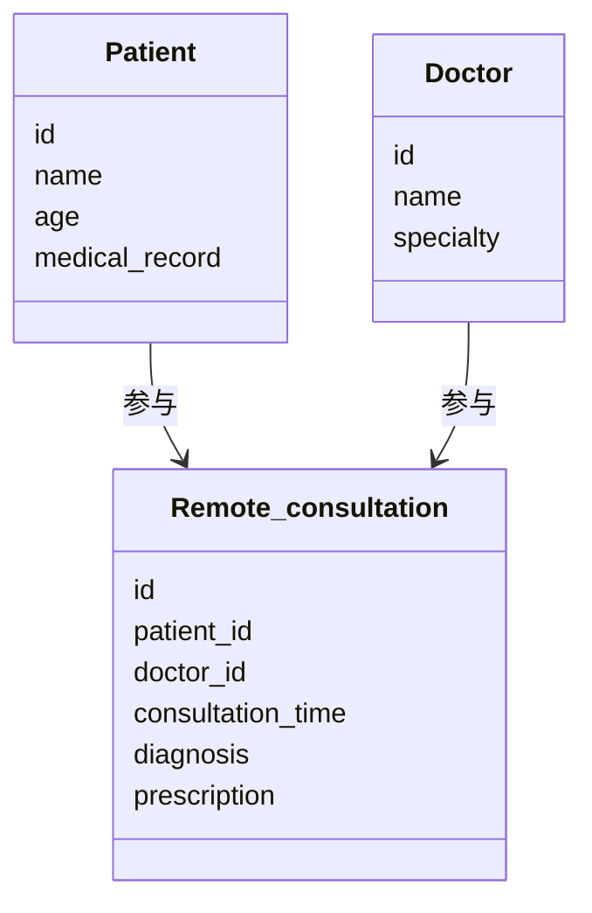
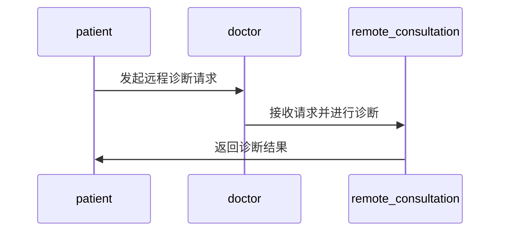

                 


# 远程医疗技术的普及对医疗行业的影响

> 关键词：远程医疗技术、医疗行业、影响、远程诊断、算法原理

> 摘要：远程医疗技术的普及正在深刻改变医疗行业的运作方式。本文将探讨远程医疗技术的核心概念、算法原理、系统架构，以及其在医疗行业中的实际应用。通过分析远程医疗技术对医疗资源分配、患者体验和医疗效率的影响，本文旨在揭示远程医疗技术如何推动医疗行业的未来发展。

---

## 第一部分: 远程医疗技术的背景与核心概念

### 第1章: 远程医疗技术的背景介绍

#### 1.1 远程医疗技术的定义与核心概念

##### 1.1.1 远程医疗技术的定义

远程医疗技术是一种通过通信技术和医疗设备，将患者与医生之间的医疗活动延伸到远程环境的技术。它利用互联网、物联网和通信技术，实现医疗资源的远程共享和医疗过程的远程监控。

##### 1.1.2 远程医疗的核心概念

远程医疗的核心概念包括：

1. **远程诊断**：通过远程设备采集患者的生理数据（如心率、血压、体温等），医生在远程进行诊断。
2. **远程治疗**：医生通过远程设备对患者进行治疗方案的制定和指导。
3. **远程监护**：通过可穿戴设备实时监控患者的健康状况，及时发现异常并采取措施。

##### 1.1.3 远程医疗技术的背景与问题背景

远程医疗技术的发展背景包括医疗资源分布不均、患者就医难、医疗成本高等问题。通过远程医疗技术，可以实现医疗资源的优化配置，提高医疗服务的效率和可及性。

---

#### 1.2 远程医疗技术的现状与发展趋势

##### 1.2.1 远程医疗技术的发展历程

远程医疗技术的发展经历了多个阶段，从早期的电话问诊到现在的智能化远程诊断系统，每一次技术的进步都推动了远程医疗的普及。

##### 1.2.2 当前远程医疗技术的应用现状

当前，远程医疗技术已广泛应用于慢性病管理、远程会诊、远程监护等领域。特别是在新冠疫情中，远程医疗技术得到了快速发展，成为医疗行业的重要组成部分。

##### 1.2.3 远程医疗技术的未来发展趋势

未来，远程医疗技术将更加智能化、个性化和普及化。随着人工智能和5G技术的快速发展，远程医疗的诊断准确性和效率将进一步提升。

---

### 第2章: 远程医疗技术的核心概念与联系

#### 2.1 远程医疗技术的核心原理

##### 2.1.1 远程医疗技术的通信技术基础

远程医疗技术依赖于高速、稳定的通信技术，包括5G、光纤通信等。这些技术确保了患者数据的实时传输和高质量的音视频通信。

##### 2.1.2 远程医疗数据的采集与传输

远程医疗数据的采集通过可穿戴设备（如智能手环、心率监测仪）完成，数据通过通信网络传输到医生端。

##### 2.1.3 远程医疗技术的数据处理与分析

数据处理与分析是远程医疗的核心，包括对患者数据的存储、处理和分析，生成诊断建议。

#### 2.2 远程医疗技术的关键技术对比

##### 2.2.1 不同远程医疗技术的对比分析

| 技术 | 特点 | 优缺点 |
|------|------|--------|
| 传统医疗 | 现场诊疗 | 资源消耗大，患者不便 |
| 远程医疗 | 远程诊疗 | 节省资源，提高效率 |

##### 2.2.2 远程医疗技术与传统医疗技术的对比

远程医疗技术的优势在于其便捷性和高效性，而传统医疗技术则更注重面对面的诊疗体验。

##### 2.2.3 远程医疗技术的核心技术特征

远程医疗技术的核心特征包括实时性、准确性、高效性和可扩展性。

#### 2.3 远程医疗技术的ER实体关系图

```mermaid
erDiagram
    patient {
        id
        name
        age
        gender
        medical_record
    }
    doctor {
        id
        name
        specialty
        hospital
    }
    remote_consultation {
        id
        patient_id
        doctor_id
        consultation_time
        diagnosis
        prescription
    }
    patient --> remote_consultation : 参与
    doctor --> remote_consultation : 参与
```

---

### 第3章: 远程医疗技术的算法原理

#### 3.1 远程医疗数据传输的算法原理

##### 3.1.1 数据压缩算法



数据压缩算法如哈夫曼编码，通过减少数据的冗余性来降低传输数据量。

##### 3.1.2 加密算法



加密算法如RSA，用于保障数据传输的安全性。

#### 3.2 远程医疗数据处理的数学模型

##### 3.2.1 数据压缩的数学模型

数据压缩的数学模型可以用信息论中的熵公式表示：

$$ H = -\sum p_i \log p_i $$

其中，\( H \) 是熵，\( p_i \) 是数据的概率。

##### 3.2.2 加密算法的数学模型

RSA算法的数学模型基于大整数分解的困难性，其核心公式为：

$$ C = M^e \mod N $$

其中，\( C \) 是密文，\( M \) 是明文，\( e \) 是公钥指数，\( N \) 是模数。

---

## 第4章: 远程医疗技术的系统分析与架构设计

### 4.1 问题场景介绍

远程医疗系统的应用场景包括远程诊断、远程监护和远程会诊等。

### 4.2 系统功能设计

#### 4.2.1 领域模型



#### 4.2.2 系统架构设计


#### 4.2.3 系统接口设计

系统接口包括患者数据接口、医生诊断接口和远程会诊接口。

#### 4.2.4 系统交互流程



---

## 第5章: 远程医疗技术的项目实战

### 5.1 环境安装

远程医疗系统的环境配置包括安装服务器、数据库和前端框架。

### 5.2 核心代码实现

#### 5.2.1 数据压缩与加密

```python
import zlib

def compress(data):
    return zlib.compress(data)

def decompress(compressed_data):
    return zlib.decompress(compressed_data)
```

#### 5.2.2 系统交互流程


#### 5.2.3 项目小结

远程医疗项目的成功实施需要各模块的协同合作和高效的系统设计。

---

## 第6章: 总结与未来展望

### 6.1 总结

远程医疗技术的普及对医疗行业的影响是深远的，它提高了医疗服务的效率和可及性。

### 6.2 注意事项

在实际应用中，需注意数据安全和患者隐私保护。

### 6.3 未来展望

未来，远程医疗技术将更加智能化和个性化，与人工智能和5G技术深度融合。

### 6.4 拓展阅读

推荐阅读《远程医疗技术与医疗信息化》和《人工智能在医疗领域的应用》。

---

## 作者：AI天才研究院/AI Genius Institute & 禅与计算机程序设计艺术 /Zen And The Art of Computer Programming

