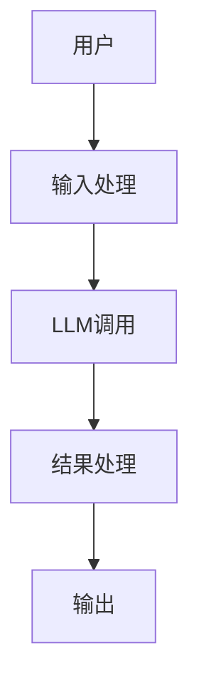
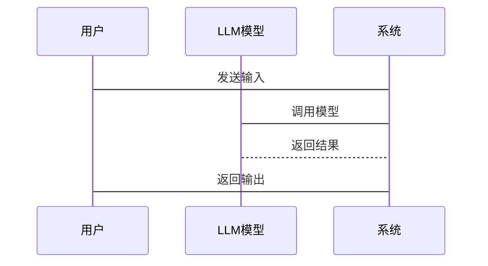

                 


# 选择合适的LLM模型：AI Agent开发的第一步

> 关键词：LLM模型、AI Agent、选择模型、大型语言模型、AI开发

> 摘要：本文将详细探讨如何为AI Agent开发选择合适的LLM模型。从背景介绍到核心原理，从选择方法到系统架构设计，再到项目实战和优化调优，我们将逐步分析，帮助读者掌握选择合适的LLM模型的技巧和方法。

---

## 第1章: LLM模型与AI Agent概述

### 1.1 LLM模型的基本概念

#### 1.1.1 大型语言模型（LLM）的定义
大型语言模型（Large Language Model, LLM）是指经过大量文本数据训练的深度学习模型，能够理解和生成人类语言。LLM的核心在于其庞大的参数量和复杂的架构，使其具备强大的上下文理解和生成能力。

#### 1.1.2 AI Agent的定义与特点
AI Agent（智能体）是指在计算机系统中能够感知环境并采取行动以实现目标的实体。AI Agent可以是软件程序，也可以是机器人，其特点包括自主性、反应性、目标导向性和社交能力。

#### 1.1.3 LLM在AI Agent中的作用
LLM作为AI Agent的核心模块，负责处理自然语言输入、生成自然语言输出，并辅助决策。LLM的引入使AI Agent具备更强的理解和表达能力，能够更好地与人类用户交互。

---

### 1.2 LLM模型的发展背景

#### 1.2.1 AI技术的演进历程
从早期的规则-based系统到基于机器学习的模型，AI技术不断进步。LLM的出现标志着自然语言处理（NLP）技术的重大突破。

#### 1.2.2 LLM模型的崛起
随着计算能力的提升和大数据的普及，LLM模型逐渐成为NLP领域的主流。模型规模的扩大和训练技术的改进使得LLM在各种任务中表现出色。

#### 1.2.3 AI Agent的兴起与应用
AI Agent的应用场景日益广泛，从客服机器人到智能助手，再到自动驾驶系统，AI Agent在多个领域展现出巨大潜力。

---

### 1.3 LLM模型与AI Agent的关系

#### 1.3.1 LLM作为AI Agent的核心模块
LLM为AI Agent提供自然语言处理能力，使其能够理解用户输入并生成自然语言输出。

#### 1.3.2 LLM与AI Agent的协同工作原理
AI Agent通过LLM模块处理用户输入，结合其他模块（如知识库、推理引擎）生成响应。

#### 1.3.3 LLM在AI Agent中的应用场景
- 智能客服
- 智能助手
- 自动化决策系统

---

## 第2章: LLM模型的核心原理

### 2.1 LLM模型的训练机制

#### 2.1.1 基于Transformer的架构
Transformer是一种基于注意力机制的深度学习模型，由编码器和解码器组成。编码器负责将输入序列编码为固定长度的向量，解码器负责根据编码结果生成输出序列。

#### 2.1.2 自注意力机制（Self-Attention）
自注意力机制允许模型在处理每个词时考虑整个序列的信息，从而捕捉长距离依赖关系。

#### 2.1.3 梯度下降与优化算法
常用的优化算法包括Adam、SGD等。优化算法通过调整模型参数，使损失函数最小化。

---

### 2.2 LLM模型的生成机制

#### 2.2.1 解码器（Decoder）的工作原理
解码器负责根据编码器输出的向量生成序列。生成过程通常采用贪心搜索或Beam Search策略。

#### 2.2.2 生成式模型的数学公式
生成式模型的概率生成公式为：
$$ P(y|x) = \prod_{i=1}^{n} P(y_i|y_{<i},x) $$

#### 2.2.3 模型的可解释性与不确定性
模型的可解释性可以通过可视化注意力权重来实现。不确定性可以通过概率生成模型来评估。

---

### 2.3 LLM模型的主要参数与性能指标

#### 2.3.1 参数量与模型复杂度
模型参数量越大，计算复杂度越高。通常，参数量在百万到万亿级别。

#### 2.3.2 模型的准确率与鲁棒性
准确率是模型在测试数据上的正确分类比例。鲁棒性指模型在面对噪声输入时的性能表现。

#### 2.3.3 计算效率与资源消耗
计算效率取决于模型架构和优化算法。资源消耗主要体现在内存和计算时间上。

---

## 第3章: 选择LLM模型的方法论

### 3.1 明确需求与目标

#### 3.1.1 AI Agent的功能需求分析
明确AI Agent需要完成的任务，如信息检索、对话生成、决策支持等。

#### 3.1.2 业务场景的复杂度评估
评估业务场景的复杂性，确定需要模型支持的复杂任务。

#### 3.1.3 用户期望与实际能力的匹配
根据用户需求和模型能力，选择合适的模型。

---

### 3.2 模型对比与评估

#### 3.2.1 常见LLM模型的对比分析
对比分析模型的参数量、训练数据、生成效果等。

#### 3.2.2 模型性能的量化评估
通过准确率、生成速度、资源消耗等指标量化评估模型性能。

#### 3.2.3 模型适用场景的匹配度
根据具体场景选择最匹配的模型。

---

### 3.3 选择模型的步骤与策略

#### 3.3.1 需求分析阶段
明确需求，确定模型需要支持的任务类型。

#### 3.3.2 模型筛选与评估
根据需求筛选候选模型，评估其性能和资源消耗。

#### 3.3.3 最终选择与优化
选择最优模型，并进行参数调优和优化。

---

## 第4章: 系统分析与架构设计

### 4.1 系统功能设计

#### 4.1.1 AI Agent的功能模块划分
- 用户输入处理模块
- LLM模型调用模块
- 输出结果处理模块

#### 4.1.2 LLM模型的集成方式
通过API或SDK将LLM模型集成到AI Agent中。

#### 4.1.3 系统的可扩展性与灵活性
设计模块化架构，便于后续功能扩展和模型替换。

---

### 4.2 系统架构设计

#### 4.2.1 分层架构设计
- 用户界面层
- 业务逻辑层
- 数据访问层

#### 4.2.2 模块间的交互关系
- 用户输入 -> 解析模块 -> LLM调用 -> 结果处理 -> 用户输出

#### 4.2.3 系统架构的Mermaid图


---

### 4.3 系统接口设计

#### 4.3.1 API接口设计
- 输入接口：接收自然语言输入
- 输出接口：返回自然语言输出

#### 4.3.2 接口的交互流程
- 用户输入 -> 接收 -> 模型处理 -> 返回结果

---

### 4.4 系统交互设计

#### 4.4.1 交互流程的Mermaid序列图


---

## 第5章: 项目实战

### 5.1 环境配置

#### 5.1.1 安装必要的库
- Python 3.8+
- transformers库
- torch库

代码示例：
```python
pip install transformers torch
```

---

### 5.2 系统核心实现

#### 5.2.1 LLM模型的调用
使用Hugging Face的transformers库调用LLM模型。

代码示例：
```python
from transformers import AutoTokenizer, AutoModelForCausalLM

tokenizer = AutoTokenizer.from_pretrained('gpt2')
model = AutoModelForCausalLM.from_pretrained('gpt2')

inputs = tokenizer("Hello, how are you?", return_tensors="pt")
outputs = model.generate(inputs.input_ids, max_length=50)
print(tokenizer.decode(outputs[0], skip_special_tokens=True))
```

---

### 5.3 代码应用解读与分析

#### 5.3.1 代码的功能模块划分
- 模型加载
- 输入处理
- 模型调用
- 输出处理

#### 5.3.2 代码的优化建议
- 使用更高效的模型
- 优化参数设置
- 增加错误处理

---

### 5.4 实际案例分析

#### 5.4.1 案例背景
假设我们开发一个智能客服AI Agent，需要处理用户的咨询请求。

#### 5.4.2 案例分析
通过LLM模型生成回复，提高客服效率和用户体验。

---

## 第6章: 优化与调优

### 6.1 模型微调

#### 6.1.1 微调的概念
微调是指在预训练模型的基础上，使用特定任务数据进行微调。

#### 6.1.2 微调的步骤
- 数据准备
- 模型加载
- 微调训练
- 模型保存

代码示例：
```python
from transformers import AutoTokenizer, AutoModelForCausalLM, TrainingArguments, Trainer

tokenizer = AutoTokenizer.from_pretrained('gpt2')
model = AutoModelForCausalLM.from_pretrained('gpt2')

training_args = TrainingArguments(...)
trainer = Trainer(model=model, args=training_args, tokenizer=tokenizer)
trainer.train()
```

---

### 6.2 参数调整

#### 6.2.1 学习率调整
调整学习率以优化模型性能。

#### 6.2.2 batch size优化
调整批量大小以平衡训练速度和内存使用。

---

### 6.3 性能监控

#### 6.3.1 训练过程监控
监控训练过程中的损失值和准确率。

#### 6.3.2 模型性能评估
定期评估模型性能，确保其稳定性和高效性。

---

## 第7章: 未来趋势与持续学习

### 7.1 LLM模型的未来趋势

#### 7.1.1 模型规模的扩大
更大规模的模型将具备更强的生成能力和理解能力。

#### 7.1.2 多模态模型的发展
未来的LLM模型将支持多模态输入，如图像、音频等。

#### 7.1.3 模型的实时性与响应速度
优化模型的响应速度，使其更适合实时应用。

---

### 7.2 AI Agent的未来发展

#### 7.2.1 智能化水平的提升
AI Agent将具备更强的自主决策能力和问题解决能力。

#### 7.2.2 多领域应用的拓展
AI Agent将应用于更多领域，如医疗、教育、金融等。

#### 7.2.3 用户体验的优化
通过优化人机交互，提升用户体验。

---

## 作者：AI天才研究院/AI Genius Institute & 禅与计算机程序设计艺术 /Zen And The Art of Computer Programming

---

通过本文的详细分析，读者可以系统地了解如何为AI Agent选择合适的LLM模型，并掌握相关的核心原理和实际应用技巧。希望本文能为AI Agent的开发提供有价值的参考和指导。

