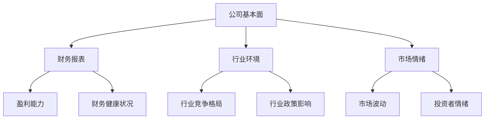
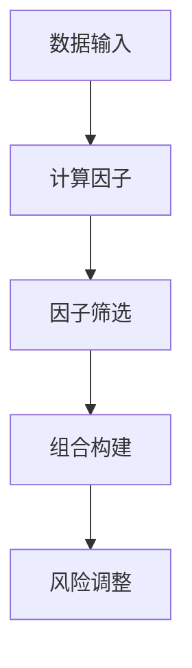
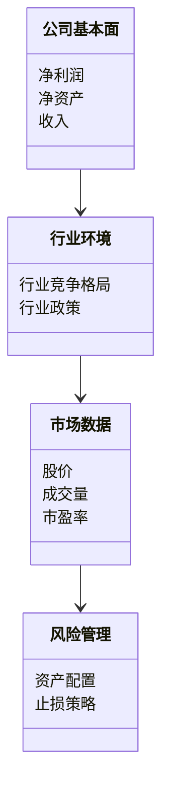
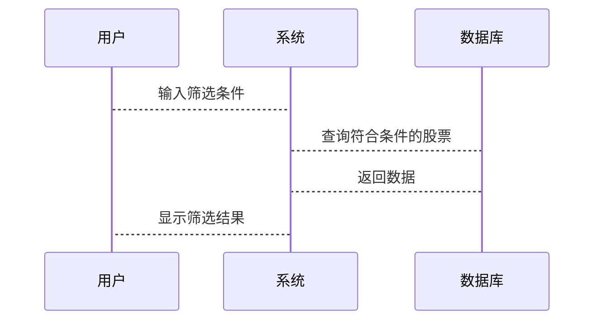

                 


# 选股技巧：如何在市场混乱中识别优质公司

> 关键词：选股技巧，优质公司识别，市场混乱，基本面分析，技术分析，风险管理，投资策略

> 摘要：在股票市场中，识别优质公司是投资者实现长期稳健收益的关键。本文通过系统的分析和方法，帮助投资者在市场混乱中筛选出具备长期竞争优势和良好财务状况的优质公司。文章结合了基本面分析、技术分析、行业分析和风险管理等多维度方法，提供了详细的操作指南和实战案例，帮助投资者提升选股能力，降低投资风险。

---

## 第一部分：背景介绍

### 1.1 核心概念术语说明

- **优质公司**：指在行业中具备竞争优势，财务状况健康，具有持续盈利能力的公司。
- **市场混乱**：指股票市场因经济波动、政策变化或市场情绪等因素导致的股价波动剧烈、走势不稳定的状况。
- **基本面分析**：通过对公司的财务报表、行业地位、盈利能力等进行分析，评估其内在价值的方法。
- **技术分析**：通过分析历史股价和成交量数据，预测未来股价走势的方法。
- **风险管理**：在投资过程中，通过合理的资产配置、止损策略等方法，降低投资风险的过程。

### 1.2 问题背景

股票市场是一个高度波动的市场，受到多种因素的影响，如经济周期、政策变化、行业竞争、公司管理等。在市场混乱的时期，许多投资者往往会被市场的短期波动所迷惑，难以准确识别具备长期投资价值的优质公司。尤其是在市场恐慌或狂热时，投资者容易做出非理性的决策，导致投资损失。

### 1.3 问题描述

如何在市场混乱中识别优质公司，是投资者面临的重要挑战。优质公司的识别需要结合公司基本面、行业地位、财务健康状况等多方面因素进行综合评估。此外，市场混乱时期的选股还需要考虑市场情绪、资金流动、宏观经济环境等外部因素。

### 1.4 问题解决

通过系统的分析和方法，投资者可以在市场混乱中识别优质公司。首先，投资者需要掌握基本面分析的技巧，如分析公司的财务报表、评估公司的盈利能力、成长性和财务健康状况。其次，投资者可以通过技术分析来辅助判断市场的短期走势，避免在市场顶部或底部做出错误的决策。最后，合理的风险管理策略可以帮助投资者在市场混乱中保持稳健的投资。

### 1.5 边界与外延

优质公司的识别需要结合公司内部因素（如财务状况、管理团队）和外部因素（如行业环境、宏观经济）进行综合评估。优质公司的外延包括具备持续竞争优势、良好财务健康状况、稳定的盈利能力的公司。

### 1.6 概念结构与核心要素组成

- **核心要素**：
  - 公司基本面：盈利能力、成长性、财务健康状况。
  - 行业环境：行业竞争格局、行业周期、政策影响。
  - 市场情绪：市场波动、投资者情绪。
  - 风险管理：资产配置、止损策略。

- **概念结构**：
  优质公司识别 = 公司基本面分析 + 行业环境分析 + 市场情绪分析 + 风险管理策略。

---

## 第二部分：核心概念与联系

### 2.1 核心概念原理

优质公司的识别需要结合多个维度的分析，包括：

- **盈利能力**：ROE（净资产收益率）、净利润率等指标。
- **成长性**：收入增长率、净利润增长率等指标。
- **财务健康状况**：资产负债率、流动比率等指标。
- **行业地位**：市场占有率、行业排名。
- **竞争优势**：技术壁垒、品牌优势、成本优势。

### 2.2 概念属性特征对比表格

| 概念       | 特征                                   |
|------------|--------------------------------------|
| 盈利能力   | ROE高，净利润稳定增长                   |
| 成长性     | 收入和利润持续增长                     |
| 财务健康   | 低负债率，良好的现金流                 |
| 行业地位   | 高市场占有率，行业龙头                 |
| 竞争优势   | 技术领先，品牌优势                     |

### 2.3 ER实体关系图架构的Mermaid流程图



---

## 第三部分：算法原理讲解

### 3.1 使用多因子模型进行选股

#### 3.1.1 算法流程图



#### 3.1.2 Python实现代码

```python
import pandas as pd
import numpy as np

# 示例数据：假设我们有多个因子，如ROE、PEG、市值等
def calculate_factor(data):
    # 计算ROE
    data['ROE'] = data['净利润'] / data['净资产']
    # 计算PEG
    data['PEG'] = data['市盈率'] / data['净利润增长率']
    # 计算市值
    data['市值'] = data['股价'] * data['流通股']
    return data

# 示例因子筛选
def factor_screening(data, threshold):
    # 筛选ROE > 均值的公司
    mean_roe = data['ROE'].mean()
    data['ROE筛选'] = data['ROE'] > mean_roe
    # 筛选PEG < 1.5的公司
    data['PEG筛选'] = data['PEG'] < 1.5
    # 综合筛选
    data['综合筛选'] = data['ROE筛选'] & data['PEG筛选']
    return data

# 示例组合构建
def build_portfolio(data):
    selected = data[data['综合筛选']]
    return selected

# 示例风险管理
def risk_management(portfolio, market_return):
    # 计算组合的超额收益
    portfolio['超额收益'] = portfolio['收益率'] - market_return
    return portfolio

# 示例代码运行
data = pd.DataFrame({
    '股价': [10, 20, 15, 25],
    '净利润': [5, 10, 7, 15],
    '净资产': [50, 100, 75, 125],
    '净利润增长率': [0.2, 0.15, 0.25, 0.1],
    '市盈率': [10, 15, 12, 18]
})

data = calculate_factor(data)
data = factor_screening(data, 0.1)
portfolio = build_portfolio(data)
risk_managed_portfolio = risk_management(portfolio, 5%)

print(risk_managed_portfolio)
```

#### 3.1.3 数学模型和公式

- **ROE计算公式**：
  $$ \text{ROE} = \frac{\text{净利润}}{\text{净资产}} $$
  
- **PEG计算公式**：
  $$ \text{PEG} = \frac{\text{市盈率}}{\text{净利润增长率}} $$
  
- **市值计算公式**：
  $$ \text{市值} = \text{股价} \times \text{流通股} $$

---

## 第四部分：系统分析与架构设计方案

### 4.1 问题场景介绍

在股票市场中，投资者需要一个系统化的工具来辅助选股。该系统需要整合多方面的信息，包括财务数据、行业数据、市场数据等，并结合投资者的风险承受能力和收益目标，生成个性化的选股策略。

### 4.2 项目介绍

本项目旨在开发一个智能化的选股系统，帮助投资者在市场混乱中识别优质公司。系统将结合基本面分析、技术分析、行业分析和风险管理等多种方法，为投资者提供全面的选股支持。

### 4.3 系统功能设计

#### 4.3.1 领域模型Mermaid类图



### 4.4 系统架构设计

#### 4.4.1 系统架构Mermaid架构图


### 4.5 系统接口设计

- **输入接口**：用户输入筛选条件，如行业、市值、盈利能力等。
- **输出接口**：系统输出筛选结果，包括股票列表、分析报告等。

### 4.6 系统交互Mermaid序列图



---

## 第五部分：项目实战

### 5.1 环境安装

- **工具安装**：安装Python、Pandas、Matplotlib等工具。
- **数据获取**：使用Yahoo Finance或其它API获取股票数据。

### 5.2 核心实现源代码

```python
import pandas as pd
import numpy as np

# 示例数据获取
def get_stock_data(tickers):
    # 获取历史股价数据
    data = pd.DataFrame()
    for ticker in tickers:
        # 获取股价数据
        df = pd.read_csv(f'data/{ticker}.csv')
        df['Ticker'] = ticker
        data = pd.concat([data, df], axis=0)
    return data

# 示例因子分析
def factor_analysis(data):
    # 计算ROE
    data['ROE'] = data['净利润'] / data['净资产']
    # 计算PEG
    data['PEG'] = data['市盈率'] / data['净利润增长率']
    # 筛选优质公司
    filtered_data = data[(data['ROE'] > data['ROE'].mean()) &
                          (data['PEG'] < 1.5)]
    return filtered_data

# 示例策略回测
def backtest策略(filtered_data):
    # 计算收益率
    filtered_data['收益率'] = filtered_data['股价'].pct_change()
    return filtered_data

# 示例代码运行
tickers = ['AAPL', 'MSFT', 'GOOGL']
data = get_stock_data(tickers)
filtered_data = factor_analysis(data)
backtest = backtest策略(filtered_data)

print(backtest)
```

### 5.3 代码解读与分析

- **数据获取**：从数据源获取股票的历史数据。
- **因子分析**：计算ROE和PEG等指标，筛选优质公司。
- **策略回测**：计算筛选后的股票收益率，评估策略的有效性。

### 5.4 案例分析

- **案例：科技行业优质公司筛选**
  - 数据来源：科技行业股票的历史数据。
  - 筛选标准：ROE > 行业平均，PEG < 1.5。
  - 结果：筛选出具备高盈利能力和技术优势的科技公司。

### 5.5 项目小结

通过上述步骤，投资者可以系统地筛选出优质公司，并制定相应的投资策略。在实际操作中，需要根据市场环境和自身风险偏好进行调整。

---

## 第六部分：最佳实践、小结、注意事项、拓展阅读

### 6.1 小结

在市场混乱中识别优质公司需要结合基本面分析、技术分析、行业分析和风险管理等多种方法。投资者应注重公司的长期竞争优势和财务健康状况，避免被市场短期波动所迷惑。

### 6.2 注意事项

- **避免过度依赖单一指标**：每个指标都有其局限性，需要结合多方面因素进行综合评估。
- **定期复盘**：市场环境和公司状况会变化，需要定期更新分析结果。
- **风险管理**：在市场混乱时期，风险管理尤为重要，合理配置资产，设置止损点。

### 6.3 拓展阅读

- 《价值投资入门：如何识别低估公司》
- 《技术分析实战：K线图与成交量分析》
- 《行业研究：如何选择高成长行业》

---

作者：AI天才研究院/AI Genius Institute & 禅与计算机程序设计艺术 /Zen And The Art of Computer Programming

