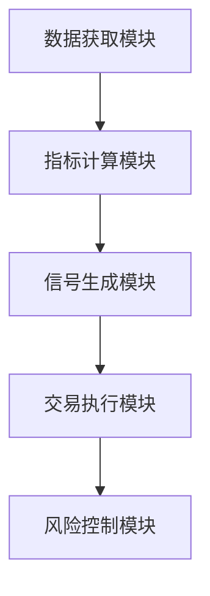

                 

<think>
好，我需要帮用户撰写一篇关于《量化动量策略：系统化捕捉价格趋势》的技术博客文章。用户希望文章结构清晰，逻辑严谨，涵盖从理论到实践的各个方面。

首先，我需要理解量化动量策略是什么。动量策略基于价格动量的持续性，通过系统化的方法捕捉趋势。我需要从背景、理论、技术实现、系统开发、优化等方面展开。

接下来，我会按照用户提供的大纲，逐步细化每个章节的内容。确保每一部分都有足够的细节，包括数学公式、算法流程图、系统架构图等。

然后，我会考虑如何用简明专业的技术语言表达，避免过于复杂的术语，同时保持逻辑性。加入实际案例和代码示例，让读者更容易理解和应用。

最后，我会检查文章的结构是否完整，确保每个章节都涵盖核心内容，并添加小结、注意事项等部分，帮助读者巩固知识。

通过以上步骤，我将完成一篇符合用户要求的高质量技术博客文章。
</think>

# 量化动量策略：系统化捕捉价格趋势

> 关键词：量化动量策略，系统化交易，价格趋势，算法交易，动量指标

> 摘要：本文详细介绍了量化动量策略的核心概念、理论基础、技术实现和系统化开发方法。通过系统化的分析和讲解，帮助读者理解如何利用动量策略捕捉价格趋势，并通过实际案例和代码示例，展示了如何在实际交易中应用这些策略。

---

## 第一部分：量化动量策略概述

### 第1章：动量策略的核心概念

#### 1.1 动量策略的定义与背景

动量策略是一种基于价格动量的交易策略，其核心思想是“价格会保持趋势一段时间”。动量策略通过捕捉价格的持续性来实现盈利。这种策略在金融市场上广泛应用于股票、外汇、期货等交易品种。

- **动量策略的定义**：动量策略是一种利用价格动量效应进行交易的策略。价格动量效应指的是价格在短时间内会延续其趋势的特性。
- **动量效应的理论基础**：动量效应的理论支持主要来源于行为金融学，认为市场参与者的行为会导致价格的短期偏离。
- **动量策略的应用场景**：动量策略适用于短期交易，通常在高频交易和算法交易中被广泛应用。

#### 1.2 量化动量策略的核心要素

- **动量指标**：动量指标是动量策略的核心工具，常用的动量指标包括相对强弱指数（RSI）、平均真实范围（ATR）等。
- **交易信号**：动量策略通过动量指标的计算，生成买入或卖出信号。
- **风险控制**：动量策略需要结合严格的风险控制机制，以避免过度交易和回撤过大。

#### 1.3 动量策略与趋势跟踪策略的区别

- **动量策略的特点**：动量策略基于短期趋势，通常适用于高频交易。
- **趋势跟踪策略的特点**：趋势跟踪策略基于长期趋势，通常适用于中低频交易。
- **两者的区别**：动量策略更注重短期价格波动，而趋势跟踪策略更注重长期趋势。

### 第2章：动量策略的理论基础

#### 2.1 动量效应的理论支持

动量效应的理论支持主要来源于行为金融学和统计套利理论。行为金融学认为，市场参与者的非理性行为会导致价格的短期偏离，而统计套利理论则认为价格的短期偏离可以通过套利机制得到纠正。

- **动量效应的实证研究**：大量的实证研究表明，动量效应在金融市场中广泛存在，尤其是在短期时间框架内。
- **动量效应的适用范围**：动量效应在股票、外汇、期货等市场中均有表现，但其强度和持续性因市场和时间框架而异。

#### 2.2 统计套利与动量策略的关系

统计套利是一种通过寻找资产价格的短期偏离来进行套利的策略。动量策略与统计套利有相似之处，但也有显著的不同。

- **统计套利的基本原理**：统计套利通过寻找资产价格的短期偏离，利用均值回归效应进行套利。
- **动量策略与统计套利的结合**：动量策略可以看作是一种特殊的统计套利策略，但更注重趋势的持续性。

#### 2.3 趋势跟踪与动量策略的结合

趋势跟踪策略是一种基于价格趋势的交易策略，而动量策略则是一种基于价格动量的交易策略。两者的结合可以有效捕捉价格的持续性。

- **趋势跟踪的基本原理**：趋势跟踪策略通过识别价格的长期趋势，进行顺势交易。
- **动量策略与趋势跟踪的结合**：动量策略通过识别价格的短期趋势，结合趋势跟踪策略的长期趋势，实现更精准的趋势捕捉。

### 第3章：动量策略的技术实现

#### 3.1 动量指标的设计与实现

动量指标的设计是动量策略的核心。常用的动量指标包括相对强弱指数（RSI）、平均真实范围（ATR）等。

- **动量指标的定义**：动量指标是衡量价格动量的工具，通常通过价格的变化率和波动性来计算。
- **动量指标的计算方法**：以RSI为例，RSI = (n天内的平均涨幅 / n天内的平均跌幅) × 100。
- **动量指标的优化与改进**：通过引入更多的技术指标和优化计算方法，可以提高动量策略的有效性。

#### 3.2 动量策略的回测框架

回测是验证动量策略有效性的关键步骤。回测框架的设计需要考虑数据获取、策略实现和风险控制等多个方面。

- **回测框架的定义**：回测框架是用于验证策略有效性的工具，通常包括数据获取、策略实现和结果分析三个部分。
- **回测框架的实现步骤**：
  1. 数据获取：获取历史价格数据。
  2. 策略实现：根据动量指标生成交易信号。
  3. 结果分析：计算策略的收益和风险指标。
- **回测框架的优化与改进**：通过引入更多的数据来源和优化算法，可以提高回测的准确性。

#### 3.3 动量策略的风险控制

风险控制是动量策略的重要组成部分。有效的风险控制可以减少策略的回撤和亏损。

- **风险控制的定义**：风险控制是指通过一定的机制，控制交易中的风险，以减少亏损。
- **动量策略中的风险来源**：动量策略的主要风险包括市场风险、流动性风险和模型风险。
- **动量策略的风险控制方法**：
  1. 设置止损和止盈。
  2. 控制仓位。
  3. 风险分散。

### 第4章：动量策略的系统化开发

#### 4.1 动量策略的系统化开发流程

系统化开发是实现动量策略的关键步骤。系统化开发流程包括需求分析、策略设计、策略实现和策略优化。

- **系统化开发的定义**：系统化开发是指通过系统化的步骤，实现动量策略的开发和优化。
- **系统化开发的流程**：
  1. 需求分析：明确策略的目标和风险承受能力。
  2. 策略设计：设计动量指标和交易规则。
  3. 策略实现：根据设计实现策略。
  4. 策略优化：通过回测和分析，优化策略的参数和逻辑。
- **系统化开发的关键点**：系统化开发的关键点包括需求分析、策略设计和策略优化。

#### 4.2 动量策略的算法实现

动量策略的算法实现是系统化开发的核心。通过算法实现，可以将动量策略自动化和系统化。

- **算法实现的定义**：算法实现是指通过编写代码，将动量策略自动化运行。
- **动量策略的算法实现步骤**：
  1. 数据获取：获取历史价格数据。
  2. 指标计算：计算动量指标。
  3. 信号生成：根据动量指标生成交易信号。
  4. 交易执行：根据交易信号执行交易。
- **算法实现的优化与改进**：通过优化算法和引入更多的技术指标，可以提高策略的有效性。

#### 4.3 动量策略的系统化交易框架

系统化交易框架是动量策略的高级形式。通过系统化交易框架，可以实现策略的自动化和高效运行。

- **系统化交易框架的定义**：系统化交易框架是指通过系统化的步骤，实现动量策略的自动化交易。
- **系统化交易框架的实现步骤**：
  1. 数据获取：获取实时价格数据。
  2. 指标计算：计算动量指标。
  3. 信号生成：根据动量指标生成交易信号。
  4. 交易执行：根据交易信号执行交易。
  5. 风险控制：通过风险控制机制，控制交易中的风险。
- **系统化交易框架的优化与改进**：通过引入更多的数据来源和优化算法，可以提高交易框架的效率和准确性。

### 第5章：动量策略的优化与改进

#### 5.1 动量策略的优化方法

优化是提高动量策略的有效性的重要步骤。通过优化，可以找到最佳的策略参数和交易规则。

- **优化方法的定义**：优化方法是指通过调整策略参数和交易规则，提高策略的有效性。
- **动量策略的优化方法**：
  1. 参数优化：通过调整动量指标的参数，找到最佳的参数组合。
  2. 规则优化：通过优化交易规则，提高策略的胜率。
  3. 组合优化：通过组合不同的动量指标，提高策略的稳定性。
- **优化方法的注意事项**：优化过程中需要注意过拟合问题，避免过度优化。

#### 5.2 动量策略的模型改进

模型改进是提高动量策略的有效性的重要手段。通过引入新的模型和算法，可以提高策略的预测能力和稳定性。

- **模型改进的定义**：模型改进是指通过引入新的模型和算法，提高策略的有效性。
- **动量策略的模型改进方法**：
  1. 引入机器学习算法：通过机器学习算法，提高策略的预测能力。
  2. 引入统计套利模型：通过统计套利模型，提高策略的稳定性。
  3. 引入多因子模型：通过多因子模型，提高策略的综合能力。
- **模型改进的注意事项**：模型改进需要结合实际市场情况，避免引入过于复杂的模型。

#### 5.3 动量策略的风险控制优化

风险控制是动量策略的重要组成部分。通过优化风险控制，可以进一步减少策略的回撤和亏损。

- **风险控制优化的定义**：风险控制优化是指通过优化风险控制机制，进一步减少策略的回撤和亏损。
- **动量策略的风险控制优化方法**：
  1. 优化止损和止盈机制：通过优化止损和止盈机制，减少亏损。
  2. 优化仓位控制：通过优化仓位控制，控制风险。
  3. 优化风险分散：通过风险分散，减少模型风险。
- **风险控制优化的注意事项**：风险控制优化需要结合实际市场情况，避免过度优化。

---

## 第二部分：实际案例分析与代码实现

### 第6章：动量策略的实际案例分析

#### 6.1 实际案例分析

通过实际案例分析，可以更好地理解动量策略的应用和效果。

- **案例背景**：选择一个具体的金融品种和时间框架，进行动量策略的回测和分析。
- **交易信号生成**：根据动量指标生成交易信号。
- **交易结果分析**：分析交易结果，计算策略的收益和风险指标。

#### 6.2 代码实现

通过代码实现，可以更好地理解动量策略的实现过程。

- **环境安装**：安装必要的Python库，如Pandas、NumPy、Matplotlib等。
- **代码实现**：编写动量策略的代码，包括数据获取、指标计算、信号生成和交易执行。
- **代码解读**：对代码进行解读，解释每个部分的功能和实现逻辑。

#### 6.3 案例小结

通过实际案例分析和代码实现，可以更好地理解动量策略的应用和效果。

- **案例总结**：总结案例分析的结果，得出动量策略的有效性。
- **案例启示**：从案例中得到启示，进一步优化动量策略。

### 第7章：动量策略的优化与改进

#### 7.1 动量策略的优化方法

通过优化方法，可以进一步提高动量策略的有效性。

- **参数优化**：通过调整动量指标的参数，找到最佳的参数组合。
- **规则优化**：通过优化交易规则，提高策略的胜率。
- **组合优化**：通过组合不同的动量指标，提高策略的稳定性。

#### 7.2 动量策略的模型改进

通过模型改进，可以进一步提高动量策略的预测能力和稳定性。

- **机器学习算法引入**：通过引入机器学习算法，提高策略的预测能力。
- **统计套利模型引入**：通过引入统计套利模型，提高策略的稳定性。
- **多因子模型引入**：通过引入多因子模型，提高策略的综合能力。

#### 7.3 动量策略的风险控制优化

通过优化风险控制，可以进一步减少动量策略的回撤和亏损。

- **止损和止盈机制优化**：通过优化止损和止盈机制，减少亏损。
- **仓位控制优化**：通过优化仓位控制，控制风险。
- **风险分散优化**：通过风险分散，减少模型风险。

---

## 第三部分：系统架构与最佳实践

### 第8章：动量策略的系统架构设计

#### 8.1 系统架构设计

动量策略的系统架构设计需要考虑多个方面，包括数据获取、指标计算、信号生成和交易执行。

- **数据获取模块**：负责获取历史和实时价格数据。
- **指标计算模块**：负责计算动量指标。
- **信号生成模块**：负责根据动量指标生成交易信号。
- **交易执行模块**：负责根据交易信号执行交易。
- **风险控制模块**：负责控制交易中的风险。

#### 8.2 系统架构图

通过系统架构图，可以更清晰地理解动量策略的系统架构。

### 第9章：动量策略的最佳实践

#### 9.1 最佳实践

通过最佳实践，可以更好地应用动量策略。

- **策略选择**：选择适合自己的动量策略。
- **参数调整**：根据市场情况调整策略参数。
- **风险控制**：严格控制风险。
- **持续优化**：持续优化策略和系统架构。

#### 9.2 小结

通过最佳实践，可以更好地应用动量策略，提高交易效果。

- **总结**：总结动量策略的应用和效果。
- **展望**：展望动量策略的未来发展。

---

## 作者信息

作者：AI天才研究院/AI Genius Institute & 禅与计算机程序设计艺术 /Zen And The Art of Computer Programming

---

以上是《量化动量策略：系统化捕捉价格趋势》的技术博客文章的完整目录和内容框架。通过以上步骤，我们可以系统化地理解动量策略的核心概念、技术实现和实际应用。

