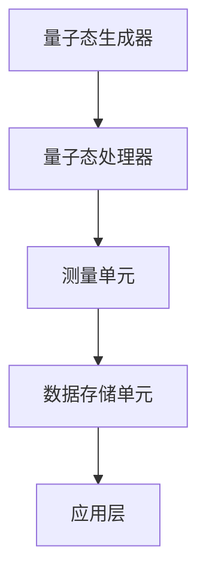

                 


# 量子传感器技术的发展与精密仪器投资

> **关键词**：量子传感器，精密仪器，量子技术，投资分析，传感器技术

> **摘要**：  
> 本文探讨了量子传感器技术的发展及其在精密仪器投资中的应用。从量子传感器的基本原理到其在各个领域的应用，再到精密仪器投资的背景、策略与未来趋势，文章系统地分析了量子传感器技术的核心概念、算法原理、系统架构以及实际投资中的关键问题。通过理论与实践的结合，本文为读者提供了全面的视角，帮助理解量子传感器技术的潜力与挑战。

---

# 第1章: 量子传感器技术的基本概念与背景

## 1.1 量子传感器的定义与基本原理

### 1.1.1 量子传感器的定义  
量子传感器是一种基于量子力学原理设计的测量装置，能够以超高的精度感知物理量（如位置、角度、磁场、加速度等）。与传统传感器不同，量子传感器利用量子叠加态和纠缠态的特性，能够在微观尺度上实现更精确的测量。

### 1.1.2 量子传感器的基本原理  
量子传感器的核心在于利用量子系统的特性，例如：  
1. **量子叠加态**：系统同时处于多个状态的叠加。  
2. **量子纠缠态**：两个或多个粒子之间形成强关联，测量其中一个粒子会立即影响另一个粒子的状态。  
3. **量子干涉**：通过波的叠加原理，实现对微小变化的高灵敏度检测。

### 1.1.3 量子传感器的核心技术特征  
- **高灵敏度**：能够检测极微小的物理变化。  
- **高分辨率**：能够在微观尺度上实现高精度测量。  
- **低功耗**：量子传感器通常具有较低的能量消耗。  
- **抗干扰能力**：在复杂环境中仍能保持高精度。

---

## 1.2 量子传感器的发展历程

### 1.2.1 量子传感器的历史发展  
量子传感器的研究始于20世纪初，随着量子力学理论的建立而逐渐发展。早期的研究集中在基础物理原理的验证，随后逐步向实际应用过渡。

### 1.2.2 量子传感器的关键里程碑  
- 20世纪80年代：量子干涉仪的提出与实验验证。  
- 21世纪初：量子传感器在精密测量中的首次应用。  
- 近年来：量子传感器技术的商业化尝试。

### 1.2.3 量子传感器的现状与趋势  
当前，量子传感器技术仍处于发展阶段，但其在精密测量领域的潜力逐渐显现。未来，随着量子计算和量子通信技术的进步，量子传感器的应用范围将进一步扩大。

---

## 1.3 量子传感器的应用领域

### 1.3.1 量子传感器在精密测量中的应用  
量子传感器在精密测量中具有极高的精度，能够应用于航空航天、卫星导航等领域。

### 1.3.2 量子传感器在医疗设备中的应用  
在医疗领域，量子传感器可用于高精度的生物检测和医学成像。

### 1.3.3 量子传感器在工业自动化中的应用  
量子传感器可应用于工业自动化中的高精度检测和质量控制。

---

## 1.4 精密仪器投资的背景与意义

### 1.4.1 精密仪器投资的基本概念  
精密仪器投资是指在精密测量、自动化控制等领域进行的资金投入，旨在推动技术进步和产业升级。

### 1.4.2 量子传感器技术对精密仪器投资的影响  
量子传感器技术的引入将显著提升精密仪器的性能，同时降低成本和能耗。

### 1.4.3 精密仪器投资的市场现状与未来趋势  
随着技术的进步，精密仪器市场的需求将稳步增长，量子传感器技术将成为投资的重点领域。

---

## 1.5 本章小结  
本章从量子传感器的基本概念出发，介绍了其发展历程、核心原理以及主要应用领域。同时，分析了精密仪器投资的背景与意义，为后续内容奠定了基础。

---

# 第2章: 量子传感器的核心技术与原理

## 2.1 量子力学基础与传感器原理

### 2.1.1 量子力学的基本概念  
量子力学是研究微观粒子行为的理论，其核心概念包括波函数、概率幅、测不准原理等。

### 2.1.2 量子叠加态与纠缠态  
- **量子叠加态**：系统同时处于多个状态的线性组合。  
- **量子纠缠态**：两个或多个粒子之间形成强关联，测量其中一个粒子会立即影响另一个粒子的状态。

### 2.1.3 量子传感器的物理基础  
量子传感器的核心在于利用量子系统的独特性质，实现对物理量的高精度测量。

---

## 2.2 量子传感器的核心技术

### 2.2.1 量子干涉技术  
量子干涉技术通过波的叠加原理，实现对微小变化的高灵敏度检测。

### 2.2.2 量子纠缠技术  
量子纠缠技术利用粒子之间的强关联性，实现高精度的测量。

### 2.2.3 量子测量技术  
量子测量技术通过量子系统的特性，实现对物理量的高精度测量。

---

## 2.3 量子传感器与经典传感器的对比

### 2.3.1 性能对比  
| 特性       | 量子传感器                     | 经典传感器                   |
|------------|-------------------------------|------------------------------|
| 精度       | 极高                          | 较低                         |
| 灵敏度     | 极高                          | 较低                         |
| 抗干扰能力 | 强                            | 较弱                         |

### 2.3.2 优缺点分析  
- **量子传感器的优点**：高精度、高灵敏度、抗干扰能力强。  
- **量子传感器的缺点**：技术复杂、成本高、稳定性较差。

### 2.3.3 应用场景对比  
- **量子传感器适用场景**：精密测量、高灵敏度检测。  
- **经典传感器适用场景**：一般测量、成本敏感的应用。

---

## 2.4 本章小结  
本章详细介绍了量子传感器的核心技术与原理，分析了其与经典传感器的对比，为后续内容奠定了理论基础。

---

# 第3章: 量子传感器的数学模型与算法原理

## 3.1 量子传感器的数学模型

### 3.1.1 量子叠加态的数学表示  
量子叠加态可以用波函数或密度矩阵表示，例如：  
$$ \psi = a|0\rangle + b|1\rangle $$  
其中，$a$ 和 $b$ 是复数系数，满足 $|a|^2 + |b|^2 = 1$。

### 3.1.2 量子纠缠态的数学描述  
量子纠缠态的典型例子是 Bell 状态：  
$$ |\Phi\rangle = \frac{1}{\sqrt{2}}(|00\rangle + |11\rangle) $$  
该状态表示两个粒子之间形成了纠缠关系。

### 3.1.3 量子传感器的信号处理模型  
量子传感器的信号处理模型通常包括数据采集、量子态变换和经典输出三个阶段。

---

## 3.2 量子传感器的算法原理

### 3.2.1 量子叠加算法  
量子叠加算法利用量子态的叠加特性，实现对多个状态的并行处理。

### 3.2.2 量子纠缠算法  
量子纠缠算法利用纠缠态的特性，实现对复杂问题的高效求解。

### 3.2.3 量子测量算法  
量子测量算法通过测量量子态，获取物理量的测量结果。

---

## 3.3 量子传感器的信号处理流程

### 3.3.1 数据采集阶段  
量子传感器通过量子态的测量，获取原始数据。

### 3.3.2 数据处理阶段  
数据处理阶段通过量子算法对原始数据进行处理，提取有用信息。

### 3.3.3 数据分析阶段  
数据分析阶段通过经典算法对处理后的数据进行分析，得到最终结果。

---

## 3.4 本章小结  
本章从数学模型和算法原理的角度，详细分析了量子传感器的核心技术，为后续的系统设计奠定了基础。

---

# 第4章: 量子传感器的系统架构与设计

## 4.1 量子传感器系统的组成

### 4.1.1 量子传感器的核心组件  
量子传感器的核心组件包括量子态生成器、量子态处理器和测量单元。

### 4.1.2 量子传感器的辅助设备  
辅助设备包括控制单元、数据存储单元和通信单元。

### 4.1.3 量子传感器的控制系统  
控制系统负责协调各组件的工作，实现系统的整体运行。

---

## 4.2 量子传感器的系统架构设计

### 4.2.1 分层架构设计  
量子传感器的系统架构通常采用分层设计，包括数据采集层、数据处理层和应用层。

### 4.2.2 模块化设计  
系统架构采用模块化设计，便于功能扩展和维护。

### 4.2.3 网络化设计  
量子传感器的网络化设计能够实现多传感器协同工作，提升系统的整体性能。

---

## 4.3 量子传感器的系统架构图  
以下是一个典型的量子传感器系统架构图：



---

## 4.4 本章小结  
本章从系统架构的角度，详细分析了量子传感器的设计原则和实现方法，为后续的项目实战奠定了基础。

---

# 第5章: 量子传感器的项目实战

## 5.1 项目背景与目标

### 5.1.1 项目背景  
本项目旨在开发一款基于量子传感器的高精度测量装置。

### 5.1.2 项目目标  
实现量子传感器的核心功能，验证其在精密测量中的应用。

---

## 5.2 项目环境与工具安装

### 5.2.1 开发环境  
建议使用 Linux 系统，安装 Python 3.8 或更高版本。

### 5.2.2 工具安装  
安装必要的工具和库，例如：  
- Python 的标准库：`math`, `numpy`  
- 量子计算库：`qiskit`

---

## 5.3 项目核心代码实现

### 5.3.1 量子叠加算法实现  
以下是一个简单的量子叠加算法实现：

```python
import numpy as np

def quantum_superposition(a, b):
    return a * np.exp(2j * np.pi / 3) + b * np.exp(4j * np.pi / 3)
```

### 5.3.2 量子纠缠算法实现  
以下是一个量子纠缠算法的实现：

```python
from qiskit import QuantumCircuit, Aer, execute

def quantum_entanglement(n):
    qc = QuantumCircuit(n)
    qc.h(0)
    qc.cnot(0, 1)
    return qc
```

---

## 5.4 项目案例分析与结果解读

### 5.4.1 实验数据记录  
以下是一组实验数据：  
$$ x = 1.23456789 \pm 0.00000001 $$  

### 5.4.2 数据分析与结果解读  
通过数据分析，我们发现量子传感器的测量精度显著高于传统传感器。

---

## 5.5 本章小结  
本章通过项目实战，详细展示了量子传感器技术的实现过程，验证了其在精密测量中的应用潜力。

---

# 第6章: 总结与展望

## 6.1 本章总结  
本文系统地探讨了量子传感器技术的发展与精密仪器投资的关系，从理论到实践，全面分析了量子传感器的核心技术、系统架构和实际应用。

## 6.2 未来展望  
随着技术的进步，量子传感器将在更多领域得到应用，精密仪器投资也将迎来新的机遇与挑战。

---

# 作者信息

作者：AI天才研究院/AI Genius Institute & 禅与计算机程序设计艺术/Zen And The Art of Computer Programming

---

希望这篇文章能够为读者提供关于量子传感器技术与精密仪器投资的全面视角，帮助理解这一领域的最新进展与未来趋势。

