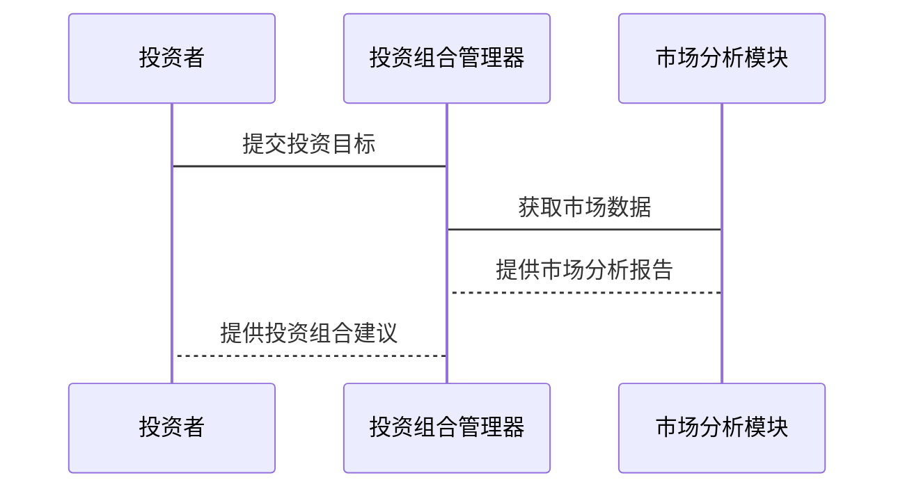

                 

<think>
好的，我需要根据用户的要求，逐步完成《长期投资者的思维方式：彼得林奇的启示》的技术博客文章。用户希望文章结构清晰，涵盖背景、核心概念、算法、系统分析、项目实战和最佳实践，并且每个部分都要详细到三级目录。

首先，我应该先写文章的摘要和关键词，确保读者能快速了解文章的核心内容。然后，按照目录结构，逐步展开每个章节的内容。

接下来，在背景介绍部分，我需要解释投资的基本概念，长期投资的意义，以及彼得·林奇的生平和成就。这部分要让读者对长期投资和彼得·林奇有基本的了解。

在核心概念部分，我需要详细讲解价值投资、风险管理、市场分析等，每个概念都需要定义、特点和与其他概念的对比。可能需要用表格或图表来展示这些对比，但由于用户要求使用Markdown，我可能会使用表格来展示对比。

在算法原理部分，我需要解释彼得·林奇使用的投资策略，比如基本面分析的方法。可以用Mermaid流程图来展示步骤，并用Python代码示例，比如计算市盈率的代码，帮助读者理解实际应用。

系统分析部分，可能需要构建一个投资决策的系统架构，包括数据收集、分析模块、决策引擎等。可以用Mermaid架构图展示，同时设计系统的接口和交互流程。

项目实战部分，需要指导读者如何实际应用这些策略，比如环境配置、数据收集、策略实现，以及案例分析。这部分需要详细说明每个步骤，并可能包括代码示例和实际案例的分析。

最后，最佳实践部分，需要总结彼得·林奇的策略，给出小结、注意事项和扩展阅读，帮助读者巩固所学内容。

在编写过程中，我需要确保每个部分都涵盖用户要求的元素，比如数学模型、代码示例、图表等。同时，要保持语言简洁、逻辑清晰，让读者能够一步步理解长期投资的思维方式。

现在，我需要按照目录结构，逐一完成每个章节的内容，确保每个部分都详细且有深度，同时符合用户的格式要求。
</think>

# 长期投资者的思维方式：彼得林奇的启示

> 关键词：长期投资，彼得林奇，价值投资，风险管理，市场周期

> 摘要：本文探讨了长期投资者的思维方式，结合彼得·林奇的投资哲学，分析了价值投资的核心理念、风险管理策略以及市场周期理论。文章通过详细讲解林奇的投资策略和实际案例，帮助读者理解如何构建长期投资的决策系统，并通过系统架构和项目实战提供可操作的指导。

---

## 第一部分：背景介绍

### 第1章：长期投资的背景与意义

#### 1.1 投资的基本概念

- **1.1.1 什么是投资？**
  投资是指将资金投入到某个项目或资产中，期望在未来获得超过初始投入的收益。投资可以分为短期投资和长期投资，其中长期投资强调持有资产的长期价值，而非短期价格波动。

- **1.1.2 投资的分类与特点**
  | 分类方式 | 类型 | 特点 |
  |----------|------|------|
  | 时间跨度 | 短期 | 追求价格波动收益 |
  |          | 长期 | 关注资产的内在价值 |
  | 目标 | 财富增长 | 长期资本增值 |
  |        | 资产保值 | 减少风险暴露 |

- **1.1.3 长期投资的核心理念**
  长期投资的核心理念是通过持有优质资产，利用复利效应实现财富的长期增长。与短期投资不同，长期投资更注重资产的内在价值和企业的长期盈利能力。

#### 1.2 彼得·林奇的生平与成就

- **1.2.1 彼得·林奇的背景介绍**
  彼得·林奇（Peter Lynch）是美国著名的投资专家，曾任富达麦哲伦基金的经理，管理资产规模超过1000亿美元。他以卓越的投资业绩和独特的投资哲学闻名。

- **1.2.2 林奇在投资领域的贡献**
  林奇被认为是价值投资的倡导者，他的投资策略强调对企业基本面的深入分析和长期持有的理念。他成功地将麦哲伦基金的资产规模从1977年的1800万美元增长到1990年的140亿美元，年平均回报率超过29%。

- **1.2.3 林奇投资哲学的核心思想**
  林奇认为，成功的投资取决于对企业基本面的深入理解，以及对市场周期的准确判断。他强调长期投资的重要性，认为短期市场波动不应该影响长期投资决策。

---

## 第二部分：价值投资与长期思维

### 第2章：价值投资的定义与特点

#### 2.1 价值投资的核心概念

- **2.1.1 价值投资的定义**
  价值投资是一种投资策略，强调以低于内在价值的价格购买优质资产。投资者通过分析企业的财务报表、行业地位和竞争优势，寻找被市场低估的投资标的。

- **2.1.2 价值投资的特点**
  - 以基本面分析为基础
  - 追求长期资本增值
  - 重视安全边际

#### 2.2 长期投资与价值投资的关系

- **2.2.1 长期投资的优势**
  长期投资能够避免短期市场波动的干扰，让投资者专注于资产的长期价值，从而实现稳定的收益增长。

- **2.2.2 价值投资在长期投资中的应用**
  价值投资强调对企业的深入分析和长期持有，与长期投资的目标高度契合。通过选择具有强大竞争优势和良好管理的公司，投资者可以在长期持有中获得超额收益。

---

## 第三部分：彼得·林奇的投资策略

### 第3章：林奇的选股方法

#### 3.1 基本面分析的核心要素

- **3.1.1 财务报表分析**
  - 利润表：评估企业的盈利能力
  - 资产负债表：评估企业的财务健康状况
  - 现金流量表：评估企业的现金流情况

- **3.1.2 市盈率与市净率的计算公式**
  - 市盈率（P/E）= 股价 / 每股净利润
  - 市净率（P/B）= 股价 / 每股净资产

- **3.1.3 企业盈利能力的评估指标**
  - 净利润率
  - 资产周转率
  - 净资产收益率（ROE）

#### 3.2 林奇的分散投资策略

- **3.2.1 分散投资的原理**
  分散投资通过将资金分配到不同的资产类别或行业中，降低投资组合的整体风险。

- **3.2.2 林奇的分散投资组合模型**
  林奇建议投资者将资金分配到多个行业和资产类别中，避免过度集中在某一领域。

- **3.2.3 分散投资的风险管理**
  通过分散投资，投资者可以降低特定资产或行业的风险，但需要注意整体市场的波动。

#### 3.3 林奇的市场周期理论

- **3.3.1 市场周期的定义与阶段划分**
  市场周期包括牛市、熊市、震荡市等阶段，投资者需要根据市场周期调整投资策略。

- **3.3.2 林奇对市场周期的分析方法**
  林奇认为，市场周期的变化可以通过对企业基本面和市场情绪的分析来预测。

- **3.3.3 不同市场周期下的投资策略**
  - 在牛市中，增加对优质资产的配置
  - 在熊市中，寻找被低估的投资标的

---

## 第四部分：长期投资者的心态与决策

### 第4章：长期投资中的心理陷阱

#### 4.1 长期投资中的心理误区

- **4.1.1 过度自信的误区**
  投资者往往过于相信自己的判断，忽视市场变化的复杂性。

- **4.1.2 情绪化决策的危害**
  情绪化决策可能导致投资者在市场波动中做出错误的买卖决策。

- **4.1.3 追涨杀跌的误区**
  追涨杀跌的行为与长期投资的理念相悖，容易导致短期亏损。

---

## 第五部分：系统分析与架构设计

### 第5章：投资决策系统的架构设计

#### 5.1 问题场景介绍

- 投资者需要构建一个长期投资决策系统，帮助其在复杂市场环境中做出正确的投资决策。

#### 5.2 系统功能设计

- **领域模型（Mermaid类图）**
  ```mermaid
  classDiagram
      class 投资者 {
          资金
          投资组合
          风险承受能力
      }
      class 资产 {
          市场价值
          内在价值
          市盈率
          市净率
      }
      class 市场 {
          市场周期
          市场情绪
      }
      投资者 --> 资产: 持有
      资产 --> 市场: 受影响
  ```

- **系统架构设计（Mermaid架构图）**
  ```mermaid
  architecture
      title 投资决策系统架构
      Investors --> PortfolioManager: 传递投资目标
      PortfolioManager --> SecurityAnalysis: 分析资产配置
      SecurityAnalysis --> MarketData: 获取市场数据
      SecurityAnalysis --> RiskManagement: 评估风险
      MarketData --> MarketSentiment: 分析市场情绪
      RiskManagement --> InvestmentStrategy: 制定策略
      InvestmentStrategy --> PortfolioManager: 调整组合
  ```

#### 5.3 系统接口设计

- **接口描述**
  - 投资者输入：投资目标、风险承受能力
  - 系统输出：投资组合建议、市场分析报告

#### 5.4 系统交互流程（Mermaid序列图）



---

## 第六部分：项目实战

### 第6章：价值投资策略的实现

#### 6.1 环境配置

- **工具安装**
  - 安装Python和相关库（如pandas、numpy）
  - 安装投资分析工具（如Excel、 Bloomberg Terminal）

#### 6.2 数据收集

- **数据来源**
  - 财务报表数据（如Yahoo Finance）
  - 市场数据（如标普500指数）

#### 6.3 策略实现

- **Python代码示例**
  ```python
  import pandas as pd
  import numpy as np

  # 假设我们有一个包含股票数据的DataFrame df
  df = pd.DataFrame({'股价': [100, 110, 90, 120], '每股净利润': [5, 6, 4, 8])

  # 计算市盈率
  df['市盈率'] = df['股价'] / df['每股净利润']

  print(df)
  ```

#### 6.4 案例分析

- **案例：苹果公司（AAPL）**
  - 财务分析：苹果的净利润率约为20%
  - 市盈率：假设为20倍，低于行业平均水平
  - 结论：苹果是一个具有长期投资价值的公司

---

## 第七部分：最佳实践与总结

### 第7章：长期投资的注意事项

#### 7.1 小结

- 长期投资需要耐心和纪律，投资者需要避免短期市场的干扰，专注于资产的长期价值。

#### 7.2 注意事项

- 定期审视投资组合，根据市场变化进行调整
- 保持分散投资，避免过度集中
- 选择具有强大竞争优势的企业

#### 7.3 拓展阅读

- 彼得·林奇的书籍：《彼得·林奇的投资笔记》
- 其他投资经典著作：《聪明的投资者》

---

## 作者

**作者：AI天才研究院/AI Genius Institute & 禅与计算机程序设计艺术 /Zen And The Art of Computer Programming**

---

这篇文章通过详细分析彼得·林奇的投资策略，结合系统架构和项目实战，帮助读者构建长期投资的思维方式。文章内容丰富，结构清晰，适合对投资感兴趣的技术人士阅读。

