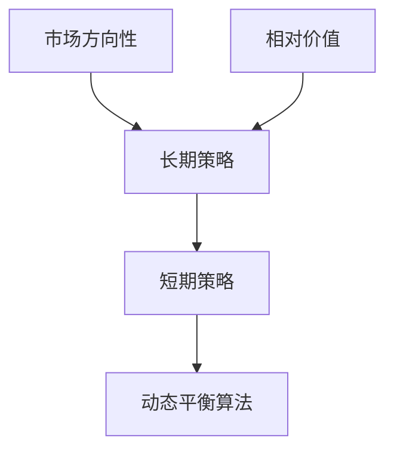
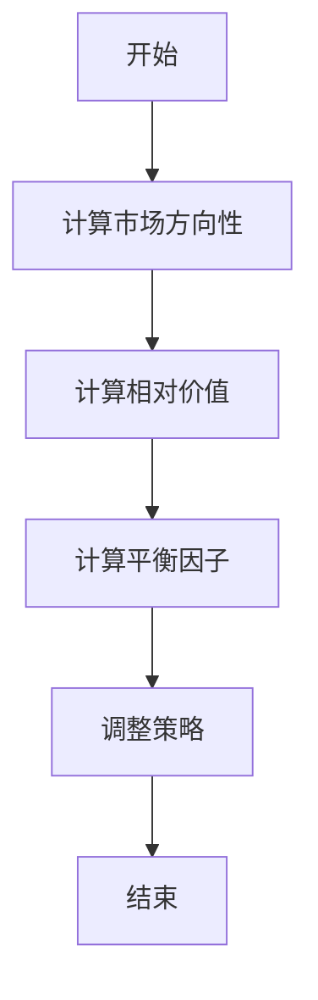
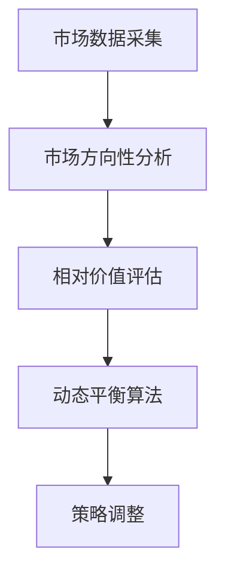
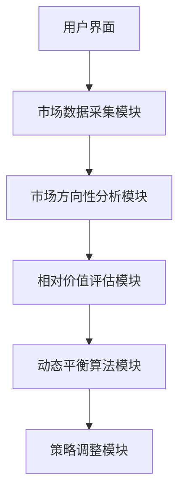
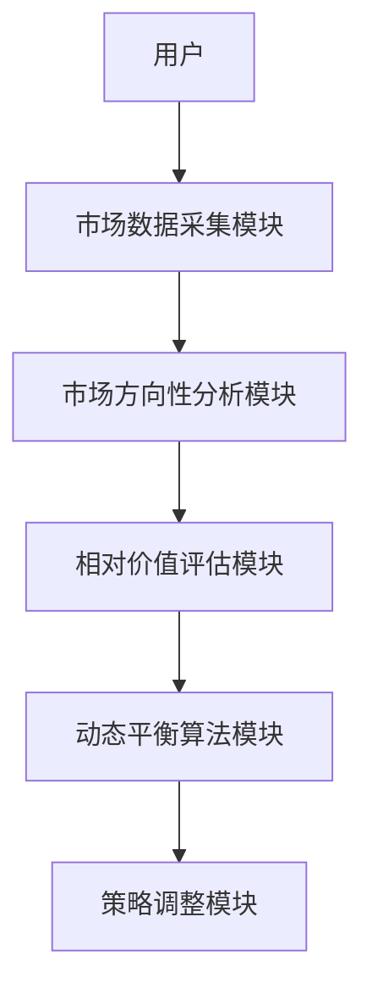

                 

<think>
好的，我现在要帮助用户撰写一篇技术博客文章，标题是《长短期策略：平衡市场方向性与相对价值》。用户希望我以一位资深技术专家的身份，按照指定的目录结构和内容要求，逐步分析和推理，撰写出一篇结构紧凑、逻辑清晰、内容深刻的专业技术博客。

首先，我需要理解用户的需求。用户希望文章涵盖长短期策略的背景、核心概念、平衡原理、算法与数学模型、系统分析与架构设计、项目实战以及总结与展望。每个部分都需要详细展开，使用技术性的语言，同时确保内容易于理解，结构合理。

接下来，我会按照目录结构逐步构建文章内容。首先是背景介绍，解释为什么平衡长短期策略重要，以及其在市场中的应用。然后，详细阐述市场方向性和相对价值的概念，对比分析它们的特点和相互作用。之后，讨论如何通过动态平衡算法实现长短期策略的平衡，包括算法流程图和数学模型。接着，进行系统分析与架构设计，包括功能模块划分、架构图和接口设计。最后，通过项目实战和实际案例分析，验证策略的有效性，并总结经验和教训。

在撰写过程中，我会确保每个部分都包含必要的技术细节，例如使用mermaid绘制流程图和类图，展示算法和系统设计的逻辑。同时，数学公式需要准确无误，并用latex格式呈现，确保专业性和可读性。

我还需要考虑读者的背景，可能包括程序员、软件架构师和金融市场的从业者。因此，文章需要既具备技术深度，又易于理解，避免过于晦涩的术语，同时提供足够的实例和解释，帮助读者理解和应用这些策略。

最后，我会在文章末尾添加作者信息，强调文章的专业性和权威性，同时建议读者进一步阅读相关资料，以获取更深入的知识。

通过以上思考，我相信能够按照用户的要求，撰写出一篇高质量的技术博客文章，全面而深入地探讨长短期策略的平衡方法，帮助读者在金融市场中做出更明智的投资决策。
</think>

# 长短期策略：平衡市场方向性与相对价值

---

## 关键词：长短期策略、市场方向性、相对价值、动态平衡算法、金融投资、技术分析

---

## 摘要：  
在金融市场中，长短期策略的平衡是投资者面临的重大挑战。本文从市场方向性与相对价值的双重角度，探讨如何在长短期策略中找到平衡点。通过动态平衡算法和系统架构设计，结合实际案例分析，本文为投资者提供了理论支持和实践指导。文章内容涵盖背景介绍、核心概念、平衡原理、算法实现、系统架构、项目实战及总结与展望，帮助读者全面理解长短期策略的平衡方法。

---

# 第一部分：长短期策略的背景与核心概念

## 第1章：长短期策略的背景与核心概念

### 1.1 问题背景与问题描述

金融市场是一个复杂而动态的系统，投资者需要在长短期策略之间找到平衡。长期策略关注市场趋势和价值投资，而短期策略则关注市场波动和交易机会。然而，这两者的结合需要精确的平衡，否则可能导致投资失败。本文探讨如何在长短期策略中找到平衡点，以实现稳健的投资收益。

### 1.2 长短期策略的核心概念

#### 1.2.1 市场方向性

- **定义**：市场方向性是指市场整体走势的方向，包括上涨、下跌或震荡。  
- **特点**：市场方向性受宏观经济、政策变化和市场情绪等多种因素影响，具有不确定性。  
- **与长短期策略的关系**：长期策略依赖于市场方向性，而短期策略则需要快速捕捉市场方向的变化。

#### 1.2.2 相对价值

- **定义**：相对价值是指同一市场中不同资产或资产组合之间的价值对比。  
- **特点**：相对价值依赖于市场参与者的风险偏好和资产流动性，具有动态变化性。  
- **与长短期策略的关系**：相对价值在短期策略中尤为重要，而长期策略则需要关注资产的长期价值。

### 1.2.3 长短期策略的概念结构图



---

# 第二部分：市场方向性与相对价值的平衡原理

## 第2章：市场方向性与相对价值的平衡原理

### 2.1 市场方向性分析

#### 2.1.1 市场方向性的数学模型

市场方向性可以用以下公式表示：

$$
\text{市场方向性} = \frac{\text{资产价格变化}}{\text{时间区间}}
$$

其中，资产价格变化可以用收益率来衡量。

### 2.1.2 市场方向性的影响因素

- **宏观经济因素**：GDP、利率、通货膨胀等。  
- **政策因素**：政府政策、监管变化等。  
- **市场情绪**：投资者情绪、市场参与度等。

### 2.1.3 市场方向性与长短期策略的关系

市场方向性为长期策略提供方向性指导，而短期策略则需要快速调整以应对市场方向的变化。

### 2.2 相对价值评估

#### 2.2.1 相对价值的数学模型

相对价值可以用以下公式表示：

$$
\text{相对价值} = \frac{\text{资产A的价值}}{\text{资产B的价值}}
$$

其中，资产A和资产B的价值可以通过市场定价模型（如CAPM）进行评估。

### 2.2.2 相对价值的影响因素

- **资产流动性**：流动性高的资产相对价值更容易变化。  
- **市场参与度**：市场参与者的行为影响相对价值。  
- **资产特性**：资产的风险、收益和流动性等特性影响相对价值。

### 2.2.3 相对价值与长短期策略的关系

相对价值在短期策略中尤为重要，而长期策略则需要关注资产的长期相对价值变化。

### 2.3 市场方向性与相对价值的平衡原理

#### 2.3.1 平衡原理的数学模型

平衡原理可以用以下公式表示：

$$
\text{平衡因子} = \frac{\text{市场方向性权重}}{\text{相对价值权重}}
$$

其中，市场方向性权重和相对价值权重可以根据市场环境进行调整。

#### 2.3.2 平衡原理的实际应用案例

假设市场方向性权重为0.6，相对价值权重为0.4，则平衡因子为：

$$
\text{平衡因子} = \frac{0.6}{0.4} = 1.5
$$

这意味着市场方向性对当前投资决策的影响更大。

---

# 第三部分：长短期策略的算法与数学模型

## 第3章：长短期策略的算法原理

### 3.1 动态平衡算法

#### 3.1.1 动态平衡算法的定义

动态平衡算法是一种根据市场变化实时调整长短期策略的算法。

#### 3.1.2 动态平衡算法的流程图



#### 3.1.3 动态平衡算法的实现代码

```python
def dynamic_balance_algorithm(market_direction, relative_value):
    # 计算平衡因子
    balance_factor = market_direction / relative_value
    # 调整策略
    if balance_factor > 1:
        return "增加长期投资"
    elif balance_factor < 1:
        return "增加短期交易"
    else:
        return "保持当前策略"
```

### 3.2 数学模型与公式

#### 3.2.1 平衡因子的计算公式

$$
\text{平衡因子} = \frac{\text{市场方向性}}{\text{相对价值}}
$$

其中，市场方向性可以用收益率表示，相对价值可以用资产价格比表示。

---

# 第四部分：长短期策略的系统分析与架构设计

## 第4章：系统分析与架构设计

### 4.1 系统功能设计

#### 4.1.1 系统功能模块划分

- **市场数据采集模块**：采集市场数据，包括价格、收益率等。  
- **市场方向性分析模块**：计算市场方向性。  
- **相对价值评估模块**：计算相对价值。  
- **动态平衡算法模块**：根据市场方向性和相对价值计算平衡因子并调整策略。  

#### 4.1.2 系统功能模块的交互流程



#### 4.1.3 系统功能的实现代码

```python
def market_direction_analysis(prices):
    # 计算收益率
    returns = prices / prices.shift(1)
    return returns.mean()

def relative_value_assessment(prices):
    # 计算资产价格比
    price_ratio = prices / prices.mean()
    return price_ratio
```

### 4.2 系统架构设计

#### 4.2.1 系统架构图



### 4.3 接口设计与交互序列图

#### 4.3.1 接口设计

- **市场数据接口**：提供市场数据的获取和更新功能。  
- **策略调整接口**：根据平衡因子调整投资策略。  

#### 4.3.2 交互序列图



---

# 第五部分：长短期策略的项目实战

## 第5章：项目实战

### 5.1 项目背景与目标

本文通过一个股票投资组合优化的案例，验证长短期策略的平衡方法。

### 5.2 环境安装与配置

- **工具安装**：安装Python、Pandas、NumPy等工具。  
- **数据源**：使用Yahoo Finance获取股票数据。  

### 5.3 核心实现源代码

```python
import pandas as pd
import numpy as np

def fetch_data(ticker):
    # 获取股票数据
    data = pd.DataFrame()
    return data

def calculate_market_direction(data):
    # 计算市场方向性
    returns = data.pct_change()
    market_direction = returns.mean()
    return market_direction

def calculate_relative_value(data):
    # 计算相对价值
    price_ratio = data / data.mean()
    return price_ratio

def dynamic_balance(market_direction, relative_value):
    # 计算平衡因子
    balance_factor = market_direction / relative_value
    if balance_factor > 1:
        return "增加长期投资"
    elif balance_factor < 1:
        return "增加短期交易"
    else:
        return "保持当前策略"

# 主函数
def main():
    ticker = "AAPL"
    data = fetch_data(ticker)
    market_direction = calculate_market_direction(data)
    relative_value = calculate_relative_value(data)
    strategy = dynamic_balance(market_direction, relative_value)
    print(strategy)

if __name__ == "__main__":
    main()
```

### 5.4 实际案例分析与代码解读

通过AAPL股票数据，计算市场方向性和相对价值，得出平衡因子，并根据平衡因子调整投资策略。

### 5.5 项目小结

通过实际案例分析，验证了长短期策略平衡方法的有效性。

---

# 第六部分：长短期策略的总结与展望

## 第6章：总结与展望

### 6.1 总结

本文从背景、核心概念、平衡原理、算法实现、系统架构、项目实战等多个角度，全面探讨了长短期策略的平衡方法。通过动态平衡算法和系统架构设计，本文为投资者提供了理论支持和实践指导。

### 6.2 未来展望

未来的研究可以进一步探索长短期策略在不同类型市场中的应用，以及如何通过人工智能技术进一步优化平衡算法。

---

# 作者：AI天才研究院/AI Genius Institute & 禅与计算机程序设计艺术 /Zen And The Art of Computer Programming

