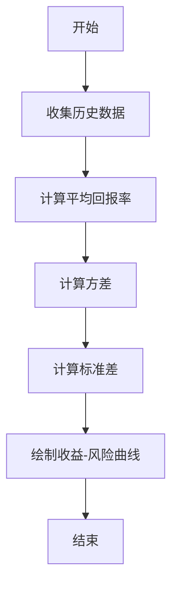
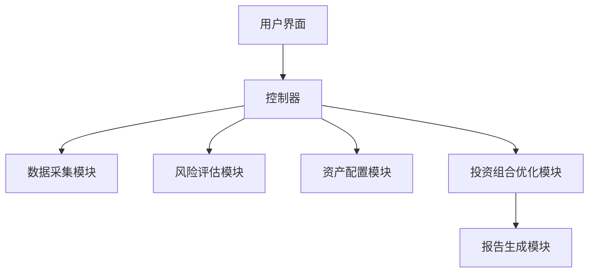
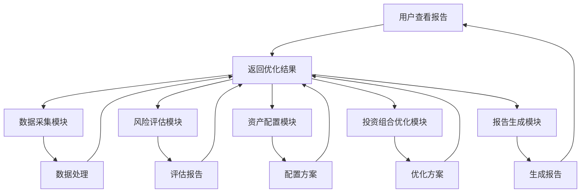

                 

<think>
好的，我现在需要帮助用户撰写一篇关于防御性投资策略的技术博客文章。用户希望我以《防御性投资策略：在不确定时期保护资本》为标题，结构清晰，逻辑严谨，并包含多个章节，每个章节下有详细的小节和内容。

首先，我应该理解防御性投资的基本概念。防御性投资是一种旨在在市场波动中保护资本的投资策略，强调风险管理和资产保护。这与进攻性投资不同，后者追求高收益，但风险较高。我需要解释防御性投资的核心概念，包括其定义、特点、与其他策略的区别，以及其在不同市场环境下的适用性。

接下来，我需要讨论防御性投资的数学模型和算法。这部分可能涉及风险评估模型，如VaR（Value at Risk）和CVaR（Conditional Value at Risk），以及资产配置优化的算法，如均值-方差优化和Markowitz有效前沿。我应该使用mermaid流程图和Python代码来展示这些模型和算法的应用。

然后，我需要设计一个防御性投资管理系统的架构。这部分包括系统功能模块划分、系统架构设计、接口设计和交互设计。使用mermaid类图、架构图和序列图来展示系统的各个部分及其关系。

接下来是项目实战部分，我需要选择一个实际案例，详细描述环境安装、代码实现、案例分析和结果解读。这将帮助读者理解如何在实际中应用防御性投资策略。

最后，我需要总结最佳实践，包括小结、注意事项和拓展阅读。这将为读者提供进一步学习和实践的方向。

在写作过程中，我需要确保每个部分都详细且易于理解，使用技术语言但避免过于复杂。同时，要遵守用户的格式要求，包括使用markdown、数学公式用latex表示，并在适当的地方插入mermaid图表和Python代码。

现在，我应该开始撰写每个章节的具体内容，确保每个小节都有足够的细节和深度，帮助读者全面理解防御性投资策略。

在撰写过程中，我可能会遇到一些挑战，比如如何将复杂的数学模型用简单的语言解释清楚，或者如何设计一个实用的防御性投资管理系统。为了解决这些问题，我可能需要查阅相关文献，寻找合适的案例，并确保每个部分都逻辑清晰，结构合理。

总的来说，我需要一步步地构建文章内容，确保每个部分都符合用户的要求，同时保持整体结构的完整性和逻辑性。
</think>

# 防御性投资策略：在不确定时期保护资本

> 关键词：防御性投资，风险管理，资产配置，资本保护，投资策略

> 摘要：防御性投资策略是一种以保护资本为核心目标的投资方法，尤其适用于市场不确定性较高的时期。本文将从防御性投资的基本原理、数学模型、系统架构设计、项目实战等多个方面，深入分析防御性投资的策略、方法和实现过程，帮助投资者在不确定的市场环境中保护和增值资本。

---

## 第1章 防御性投资策略概述

### 1.1 防御性投资的核心概念

#### 1.1.1 投资的基本原理
投资的本质是通过配置资金到不同资产或项目中，以实现资产的保值或增值。投资的核心目标是在风险可控的前提下，追求收益的最大化。

#### 1.1.2 防御性投资的定义与特点
防御性投资是一种以风险控制和资本保护为核心的投资策略。其特点包括：
1. **低风险偏好**：倾向于选择风险较低的资产，避免高波动性投资。
2. **稳定性优先**：注重资产的稳定性，追求长期稳健的回报。
3. **防御性资产配置**：通过分散投资和选择抗跌资产来降低风险。

#### 1.1.3 防御性投资与其他投资策略的区别
防御性投资与进攻性投资的主要区别在于风险承受能力和收益目标。防御性投资更注重本金安全，而进攻性投资则追求高收益，愿意承担更高的风险。

### 1.2 防御性投资的背景与现状

#### 1.2.1 当前经济环境的不确定性
近年来，全球经济波动加剧，地缘政治风险、通货膨胀和市场波动等不确定性因素增多，使得投资者更倾向于采取防御性投资策略。

#### 1.2.2 防御性投资的适用场景
防御性投资适用于市场低迷时期、经济衰退周期或高波动性市场环境。在这些情况下，防御性投资可以帮助投资者避免重大损失，保护资本。

#### 1.2.3 防御性投资与进攻性投资的对比
| 对比维度         | 防御性投资               | 进攻性投资               |
|------------------|--------------------------|--------------------------|
| 风险偏好         | 低风险                  | 高风险                  |
| 收益目标         | 稳定回报                | 高收益                  |
| 适用场景         | 不确定性较高的市场      | 稳定或上升的市场          |
| 投资策略         | 分散投资、选择抗跌资产   | 集中投资、选择高增长资产  |

---

## 第2章 防御性投资的核心原理

### 2.1 风险管理与资本保护

#### 2.1.1 风险的定义与分类
风险是投资活动中可能出现的损失或收益低于预期的可能性。常见的风险类型包括市场风险、流动性风险、信用风险和通胀风险。

#### 2.1.2 风险管理的基本原则
1. **分散投资**：通过将资金分配到不同资产类别或行业中降低风险。
2. **止损策略**：设定止损点，避免重大亏损。
3. **定期评估**：根据市场变化定期调整投资组合。

#### 2.1.3 资本保护的策略与方法
资本保护的核心是避免本金的损失。常见的资本保护方法包括：
1. **选择保守型资产**：如国债、黄金、房地产等。
2. **使用期权对冲**：通过购买期权来对冲市场波动风险。
3. **分散投资**：避免将资金集中在高风险资产上。

### 2.2 资产配置与分散投资

#### 2.2.1 资产配置的原理
资产配置是根据投资者的风险承受能力、收益目标和市场环境，将资金分配到不同资产类别（如股票、债券、现金等）的过程。

#### 2.2.2 分散投资的逻辑
通过将资金分散投资于不同的资产或行业，可以降低单一资产或行业波动带来的风险。

#### 2.2.3 防御性资产配置的典型案例
例如，在市场不确定性较高时，投资者可以将资产配置为：
- 40% 高评级债券
- 30% 现金或货币市场基金
- 20% 黄金或其他贵金属
- 10% 防御性股票（如公用事业、医疗等）

---

## 第3章 防御性投资的数学模型与算法

### 3.1 风险评估模型

#### 3.1.1 风险的度量方法
常用的风崄度量方法包括方差、标准差、VaR（Value at Risk）和CVaR（Conditional Value at Risk）。

#### 3.1.2 风险评估的数学公式
1. **方差公式**：
   $$ \sigma^2 = \frac{1}{n}\sum_{i=1}^{n}(x_i - \mu)^2 $$
   其中，$\mu$ 是资产的平均回报率，$\sigma^2$ 是方差。

2. **VaR公式**：
   VaR 是在给定置信水平下，可能的最大损失。例如，95%置信水平下，VaR 表示在95%的概率下，损失不会超过某个值。

#### 3.1.3 风险评估的算法流程图


### 3.2 资产配置优化算法

#### 3.2.1 均值-方差优化模型
均值-方差优化模型由Harry Markowitz提出，用于寻找风险最小化的同时实现收益最大化的资产配置。

#### 3.2.2 Markowitz有效前沿的原理
Markowitz有效前沿是一系列在给定风险下收益最高的资产组合，或者在给定收益下风险最低的资产组合。

#### 3.2.3 资产配置的Python代码实现
```python
import numpy as np
import pandas as pd
from scipy.optimize import minimize

# 假设我们有三个资产，其历史回报率为returns矩阵
def portfolio_variance(weights, returns):
    return np.dot(weights.T, np.dot(returns.cov(), weights))

# 定义优化目标函数
def min_variance_portfolio(returns):
    n = returns.shape[1]
    # 初始权重（等权）
    init_weights = np.array([1.0/n]*n)
    # 约束条件：权重之和为1
    constraints = {'type': 'eq', 'fun': lambda w: sum(w) - 1}
    # 最优化问题：最小化方差
    result = minimize(portfolio_variance, init_weights, args=(returns,), constraints=constraints)
    return result.x

# 示例代码：假设returns是一个包含各资产历史回报率的pandas DataFrame
# weights = min_variance_portfolio(returns)
```

---

## 第4章 防御性投资的系统架构设计

### 4.1 投资管理系统概述

#### 4.1.1 系统功能模块划分
1. 数据采集模块
2. 风险评估模块
3. 资产配置模块
4. 投资组合优化模块
5. 报告生成模块

#### 4.1.2 系统架构的层次结构


#### 4.1.3 系统交互流程图


---

## 第5章 防御性投资的项目实战

### 5.1 项目背景与目标

#### 5.1.1 项目需求分析
假设我们有一个100万元的资金，目标是在市场不确定性较高的环境下，实现资本的保值和小幅增值。

#### 5.1.2 项目目标设定
- 保护本金，避免重大损失。
- 追求年化收益率3%-5%。
- 定期评估和调整投资组合。

### 5.2 项目核心实现

#### 5.2.1 环境搭建与工具安装
- 安装Python、Pandas、NumPy、Scipy等工具。
- 数据源：使用历史市场数据，如股票指数、债券收益率等。

#### 5.2.2 风险评估模型的实现
- 使用历史数据计算各资产的方差和标准差。
- 通过VaR模型评估潜在损失。

#### 5.2.3 资产配置优化的代码实现
```python
import numpy as np
import pandas as pd
from scipy.optimize import minimize

def portfolio_variance(weights, returns):
    return np.dot(weights.T, np.dot(returns.cov(), weights))

def min_variance_portfolio(returns):
    n = returns.shape[1]
    init_weights = np.array([1.0/n]*n)
    constraints = [{'type': 'eq', 'fun': lambda w: sum(w) - 1}]
    result = minimize(portfolio_variance, init_weights, args=(returns,), constraints=constraints)
    return result.x

# 示例数据：假设returns是各资产的历史回报率
# optimized_weights = min_variance_portfolio(returns)
```

---

## 第6章 防御性投资的最佳实践

### 6.1 防御性投资的策略选择

#### 6.1.1 风险控制优先
在市场不确定性较高的时期，优先选择低风险资产，如债券、黄金等。

#### 6.1.2 定期调整投资组合
根据市场变化和风险评估结果，定期调整资产配置比例。

#### 6.1.3 使用对冲工具
通过期权、期货等工具对冲市场波动风险，降低整体投资组合的风险。

### 6.2 小结

防御性投资是一种在不确定市场环境中保护资本的有效策略。通过科学的资产配置、风险管理和定期调整，投资者可以在市场波动中实现资本的保值和小幅增值。

### 6.3 注意事项

- 防御性投资并非完全规避风险，而是通过科学的方法降低风险。
- 投资者需根据自身风险承受能力和收益目标，选择适合自己的投资策略。
- 定期评估和调整投资组合是防御性投资成功的关键。

### 6.4 拓展阅读

- 《投资学》（书籍）
- 《风险管理与VaR模型》（书籍）
- 《资产配置的艺术》（书籍）

---

作者：AI天才研究院/AI Genius Institute & 禅与计算机程序设计艺术 /Zen And The Art of Computer Programming

