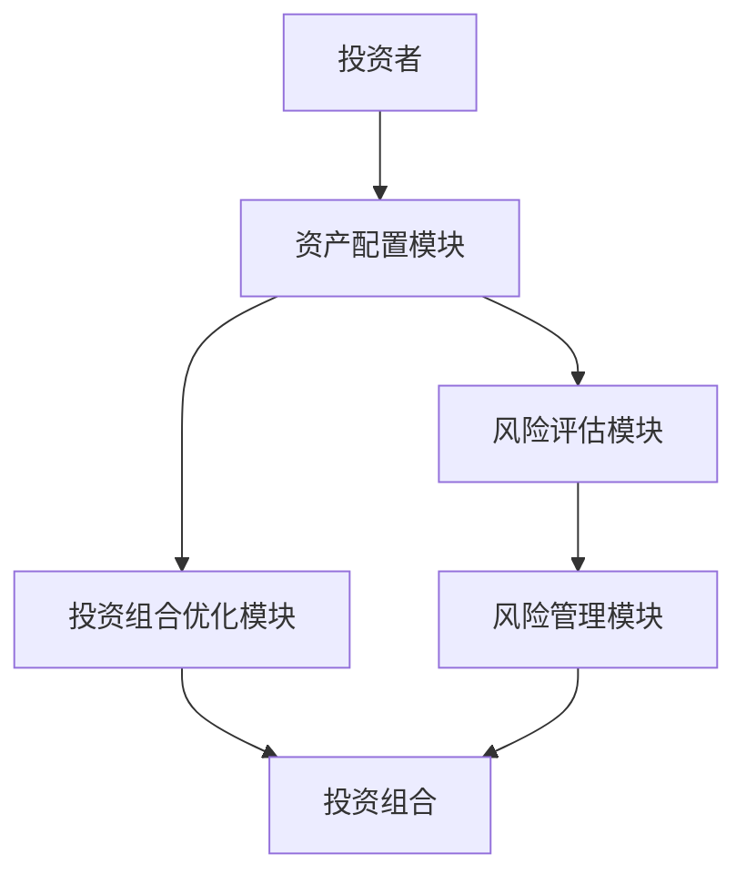
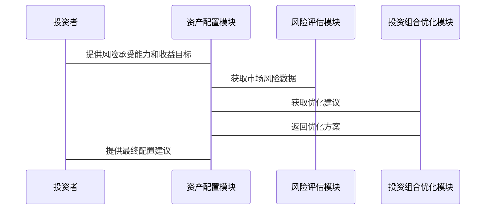

                 

<think>
好的，我现在需要帮助用户完成一个技术博客文章的撰写，标题是《防御性投资：在市场动荡中保护资本的策略》。用户已经提供了一个详细的大纲，我需要根据这个大纲逐步扩展内容，确保每个部分都详细、专业且符合技术博客的要求。

首先，我需要明确文章的结构。用户已经列出了目录大纲，我需要按照这个结构逐步填充内容。文章的开头应该包括关键词和摘要，然后是各个章节的具体内容。

在撰写每个部分时，我要确保语言逻辑清晰，结构紧凑，并且使用技术术语时要准确。同时，我需要嵌入数学公式和Mermaid图来增强内容的表现力。例如，在解释投资组合优化时，我会使用数学公式来展示期望收益和风险的计算方法。

接下来，我需要考虑每个章节的核心内容。例如，在“防御性投资的基本原理”部分，我需要详细解释价值投资、分散投资和风险控制策略，并提供实际案例来说明这些策略的应用。同时，我需要确保这些解释通俗易懂，让读者能够理解这些复杂的概念。

在“防御性投资的系统分析与架构设计”部分，我需要使用Mermaid图来展示系统的模块划分和交互流程。这将帮助读者更好地理解系统的组成部分及其如何协同工作。

在“项目实战”部分，我需要提供具体的代码示例，展示如何使用Python进行数据分析和投资组合优化。同时，我需要解释这些代码的功能，以及它们在防御性投资中的应用。

最后，在“总结与展望”部分，我需要回顾全文的主要观点，并对未来的发展趋势进行展望。同时，提供一些实用的建议，帮助读者更好地实施防御性投资策略。

在整个写作过程中，我要注意保持文章的连贯性和逻辑性，确保每个部分都紧密相连，形成一个完整的知识体系。同时，我需要避免使用过于复杂的术语，确保内容易于理解，吸引更多的读者。

现在，我将按照这个思路逐步撰写每个部分的内容，确保满足用户的所有要求，包括字数、格式和内容深度。完成后，我会检查文章的结构和内容，确保没有遗漏任何关键点，并且所有部分都符合用户的期望。
</think>

# 防御性投资：在市场动荡中保护资本的策略

> 关键词：防御性投资、市场动荡、资本保护、投资策略、风险管理、资产配置

> 摘要：防御性投资是一种旨在在市场波动中保护资本的策略，通过科学的资产配置、严格的风险管理和灵活的投资组合调整，实现资本的稳健增长。本文详细探讨防御性投资的核心概念、策略、系统设计及实战应用，为投资者提供一套在市场动荡中保护资本的有效方案。

---

## 第1章: 防御性投资的背景与概念

### 1.1 防御性投资的定义与核心要素

防御性投资是一种以保护资本、规避市场风险为核心目标的投资策略。与追求高收益的进攻性投资不同，防御性投资更注重稳健性和安全性，强调在市场波动中最大限度地降低损失，实现资本的保值与增值。

#### 核心要素：
1. **稳健性**：以本金安全为首要目标，注重长期稳健增长。
2. **风险控制**：通过分散投资、严格止损等手段降低投资风险。
3. **逆向思维**：在市场恐慌时寻找价值，避免盲目跟风。
4. **动态调整**：根据市场变化及时优化投资组合。

### 1.2 防御性投资的背景与重要性

近年来，全球经济不确定性加剧，地缘政治冲突、疫情冲击、通货膨胀等因素导致金融市场波动剧烈。在这种环境下，防御性投资的重要性日益凸显。

#### 重要性：
1. **降低波动性风险**：通过分散投资和资产配置，减少单一资产的价格波动对整体投资组合的影响。
2. **保护本金安全**：在市场低迷时期，防御性投资能够有效避免本金的重大损失。
3. **长期稳健收益**：通过价值投资和优质资产配置，实现资本的长期稳定增长。

---

## 第2章: 防御性投资的基本原理

### 2.1 防御性投资的核心策略

防御性投资的核心在于“防守反击”，通过科学的策略组合实现资本的稳健增长。

#### 2.1.1 价值投资策略

价值投资强调以低于内在价值的价格买入优质资产，长期持有，等待市场回归理性。其核心在于识别低估资产，注重安全边际。

#### 2.1.2 分散投资策略

通过将资金分散投资于不同资产类别、行业和地域，降低投资组合的整体风险。分散投资不是简单的资产分配，而是基于风险收益特征的最优配置。

#### 2.1.3 风险控制策略

通过设置止损、杠杆控制、流动性管理等手段，严格控制投资组合的最大回撤幅度，确保在极端市场条件下资本的安全。

### 2.2 防御性投资的数学模型

防御性投资的科学性体现在其严谨的数学模型构建上。通过量化分析，投资者可以更准确地评估风险与收益的平衡。

#### 2.2.1 投资组合的收益与风险模型

投资组合的期望收益可以通过以下公式计算：

$$ E(R_p) = \sum w_i E(R_i) $$

其中：
- $E(R_p)$ 表示投资组合的期望收益。
- $w_i$ 表示第 $i$ 个资产的权重。
- $E(R_i)$ 表示第 $i$ 个资产的期望收益。

投资组合的风险（波动性）则通过方差衡量：

$$ \sigma_p^2 = \sum \sum w_i w_j \sigma_{i,j} $$

其中：
- $\sigma_p$ 表示投资组合的波动性。
- $\sigma_{i,j}$ 表示第 $i$ 个资产和第 $j$ 个资产之间的协方差。

#### 2.2.2 风险调整后的收益模型

夏普比率（Sharpe Ratio）用于衡量投资组合在承担额外风险后的超额收益：

$$ \text{夏普比率} = \frac{E(R_p) - R_f}{\sigma_p} $$

其中：
- $R_f$ 表示无风险利率。

### 2.3 防御性投资的资产配置

#### 2.3.1 资产配置的基本原理

资产配置是防御性投资的核心，通过将资金分配到不同类别资产中，降低整体投资组合的波动性。

#### 2.3.2 不同资产类别在防御性投资中的作用

- **债券**：提供稳定的利息收入，降低投资组合的整体波动性。
- **黄金**：作为避险资产，能够在市场恐慌时对冲通货膨胀风险。
- **股票**：选择优质蓝筹股，注重股息收益和估值合理性。

---

## 第3章: 防御性投资的策略与技巧

### 3.1 逆向投资策略

#### 3.1.1 逆向投资的定义与特点

逆向投资是指在市场恐慌时买入，在市场疯狂时卖出。其核心在于“买别人恐慌，卖别人贪婪”。

#### 3.1.2 逆向投资的实施步骤

1. **识别市场情绪**：通过市场估值指标（如市盈率、市净率）判断市场是否处于恐慌或贪婪状态。
2. **寻找低估资产**：在市场恐慌时，寻找基本面良好但价格被低估的资产。
3. **逐步建仓**：分批次买入，避免一次性投入的风险。

### 3.2 风险管理策略

#### 3.2.1 风险的定义与分类

风险是投资回报的不确定性。常见的风险类型包括市场风险、流动性风险、信用风险和操作风险。

#### 3.2.2 风险的量化与评估

使用VaR（Value at Risk）模型量化投资组合在给定置信水平下的最大潜在损失。

$$ \text{VaR} = \text{损失的金额} $$

#### 3.2.3 风险控制的具体措施

1. **设置止损**：为每个头寸设定最大回撤幅度，一旦触发立即平仓。
2. **杠杆控制**：避免过度杠杆，保持合理的融资比例。
3. **流动性管理**：确保在需要时能够迅速变现资产，避免流动性危机。

### 3.3 定位与分散策略

#### 3.3.1 投资组合的定位

根据自身的风险承受能力和收益目标，确定投资组合的定位。

#### 3.3.2 资产分散的原理与方法

通过分散投资于不同资产类别、行业和地域，降低特定风险。

#### 3.3.3 跨资产类别分散的实际应用

例如，在股票、债券、黄金和房地产等不同资产之间分散投资，降低整体投资组合的波动性。

---

## 第4章: 防御性投资的系统分析与架构设计

### 4.1 防御性投资系统的总体架构

防御性投资系统是一个复杂的决策支持系统，包含多个功能模块。

#### 4.1.1 系统模块划分

- 资产配置模块
- 风险评估模块
- 投资组合优化模块

#### 4.1.2 系统功能概述

系统能够根据市场环境和投资者需求，自动优化投资组合，实时监控风险。

#### 4.1.3 系统架构图



### 4.2 防御性投资系统的功能设计

#### 4.2.1 资产配置模块

资产配置模块负责根据市场环境和投资者需求，推荐最优的资产配置方案。

#### 4.2.2 风险评估模块

风险评估模块使用VaR模型等工具，量化投资组合的风险。

#### 4.2.3 投资组合优化模块

优化模块基于数学模型，调整投资组合的权重，实现风险收益的最优平衡。

### 4.3 系统接口与交互设计

#### 4.3.1 系统接口定义

- 获取市场数据接口
- 计算风险收益比接口
- 优化投资组合接口

#### 4.3.2 系统交互流程



---

## 第5章: 防御性投资的项目实战

### 5.1 环境安装与工具准备

#### 5.1.1 数据分析工具安装

安装Python、Pandas、Matplotlib等工具，用于数据处理和可视化。

#### 5.1.2 开发环境配置

配置Jupyter Notebook或VS Code等开发环境，安装必要的库和插件。

### 5.2 核心算法实现

#### 5.2.1 投资组合优化算法

使用Python编写投资组合优化代码，基于数学模型计算最优权重。

```python
import pandas as pd
import numpy as np

# 示例数据：资产的预期收益和协方差矩阵
returns = pd.DataFrame({
    '资产1': [0.05, 0.06, 0.04],
    '资产2': [0.06, 0.05, 0.07],
    '资产3': [0.04, 0.07, 0.06]
})

covariance_matrix = returns.cov()

# 使用拉格朗日乘数法求解最优权重
def optimize_weights(covariance_matrix, returns, target_return):
    n = covariance_matrix.shape[0]
    ones = np.array([1]*n)
    covariance_inverse = np.linalg.inv(covariance_matrix)
    numerator = covariance_inverse.dot(ones)
    denominator = ones.T.dot(covariance_inverse).dot(ones)
    weights = numerator / denominator
    return weights

weights = optimize_weights(covariance_matrix, returns, target_return=0.06)
print("最优权重:", weights)
```

#### 5.2.2 风险评估算法

使用VaR模型计算投资组合的风险。

### 5.3 实际案例分析

#### 5.3.1 案例背景介绍

假设在2022年全球股市大跌的背景下，如何通过防御性投资策略保护资本。

#### 5.3.2 数据分析与处理

使用历史数据计算不同资产类别的风险收益比。

#### 5.3.3 投资策略实施与结果分析

通过分散投资于债券、黄金和优质股票，实现投资组合的稳健增长。

---

## 第6章: 防御性投资的总结与展望

### 6.1 总结

防御性投资是一种科学且实用的投资策略，通过稳健的资产配置和严格的风险管理，在市场波动中保护资本。投资者需要根据自身的风险承受能力和收益目标，灵活调整投资组合，实现长期稳健的财富增长。

### 6.2 展望

随着金融市场的发展和量化工具的进步，防御性投资将更加精确和高效。未来，投资者可以利用更多的数据和技术手段，进一步优化投资策略，提升风险管理能力。

---

作者：AI天才研究院/AI Genius Institute & 禅与计算机程序设计艺术 /Zen And The Art of Computer Programming

