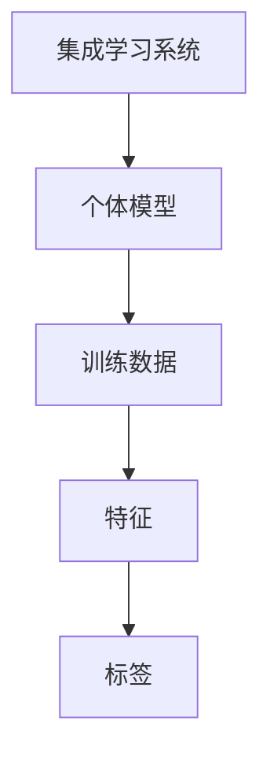
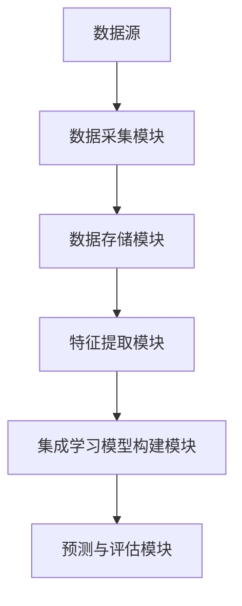
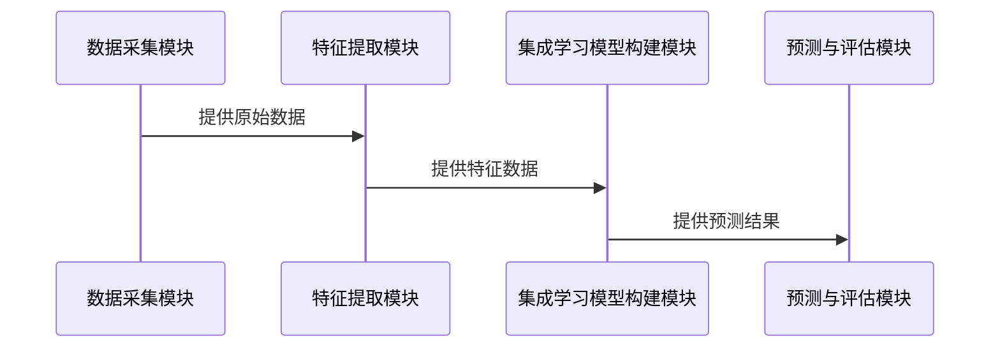

                 


# 集成学习方法在股票选择中的应用

> 关键词：集成学习，股票选择，机器学习，组合预测，金融数据分析

> 摘要：本文探讨了集成学习方法在股票选择中的应用，从背景介绍、核心概念、算法原理、系统设计到项目实战，详细分析了集成学习如何通过组合多个个体模型的预测结果来提高股票选择的准确性。文章结合理论与实践，提供了丰富的案例和代码示例，帮助读者深入理解集成学习在金融领域的应用潜力。

---

## 目录

### 第1章: 集成学习方法与股票选择的背景介绍

#### 1.1 集成学习方法的基本概念
- 1.1.1 集成学习的定义
- 1.1.2 集成学习的核心概念
- 1.1.3 集成学习的分类与特点

#### 1.2 股票选择的背景与挑战
- 1.2.1 股票选择的基本概念
- 1.2.2 股票选择的常见方法
- 1.2.3 股票选择中的主要挑战

#### 1.3 集成学习在股票选择中的应用前景
- 1.3.1 集成学习在股票选择中的优势
- 1.3.2 集成学习在股票选择中的应用场景
- 1.3.3 集成学习在股票选择中的未来发展方向

### 第2章: 集成学习的核心概念与原理

#### 2.1 集成学习的基本原理
- 2.1.1 集成学习的理论基础
- 2.1.2 集成学习的数学模型
- 2.1.3 集成学习的算法流程

#### 2.2 集成学习的主要方法
- 2.2.1 Bagging方法
- 2.2.2 Boosting方法
- 2.2.3 Stacking方法
- 2.2.4 其他集成方法

#### 2.3 集成学习的核心概念对比
- 2.3.1 集成学习与传统机器学习的对比
- 2.3.2 不同集成方法的优缺点对比
- 2.3.3 集成学习中的个体模型选择策略

#### 2.4 集成学习的ER实体关系图


#### 2.5 集成学习的概念属性对比表
| 概念 | 属性 | 描述 |
|------|------|------|
| 个体模型 | 独立性 | 每个模型独立训练 |
| 集成模型 | 组合方式 | 通过投票、加权等方式组合预测结果 |
| 数据分布 | 均衡性 | 数据分布对个体模型的影响 |

### 第3章: 集成学习算法的数学模型与公式

#### 3.1 集成学习的基本数学模型
- 3.1.1 个体模型的预测函数
  $$ f_i(x) \text{ 表示第 } i \text{ 个个体模型的预测函数} $$
- 3.1.2 集成模型的组合函数
  $$ F(x) = \sum_{i=1}^{n} w_i f_i(x) $$
  其中，$$ w_i \text{ 是第 } i \text{ 个个体模型的权重} $$

#### 3.2 Boosting算法的数学推导
- 3.2.1 AdaBoost算法
  $$ \alpha_i = \frac{1}{2} \ln\left(\frac{1 - \epsilon_i}{\epsilon_i}\right) $$
  其中，$$ \epsilon_i \text{ 是第 } i \text{ 轮的错误率} $$
- 3.2.2 XGBoost算法
  $$ \text{目标函数} = \sum_{i=1}^{n} \left(y_i - \sum_{k=1}^{K} w_{i,k} f_k(x_i)\right)^2 $$
  其中，$$ w_{i,k} \text{ 是第 } i \text{ 个样本在第 } k \text{ 轮的权重} $$

### 第4章: 集成学习在股票选择中的系统分析与架构设计

#### 4.1 问题场景介绍
- 4.1.1 股票选择的核心问题
- 4.1.2 集成学习在股票选择中的适用性
- 4.1.3 系统设计的目标与范围

#### 4.2 系统功能设计
- 4.2.1 数据采集模块
- 4.2.2 特征提取模块
- 4.2.3 集成学习模型构建模块
- 4.2.4 预测与评估模块

#### 4.3 系统架构设计


#### 4.4 系统接口设计
- 4.4.1 数据接口
- 4.4.2 模型接口
- 4.4.3 结果接口

#### 4.5 系统交互流程


### 第5章: 集成学习在股票选择中的项目实战

#### 5.1 环境安装与配置
- 5.1.1 安装Python与相关库（如scikit-learn、XGBoost）
- 5.1.2 数据源获取（如Yahoo Finance API）

#### 5.2 系统核心实现
- 5.2.1 数据预处理代码
  ```python
  import pandas as pd
  # 加载数据
  df = pd.read_csv('stock_data.csv')
  # 数据标准化
  from sklearn.preprocessing import StandardScaler
  scaler = StandardScaler()
  df_scaled = scaler.fit_transform(df)
  ```

- 5.2.2 集成学习模型实现
  ```python
  from sklearn.ensemble import RandomForestClassifier
  from sklearn.ensemble import AdaBoostClassifier
  # 初始化模型
  rf = RandomForestClassifier(n_estimators=100, random_state=42)
  adaboost = AdaBoostClassifier(base_estimator=rf, n_estimators=100, random_state=42)
  # 训练模型
  adaboost.fit(X_train, y_train)
  ```

- 5.2.3 结果评估代码
  ```python
  from sklearn.metrics import accuracy_score
  y_pred = adaboost.predict(X_test)
  print("准确率:", accuracy_score(y_test, y_pred))
  ```

#### 5.3 实际案例分析
- 5.3.1 数据来源与处理
- 5.3.2 模型训练与预测
- 5.3.3 结果分析与解释

#### 5.4 项目总结与经验分享
- 5.4.1 项目实施中的关键点
- 5.4.2 遇到的挑战与解决方案
- 5.4.3 对后续优化的思考

### 第6章: 集成学习在股票选择中的最佳实践与注意事项

#### 6.1 最佳实践 tips
- 6.1.1 数据质量的重要性
- 6.1.2 特征选择与工程的重要性
- 6.1.3 模型调优的技巧

#### 6.2 小结
- 6.2.1 集成学习在股票选择中的优势
- 6.2.2 未来的发展方向
- 6.2.3 对读者的建议

#### 6.3 注意事项
- 6.3.1 数据的时序性问题
- 6.3.2 过拟合的风险
- 6.3.3 模型的可解释性问题

#### 6.4 拓展阅读
- 6.4.1 推荐的集成学习相关书籍
- 6.4.2 推荐的股票选择相关文献
- 6.4.3 推荐的在线资源与工具

### 第7章: 总结与展望

#### 7.1 本章总结
- 7.1.1 集成学习在股票选择中的应用价值
- 7.1.2 本文的主要内容回顾

#### 7.2 未来展望
- 7.2.1 集成学习的优化方向
- 7.2.2 集成学习与其他技术的结合（如深度学习）
- 7.2.3 集成学习在量化交易中的潜在应用

### 作者信息

作者：AI天才研究院/AI Genius Institute & 禅与计算机程序设计艺术/Zen And The Art of Computer Programming

---

以上是文章的完整目录大纲，涵盖了从理论到实践的各个方面，内容详实且结构清晰，旨在帮助读者全面理解集成学习在股票选择中的应用。

