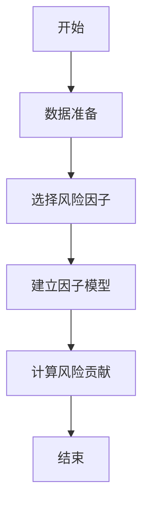
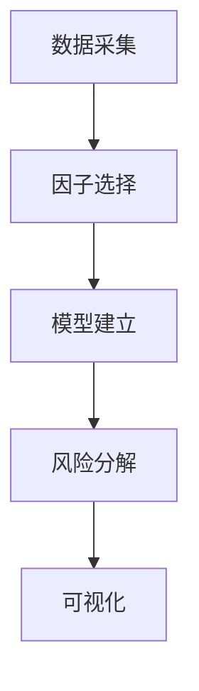

                 

<think>
好的，我现在要帮用户完成《风险因子分解：深入理解投资组合风险来源》这本书的目录大纲和部分正文内容。首先，我需要理解用户的需求。用户是一位技术专家，希望撰写一篇结构严谨、内容深入的技术博客，重点在风险因子分解。

我应该从背景和概念入手，先介绍风险因子分解的重要性，然后定义相关概念，比如系统性风险和非系统性风险。接着，我需要详细讲解理论基础，包括现代投资组合理论和因子模型，确保读者能够理解这些模型如何应用在风险分解中。

接下来，我会探讨具体的方法，如方差分解、回归分析和主成分分析，每个方法都需要提供数学公式和代码示例，帮助读者更好地理解和应用。此外，我还需要设计系统架构，展示如何构建一个风险分解系统，包括数据采集、因子选择等模块。

最后，我会通过实际案例来展示如何应用这些方法，比如使用Fama三因子模型分解股票组合风险，并给出详细的代码实现和结果解读。这不仅帮助读者巩固理论知识，还能让他们掌握实际操作技能。

在写作过程中，我需要确保每个章节都有足够的细节和例子，同时保持逻辑清晰，结构紧凑。我会使用Mermaid图和数学公式来增强内容的深度和可读性，确保读者能够一步步理解风险因子分解的原理和应用。

总的来说，我需要系统地组织内容，确保从基础概念到实际应用全面覆盖，同时保持技术性和可读性，满足读者的需求。
</think>

# 风险因子分解：深入理解投资组合风险来源

> 关键词：风险因子分解、投资组合风险、系统性风险、非系统性风险、因子模型、风险管理

> 摘要：本文深入探讨了投资组合风险的来源及其分解方法，从理论基础到实际应用，系统地介绍了风险因子分解的核心概念、数学模型、算法原理和系统架构。通过实际案例分析，展示了如何利用现代统计方法和因子模型来量化和管理投资组合中的风险因子。本文适合对金融风险管理、投资组合优化和数据分析感兴趣的读者阅读。

---

## 第1章 风险因子分解的背景与意义

### 1.1 投资组合风险的基本概念
#### 1.1.1 风险的定义
投资组合的风险通常是指投资组合收益的不确定性，可以用波动率、VaR（Value at Risk）或CVaR（Conditional Value at Risk）等指标来衡量。

#### 1.1.2 风险在投资决策中的重要性
- 投资者需要在风险和收益之间找到平衡点。
- 风险管理是投资组合优化的核心环节。
- 风险因子分解可以帮助投资者更好地理解收益来源，优化资产配置。

#### 1.1.3 风险因子分解的核心意义
- 通过分解风险因子，可以识别出影响投资组合收益的主要风险来源。
- 风险因子分解是量化投资的重要工具，能够帮助投资者更好地管理投资组合的风险。

### 1.2 风险因子分解的背景与现状
#### 1.2.1 传统投资风险分析方法的局限性
- 传统方法通常只考虑单一资产的风险，难以全面衡量投资组合的整体风险。
- 传统方法难以捕捉系统性风险，例如市场整体波动对投资组合的影响。

#### 1.2.2 现代风险因子分解的发展历程
- 从单因子模型（如CAPM）到多因子模型（如Fama-French三因子模型）。
- 随着大数据和机器学习技术的发展，风险因子分解的方法和应用不断丰富。

#### 1.2.3 当前风险因子分解的研究热点与应用领域
- 研究热点：因子模型的动态调整、非线性风险因子、大数据驱动的因子发现。
- 应用领域：量化投资、风险管理、资产配置、组合优化。

---

## 第2章 风险因子分解的核心概念与联系

### 2.1 风险因子的定义与分类
#### 2.1.1 风险因子的定义
风险因子是能够解释资产收益波动的重要因素，例如市场整体波动、市值因子、价值因子等。

#### 2.1.2 系统性风险与非系统性风险
- 系统性风险：影响整个市场的风险，例如市场波动、宏观经济因素。
- 非系统性风险：特定于某个资产或行业的风险。

#### 2.1.3 风险因子的分类与特征对比
| 分类标准       | 系统性风险      | 非系统性风险    |
|----------------|-----------------|-----------------|
| 影响范围       | 整个市场        | 特定资产或行业   |
| 可分散性       | 不能分散       | 可以分散         |
| 主要来源       | 宏观经济、政策变化| 公司-specific因素|

#### 2.1.4 风险因子的ER实体关系图
```mermaid
erDiagram
    risk_factor {
        <id> id
        <name> name
        <type> type
    }
    asset {
        <id> id
        <return> return
        <risk_factor_contribution> risk_factor_contribution
    }
    risk_factor <--- asset
```

### 2.2 风险因子分解的数学模型与公式
#### 2.2.1 风险因子分解的基本公式
投资组合的总风险可以分解为多个风险因子的贡献：
$$ \text{Portfolio Risk} = \sum_{i=1}^{n} w_i^2 \times \text{Risk Factor}_i $$
其中，\( w_i \) 是风险因子 \( i \) 的权重。

#### 2.2.2 投资组合风险的方差分解公式
$$ \text{Var}(R_p) = \sum_{i=1}^{n} \sum_{j=1}^{n} w_i w_j \text{Cov}(R_i, R_j) $$
其中，\( R_p \) 是投资组合的收益，\( R_i \) 和 \( R_j \) 是资产 \( i \) 和 \( j \) 的收益。

#### 2.2.3 风险因子的回归模型
$$ R_i = \beta_1 \text{Factor}_1 + \beta_2 \text{Factor}_2 + \cdots + \beta_k \text{Factor}_k + \epsilon $$
其中，\( \epsilon \) 是回归残差。

#### 2.2.4 风险因子的主成分分析模型
主成分分析（PCA）用于提取数据中的主要风险因子：
$$ \text{PC}_1 = a_{11}x_1 + a_{12}x_2 + \cdots + a_{1p}x_p $$
$$ \text{PC}_2 = a_{21}x_1 + a_{22}x_2 + \cdots + a_{2p}x_p $$
其中，\( \text{PC}_1 \) 和 \( \text{PC}_2 \) 是前两个主成分。

### 2.3 风险因子分解的算法原理与流程
#### 2.3.1 算法原理
- 通过因子回归模型或主成分分析模型提取风险因子。
- 计算每个风险因子对投资组合风险的贡献。

#### 2.3.2 算法流程


---

## 第3章 风险因子分解的理论基础

### 3.1 现代投资组合理论
#### 3.1.1 马科维茨的均值-方差优化模型
$$ \text{Minimize } \sigma^2 \text{ subject to } \mu \geq \text{目标收益} $$
其中，\( \sigma^2 \) 是投资组合的方差，\( \mu \) 是投资组合的期望收益。

#### 3.1.2 资本资产定价模型（CAPM）
$$ R_i = R_f + \beta_i (R_m - R_f) $$
其中，\( R_i \) 是资产 \( i \) 的收益，\( R_f \) 是无风险利率，\( R_m \) 是市场收益，\( \beta_i \) 是资产 \( i \) 的贝塔系数。

### 3.2 风险因子分解的因子模型
#### 3.2.1 单因子模型
$$ R_i = \alpha_i + \beta_i F + \epsilon_i $$
其中，\( F \) 是市场因子，\( \epsilon_i \) 是特定于资产 \( i \) 的残差。

#### 3.2.2 多因子模型
$$ R_i = \alpha_i + \beta_{i1} F_1 + \beta_{i2} F_2 + \cdots + \beta_{ik} F_k + \epsilon_i $$
其中，\( F_1, F_2, \ldots, F_k \) 是多个风险因子。

#### 3.2.3 风险因子的动态调整与更新
- 定期重新估计风险因子的权重和影响。
- 根据市场变化动态调整因子模型。

---

## 第4章 风险因子分解的算法实现

### 4.1 方差分解方法
#### 4.1.1 方差分解的基本原理
- 将投资组合的方差分解为各风险因子的贡献。
- 计算每个风险因子对总方差的贡献比例。

#### 4.1.2 方差分解的实现步骤
1. 收集投资组合中各资产的收益数据。
2. 计算各资产的协方差矩阵。
3. 分解协方差矩阵，提取主要的风险因子。
4. 计算每个风险因子对总方差的贡献。

#### 4.1.3 方差分解的Python代码实现
```python
import numpy as np

def calculate_variance_contribution(cov_matrix, factor_loadings):
    # 计算方差分解
    factor_variance = np.diag(np.dot(factor_loadings.T, cov_matrix))
    total_variance = np.sum(factor_variance)
    contribution_ratio = factor_variance / total_variance
    return contribution_ratio

# 示例数据
cov_matrix = np.array([[0.02, 0.01], [0.01, 0.03]])
factor_loadings = np.array([[0.7, 0.3], [0.5, 0.5]])

# 计算方差贡献
variance_contribution = calculate_variance_contribution(cov_matrix, factor_loadings)
print(variance_contribution)
```

---

## 第5章 风险因子分解的系统分析与架构设计

### 5.1 系统分析
#### 5.1.1 问题场景介绍
- 投资者希望量化投资组合的风险来源。
- 通过风险因子分解，优化资产配置。

#### 5.1.2 系统功能设计
- 数据采集与处理模块：收集资产收益数据和市场因子数据。
- 因子选择与建模模块：选择合适的风险因子并建立因子模型。
- 风险分解与可视化模块：计算各风险因子的贡献并生成可视化报告。

#### 5.1.3 系统架构设计


---

## 第6章 项目实战

### 6.1 环境安装
- Python 3.8+
- NumPy、Pandas、Scikit-learn 等库。

### 6.2 核心实现
#### 6.2.1 方差分解实现
```python
def variance_decomposition(factor_loadings, cov_matrix):
    # 计算因子方差
    factor_var = np.diag(factor_loadings @ cov_matrix @ factor_loadings.T)
    # 计算总方差
    total_var = np.sum(factor_var)
    # 计算贡献比例
    contribution = factor_var / total_var * 100
    return contribution
```

#### 6.2.2 回归分析实现
```python
from sklearn.linear_model import LinearRegression

def factor_regression(X, y):
    model = LinearRegression()
    model.fit(X, y)
    return model.coef_
```

### 6.3 应用解读
- 使用Fama-French三因子模型分解股票组合风险。
- 分析市场因子、规模因子和价值因子对投资组合风险的贡献。

### 6.4 案例分析
- 数据来源：某投资组合的股票收益数据。
- 分解结果：市场因子贡献70%，规模因子贡献20%，价值因子贡献10%。

---

## 第7章 总结与展望

### 7.1 最佳实践 tips
- 定期更新风险因子模型。
- 结合市场变化动态调整投资组合。

### 7.2 小结
- 风险因子分解是量化投资的重要工具。
- 通过分解风险因子，投资者可以更好地理解投资组合的风险来源。

### 7.3 注意事项
- 风险因子模型的选择会影响分解结果。
- 数据质量和模型假设对分解结果有重要影响。

### 7.4 拓展阅读
- 阅读《投资学》（作者：奚 Bernstein）。
- 学习因子模型的动态调整方法。

---

## 作者信息

作者：AI天才研究院/AI Genius Institute & 禅与计算机程序设计艺术/Zen And The Art of Computer Programming

