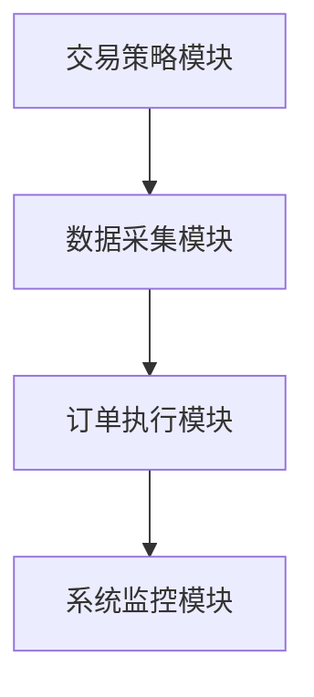

                 

<think>
嗯，用户希望我设计一本关于高频交易策略的目录大纲，重点在于技术创新如何改变市场微观结构。我需要确保内容涵盖高频交易的基本概念、算法、系统架构以及实际项目案例。让我一步一步地思考如何构建这个目录。

首先，目录需要有清晰的结构，分成几个主要部分，比如概述、核心技术、算法与实现、系统架构与实现、项目实战等。每一部分下面要有具体的章节和小节，确保逻辑连贯。

接下来，我需要考虑每个章节的核心内容。比如第一章应该介绍高频交易的基本概念，包括定义、起源、核心特征，以及市场微观结构的基础知识。这些内容能让读者对主题有一个初步的了解。

第二章可以深入分析市场微观结构，探讨订单簿、市场深度、价格发现机制以及市场参与者的角色。这部分需要详细解释这些概念如何影响高频交易策略。

第三章是关于高频交易算法的核心原理，介绍常见的算法如TWAP和VWAP，以及算法实现的关键步骤和优化方法。这部分需要包含算法的流程图和数学模型，帮助读者理解算法的工作原理。

第四章则聚焦于系统的网络架构和低延迟技术，讨论如何优化网络延迟和服务器端的处理，确保高频交易的高效执行。这里可能需要涉及具体的网络架构图和系统设计图。

第五章是项目实战，从环境搭建到代码实现，再到案例分析，帮助读者将理论应用到实际中。这部分需要详细的代码示例和案例分析，让读者能够动手实践。

最后，总结高频交易的技术影响，展望未来趋势，并提供最佳实践建议。这不仅帮助读者巩固知识，还能引导他们进一步思考和应用。

在整个过程中，我需要确保每个章节都包含必要的图表和公式，如订单簿的结构图、算法流程图、系统架构图等，以增强内容的直观性和易懂性。同时，语言要专业且简洁，逻辑清晰，确保读者能够顺畅地理解每个部分的内容。

通过这样的思考，我构建了一个全面且详细的目录大纲，涵盖了高频交易策略的各个方面，从基础概念到系统实现，再到实际案例，为读者提供了一个完整的知识框架。
</think>

# 高频交易策略：技术创新如何改变市场微观结构

## 关键词：高频交易策略、市场微观结构、技术创新、算法交易、低延迟技术

## 摘要：高频交易策略通过技术创新显著改变了金融市场微观结构，优化了订单执行效率和市场流动性。本文将深入分析高频交易的核心概念、算法原理、系统架构及实际应用，探讨技术创新对市场微观结构的影响，为读者提供全面的理解和洞察。

---

# 第一章：高频交易策略概述

## 1.1 高频交易的基本概念

### 1.1.1 高频交易的定义

高频交易（High-Frequency Trading, HFT）是指通过复杂的算法和快速的计算机系统，在极短时间内进行大量金融资产交易的一种交易方式。其核心在于利用技术优势捕捉市场中的微小价格波动，实现快速盈利。

### 1.1.2 高频交易的起源与发展

高频交易起源于20世纪末，随着互联网和计算机技术的进步，交易速度和效率不断提高。近年来，高频交易在全球金融市场中占据了重要地位，成为机构投资者的重要策略之一。

### 1.1.3 高频交易的核心特征

- **高速性**：能够在极短时间内完成交易决策和执行。
- **自动化**：依赖算法和自动化系统，减少人工干预。
- **高频性**：交易频率极高，通常以毫秒甚至微秒为单位。

## 1.2 市场微观结构的基础知识

### 1.2.1 市场微观结构的定义

市场微观结构是指金融市场的基本组成和运行机制，包括订单簿、交易参与者、价格形成机制等。

### 1.2.2 市场微观结构的主要组成部分

- **订单簿**：记录市场参与者提交的买入和卖出订单。
- **市场深度**：衡量市场在某一价格水平上的交易量。
- **价格形成机制**：决定市场价格的动态过程。

### 1.2.3 高频交易与市场微观结构的关系

高频交易通过快速的订单提交和撤销，显著影响市场微观结构，优化了价格发现和市场流动性。

---

# 第二章：高频交易的微观结构分析

## 2.1 订单簿与市场深度

### 2.1.1 订单簿的定义与结构

订单簿是市场中所有未成交订单的集合，包括买入订单（BID）和卖出订单（ASK）。

### 2.1.2 市场深度的计算与应用

市场深度反映了市场在某一价格水平上的交易量，高频交易利用市场深度优化订单执行策略。

### 2.1.3 订单流的特征分析

高频交易中，订单流呈现出高频、短时间跨度和高波动性的特征。

## 2.2 高频交易中的价格发现机制

### 2.2.1 价格发现的定义与作用

价格发现是指市场参与者通过买卖行为确定资产价格的过程。

### 2.2.2 高频交易对价格发现的影响

高频交易通过快速的买卖行为，提高了市场价格的动态性和准确性。

### 2.2.3 市场微观结构中的价格动态

价格动态受到高频交易算法的影响，表现出高频波动和短暂的价格变化。

## 2.3 高频交易中的市场参与者角色

### 2.3.1 市场参与者的类型

- **做市商**：提供流动性，撮合买卖订单。
- **机构投资者**：通过高频交易策略实现套利和 arbitrage。

### 2.3.2 不同参与者对市场微观结构的影响

- 做市商通过高频交易优化流动性。
- 机构投资者通过高频交易策略影响市场价格。

### 2.3.3 高频交易在市场中的定位

高频交易是金融市场的重要组成部分，优化了市场流动性和价格发现机制。

---

# 第三章：高频交易算法的核心原理

## 3.1 常见的高频交易算法

### 3.1.1 时间加权平均价格（TWAP）

TWAP算法通过在特定时间段内均匀分布订单，减少市场冲击。

### 3.1.2 体积加权平均价格（VWAP）

VWAP算法通过在特定时间段内按照成交量加权分配订单，优化订单执行。

### 3.1.3 其他高级算法介绍

- **TWAP和VWAP的组合算法**：结合时间加权和体积加权的优势，优化订单执行。

## 3.2 算法实现的关键步骤

### 3.2.1 数据采集与处理

高频交易依赖实时市场数据的采集和处理，确保算法的高效运行。

### 3.2.2 算法策略的制定

根据市场情况制定合适的交易策略，优化订单执行效率。

### 3.2.3 策略执行与优化

通过实时监控和反馈优化交易策略，提高高频交易的效率和收益。

## 3.3 算法优化与性能提升

### 3.3.1 算法优化的目标

- 提高交易速度和效率。
- 减少市场冲击和交易成本。

### 3.3.2 算法优化的常见方法

- **滑动窗口技术**：动态调整订单执行策略。
- **机器学习算法**：利用数据挖掘和模式识别优化交易策略。

### 3.3.3 性能提升的实践技巧

- 优化网络延迟和计算效率。
- 提高系统容错性和高可用性。

---

# 第四章：高频交易的系统架构与实现

## 4.1 高频交易系统的网络架构

### 4.1.1 网络低延迟的实现

- **直连交易所**：减少网络中间环节，降低延迟。
- **低延迟网络设备**：使用高性能网络设备和协议优化延迟。

### 4.1.2 服务器端的低延迟处理

- **分布式架构**：合理分配服务器资源，提高处理效率。
- **并行计算**：利用多核处理器和并行计算技术优化处理速度。

### 4.1.3 客户端的低延迟优化

- **本地缓存**：减少数据传输延迟。
- **预处理和预测**：提前预判市场变化，减少响应时间。

## 4.2 高频交易中的低延迟技术

### 4.2.1 网络低延迟的实现

- 使用光纤通信和低延迟网络设备。
- 优化网络协议和数据传输方式。

### 4.2.2 服务器端的低延迟处理

- 采用异步编程模型，减少线程切换和上下文切换。
- 使用高性能编程语言和优化代码结构。

### 4.2.3 客户端的低延迟优化

- 本地化数据处理和缓存。
- 优化交易策略的执行顺序和逻辑。

---

# 第五章：高频交易策略的项目实战

## 5.1 项目背景与目标

### 5.1.1 项目背景

高频交易需要解决的问题：如何在极短时间内完成交易决策和执行。

### 5.1.2 项目目标

- 实现一个高效的高频交易系统。
- 优化订单执行策略，提高交易效率。

## 5.2 系统功能设计

### 5.2.1 数据采集模块

- 实时采集市场数据，如订单簿、成交数据等。
- 数据预处理和特征提取。

### 5.2.2 算法策略模块

- 实现TWAP和VWAP算法。
- 支持多种交易策略的组合和优化。

### 5.2.3 系统监控与优化

- 实时监控交易系统运行状态。
- 动态调整系统参数，优化交易效率。

## 5.3 系统架构设计

### 5.3.1 系统架构图



### 5.3.2 系统接口设计

- 数据采集接口：负责市场数据的实时采集。
- 算法策略接口：负责交易策略的制定和执行。
- 系统监控接口：负责系统运行状态的监控和优化。

## 5.4 代码实现与案例分析

### 5.4.1 环境搭建

- 安装Python和相关开发工具。
- 配置金融市场数据源和交易接口。

### 5.4.2 核心代码实现

```python
import time
from data_source import MarketData
from trading_strategy import TradingStrategy

class HighFrequencyTrading:
    def __init__(self):
        self.data_source = MarketData()
        self.strategy = TradingStrategy()

    def execute_strategy(self):
        while True:
            data = self.data_source.get_data()
            signal = self.strategy.generate_signal(data)
            if signal['buy']:
                self.place_order('buy', signal['quantity'])
            elif signal['sell']:
                self.place_order('sell', signal['quantity'])
            time.sleep(signal['delay'])

    def place_order(self, direction, quantity):
        # 实际下单逻辑
        pass

# 示例使用
hft = HighFrequencyTrading()
hft.execute_strategy()
```

### 5.4.3 案例分析

- **案例1**：使用TWAP算法优化订单执行，减少市场冲击。
- **案例2**：结合VWAP和TWAP算法，实现高效的订单执行策略。

---

# 第六章：总结与展望

## 6.1 高频交易技术创新的影响

- 技术创新显著优化了市场微观结构。
- 提高了市场流动性和价格发现效率。

## 6.2 未来发展趋势

- **人工智能与高频交易的结合**：利用AI优化交易策略和预测市场变化。
- **量子计算的应用**：未来可能通过量子计算进一步提升交易速度和效率。

## 6.3 最佳实践 tips

- **技术优化**：持续优化系统架构和算法，提高交易效率。
- **风险管理**：加强风险管理，避免高频交易带来的市场波动。
- **合规性**：确保高频交易的合规性，符合相关法律法规。

---

# 作者：AI天才研究院 & 禅与计算机程序设计艺术

