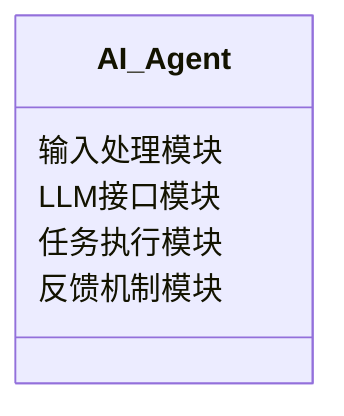
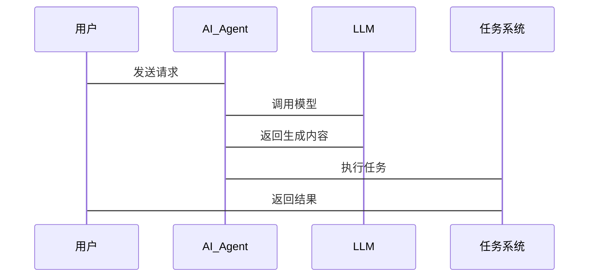

                 


# AI Agent 架构设计：基于 LLM 的智能助手系统构建

> **关键词**：AI Agent，LLM，大语言模型，智能助手，架构设计

> **摘要**：本文详细探讨了基于大语言模型（LLM）的AI Agent架构设计，从基本概念到算法原理，再到系统实现，全面解析如何构建一个高效、智能的AI助手系统。

---

## 第1章: AI Agent 与 LLM 的基本概念

### 1.1 AI Agent 的定义与特点

#### 1.1.1 什么是 AI Agent
AI Agent（人工智能代理）是一种智能实体，能够感知环境、执行任务并做出决策。它通过与用户的交互，理解需求并提供相应的服务，如信息检索、任务执行或建议生成。

#### 1.1.2 AI Agent 的核心特点
- **自主性**：AI Agent能够独立运作，无需外部干预。
- **反应性**：能够实时感知环境变化并做出响应。
- **目标导向**：基于目标驱动行为，优化决策过程。
- **可扩展性**：能够处理多种任务和复杂场景。

#### 1.1.3 AI Agent 的应用场景
AI Agent广泛应用于智能助手、聊天机器人、自动化系统等领域。例如，Siri、Alexa等智能助手都是基于AI Agent的应用实例。

### 1.2 大语言模型（LLM）的基本原理

#### 1.2.1 LLM 的定义与特点
LLM（Large Language Model）是基于深度学习的自然语言处理模型，能够理解和生成人类语言。其特点包括：
- **大规模训练**：使用海量数据进行预训练。
- **上下文理解**：能够捕捉语言中的上下文关系。
- **多任务能力**：适用于多种NLP任务，如翻译、问答、文本生成。

#### 1.2.2 LLM 的训练过程
LLM的训练通常采用Transformer架构，包括编码器和解码器。训练过程分为预训练和微调两个阶段，预训练使用大规模通用数据，微调针对特定任务进行优化。

#### 1.2.3 LLM 的优势与局限性
- **优势**：强大的语言理解和生成能力，可扩展性强。
- **局限性**：需要大量计算资源，可能产生不准确的结果。

### 1.3 AI Agent 与 LLM 的关系

#### 1.3.1 AI Agent 中的 LLM
LLM作为AI Agent的核心模块，负责处理自然语言输入并生成输出。AI Agent通过调用LLM API，将用户需求转化为具体操作。

#### 1.3.2 LLM 在 AI Agent 中的作用
LLM为AI Agent提供语言理解和生成能力，使其能够进行对话交互、信息检索和任务执行。

#### 1.3.3 LLM 与 AI Agent 的结合
AI Agent通过整合LLM，实现了从理解用户需求到执行任务的闭环流程。例如，用户输入“订机票去北京”，AI Agent通过LLM解析需求，调用机票预订系统完成任务。

### 1.4 本章小结
本章介绍了AI Agent和LLM的基本概念、特点及其在AI Agent中的作用，为后续章节的深入分析奠定了基础。

---

## 第2章: LLM 的数学模型与算法原理

### 2.1 LLM 的核心算法

#### 2.1.1 Transformer 模型
Transformer由编码器和解码器组成，通过自注意力机制捕捉输入中的长距离依赖关系。

```mermaid
graph LR
    Encoder -> Sublayer1 -> Sublayer2 -> Output
    Decoder -> Sublayer1 -> Sublayer2 -> Output
```

#### 2.1.2 注意力机制
注意力机制通过计算输入序列中每个词的重要性，生成加权后的表示。

公式：
$$
\text{Attention}(Q, K, V) = \text{softmax}\left(\frac{QK^T}{\sqrt{d_k}}\right)V
$$

其中，$Q$、$K$、$V$分别是查询、键和值矩阵，$d_k$是键的维度。

#### 2.1.3 解码器结构
解码器通过自注意力机制生成输出序列，逐步生成文本。

### 2.2 LLM 的训练过程

#### 2.2.1 损失函数
LLM使用交叉熵损失函数来衡量预测与真实值的差异。

公式：
$$
\text{Loss} = -\sum_{i=1}^{n} \text{log}(p(y_i|x))
$$

其中，$p(y_i|x)$是模型对第$i$个词的预测概率。

#### 2.2.2 优化算法
常用Adam优化器，结合学习率衰减策略优化模型参数。

#### 2.2.3 预训练任务
预训练任务包括Masked Language Modeling（遮蔽语言模型）和Next Sentence Prediction（下一句预测）。

### 2.3 LLM 的推理过程

#### 2.3.1 解码策略
常用贪心解码和随机采样两种策略，贪心解码速度快但可能缺乏创意，随机采样生成多样性结果。

#### 2.3.2 模型调参
根据具体任务调整模型参数，如调整温度（temperature）和重复惩罚（repetition penalty）等。

#### 2.3.3 模型评估
使用BLEU、ROUGE等指标评估生成文本的质量。

### 2.4 本章小结
本章深入分析了LLM的数学模型和训练推理过程，为后续AI Agent的实现提供了理论基础。

---

## 第3章: AI Agent 的架构设计

### 3.1 AI Agent 的核心组件

#### 3.1.1 输入处理模块
负责接收用户输入并进行预处理，如分词和意图识别。

#### 3.1.2 LLM 接口模块
与LLM进行交互，传递输入并接收生成结果。

#### 3.1.3 任务执行模块
根据生成的输出调用外部服务或系统，执行具体任务。

#### 3.1.4 反馈机制模块
收集用户反馈，优化模型和系统性能。

### 3.2 系统功能设计

#### 3.2.1 功能模块划分
将系统划分为输入处理、LLM调用、任务执行和反馈优化四大模块。



#### 3.2.2 功能流程设计
用户输入->输入处理->LLM调用->生成结果->任务执行->反馈优化。

### 3.3 系统架构设计

#### 3.3.1 分层架构
将系统分为表示层、业务逻辑层和数据访问层。


#### 3.3.2 微服务架构
采用微服务架构，各模块独立开发和部署，便于扩展和维护。

### 3.4 系统接口设计

#### 3.4.1 API 接口定义
使用RESTful API定义接口，如POST /api/v1/agent。

#### 3.4.2 接口调用流程
用户请求->API网关->服务调用->返回结果。

### 3.5 系统交互设计

#### 3.5.1 用户交互流程
用户输入->解析需求->生成回复->执行任务->反馈结果。



### 3.6 本章小结
本章详细探讨了AI Agent的系统架构设计，从功能模块到系统架构，再到接口和交互设计，为实际开发提供了指导。

---

## 第4章: 项目实战：基于 LLM 的 AI Agent 实现

### 4.1 环境安装

#### 4.1.1 安装 Python 和相关库
安装Python 3.8及以上版本，使用pip安装numpy、transformers等库。

```bash
pip install numpy transformers
```

#### 4.1.2 安装 LLM 模型
选择开源LLM模型，如GPT-2，使用Hugging Face提供的库进行加载。

```python
from transformers import AutoModelForCausalLM, AutoTokenizer

model_name = "gpt2"
tokenizer = AutoTokenizer.from_pretrained(model_name)
model = AutoModelForCausalLM.from_pretrained(model_name)
```

### 4.2 核心代码实现

#### 4.2.1 输入处理模块

```python
def preprocess_input(user_input):
    # 分词处理
    tokens = tokenizer.encode(user_input)
    return tokens
```

#### 4.2.2 LLM 接口模块

```python
def call_llm(tokens):
    # 生成回复
    outputs = model.generate(tokens, max_length=50)
    response = tokenizer.decode(outputs[0].tolist())
    return response
```

#### 4.2.3 任务执行模块

```python
def execute_task(response):
    # 示例任务：发送邮件
    print(f"正在执行任务：{response}")
    return "任务完成"
```

#### 4.2.4 反馈机制模块

```python
def feedback(user_id, response):
    # 收集用户反馈
    pass
```

### 4.3 案例分析与实现

#### 4.3.1 案例场景
用户输入“帮我预订明天北京的机票”。

#### 4.3.2 处理流程
1. 输入处理模块接收输入并分词。
2. LLM接口生成“建议您通过航空公司官网预订”。
3. 任务执行模块调用机票预订系统。
4. 返回结果并收集用户反馈。

### 4.4 本章小结
通过实际项目案例，展示了如何基于LLM构建AI Agent系统，从环境安装到代码实现，完整呈现了整个开发流程。

---

## 第5章: 最佳实践与总结

### 5.1 最佳实践 tips

#### 5.1.1 模型选择
根据具体任务选择合适的LLM模型，如较小的模型适合资源受限的场景。

#### 5.1.2 系统优化
通过缓存和并行处理优化系统性能，降低响应时间。

#### 5.1.3 安全性考虑
确保用户数据的安全性，防止信息泄露和滥用。

### 5.2 小结
本文从理论到实践，全面探讨了基于LLM的AI Agent架构设计，涵盖了模型原理、系统架构和项目实现等内容。

### 5.3 注意事项
在实际应用中，需注意模型的泛化能力、计算资源的分配以及系统的可扩展性。

### 5.4 拓展阅读
建议深入学习Transformer架构、微调LLM模型以及分布式系统设计的相关内容。

---

**作者：AI天才研究院/AI Genius Institute & 禅与计算机程序设计艺术 /Zen And The Art of Computer Programming**

---

这篇文章详细探讨了基于LLM的AI Agent架构设计，从基本概念到算法实现，再到系统设计和项目实战，为读者提供了全面的指导。通过理论与实践的结合，帮助读者理解并掌握构建智能助手系统的关键步骤和方法。

