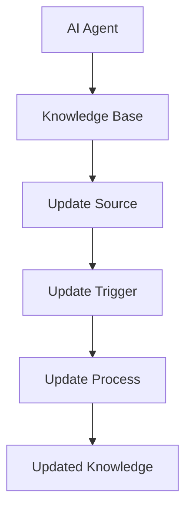
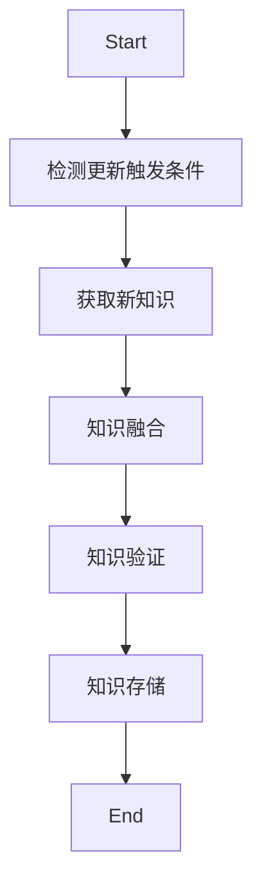
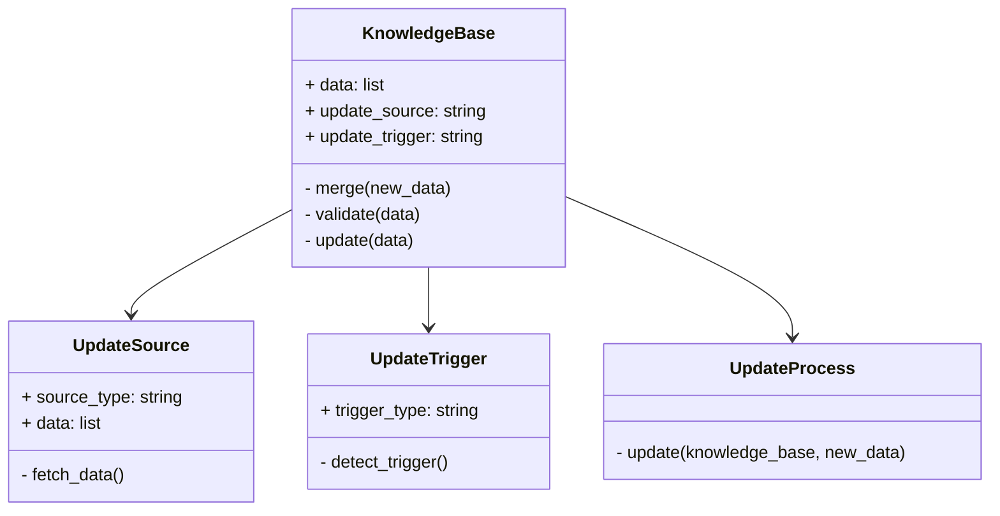
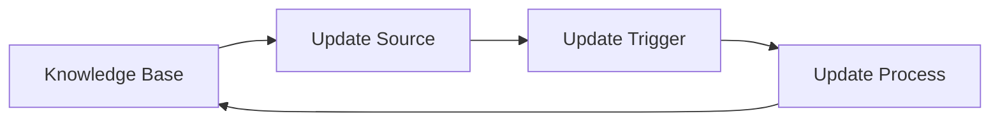
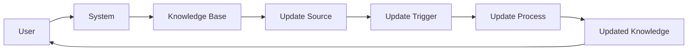

                 


# AI Agent 的动态知识更新：保持 LLM 知识的实时性

> 关键词：AI Agent, LLM, 动态知识更新, 知识实时性, 实时知识管理

> 摘要：本文探讨了AI Agent在动态环境中保持大型语言模型（LLM）知识实时性的方法。通过分析动态知识更新的背景、核心概念、算法原理、系统架构及项目实战，本文为技术从业者提供了深入的理论和实践指导。从问题背景到解决方案，从系统设计到实现案例，本文系统地阐述了如何实现AI Agent的动态知识更新，确保LLM的知识始终保持最新的状态。

---

## 第1章 AI Agent 的动态知识更新背景

### 1.1 问题背景与描述

#### 1.1.1 AI Agent 的概念与作用
AI Agent（人工智能代理）是一种能够感知环境、执行任务并做出决策的智能实体。它通过与用户或系统的交互，利用内部知识库和推理机制，为用户提供智能化的服务。AI Agent的核心在于其知识的准确性和实时性。

#### 1.1.2 LLM 知识实时性的重要性
大型语言模型（LLM）通过大量的训练数据构建知识体系，但这些知识并非实时更新。在动态环境中，如金融市场、新闻热点、实时事件等场景中，知识的实时性至关重要。如果AI Agent的知识 outdated，将导致决策失误，影响用户体验和服务质量。

#### 1.1.3 动态知识更新的必要性
动态知识更新是AI Agent适应环境变化的核心能力。它允许AI Agent在运行过程中持续吸收新的信息，调整知识库，确保输出结果的时效性和准确性。

### 1.2 问题解决与边界

#### 1.2.1 动态知识更新的核心目标
动态知识更新的目标是在不影响AI Agent正常运行的前提下，实时或按需更新知识库。这包括从数据源获取新信息、解析信息、融合到现有知识体系，并验证更新后知识的准确性。

#### 1.2.2 更新机制的边界与限制
动态知识更新并非没有限制。首先，更新频率不能过高，否则会导致资源消耗过大；其次，更新的信息必须经过验证，避免引入错误知识；最后，更新过程需要在不影响现有功能的前提下进行。

#### 1.2.3 知识实时性与准确性的平衡
实时性与准确性之间存在权衡。过于追求实时性可能导致知识准确性下降，而过度追求准确性则会牺牲实时性。动态知识更新需要在这两者之间找到平衡点。

### 1.3 概念结构与核心要素

#### 1.3.1 AI Agent 的知识体系构成
AI Agent的知识体系通常包括领域知识、上下文信息和推理规则。领域知识是AI Agent在特定领域的核心内容，上下文信息是与当前任务相关的动态数据，推理规则是知识之间的关联和逻辑关系。

#### 1.3.2 动态更新的驱动因素
动态知识更新的驱动因素包括外部数据源、用户反馈、系统事件和时间触发。例如，当新的新闻发布时，系统会触发知识库的更新；当用户提出一个新问题，系统会通过反馈机制补充相关知识。

#### 1.3.3 实时性评估指标
实时性评估指标包括更新频率、响应时间、知识准确性和系统稳定性。这些指标帮助我们衡量动态知识更新的效果和效率。

## 1.4 本章小结
本章从AI Agent的基本概念出发，分析了动态知识更新的必要性，探讨了其实时性与准确性的平衡，并明确了知识体系的构成和评估指标。这为后续章节的深入分析奠定了基础。

---

## 第2章 核心概念与联系

### 2.1 核心概念原理

#### 2.1.1 动态知识更新的机制
动态知识更新的机制包括信息采集、解析、融合和验证四个步骤。信息采集从数据源获取新数据，解析将数据转换为可理解的格式，融合将新知识整合到现有知识体系中，验证确保新知识的准确性和一致性。

#### 2.1.2 实时性与响应速度的关系
实时性强调知识的及时更新，响应速度则关注系统对更新请求的处理速度。两者的结合确保了AI Agent在动态环境中的高效运行。

#### 2.1.3 知识更新的周期性与持续性
知识更新可以是周期性的（如每天一次）或持续性的（实时更新）。选择哪种方式取决于应用场景的需求和系统资源的限制。

### 2.2 概念属性特征对比

| 概念       | 静态知识 | 动态知识 |
|------------|----------|----------|
| 更新频率   | 低       | 高       |
| 知识准确度 | 高       | 中高     |
| 响应速度   | 高       | 中       |
| 适应性     | 低       | 高       |

### 2.3 ER 实体关系图



### 2.4 本章小结
本章通过对比分析，明确了动态知识更新的核心概念和机制，并通过ER图展示了实体之间的关系。这些内容为后续章节的系统设计和实现提供了理论基础。

---

## 第3章 动态知识更新算法原理

### 3.1 算法原理概述

#### 3.1.1 动态知识更新的基本流程
动态知识更新的流程包括检测更新触发条件、获取新知识、知识融合、验证和存储。

#### 3.1.2 基于反馈的更新机制
基于反馈的更新机制通过用户反馈或系统事件触发更新。例如，当用户指出某个知识错误时，系统会触发更新流程。

#### 3.1.3 分布式更新的实现方式
分布式更新允许多个节点同时进行知识更新，提高了更新效率和系统的容错能力。

### 3.2 算法流程图



### 3.3 算法实现代码

```python
def update_knowledge_base(knowledge_base, new_data):
    # 知识融合
    merged_data = merge(knowledge_base, new_data)
    
    # 知识验证
    validated_data = validate(merged_data)
    
    # 更新知识库
    knowledge_base.update(validated_data)
    
    return knowledge_base
```

### 3.4 数学模型与公式

知识融合可以通过加权平均的方式进行，公式如下：

$$
\text{merged\_weight} = \frac{\sum w_i \cdot x_i}{\sum w_i}
$$

其中，$w_i$ 是新知识的权重，$x_i$ 是新知识的值。

### 3.5 本章小结
本章详细讲解了动态知识更新的算法原理，通过流程图和代码示例展示了实现过程，并给出了数学模型来解释知识融合的机制。

---

## 第4章 系统分析与架构设计方案

### 4.1 问题场景介绍
在金融领域，实时市场数据的更新需要AI Agent能够快速响应。例如，当市场出现新的动态时，AI Agent需要及时更新其知识库，以提供最新的投资建议。

### 4.2 项目介绍
本项目旨在开发一个支持动态知识更新的AI Agent系统，用于实时金融数据分析。

### 4.3 系统功能设计

#### 4.3.1 领域模型类图


### 4.4 系统架构设计

#### 4.4.1 系统架构图


### 4.5 系统接口设计
系统接口包括数据获取接口、知识融合接口和知识验证接口。

### 4.6 系统交互流程图



### 4.7 本章小结
本章通过系统架构设计和交互流程图，详细展示了动态知识更新在实际系统中的实现方式。

---

## 第5章 项目实战

### 5.1 环境安装
需要安装Python、相关库（如numpy、pandas）和AI框架（如TensorFlow或PyTorch）。

### 5.2 系统核心实现源代码

```python
class KnowledgeBase:
    def __init__(self, data):
        self.data = data
        self.update_source = None
        self.update_trigger = None

    def merge(self, new_data):
        # 简单的合并逻辑
        return self.data + new_data

    def validate(self, data):
        # 简单的验证逻辑
        return data

    def update(self, new_data):
        merged_data = self.merge(new_data)
        validated_data = self.validate(merged_data)
        self.data = validated_data
        return self.data
```

### 5.3 代码应用解读与分析
上述代码展示了知识库的合并和验证过程。合并将新数据与现有数据简单拼接，验证则确保数据的合理性。

### 5.4 实际案例分析
以金融数据为例，当市场发布新财报时，AI Agent会触发更新流程，获取新数据并更新知识库，确保投资建议的实时性。

### 5.5 项目小结
本章通过实际项目的实现，展示了动态知识更新技术的应用场景和具体实现方式。

---

## 第6章 最佳实践与小结

### 6.1 最佳实践 tips
- 定期测试知识更新的准确性
- 优化数据源的多样性和可靠性
- 监控系统性能，避免资源消耗过大

### 6.2 小结
本文系统地探讨了AI Agent动态知识更新的实现方法，从理论到实践，为技术从业者提供了全面的指导。

### 6.3 注意事项
在实际应用中，需注意数据安全、系统稳定性和知识准确性。

### 6.4 拓展阅读
建议进一步阅读分布式系统和实时数据处理的相关文献。

---

## 作者信息

作者：AI天才研究院/AI Genius Institute & 禅与计算机程序设计艺术 /Zen And The Art of Computer Programming

---

通过以上结构，本文系统地阐述了AI Agent动态知识更新的背景、核心概念、算法原理、系统架构及项目实现，为技术从业者提供了深入的技术指导和实践参考。

