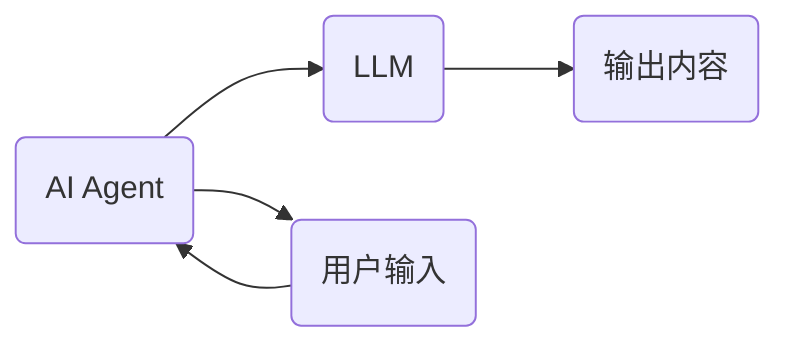
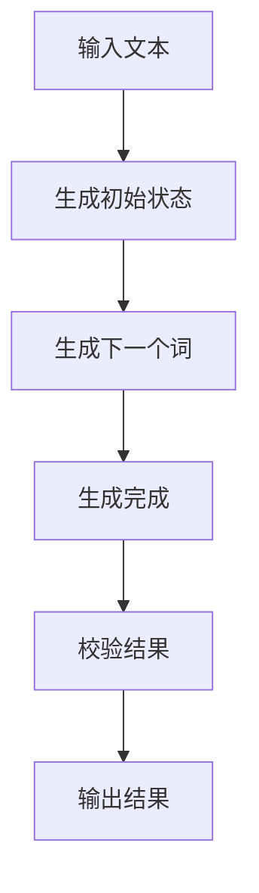

                 


---

# AI Agent 的可控生成：精确控制 LLM 的输出

> **关键词**：AI Agent，LLM，可控生成，文本生成，深度学习

> **摘要**：本文探讨了如何精确控制AI Agent生成的LLM（大语言模型）输出，分析了当前生成技术的挑战，提出了基于AI Agent的可控生成解决方案。文章从背景、概念、算法原理、系统设计到实战案例，全面解析了实现可控生成的方法，提供了丰富的技术细节和实际应用案例，帮助读者深入理解并掌握可控生成技术的核心要点。

---

## 第一部分: AI Agent 的可控生成基础

### 第1章: 问题背景与概念解析

#### 1.1 问题背景

- **1.1.1 当前AI生成技术的挑战**
  - 当前，基于LLM的生成技术在自然语言处理领域取得了显著进展，但生成结果的不可控性仍然是一个亟待解决的问题。LLM生成的内容可能偏离预期目标，导致错误、不一致或有害信息的输出。

- **1.1.2 LLM 输出失控的潜在风险**
  - 不可控的生成可能导致严重的后果，例如生成错误信息、歧视性言论或误导性内容，影响企业声誉和用户信任。

- **1.1.3 可控生成的重要性与应用场景**
  - 可控生成技术在多个领域具有重要意义，例如企业自动化生成、智能客服、内容创作等场景，需要确保生成内容的准确性和一致性。

#### 1.2 问题描述

- **1.2.1 LLM 输出不可控的表现形式**
  - 生成内容偏离主题、语法错误、逻辑混乱、重复内容等问题。

- **1.2.2 不可控输出对企业与用户的危害**
  - 企业可能面临法律风险、用户信任危机和品牌声誉损失；用户可能获得错误信息，影响决策。

- **1.2.3 可控生成的目标与边界**
  - 可控生成的目标是通过AI Agent干预和调整LLM的生成过程，确保输出符合预期。边界在于在不破坏生成模型性能的前提下，实现生成内容的可控制性。

#### 1.3 问题解决思路

- **1.3.1 从输入到输出的控制机制**
  - 通过输入干预（如添加约束条件、关键词引导）、输出校验（如关键词过滤、内容纠错）等方法实现对生成内容的控制。

- **1.3.2 AI Agent 在可控生成中的角色**
  - AI Agent作为中间代理，负责接收用户输入、调用LLM生成内容，并根据预设规则对生成结果进行干预和调整。

- **1.3.3 可控生成的实现路径与方法**
  - 结合AI Agent的规则引擎和LLM的生成能力，实现输入干预、输出校验和结果优化的闭环控制。

#### 1.4 概念结构与核心要素

- **1.4.1 AI Agent 的定义与组成**
  - AI Agent是一种智能体，能够感知环境、执行任务并做出决策，通常包括感知模块、决策模块和执行模块。

- **1.4.2 LLM 的工作原理与特点**
  - LLM基于Transformer架构，通过自注意力机制和前馈网络生成文本，具有生成速度快、内容丰富等优点。

- **1.4.3 可控生成的系统架构**
  - 可控生成系统由输入模块、生成模块、控制模块和输出模块组成，通过模块间的协同工作实现生成内容的控制。

---

### 第2章: 核心概念与联系

#### 2.1 AI Agent 与 LLM 的关系

- **2.1.1 AI Agent 的功能模块**
  - 输入解析模块：解析用户输入，提取关键信息；生成调用模块：调用LLM生成内容；结果校验模块：校验生成内容是否符合预期。

- **2.1.2 LLM 在 AI Agent 中的作用**
  - LLM作为生成引擎，负责根据输入生成高质量的文本内容，提供创造力和丰富性。

- **2.1.3 可控生成的实现机制**
  - AI Agent通过输入干预、输出校验和结果优化，实现对LLM生成过程的控制。

#### 2.2 核心概念对比表

| 比较维度 | AI Agent | LLM | 可控生成 |
|----------|-----------|-----|----------|
| 功能定位 | 中间代理，负责任务执行 | 生成模型，负责内容生成 | 控制机制，确保生成内容符合预期 |
| 技术特点 | 感知环境，执行任务 | 基于Transformer，生成文本 | 输入干预，输出校验 |
| 应用场景 | 企业自动化、智能客服 | 内容生成、文本摘要 | 多领域生成控制 |

#### 2.3 实体关系图（ER 图）



---

### 第3章: 算法原理与数学模型

#### 3.1 可控生成的算法原理

- **3.1.1 基于Transformer的生成模型**
  - Transformer模型通过自注意力机制和前馈网络生成文本，具有并行计算能力强、生成速度快的特点。

- **3.1.2 梯度控制与温度参数调节**
  - 温度参数通过调整生成分布的熵，控制生成内容的多样性和确定性。

- **3.1.3 前缀引导与指针网络**
  - 前缀引导通过在输入中添加引导性内容，指导生成模型生成预期结果；指针网络通过引用外部知识库，增强生成内容的准确性和相关性。

#### 3.2 数学模型与公式

- **3.2.1 Transformer 模型的解码过程**
  $$P(x_{i}|x_{<i}) = \text{softmax}(QK^T/V)$$

- **3.2.2 温度参数对生成概率的影响**
  $$P_{\text{new}}(x) = \text{softmax}(\frac{log P(x)}{T})$$

- **3.2.3 前缀引导的数学表达**
  $$x_{\text{prefix}} \Rightarrow x_{\text{generated}}$$

#### 3.3 算法流程图



---

## 第4章: 系统分析与架构设计

### 4.1 系统分析

#### 4.1.1 问题场景介绍

- 在企业自动化场景中，AI Agent需要生成符合企业政策和用户需求的内容，例如智能客服对话生成、企业邮件自动回复等。

#### 4.1.2 项目介绍

- 本项目旨在通过AI Agent实现对LLM生成过程的精确控制，确保生成内容的准确性和一致性。

#### 4.1.3 系统功能设计

| 功能模块 | 功能描述 |
|----------|----------|
| 输入模块 | 接收用户输入，解析关键信息 |
| 生成模块 | 调用LLM生成内容 |
| 控制模块 | 根据预设规则干预生成过程 |
| 输出模块 | 输出最终生成内容 |

#### 4.1.4 系统架构设计


---

## 第5章: 项目实战

### 5.1 项目实战: 可控生成系统实现

#### 5.1.1 环境安装

- 安装Python 3.8以上版本、PyTorch 1.9以上版本、Hugging Face Transformers库。

#### 5.1.2 核心代码实现

```python
from transformers import AutoTokenizer, AutoModelForCausalLM
import torch

class AI_Agent:
    def __init__(self, model_name="gpt2"):
        self.tokenizer = AutoTokenizer.from_pretrained(model_name)
        self.model = AutoModelForCausalLM.from_pretrained(model_name)
    
    def generate(self, input_text, max_length=50, temperature=1.0):
        inputs = self.tokenizer.encode(input_text, return_tensors="pt")
        outputs = self.model.generate(
            inputs,
            max_length=max_length,
            temperature=temperature,
            do_sample=True
        )
        return self.tokenizer.decode(outputs[0], skip_special_tokens=True)

# 示例用法
agent = AI_Agent()
input_text = "今天天气不错，"
output = agent.generate(input_text, max_length=100, temperature=0.7)
print(output)
```

#### 5.1.3 案例分析与代码解读

- **案例分析**：在智能客服场景中，AI Agent需要根据用户输入生成符合企业政策的回答。
- **代码解读**：AI Agent通过调用LLM生成内容，并根据输入文本和参数调整生成结果。

---

## 第6章: 高级主题

### 6.1 模型的可解释性与鲁棒性

- **6.1.1 模型可解释性的重要性**
  - 可解释性是确保生成内容可控的重要因素，能够帮助用户理解生成结果的原因。

- **6.1.2 鲁棒性提升方法**
  - 通过数据增强、模型微调和生成结果校验等方法，提升生成模型的鲁棒性。

### 6.2 伦理与安全

- **6.2.1 生成内容的伦理问题**
  - 需要注意避免生成有害信息、歧视性言论等，确保生成内容符合伦理规范。

- **6.2.2 安全风险与防范措施**
  - 通过内容校验、黑白名单机制等方法，防范生成内容的安全风险。

---

## 第7章: 总结与展望

### 7.1 总结

- 本文全面分析了AI Agent可控生成的技术背景、实现方法和实际应用，通过案例分析展示了可控生成技术的实际价值。

### 7.2 展望

- 未来，随着AI技术的不断发展，可控生成技术将更加智能化和自动化，AI Agent在生成过程中的作用将更加重要。

---

**作者：AI天才研究院/AI Genius Institute & 禅与计算机程序设计艺术 /Zen And The Art of Computer Programming**

