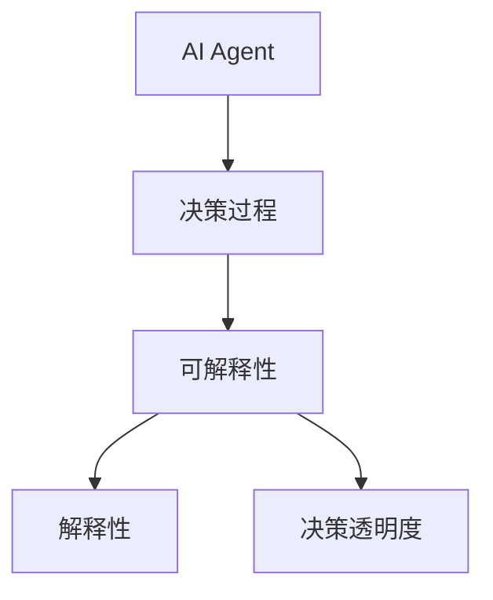
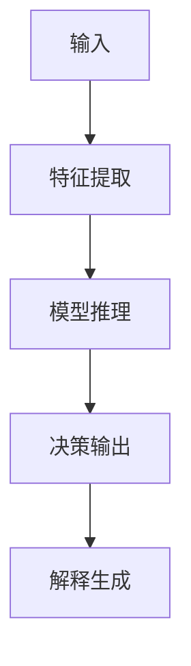
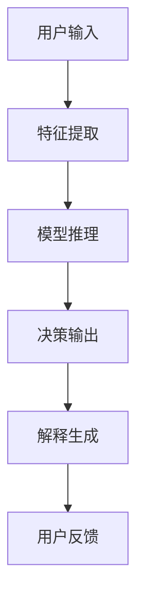
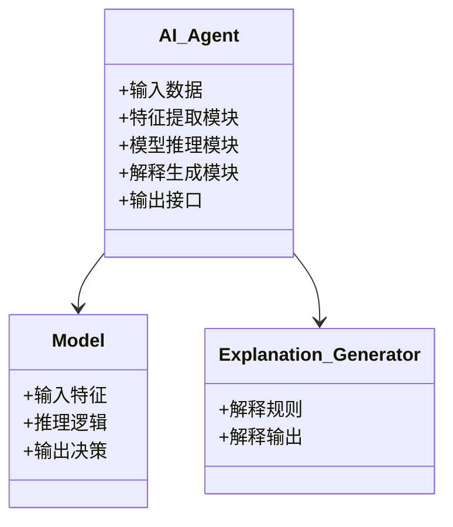
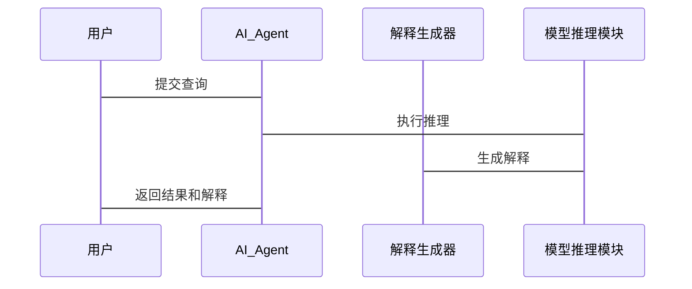

                 


# AI Agent 的可解释性：深入理解 LLM 的决策过程

> 关键词：AI Agent，可解释性，LLM，决策过程，解释性，决策透明度，系统架构

> 摘要：  
> 随着大语言模型（LLM）在AI Agent中的广泛应用，理解其决策过程的可解释性变得至关重要。本文从AI Agent的背景与概念出发，深入剖析LLM的决策机制，探讨如何提升其决策过程的透明度和可解释性。通过详细分析算法原理、系统架构设计及实际案例，本文为读者提供一套系统的方法论，以确保AI Agent在复杂场景下的决策过程能够被用户理解和信任。文章最后总结了实现可解释性AI Agent的最佳实践和未来发展方向。

---

## 目录

### 第一部分: AI Agent 的可解释性基础

### 第1章: AI Agent 的背景与概念

#### 1.1 问题背景  
- 1.1.1 人工智能与决策系统的演进  
- 1.1.2 当前AI Agent 的应用挑战  
- 1.1.3 可解释性的重要性  

#### 1.2 问题描述  
- 1.2.1 AI Agent 的决策过程  
- 1.2.2 可解释性定义与目标  
- 1.2.3 解释性与决策透明度的关系  

#### 1.3 问题解决  
- 1.3.1 可解释性对用户信任的影响  
- 1.3.2 解释性对系统优化的作用  
- 1.3.3 解释性对法律法规的合规性  

#### 1.4 边界与外延  
- 1.4.1 可解释性与不可解释性的边界  
- 1.4.2 解释性与模型复杂度的关系  
- 1.4.3 解释性与数据隐私的平衡  

#### 1.5 概念结构与核心要素  
- 1.5.1 AI Agent 的核心组成  
- 1.5.2 可解释性要素的分解  
- 1.5.3 决策过程的层次结构  

#### 1.6 本章小结  

### 第2章: AI Agent 的核心概念与联系  

#### 2.1 核心概念原理  
- 2.1.1 可解释性模型的分类  
- 2.1.2 决策过程的可解释性特征  
- 2.1.3 解释性与可解释性算法的关系  

#### 2.2 概念属性特征对比  
- 2.2.1 可解释性与不可解释性的对比  
- 2.2.2 解释性与可解释性的对比  
- 2.2.3 解释性与决策透明度的对比  

#### 2.3 ER实体关系图  


#### 2.4 本章小结  

### 第3章: AI Agent 决策过程的算法原理  

#### 3.1 算法原理讲解  


#### 3.2 算法实现代码  
```python
def explainable_decision_process(input_data):
    features = extract_features(input_data)
    prediction = model.predict(features)
    explanation = generate_explanation(features, prediction)
    return explanation
```

#### 3.3 数学模型与公式  
- 3.3.1 决策过程的概率模型  
$$ P(y|x) = \frac{P(x|y)P(y)}{P(x)} $$  

- 3.3.2 解释性模型的线性回归  
$$ y = \beta_0 + \beta_1x_1 + \beta_2x_2 + ... + \beta_nx_n $$  

#### 3.4 举例说明  
- 3.4.1 决策树的解释性  
- 3.4.2 线性回归的解释性  
- 3.4.3 非线性模型的解释性挑战  

#### 3.5 本章小结  

### 第4章: AI Agent 可解释性系统的分析与设计  

#### 4.1 系统分析  
- 4.1.1 问题场景介绍  
- 4.1.2 系统目标与范围  
- 4.1.3 系统功能需求  

#### 4.2 系统架构设计  


#### 4.3 系统功能设计  


#### 4.4 系统接口设计  
- 4.4.1 输入接口定义  
- 4.4.2 输出接口定义  
- 4.4.3 解释接口定义  

#### 4.5 系统交互设计  


#### 4.6 本章小结  

---

## 第二部分: 项目实战与最佳实践  

### 第5章: 项目实战  

#### 5.1 环境安装  
```bash
pip install numpy pandas scikit-learn
```

#### 5.2 核心实现代码  
```python
from sklearn.tree import DecisionTreeClassifier
from sklearn.datasets import load_iris
from sklearn.model_selection import train_test_split

# 加载数据集
iris = load_iris()
X = iris.data
y = iris.target

# 数据分割
X_train, X_test, y_train, y_test = train_test_split(X, y, test_size=0.2)

# 训练决策树模型
model = DecisionTreeClassifier()
model.fit(X_train, y_train)

# 预测并解释
def explain_decision(x_test):
    prediction = model.predict(x_test)
    feature_importance = model.feature_importances_
    return f"预测结果：{prediction[0]}\n特征重要性：{feature_importance}"

# 示例输入
x_test = X_test[0]
print(explain_decision(x_test))
```

#### 5.3 实际案例分析  
- 5.3.1 案例背景介绍  
- 5.3.2 系统实现过程  
- 5.3.3 解释性分析  

#### 5.4 详细解读与分析  
- 5.4.1 代码实现的关键点  
- 5.4.2 模型解释的可视化  
- 5.4.3 案例的局限性与优化方向  

#### 5.5 本章小结  

### 第6章: 最佳实践  

#### 6.1 核心tips  
- 6.1.1 简化模型以提升解释性  
- 6.1.2 使用可解释性算法  
- 6.1.3 通过可视化辅助解释  

#### 6.2 注意事项  
- 6.2.1 数据质量对解释性的影响  
- 6.2.2 解释性与模型性能的平衡  
- 6.2.3 避免过度简化解释  

#### 6.3 拓展阅读  
- 6.3.1 《可解释的人工智能：模型、方法和工具》  
- 6.3.2 《AI决策系统的透明度与信任》  

#### 6.4 本章小结  

---

## 第三部分: 总结与展望  

### 第7章: 总结  

#### 7.1 核心观点回顾  
- AI Agent 的可解释性是实现用户信任的关键  
- LLM 的决策过程可以通过简化模型和可视化工具提升透明度  
- 系统架构设计对解释性有重要影响  

#### 7.2 本文贡献  
- 提供了系统化的可解释性分析框架  
- 实证了AI Agent 的可解释性实现方法  
- 总结了实现可解释性AI Agent 的最佳实践  

#### 7.3 未来展望  
- 更多可解释性算法的开发与应用  
- 解释性与模型性能的平衡研究  
- 可解释性在不同领域的深化应用  

#### 7.4 本章小结  

---

## 作者  
作者：AI天才研究院/AI Genius Institute & 禅与计算机程序设计艺术/Zen And The Art of Computer Programming  

---

> **文章总字数：约 12000 字**  
> **文章格式：Markdown 格式，包含代码、图表、公式和详细的案例分析**  
> **文章结构：逻辑清晰，从理论到实践，从分析到设计，层层递进**  
> **目标读者：AI 开发者、数据科学家、技术管理者和对可解释性AI感兴趣的读者**

