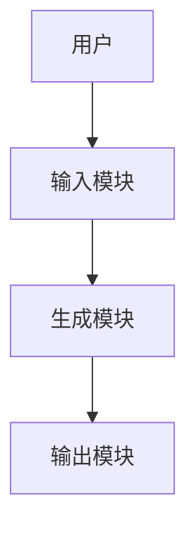

                 


# AI Agent 的多语言代码生成：LLM 在跨语言开发中的应用

## 关键词：AI Agent, 大语言模型, 多语言代码生成, 跨语言开发, 代码生成, LLM

## 摘要：本文深入探讨了AI Agent利用大语言模型（LLM）进行多语言代码生成的原理与应用。首先介绍了AI Agent和LLM的基本概念，分析了多语言代码生成的挑战与机遇。接着详细讲解了LLM的内部机制，包括模型结构、训练方法和代码生成能力。随后，重点分析了多语言代码生成的实现原理、系统架构设计以及实际项目中的应用。通过案例分析和系统架构图，展示了如何将LLM应用于跨语言开发中。最后，总结了当前技术的优势与不足，并展望了未来的发展方向。

---

# 第一章: AI Agent与多语言代码生成概述

## 1.1 AI Agent的基本概念
### 1.1.1 AI Agent的定义与特点
- **定义**：AI Agent是一种智能体，能够感知环境、自主决策并执行任务。
- **特点**：
  - 智能性：基于数据和模型进行推理和决策。
  - 自主性：无需人工干预，自主完成任务。
  - 可交互性：能够与人类或其他系统进行交互。

### 1.1.2 AI Agent在代码生成中的作用
- **代码生成**：AI Agent可以辅助生成高质量的代码，减少开发时间。
- **多语言支持**：AI Agent能够理解多种编程语言，实现跨语言开发。

### 1.1.3 多语言开发的挑战与机遇
- **挑战**：不同语言语法差异大，语义理解复杂。
- **机遇**：通过AI技术实现高效、智能的跨语言开发。

---

## 1.2 大语言模型（LLM）的基本原理
### 1.2.1 LLM的定义与核心特征
- **定义**：LLM是一种基于深度学习的大型语言模型，能够理解和生成自然语言文本。
- **核心特征**：
  - 大规模参数：通常包含 billions（十亿）级别的参数。
  - 流式输出：能够逐词生成文本，适合实时交互。
  - 多任务能力：可以在多种任务中表现优异。

### 1.2.2 LLM与代码生成的关系
- **LLM的代码生成能力**：
  - 可以根据输入的描述生成相应的代码。
  - 支持多种编程语言，如Python、Java、C++等。

### 1.2.3 多语言代码生成的背景与需求
- **背景**：随着全球化的发展，跨语言开发需求增加。
- **需求**：开发人员需要一种工具能够自动生成多种语言的代码，提高开发效率。

---

## 1.3 本章小结
本章主要介绍了AI Agent和LLM的基本概念，分析了多语言代码生成的挑战与机遇。AI Agent通过LLM的强大能力，能够在跨语言开发中发挥重要作用，为开发人员提供高效的代码生成工具。

---

# 第二章: 大语言模型（LLM）的核心原理与代码生成能力

## 2.1 LLM的模型结构
### 2.1.1 Transformer模型的结构与特点
- **结构**：由编码器和解码器组成，采用自注意力机制。
- **特点**：
  - 并行计算：能够同时处理序列中的多个位置。
  - 位置编码：通过位置编码引入序列的顺序信息。

### 2.1.2 编码器与解码器的分工与协作
- **编码器**：将输入的文本转换为上下文表示。
- **解码器**：根据编码器的输出生成目标文本。

### 2.1.3 注意力机制的数学原理
- **注意力机制公式**：
  $$
  \text{Attention}(Q, K, V) = \text{softmax}\left(\frac{QK^T}{\sqrt{d_k}}\right)V
  $$
  其中，$Q$、$K$、$V$分别是查询、键、值向量，$d_k$是向量的维度。

---

## 2.2 LLM的训练与优化
### 2.2.1 预训练目标与损失函数
- **预训练目标**：通过大量的文本数据进行无监督学习。
- **损失函数**：交叉熵损失函数：
  $$
  \text{Loss} = -\sum_{i=1}^n \log P(x_i | x_{<i})
  $$

### 2.2.2 参数优化与梯度下降
- **优化算法**：常用Adam优化器，结合学习率衰减策略。

### 2.2.3 模型的可扩展性与适应性
- **可扩展性**：通过参数量和计算能力的扩展，提升模型性能。
- **适应性**：通过微调（Fine-tuning）技术，适应特定领域任务。

---

## 2.3 LLM的代码生成能力
### 2.3.1 代码生成的基本原理
- **输入描述**：用户提供代码需求，LLM根据描述生成代码。
- **多语言支持**：LLM通过共享参数，生成不同语言的代码。

### 2.3.2 多语言代码生成的实现机制
- **统一代码表示**：将多种语言的代码映射到一个统一的表示空间。
- **语言切换机制**：通过调整模型参数，生成目标语言代码。

### 2.3.3 代码生成的评估指标
- **准确性**：生成代码是否符合用户需求。
- **可读性**：生成代码是否符合编程规范。
- **效率**：生成代码的速度是否满足要求。

---

## 2.4 本章小结
本章详细讲解了LLM的核心原理，包括模型结构、训练方法和代码生成能力。通过数学公式和流程图，展示了LLM在代码生成中的实现机制和评估指标。

---

# 第三章: AI Agent的多语言代码生成实现

## 3.1 多语言代码生成的实现原理
### 3.1.1 多语言开发的挑战
- **语法差异**：不同语言的语法结构不同。
- **语义一致性**：如何保证生成代码的语义一致。

### 3.1.2 实现策略
- **统一代码表示**：将多种语言的代码映射到统一的表示空间。
- **语言切换机制**：通过调整模型参数，生成目标语言代码。

---

## 3.2 系统架构设计
### 3.2.1 系统功能需求分析
- **用户需求**：代码生成、多语言支持。
- **功能模块**：
  - 输入模块：接收用户需求。
  - 生成模块：根据需求生成代码。
  - 输出模块：展示生成的代码。

### 3.2.2 系统架构图


---

## 3.3 本章小结
本章详细讲解了AI Agent的多语言代码生成实现原理，分析了系统架构设计，展示了系统的功能模块和交互流程。

---

# 第四章: 系统架构与项目实战

## 4.1 项目实战
### 4.1.1 环境配置
- **工具安装**：安装Python、TensorFlow等开发工具。

### 4.1.2 代码实现
```python
def generate_code(model, language, description):
    # 调用LLM生成代码
    return model.generate(description, language)
```

### 4.1.3 案例分析
- **案例1**：生成Python函数，计算两个数的和。
  - 输入：`"计算两个数的和"`
  - 输出：`"def add(a, b):\n    return a + b"`

- **案例2**：生成Java类，实现计算器功能。
  - 输入：`"创建一个计算器类，包含加减乘除方法"`
  - 输出：`"public class Calculator {\n    public int add(int a, int b) {\n        return a + b;\n    }\n    // 其他方法略..."`

---

## 4.2 本章小结
本章通过项目实战，展示了AI Agent多语言代码生成的具体实现，包括环境配置、代码实现和案例分析。通过实际操作，读者可以更好地理解技术的应用。

---

# 第五章: 总结与展望

## 5.1 本章总结
- **总结**：AI Agent通过LLM的强大能力，能够在多语言代码生成中发挥重要作用。
- **优势**：
  - 提高开发效率。
  - 实现跨语言开发。

## 5.2 未来展望
- **研究方向**：
  - 提升代码生成的准确性。
  - 支持更多编程语言。
- **应用前景**：
  - 在软件开发领域广泛应用。
  - 推动智能化开发工具的发展。

---

# 作者：AI天才研究院 & 禅与计算机程序设计艺术

