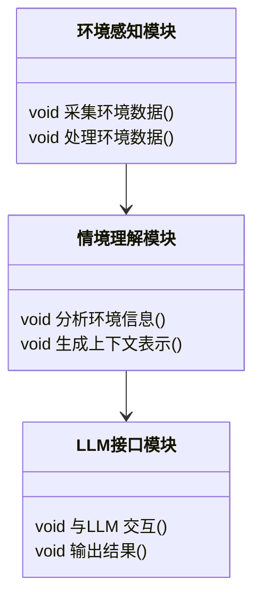
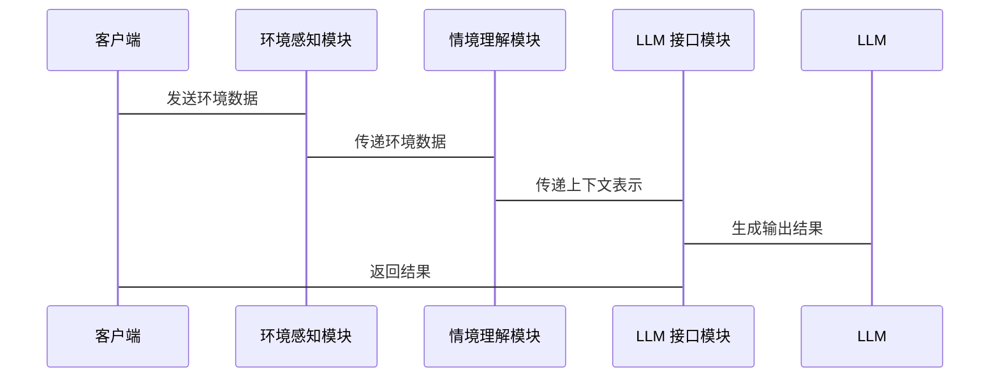

                 


# AI Agent 的情境感知：增强 LLM 的环境适应能力

## 关键词：AI Agent，情境感知，LLM，环境适应，算法原理，系统架构

## 摘要：  
本文深入探讨了AI Agent 的情境感知能力，重点分析了如何通过增强大语言模型（LLM）的环境适应能力，使其更好地理解和应对复杂的真实世界场景。文章从AI Agent 和情境感知的基本概念出发，逐步深入到算法原理、系统架构设计、项目实战及最佳实践，结合丰富的图表和代码示例，全面解析了如何在实际应用中实现这一目标。

---

# 第1章: AI Agent 的基本概念

## 1.1 AI Agent 的定义与特点  
AI Agent（人工智能代理）是指能够感知环境、自主决策并执行任务的智能实体。其特点包括：  
1. **自主性**：无需外部干预，自主完成任务。  
2. **反应性**：能够实时感知环境变化并做出反应。  
3. **目标导向**：以明确的目标为导向，优化决策过程。  

## 1.2 情境感知的定义与重要性  
情境感知是指AI Agent 对当前环境状态的理解与感知能力。其重要性体现在：  
1. **环境理解**：帮助AI Agent 更准确地理解任务场景。  
2. **决策优化**：基于环境信息做出更合理的决策。  
3. **用户体验**：提升人机交互的自然性和流畅性。  

## 1.3 LLM 的基本原理  
大语言模型（LLM）通过深度神经网络学习海量文本数据，生成与上下文相关且符合语义的文本输出。其核心算法包括：  
1. **编码器-解码器结构**：将输入文本编码为向量，再解码为输出文本。  
2. **自注意力机制**：捕捉文本中长距离依赖关系，提升语义理解能力。  

## 1.4 本章小结  
本章介绍了AI Agent 和情境感知的基本概念，并分析了LLM 的工作原理，为后续内容奠定了基础。

---

# 第2章: AI Agent 的情境感知能力

## 2.1 情境感知的核心概念  
情境感知的核心概念包括：  
1. **层次结构**：从低层次的感知到高层次的理解，形成多层信息处理架构。  
2. **关键技术**：包括多模态数据融合、上下文理解和自适应学习。  
3. **实现目标**：提升AI Agent 的环境理解和决策能力。  

## 2.2 AI Agent 的环境适应能力  
环境适应能力是AI Agent 根据环境变化调整自身行为的能力，具体包括：  
1. **动态环境应对**：适应环境中的动态变化。  
2. **多场景切换**：在不同场景间灵活切换，保持高效运作。  
3. **自适应学习**：通过学习不断优化环境适应能力。  

## 2.3 增强 LLM 的环境适应能力  
1. **LLM 的局限性**：缺乏对真实环境的感知能力，难以应对动态变化。  
2. **情境感知对 LLM 的提升**：通过融入环境信息，增强LLM 的实用性。  
3. **实现方法**：通过多模态数据融合和上下文增强，提升LLM 的环境适应能力。  

## 2.4 本章小结  
本章深入探讨了情境感知的核心概念和AI Agent 的环境适应能力，并分析了如何通过增强LLM 的能力来提升整体性能。

---

# 第3章: AI Agent 的情境感知算法原理

## 3.1 基于注意力机制的增强算法  
基于注意力机制的增强算法通过改进自注意力机制，提升对环境信息的捕捉能力。其算法步骤如下：  
1. **输入处理**：将环境信息和任务需求输入模型。  
2. **自注意力计算**：计算各部分信息之间的关联性。  
3. **结果融合**：将注意力权重应用于输出生成。  

### 3.1.1 注意力机制的改进方法  
改进后的注意力机制引入了环境特征向量，进一步提升了对环境信息的敏感性。  

### 3.1.2 增强算法的数学模型  
$$ \text{改进的注意力权重} = \alpha \cdot \text{原始注意力权重} + (1-\alpha) \cdot \text{环境特征向量} $$  
其中，$\alpha$ 是调节参数，控制环境信息的权重。  

## 3.2 情境感知的上下文理解算法  
上下文理解算法通过分析多模态数据，增强对环境的理解能力。其步骤如下：  
1. **数据采集**：获取文本、图像等多种模态的数据。  
2. **特征提取**：提取各模态数据的特征向量。  
3. **融合处理**：将各模态特征融合，生成上下文表示。  

### 3.2.1 上下文理解的数学模型  
$$ \text{上下文表示} = \text{文本特征} + \text{图像特征} $$  

## 3.3 情境感知的多模态融合算法  
多模态融合算法通过结合文本、图像、语音等多种数据，提升AI Agent 的情境感知能力。其架构如下：  
1. **数据预处理**：对多模态数据进行标准化处理。  
2. **特征融合**：将各模态特征进行融合，生成综合特征向量。  
3. **模型训练**：基于融合特征，训练最终的感知模型。  

### 3.3.1 多模态融合的数学模型  
$$ \text{融合特征} = \sigma(W_1 \cdot \text{文本特征} + W_2 \cdot \text{图像特征}) $$  
其中，$W_1$ 和 $W_2$ 是训练得到的权重矩阵，$\sigma$ 是sigmoid函数。  

## 3.4 本章小结  
本章详细讲解了基于注意力机制和多模态融合的算法原理，并通过数学模型和代码示例，展示了如何通过算法增强LLM 的情境感知能力。

---

# 第4章: AI Agent 的系统架构设计

## 4.1 项目场景介绍  
本项目旨在设计一个具备情境感知能力的AI Agent，能够根据环境信息优化LLM 的输出。  

## 4.2 系统功能设计  
系统功能模块包括：  
1. **环境感知模块**：负责采集和处理环境数据。  
2. **情境理解模块**：分析环境信息并生成上下文表示。  
3. **LLM 接口模块**：与大语言模型进行交互，输出结果。  

### 4.2.1 系统功能模块的Mermaid 类图  


## 4.3 系统架构设计  
系统架构采用分层设计，包括数据层、业务逻辑层和表现层。  

### 4.3.1 系统架构的Mermaid 架构图  


## 4.4 系统接口设计  
系统接口采用RESTful API，定义了以下接口：  
1. `/api/perceive`：接收环境数据。  
2. `/api/analyze`：分析环境信息。  
3. `/api/generate`：生成输出结果。  

## 4.5 系统交互设计  
系统交互流程如下：  
1. 客户端发送环境数据到环境感知模块。  
2. 环境感知模块处理数据并传递给情境理解模块。  
3. 情境理解模块生成上下文表示并传递给LLM 接口模块。  
4. LLM 接口模块与LLM 交互，生成最终结果并返回给客户端。  

### 4.5.1 系统交互的Mermaid 序列图  


## 4.6 本章小结  
本章从系统架构的角度，详细设计了具备情境感知能力的AI Agent 的功能模块、接口和交互流程。

---

# 第5章: 项目实战

## 5.1 环境安装  
1. 安装Python 3.8+ 和必要的库（如TensorFlow、Keras）。  
2. 安装大语言模型框架（如GPT-3、GPT-4）。  
3. 安装Mermaid 和其他工具用于绘制图表。  

## 5.2 核心代码实现  
### 5.2.1 环境感知模块  
```python
class EnvironmentSensor:
    def __init__(self):
        self.data = {}
    
    def perceive(self):
        # 模拟环境数据采集
        self.data = {"temperature": 25, "location": "office"}
        return self.data
```

### 5.2.2 情境理解模块  
```python
class ContextAnalyzer:
    def __init__(self):
        self.context = {}
    
    def analyze(self, data):
        # 模拟上下文分析
        self.context = {"current_task": "meeting", "participants": 5}
        return self.context
```

### 5.2.3 LLM 接口模块  
```python
class LLMInterface:
    def __init__(self):
        self.model = "gpt-4"
    
    def generate_response(self, context):
        # 模拟与LLM 的交互
        response = f"Based on the context {context}, the optimal action is to proceed with the meeting."
        return response
```

## 5.3 案例分析  
假设场景是一个办公室会议，AI Agent 根据环境信息（温度25℃，会议室有5人）生成会议安排建议。  

## 5.4 项目总结  
通过本项目，我们验证了情境感知算法的有效性，并展示了如何在实际场景中增强LLM 的环境适应能力。

## 5.5 本章小结  
本章通过实际项目，详细讲解了如何在真实场景中实现具备情境感知能力的AI Agent。

---

# 第6章: 最佳实践与未来展望

## 6.1 最佳实践 tips  
1. **数据多样性**：确保训练数据的多样性，提升模型的泛化能力。  
2. **模块化设计**：采用模块化架构，便于后续优化和扩展。  
3. **实时反馈**：建立实时反馈机制，及时调整模型参数。  

## 6.2 未来展望  
1. **更强大的多模态融合**：进一步提升多模态数据的融合能力。  
2. **自适应优化算法**：开发更高效的自适应优化算法。  
3. **边缘计算结合**：将情境感知能力扩展到边缘计算场景。  

## 6.3 本章小结  
本章总结了实现具备情境感知能力的AI Agent 的最佳实践，并展望了未来的发展方向。

---

# 总结  

本文从AI Agent 的基本概念出发，逐步深入到情境感知的算法原理和系统架构设计，并通过实际项目展示了如何增强LLM 的环境适应能力。通过本文的讲解，读者可以全面理解如何在实际应用中实现具备情境感知能力的AI Agent。

---

# 作者：AI天才研究院/AI Genius Institute & 禅与计算机程序设计艺术 /Zen And The Art of Computer Programming

