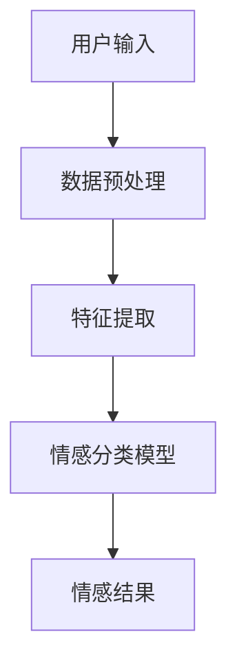
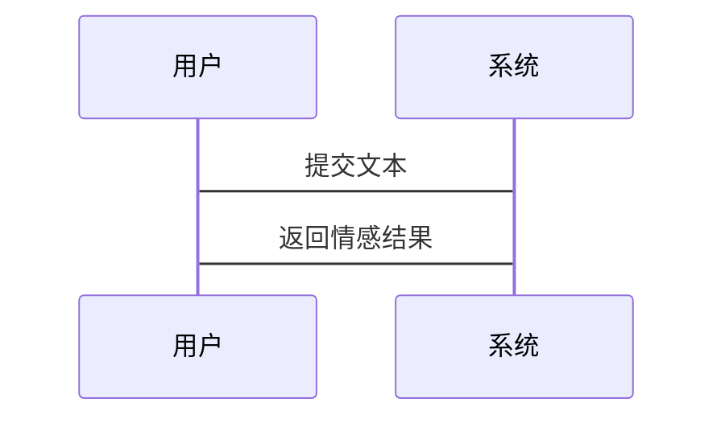

                 


# AI Agent 的情感分析：利用 LLM 洞察用户情绪

> 关键词：AI Agent, 情感分析, LLM, 用户情绪, 自然语言处理

> 摘要：本文深入探讨了AI Agent在情感分析中的应用，利用大型语言模型（LLM）来洞察用户情绪。文章从情感分析的基本概念出发，详细分析了AI Agent的定义、特点以及其与情感分析的结合。通过具体的算法原理和系统架构设计，展示了如何利用LLM进行情感分析。最后，通过实战项目和最佳实践，总结了情感分析在AI Agent中的重要性和应用前景。

---

## 第1章: AI Agent 与情感分析概述

### 1.1 什么是情感分析
情感分析（Sentiment Analysis）是自然语言处理（NLP）中的一个核心任务，旨在判断一段文本所表达的情感倾向。情感分析的结果通常分为正面、负面或中性三种，也可以更细分为多个情感类别。例如，用户对产品的评论可以被分类为“非常喜欢”、“一般”或“不满意”。

情感分析不仅关注整体情感，还可以分析特定情感强度。例如，一段文本可能被判定为“非常满意”（0.9）或“轻微不满”（0.2）。

情感分析的核心目标是理解文本中隐含的情感信息，从而帮助企业进行市场调研、客户反馈分析、社交媒体监控等。

### 1.2 AI Agent 的定义与特点
AI Agent（人工智能代理）是指能够感知环境并采取行动以实现目标的智能实体。AI Agent可以是软件程序，也可以是机器人或其他智能设备。

AI Agent的特点包括：
1. **自主性**：能够自主决策，无需人工干预。
2. **反应性**：能够根据环境变化调整行为。
3. **目标导向**：具有明确的目标，并采取行动以实现目标。
4. **学习能力**：能够通过经验改进性能。

### 1.3 情感分析与 AI Agent 的结合
情感分析为AI Agent提供了理解用户情绪的能力。通过分析用户的文本输入，AI Agent可以判断用户的情感倾向，并据此调整其行为。例如：

- **客服AI Agent**：通过分析用户的投诉文本，判断用户的不满程度，并采取相应的解决方案。
- **社交媒体AI Agent**：实时监控社交媒体上的用户评论，识别负面情绪并及时反馈给相关部门。

情感分析使AI Agent能够更贴近人类的交流方式，从而提供更智能、更个性化的服务。

---

## 第2章: 情感分析的核心概念与原理

### 2.1 情感分析的基本原理
情感分析的基本原理是将文本转换为计算机可以理解的特征表示，然后通过分类算法判断情感倾向。以下是情感分析的主要步骤：

1. **数据预处理**：对文本进行清洗、分词、去除停用词等处理。
2. **特征提取**：将文本转换为数值特征，如词袋模型、词嵌入等。
3. **模型训练**：使用分类算法（如朴素贝叶斯、SVM、神经网络等）训练情感分类模型。
4. **结果预测**：将新的文本输入模型，预测其情感倾向。

### 2.2 情感分析的分类与方法
情感分析可以根据多个维度进行分类，常见的分类方式包括：

1. **按情感极性分类**：
   - 正面（Positive）
   - 负面（Negative）
   - 中性（Neutral）

2. **按情感强度分类**：
   - 非常满意（Very Satisfied）
   - 满意（Satisfied）
   - 一般（Neutral）
   - 不满意（Dissatisfied）
   - 非常不满意（Very Dissatisfied）

3. **按情感类型分类**：
   - 愉悦（Joy）
   - 愤怒（Anger）
   - 焦虑（Anxiety）
   - 兴趣（Interest）

### 2.3 情感分析的关键技术
情感分析的关键技术包括文本预处理、特征提取和情感分类模型。

1. **文本预处理**：
   - 分词：将文本分割成单词或短语。
   - 去除停用词：移除常见但无意义的词汇，如“的”、“是”等。
   - 去除标点符号：清理文本中的标点符号。

2. **特征提取**：
   - 词袋模型（Bag of Words）：将文本表示为词的频率向量。
   - 词嵌入（Word Embedding）：将词表示为低维向量，如Word2Vec、GloVe等。

3. **情感分类模型**：
   - 朴素贝叶斯（Naive Bayes）：基于概率论的分类算法。
   - 支持向量机（SVM）：基于几何间隔的分类算法。
   - 神经网络（Neural Networks）：基于深度学习的分类模型，如LSTM、Transformer等。

---

## 第3章: 情感分析的算法原理与实现

### 3.1 基于朴素贝叶斯的情感分析
朴素贝叶斯是一种简单有效的分类算法，常用于情感分析。其核心思想是根据特征的条件概率来计算文本属于某个类别的概率。

**算法步骤**：
1. **数据预处理**：对文本进行分词、去停用词等处理。
2. **特征提取**：将文本转换为词袋模型或词嵌入。
3. **模型训练**：计算每个类别的概率以及每个特征在该类别下的条件概率。
4. **结果预测**：根据测试文本的特征，计算其属于每个类别的概率，选择概率最高的类别作为结果。

**数学公式**：
朴素贝叶斯的分类概率公式为：
$$ P(y|x) = \frac{P(x|y) \cdot P(y)}{P(x)} $$
其中：
- \( P(y|x) \) 是文本 \( x \) 属于类别 \( y \) 的概率。
- \( P(x|y) \) 是类别 \( y \) 下文本 \( x \) 出现的概率。
- \( P(y) \) 是类别 \( y \) 的先验概率。
- \( P(x) \) 是文本 \( x \) 的全概率。

### 3.2 基于深度学习的情感分析
深度学习模型（如LSTM、Transformer）在情感分析中表现出色，尤其是处理长文本时。

**LSTM模型**：
LSTM（长短期记忆网络）通过门控机制有效捕捉文本的长距离依赖关系。

**数学公式**：
LSTM的输出为：
$$ f(x_t) = \sigma(W_f \cdot x_t + U_f \cdot h_{t-1} + b_f) $$
其中：
- \( x_t \) 是当前时间步的输入。
- \( h_{t-1} \) 是前一时间步的隐藏状态。
- \( W_f \) 和 \( U_f \) 是权重矩阵。
- \( b_f \) 是偏置项。
- \( \sigma \) 是sigmoid函数。

---

## 第4章: 情感分析的系统架构与设计

### 4.1 系统架构设计
以下是情感分析系统的整体架构图：



### 4.2 系统功能设计
1. **数据采集**：从社交媒体、客服系统等渠道获取用户文本。
2. **数据预处理**：清洗、分词、去停用词等。
3. **特征提取**：将文本转换为数值特征。
4. **模型训练**：训练情感分类模型。
5. **结果预测**：输入新文本，输出情感结果。

### 4.3 系统接口设计
以下是系统接口设计图：



---

## 第5章: 项目实战与最佳实践

### 5.1 项目实战
以下是一个基于Python的情感分析实战代码：

```python
import numpy as np
from sklearn.feature_extraction.text import TfidfVectorizer
from sklearn.naive_bayes import MultinomialNB

# 数据预处理
texts = ["I love this product!", "This is terrible!", "It's okay."]
labels = [1, 0, 2]

# 特征提取
vectorizer = TfidfVectorizer()
X = vectorizer.fit_transform(texts)

# 模型训练
model = MultinomialNB()
model.fit(X, labels)

# 预测
new_text = "I am very satisfied!"
X_new = vectorizer.transform([new_text])
预测结果 = model.predict(X_new)
print(预测结果)
```

### 5.2 最佳实践
1. **数据质量**：确保数据清洗充分，避免噪声干扰。
2. **特征选择**：根据具体任务选择合适的特征提取方法。
3. **模型调优**：通过交叉验证优化模型参数。
4. **结果解释**：对情感分析结果进行解释，避免黑箱操作。

---

## 第6章: 总结与展望

### 6.1 总结
本文详细介绍了AI Agent在情感分析中的应用，探讨了情感分析的核心概念、算法原理和系统架构。通过实战项目，展示了如何利用LLM进行情感分析，并总结了相关经验。

### 6.2 展望
随着深度学习技术的发展，情感分析将更加精准和智能化。未来，AI Agent将更广泛地应用于各个领域，为企业和用户提供更高效的服务。

---

## 附录

### 附录A: 术语表
- **情感分析（Sentiment Analysis）**：判断文本情感倾向的技术。
- **AI Agent**：能够感知环境并采取行动的智能实体。
- **LLM**：大型语言模型，用于生成和理解文本。

### 附录B: 参考文献
- [1] 周志华. 机器学习. 清华大学出版社, 2016.
- [2] LeCun Y, Bengio Y, Hinton G. Deep learning. Nature, 2015.

---

作者：AI天才研究院（AI Genius Institute） & 禅与计算机程序设计艺术（Zen And The Art of Computer Programming）

