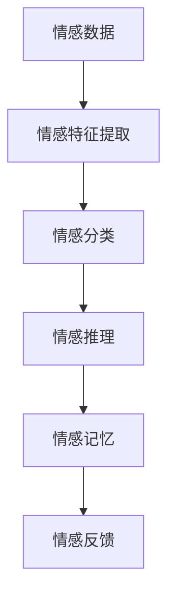
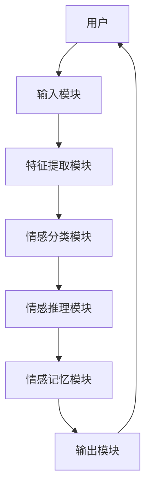

                 


# AI Agent 的情感计算：增强 LLM 的情感交互能力

> 关键词：情感计算，AI Agent，LLM，情感交互，自然语言处理，深度学习

> 摘要：本文深入探讨了AI Agent的情感计算能力，分析了当前大型语言模型（LLM）在情感交互中的不足，并提出了一种基于情感计算的增强方法。通过数学模型、算法原理和系统设计的详细讲解，本文展示了如何通过情感计算提升LLM的交互体验，为AI Agent的情感智能发展提供了新的思路。

---

## 第一部分: AI Agent 的情感计算基础

## 第1章: 情感计算与AI Agent概述

### 1.1 情感计算的核心概念

#### 1.1.1 情感计算的定义与背景
情感计算（Affective Computing）是一种通过计算技术来识别、理解和模拟人类情感的新兴领域。它结合了心理学、认知科学和计算机科学，旨在使计算机系统能够像人类一样感知和处理情感信息。

AI Agent（智能体）是一种能够感知环境并采取行动以实现目标的实体。在情感计算的加持下，AI Agent能够理解并回应用户的情感状态，从而提供更智能化和个性化的服务。

#### 1.1.2 AI Agent 的定义与特点
AI Agent可以分为两类：反应式和认知式。反应式Agent仅基于当前感知做出反应，而认知式Agent则具备推理和规划能力。情感计算增强了AI Agent的“情感智能”，使其能够理解用户的情感需求。

#### 1.1.3 情感计算在AI Agent中的作用
情感计算使AI Agent能够：
1. 理解用户的情感状态（如高兴、悲伤、愤怒）。
2. 根据情感反馈调整交互策略。
3. 提供更具人性化和个性化的服务。

### 1.2 情感计算的问题背景

#### 1.2.1 当前LLM在情感交互中的不足
尽管大型语言模型（如GPT-3）在文本生成和理解方面表现出色，但它们在情感交互上存在以下问题：
- **情感理解深度不足**：难以捕捉复杂的情感 nuances。
- **情感一致性缺失**：在长期对话中缺乏情感连贯性。
- **情感反馈机制缺失**：无法根据用户情感动态调整响应。

#### 1.2.2 情感计算的必要性与重要性
情感计算是实现真正智能交互的关键，它能够：
1. 提升用户体验。
2. 增强人机信任关系。
3. 扩展AI Agent的应用场景（如心理健康支持、教育辅助等）。

#### 1.2.3 情感计算的应用场景与边界
情感计算适用于以下场景：
- 情感支持：帮助用户缓解压力。
- 教育：根据学生情绪提供个性化教学。
- 健康监测：通过情感分析预测心理健康问题。

边界包括：
- 避免过度解读：防止误判情感状态。
- 保护隐私：确保情感数据的安全。

### 1.3 情感计算的解决方法与核心要素

#### 1.3.1 解决方法概述
通过结合自然语言处理（NLP）、机器学习和情感计算技术，可以实现以下目标：
- 情感识别：从文本中提取情感信息。
- 情感推理：理解情感的上下文和逻辑关系。
- 情感记忆：维护长期的情感状态。

#### 1.3.2 核心要素组成
- **情感数据**：输入文本、语音或面部表情。
- **情感模型**：用于分析和预测情感的算法。
- **情感记忆**：存储和更新情感状态的机制。
- **情感反馈**：根据情感状态调整交互策略。

---

## 第2章: 情感计算的核心概念与联系

### 2.1 情感计算的原理与特征

#### 2.1.1 情感计算的基本原理
情感计算涉及以下步骤：
1. 情感数据采集：通过文本、语音或图像获取情感信息。
2. 情感特征提取：识别关键情感相关特征。
3. 情感分类：利用机器学习模型预测情感类别。
4. 情感推理：理解情感的逻辑关系和因果关系。
5. 情感记忆：维护情感状态的长期记忆。

#### 2.1.2 情感计算的特征对比
| 特性 | 情感计算 | 传统计算 |
|------|----------|----------|
| 数据源 | 文本、语音、图像 | 结构化数据 |
| 目标 | 理解情感 | 计算数值 |
| 方法 | 基于规则和机器学习 | 确定性算法 |

#### 2.1.3 情感计算与传统计算的差异
情感计算更具动态性和不确定性，需要处理模糊和复杂的情感信息。传统计算则基于明确的规则和结构化数据。

### 2.2 情感计算的实体关系图

#### 2.2.1 情感计算的ER实体关系图
```mermaid
er
    entity 情感状态 {
        id 情感ID [PK]
        情感类型 类型 [FK]
        情感强度 强度
        时间戳 timestamp
    }
    entity 情感类型 {
        id 类型ID [PK]
        类型名称 name
    }
    entity 情感数据 {
        id 数据ID [PK]
        数据内容 content
        数据来源 source
        关联的情感状态 情感状态 [M]
    }
    情感数据 --> 情感状态
```

#### 2.2.2 情感数据流的流程图


---

## 第3章: 情感计算的算法原理

### 3.1 情感计算的核心算法

#### 3.1.1 基于规则的情感分析算法
基于规则的算法通过预定义的情感词典和语法规则来判断情感倾向。例如：
1. 将文本分词。
2. 查找情感词典中的关键词。
3. 根据关键词的位置和权重计算情感倾向。

#### 3.1.2 基于机器学习的情感分类算法
基于机器学习的算法利用训练数据提取特征并训练分类器。常用算法包括：
- 支持向量机（SVM）
- 朴素贝叶斯（Naive Bayes）
- 深度学习模型（如LSTM）

#### 3.1.3 情感记忆与推理算法
情感记忆算法维护用户的情感状态，用于长期记忆。推理算法分析情感之间的逻辑关系，例如：
- 如果用户连续表达负面情绪，AI Agent需要调整交互策略。

### 3.2 情感计算的数学模型

#### 3.2.1 情感相似度计算公式
$$ \text{相似度} = \frac{\sum_{i=1}^{n} w_i \cdot s_i}{\sum_{i=1}^{n} w_i} $$

其中：
- $w_i$ 是第$i$个特征的权重。
- $s_i$ 是第$i$个特征的相似度评分。

#### 3.2.2 情感强度预测模型
$$ P(y|x) = \frac{\exp(w \cdot x)}{\sum_{k} \exp(w_k \cdot x)} $$

其中：
- $y$ 是情感类别。
- $x$ 是输入特征向量。
- $w$ 是模型权重。

---

## 第4章: 情感计算的系统分析与架构设计

### 4.1 情感计算的系统场景

#### 4.1.1 情感交互的典型场景
1. 用户与AI Agent进行对话，表达情感需求。
2. AI Agent根据情感状态调整响应策略。

#### 4.1.2 系统功能需求
- 情感数据采集：文本、语音或图像。
- 情感特征提取：识别情感相关特征。
- 情感分类：判断情感类别。
- 情感推理：理解情感逻辑。
- 情感记忆：维护情感状态。

### 4.2 情感计算的系统架构设计

#### 4.2.1 系统架构图


#### 4.2.2 模块划分与交互流程
- 输入模块：接收用户输入。
- 特征提取模块：提取情感特征。
- 情感分类模块：预测情感类别。
- 情感推理模块：理解情感逻辑。
- 情感记忆模块：维护情感状态。
- 输出模块：生成个性化响应。

---

## 第5章: 情感计算的项目实战

### 5.1 环境安装与配置

#### 5.1.1 安装Python环境
```bash
python --version
pip install numpy scikit-learn
```

#### 5.1.2 安装情感计算库
```bash
pip install textblob
pip install spacy
```

### 5.2 核心代码实现

#### 5.2.1 情感特征提取
```python
from textblob import TextBlob

def extract_features(text):
    blob = TextBlob(text)
    features = {
        'polarity': blob.polarity,
        'subjectivity': blob.subjectivity
    }
    return features
```

#### 5.2.2 情感分类模型
```python
from sklearn.svm import SVC
from sklearn.feature_extraction.text import TfidfVectorizer

vectorizer = TfidfVectorizer()
model = SVC()
model.fit(vectorizer.fit_transform(train_texts), train_labels)
```

#### 5.2.3 情感记忆模块
```python
class EmotionMemory:
    def __init__(self):
        self.memory = {}
    
    def update(self, emotion, timestamp):
        self.memory[timestamp] = emotion
    
    def get_recent_emotion(self, timestamp):
        return self.memory.get(timestamp, 'neutral')
```

### 5.3 代码解读与应用

#### 5.3.1 情感特征提取
上述代码使用TextBlob库提取文本的情感极性和主体性特征。

#### 5.3.2 情感分类模型
TF-IDF向量化文本特征，SVM模型进行情感分类。

#### 5.3.3 情感记忆模块
该模块维护用户的情感状态，记录每个时间点的情感值，用于后续推理和反馈。

### 5.4 实际案例分析

#### 5.4.1 情感交互案例
用户输入：“我今天心情很糟糕。”
AI Agent提取情感特征并分类为“悲伤”。
根据情感记忆，AI Agent调整后续交互策略，例如提供安慰或建议。

---

## 第6章: 情感计算的总结与展望

### 6.1 最佳实践 tips
- 结合上下文进行情感推理。
- 使用多样化的数据进行模型训练。
- 定期更新情感词典和特征模型。

### 6.2 小结
情感计算使AI Agent具备情感智能，能够理解并回应用户情感需求，显著提升交互体验。

### 6.3 注意事项
- 情感计算存在不确定性，需谨慎处理。
- 保护用户隐私，确保情感数据安全。

### 6.4 拓展阅读
建议阅读《Affective Computing》（ Rafael A. Calvo 等著）了解更多情感计算理论。

---

## 作者：AI天才研究院/AI Genius Institute & 禅与计算机程序设计艺术 /Zen And The Art of Computer Programming

---

这篇文章通过详细讲解情感计算的背景、原理、算法和系统设计，结合实际案例分析，全面展示了如何增强LLM的情感交互能力。从理论到实践，为AI Agent的情感智能发展提供了系统化的解决方案。

