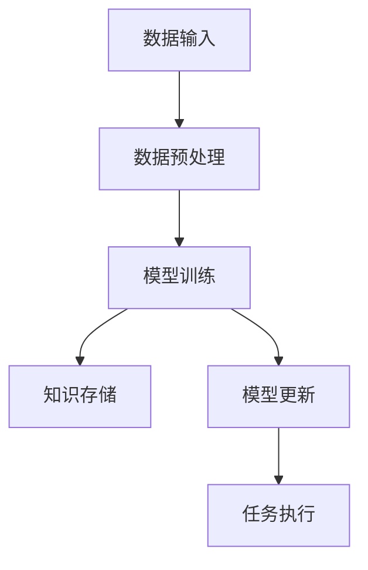

                 


# AI Agent 的持续学习：实现 LLM 的终身学习能力

> 关键词：AI Agent，持续学习，LLM，终身学习，增量学习，知识蒸馏

> 摘要：本文探讨了如何通过持续学习的方法，赋予大语言模型（LLM）终身学习的能力，使AI Agent能够不断适应新任务和环境变化。文章从AI Agent和LLM的基本概念出发，分析了持续学习的必要性，详细介绍了增量学习算法、模型优化方法和系统架构设计，并通过实际案例展示了如何实现和应用这些技术。

---

## 第一部分: AI Agent 和 LLM 的基本概念

### 第1章: AI Agent 的定义与特点

#### 1.1 AI Agent 的定义
AI Agent 是指能够感知环境、做出决策并采取行动的智能体。它可以是一个软件程序或物理设备，通过与环境的交互，完成特定任务。

#### 1.2 AI Agent 的核心特点
- **自主性**：AI Agent能够在没有外部干预的情况下自主运行。
- **反应性**：能够实时感知环境并做出反应。
- **目标导向**：具有明确的目标，并采取行动以实现这些目标。
- **学习能力**：能够通过经验改进自身的性能。

#### 1.3 AI Agent 与传统AI 的区别
| 特性 | AI Agent | 传统AI |
|------|-----------|--------|
| 自主性 | 高        | 中/低  |
| 适应性 | 强        | 较弱    |
| 交互能力 | 强        | 较弱    |

### 第2章: 大语言模型（LLM）的基本概念

#### 2.1 LLM 的定义
大语言模型（LLM）是基于深度学习的自然语言处理模型，具有强大的语言理解和生成能力。

#### 2.2 LLM 的核心特点
- **大规模训练**：通常使用大量的文本数据进行训练。
- **上下文理解**：能够理解上下文，生成连贯的文本。
- **多任务能力**：可以执行多种NLP任务，如翻译、问答、摘要等。

#### 2.3 LLM 与传统NLP 模型的区别
| 特性 | LLM | 传统NLP模型 |
|------|------|-------------|
| 训练数据 | 大规模 | 较小规模    |
| 多任务能力 | 强 | 较弱        |
| 自然度 | 高 | 较低        |

### 第3章: AI Agent 和 LLM 的关系

#### 3.1 AI Agent 使用 LLM 的方式
AI Agent 可以通过调用 LLM API，利用其语言处理能力完成任务，如理解用户指令、生成回答等。

#### 3.2 LLM 在 AI Agent 中的角色
- **语言理解**：帮助AI Agent理解用户的输入。
- **决策支持**：提供上下文相关的建议或信息。
- **生成能力**：生成自然语言输出，与用户交互。

---

## 第二部分: 持续学习的背景与挑战

### 第4章: 持续学习的定义与特点

#### 4.1 持续学习的定义
持续学习（Continual Learning）是指模型在不断变化的环境中，逐步学习新任务，同时保持旧任务性能的能力。

#### 4.2 持续学习的核心特点
- **在线学习**：模型在接收数据流时进行学习，而不是一次性训练。
- **任务增量**：模型能够处理新任务，而不需要重新训练整个模型。
- **知识保持**：在学习新任务时，保持旧任务的知识和性能。

#### 4.3 持续学习与传统学习的区别
| 特性 | 持续学习 | 传统学习 |
|------|----------|----------|
| 数据提供方式 | 流式 | 批式      |
| 任务数量 | 多任务 | 单任务    |
| 知识保持 | 强调 | 通常不强调 |

---

## 第三部分: 持续学习的实现方法

### 第5章: 增量学习算法

#### 5.1 增量学习算法的核心原理
增量学习算法通过逐步处理数据，更新模型参数，实现对新任务的学习。

#### 5.2 常见的增量学习算法
- **经验重放（Experience Replay）**：存储过去的经验，并随机抽取样本进行训练，防止遗忘。
- **渐近式神经网络（Progressive Neural Networks）**：通过添加新层或模块，逐步扩展模型能力。
- **知识蒸馏（Knowledge Distillation）**：将大型模型的知识迁移到更小的模型中，实现轻量化。

#### 5.3 经验重放算法的实现步骤
1. **存储经验**：将每次交互的经验存储在经验回放器中。
2. **随机采样**：从回放器中随机抽取样本进行训练。
3. **更新模型**：基于抽取的样本，更新模型参数。

### 第6章: 模型优化方法

#### 6.1 模型优化的核心目标
- 防止灾难性遗忘。
- 提高模型的泛化能力。

#### 6.2 常见的模型优化方法
- **弹性权重（Elastic Weight）**：通过调整权重，保持旧任务的知识。
- **门控机制（Gate Mechanism）**：通过门控单元，控制新旧任务的信息流。
- **记忆网络（Memory Networks）**：使用外部存储器，记录重要的信息。

#### 6.3 灾难性遗忘的解决方案
- **渐进式神经网络**：通过逐步扩展网络结构，减少旧任务的干扰。
- **经验重放**：通过重复采样旧数据，加强旧任务的学习。

### 第7章: 系统架构设计

#### 7.1 系统功能模块
- **数据输入模块**：接收新的数据流。
- **模型训练模块**：执行增量学习算法，更新模型参数。
- **知识存储模块**：保存重要的经验或知识。
- **应用执行模块**：根据模型输出，执行具体任务。

#### 7.2 系统架构图


---

## 第四部分: 项目实战与案例分析

### 第8章: 项目环境安装

#### 8.1 安装 Python 和必要的库
```bash
pip install numpy
pip install matplotlib
pip install torch
```

### 第9章: 核心代码实现

#### 9.1 经验重放算法的实现
```python
import numpy as np

class ExperienceReplay:
    def __init__(self, capacity):
        self.capacity = capacity
        self.memory = []
    
    def remember(self, experience):
        if len(self.memory) < self.capacity:
            self.memory.append(experience)
        else:
            self.memory.pop(0)
    
    def sample(self, batch_size):
        batch = np.random.choice(len(self.memory), batch_size)
        return [self.memory[i] for i in batch]
```

#### 9.2 知识蒸馏算法的实现
```python
import torch
import torch.nn as nn

class StudentModel(nn.Module):
    def __init__(self):
        super().__init__()
        self.fc = nn.Linear(10, 5)
    
    def forward(self, x):
        return torch.relu(self.fc(x))

class TeacherModel(nn.Module):
    def __init__(self):
        super().__init__()
        self.fc = nn.Linear(10, 5)
    
    def forward(self, x):
        return torch.relu(self.fc(x))

def knowledge_distillation(student, teacher, optimizer):
    criterion = nn.MSELoss()
    optimizer.zero_grad()
    outputs_student = student(input)
    outputs_teacher = teacher(input)
    loss = criterion(outputs_student, outputs_teacher)
    loss.backward()
    optimizer.step()
```

### 第10章: 案例分析与小结

#### 10.1 案例分析
通过一个简单的案例，展示如何使用经验重放和知识蒸馏实现持续学习。假设有一个分类任务，模型需要逐步学习新的类别，同时保持旧类别的分类能力。

#### 10.2 小结
本文通过理论分析和实际案例，展示了如何实现LLM的持续学习能力。通过经验重放、知识蒸馏等方法，可以在不遗忘旧知识的情况下，逐步学习新任务，赋予AI Agent终身学习的能力。

---

## 第五部分: 最佳实践与未来展望

### 第11章: 最佳实践 tips

#### 11.1 数据处理
- 确保数据的多样性和代表性。
- 处理数据中的噪声和偏差。

#### 11.2 模型选择
- 根据任务需求选择合适的模型架构。
- 考虑模型的可解释性和效率。

### 第12章: 未来展望

#### 12.1 持续学习的研究方向
- 更高效的增量学习算法。
- 更强的知识保持机制。

#### 12.2 AI Agent 的发展方向
- 更强大的多任务处理能力。
- 更高的自主性和适应性。

---

## 作者：AI天才研究院/AI Genius Institute & 禅与计算机程序设计艺术 /Zen And The Art of Computer Programming

---

本文详细探讨了AI Agent的持续学习能力，通过理论分析和实际案例，展示了如何实现LLM的终身学习能力。希望对读者在理解和应用持续学习技术方面有所帮助。

