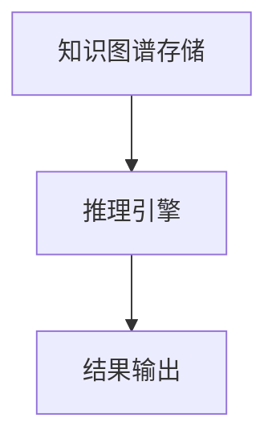
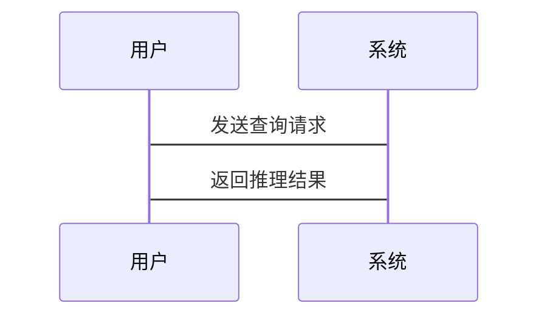

                 


# AI Agent 的知识图谱推理：增强 LLM 的关系理解

## 关键词：AI Agent，知识图谱，LLM，关系理解，推理算法，系统架构

## 摘要

AI Agent 作为人工智能领域的重要组成部分，其核心能力依赖于对知识的准确理解和推理。传统的基于统计的大型语言模型（LLM）虽然在文本生成和模式识别方面表现出色，但在关系理解和复杂推理方面存在明显不足。知识图谱作为一种结构化的知识表示形式，能够有效补充 LLM 的这些短板。本文将深入探讨 AI Agent 如何通过知识图谱推理来增强 LLM 的关系理解能力，包括知识图谱的构建、推理算法的设计与实现、系统架构的优化等方面。通过结合知识图谱的结构化知识和 LLM 的强大生成能力，AI Agent 将能够更准确地理解复杂关系，从而在智能问答、对话系统、自动推理等场景中展现出更强大的性能。

---

## 第1章 AI Agent与知识图谱概述

### 1.1 AI Agent的基本概念

#### 1.1.1 AI Agent的定义与特点
AI Agent（智能体）是指能够感知环境、自主决策并执行任务的智能系统。AI Agent 可以是软件程序、机器人或其他智能设备。其核心特点包括：
- **自主性**：无需外部干预，自主完成任务。
- **反应性**：能够感知环境并实时调整行为。
- **目标导向**：基于目标驱动决策和行动。
- **社交能力**：能够与其他 Agent 或人类进行交互。

#### 1.1.2 知识图谱的基本概念与结构
知识图谱是一种以结构化形式表示知识的网络，由实体（概念）和关系（属性）组成。例如，Google的Knowledge Graph、Wikidata等都是典型的知识图谱。其结构通常由三元组（头实体、关系、尾实体）构成，例如“苏格拉底是哲学家”。

#### 1.1.3 AI Agent与知识图谱的关系
AI Agent 的智能性依赖于知识的理解和推理能力，而知识图谱提供了结构化的知识表示，能够帮助 AI Agent 更高效地理解和推理复杂关系。

### 1.2 知识图谱的构建与应用

#### 1.2.1 知识图谱的构建流程
知识图谱的构建通常包括数据收集、数据清洗、实体识别、关系抽取、知识融合和存储等步骤。例如，可以从维基百科中抽取实体和关系，构建一个通用的知识图谱。

#### 1.2.2 知识图谱的主要技术与工具
常用的工具包括：
- **信息抽取**：从文本中提取实体和关系（如spaCy、NLTK）。
- **知识融合**：将多个知识源的数据整合（如Fuscept）。
- **知识存储**：使用图数据库（如Neo4j）存储三元组数据。

#### 1.2.3 知识图谱在AI Agent中的作用
知识图谱为AI Agent 提供了丰富的结构化知识，使其能够更准确地理解和推理复杂问题。

### 1.3 LLM与知识图谱的结合

#### 1.3.1 LLM的基本原理与特点
LLM（Large Language Model）通过深度学习技术训练大规模文本数据，具备强大的文本生成和模式识别能力。例如，GPT-3能够生成连贯的自然语言文本，但其在关系理解和推理方面的能力有限。

#### 1.3.2 知识图谱如何增强LLM的关系理解
知识图谱提供了结构化的知识，能够帮助LLM补充外部知识，提升其在关系推理和复杂问题解决方面的能力。

#### 1.3.3 当前LLM在关系理解中的局限性
- **缺乏结构化知识**：LLM通常基于统计模式，难以理解复杂的关系结构。
- **推理能力有限**：LLM难以进行多步推理，尤其在处理复杂问题时容易出错。

---

## 第2章 知识图谱推理的核心概念

### 2.1 知识图谱推理的定义与分类

#### 2.1.1 基于符号的推理
基于符号逻辑的推理，例如使用谓词逻辑进行推理。优点是逻辑清晰，但计算复杂度较高。

#### 2.1.2 基于概率的推理
基于概率论的推理方法，例如贝叶斯网络。适用于处理不确定性较高的问题。

#### 2.1.3 基于深度学习的推理
基于神经网络的推理方法，例如图神经网络。能够处理大规模数据，但需要大量训练数据。

### 2.2 知识图谱推理的关键技术

#### 2.2.1 知识表示与推理规则
知识表示通常采用符号化或嵌入式表示。推理规则包括逻辑规则和统计规则。

#### 2.2.2 知识图谱中的实体与关系
实体是知识图谱的基本单元，关系描述实体之间的关联。例如，在知识图谱中，“人名”和“职业”是常见的实体和关系。

#### 2.2.3 推理算法的选择与优化
选择推理算法时需要考虑计算效率、准确性和复杂度等因素。例如，基于规则的推理适用于小规模推理，而基于概率的推理适用于大规模复杂推理。

### 2.3 知识图谱推理的数学模型

#### 2.3.1 基于符号逻辑的推理模型
符号逻辑推理模型通常使用谓词逻辑，例如：
$$ P(x) \land Q(x) \rightarrow R(x) $$
其中，$P(x)$ 表示“x是人”，$Q(x)$ 表示“x是医生”，$R(x)$ 表示“x是专家”。

#### 2.3.2 基于概率论的推理模型
贝叶斯网络是一种常用的概率推理模型。例如，计算在已知“x是医生”的情况下，“x是专家”的概率。

#### 2.3.3 基于神经网络的推理模型
图神经网络（GNN）是一种常用的深度学习推理模型。其基本思想是将知识图谱中的实体和关系表示为图的节点和边，然后通过神经网络进行推理。

---

## 第3章 知识图谱推理的算法原理

### 3.1 基于规则的推理算法

#### 3.1.1 规则表示与匹配
规则表示通常采用一阶逻辑或正则表达式。例如，规则“如果一个人是医生，那么他是专家”可以用一阶逻辑表示为：
$$ \forall x (Doctor(x) \rightarrow Expert(x)) $$

#### 3.1.2 基于规则的推理步骤
1. **规则匹配**：在知识图谱中找到与规则匹配的部分。
2. **推理推理**：根据匹配的规则进行推理，得出结论。

#### 3.1.3 规则库的构建与管理
规则库的构建需要考虑规则的覆盖范围和冲突问题。例如，可以通过优先级来管理冲突的规则。

### 3.2 基于符号逻辑的推理算法

#### 3.2.1 符号逻辑的基本概念
符号逻辑是知识表示和推理的基础，通常包括命题逻辑和谓词逻辑。

#### 3.2.2 基于逻辑推理的算法实现
基于逻辑推理的算法通常采用正向推理或反向推理。例如，正向推理是从已知事实出发，推导出新的结论。

#### 3.2.3 逻辑推理的复杂性分析
逻辑推理的复杂性主要取决于知识图谱的规模和推理规则的复杂性。例如，一阶逻辑推理是NP难的问题。

### 3.3 基于概率的推理算法

#### 3.3.1 概率推理的基本原理
概率推理是基于概率论的推理方法，通常用于处理不确定性问题。

#### 3.3.2 基于贝叶斯网络的推理算法
贝叶斯网络是一种常用的概率推理模型。例如，计算在已知“x是医生”的情况下，“x是专家”的概率。

#### 3.3.3 概率推理的优缺点分析
概率推理的优点是能够处理不确定性，缺点是计算复杂度较高。

---

## 第4章 知识图谱推理的系统架构设计

### 4.1 系统功能设计

#### 4.1.1 知识图谱的存储与管理
知识图谱的存储通常采用图数据库，例如Neo4j。数据管理包括数据的查询、更新和删除。

#### 4.1.2 推理算法的实现与优化
推理算法的实现需要考虑计算效率和准确性。例如，可以通过剪枝优化来提高推理效率。

#### 4.1.3 系统的输入输出接口设计
系统的接口设计需要考虑输入和输出的格式。例如，输入可以是自然语言查询，输出可以是结构化的推理结果。

### 4.2 系统架构图



### 4.3 系统交互设计



---

## 第5章 项目实战

### 5.1 环境安装

```bash
pip install neo4j==4.3.0
pip install spacy
```

### 5.2 系统核心实现源代码

```python
from neo4j import GraphDatabase
from spacy.lang.zh import Chinese

# 知识图谱存储
class KnowledgeGraph:
    def __init__(self, uri, user, password):
        self.graph_db = GraphDatabase.driver(uri, auth=(user, password))
        
    def get_entity(self, entity):
        # 查询实体
        with self.graph_db.session() as session:
            result = session.run("MATCH (n:{}) RETURN n".format(entity))
            return [record["n"] for record in result]

# 推理算法实现
class ReasoningEngine:
    def __init__(self, kg):
        self.kg = kg
        
    def infer(self, head, relation, tail):
        # 简单的推理算法
        entities = self.kg.get_entity(head)
        for entity in entities:
            if relation in entity.relationships:
                return entity.relationships[relation]
        return None
```

### 5.3 案例分析与详细解读

假设我们有一个简单的知识图谱，包含“人名”和“职业”两个实体。例如：

```plaintext
苏格拉底 -> 职业 -> 哲学家
柏拉图 -> 职业 -> 哲学家
```

当我们查询“苏格拉底的职业是什么？”时，推理引擎会通过知识图谱查询，返回“哲学家”。

---

## 第6章 总结与展望

### 6.1 小结
本文详细探讨了AI Agent 如何通过知识图谱推理来增强 LLM 的关系理解能力。通过结合知识图谱的结构化知识和 LLM 的强大生成能力，AI Agent 将能够更准确地理解和推理复杂关系。

### 6.2 最佳实践 tips
- 在实际应用中，需要根据具体场景选择合适的推理算法。
- 知识图谱的构建和维护需要投入大量的时间和资源。
- 为了提高推理效率，可以采用混合推理方法（符号推理与概率推理结合）。

### 6.3 展望
未来，随着深度学习和符号逻辑的进一步融合，知识图谱推理将更加高效和智能。同时，随着大规模预训练模型的不断发展，知识图谱推理在 AI Agent 中的应用前景将更加广阔。

---

## 作者：AI天才研究院/AI Genius Institute & 禅与计算机程序设计艺术 /Zen And The Art of Computer Programming

---

**文章总结**：通过结合知识图谱的结构化知识和 LLM 的强大生成能力，AI Agent 将能够更准确地理解和推理复杂关系，从而在智能问答、对话系统、自动推理等场景中展现出更强大的性能。

