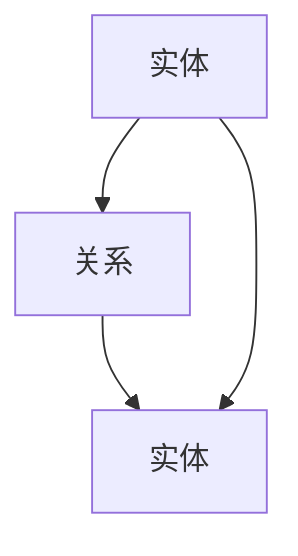
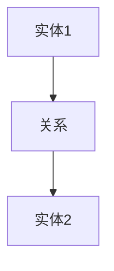
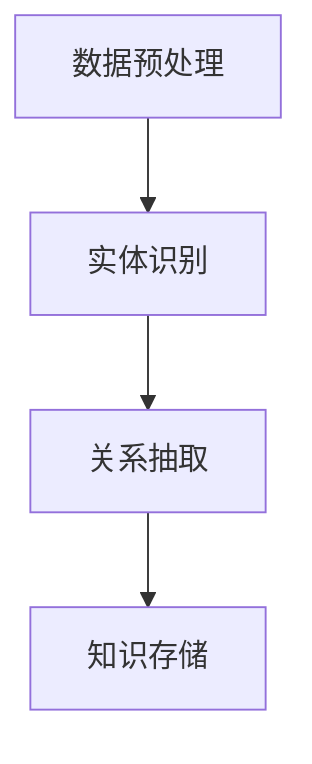

                 


# AI Agent 的知识图谱构建：从 LLM 输出中提取结构化知识

---

## 关键词：
AI Agent, 知识图谱, 大语言模型, 结构化知识, 实体识别, 关系抽取

---

## 摘要：
本文详细探讨了AI Agent的知识图谱构建过程，特别是从大语言模型（LLM）的输出中提取结构化知识的方法。通过分析知识图谱的核心概念、构建算法、系统架构设计以及实际案例，本文为读者提供了从理论到实践的全面指导，帮助技术人员认识如何利用LLM输出构建高效的AI Agent知识图谱。

---

## 正文

---

## 第一部分：背景与核心概念

### 第1章：知识图谱与AI Agent概述

#### 1.1 知识图谱的基本概念
知识图谱是一种以实体和关系为基础的知识表示方式，能够将分散在不同数据源中的信息整合成一个统一的语义网络。知识图谱的核心要素包括实体、关系和属性，其中实体是知识图谱的基本单元，关系描述实体之间的关联，属性则为实体或关系提供额外的描述信息。

**表格：实体与关系的对比**

| 属性维度 | 实体 | 关系 |
|----------|------|------|
| 定义     | 代表具体事物或概念 | 描述实体之间的关联 |
| 示例     | "苹果"、"iPhone" | "苹果公司生产iPhone" |

**Mermaid 实体关系图**



#### 1.2 AI Agent 的基本概念
AI Agent 是一种智能体，能够感知环境并执行任务以实现目标。AI Agent 的核心能力包括感知、推理、规划和学习。知识图谱作为AI Agent 的知识库，为其提供了丰富的语义信息，帮助其更准确地理解和执行任务。

#### 1.3 大语言模型（LLM）的输出特点
大语言模型通过生成文本输出对问题进行回答或生成内容。LLM 的输出通常是非结构化的文本，需要通过特定的算法提取其中的结构化知识，如实体和关系。

---

### 第2章：知识图谱构建的核心概念

#### 2.1 实体与关系的定义
实体是知识图谱的基本单元，可以是具体事物（如“苹果”）或抽象概念（如“水果”）。关系描述实体之间的关联，如“苹果是一种水果”。

#### 2.2 知识图谱的属性与结构
知识图谱中的实体和关系可以具有属性，如“苹果”可能有属性“颜色”和“形状”。知识图谱的层次化结构有助于更好地组织和管理知识。

#### 2.3 知识图谱的构建流程
知识图谱的构建通常包括数据采集、预处理、实体识别、关系抽取和知识融合等步骤。

---

### 第3章：核心概念的联系与对比

#### 3.1 实体与关系的属性对比
通过对比实体和关系的属性，可以更好地理解它们在知识图谱中的作用。

**表格：实体与关系的属性对比**

| 属性维度 | 实体 | 关系 |
|----------|------|------|
| 属性类型 | 名词或名词短语 | 动词或动词短语 |
| 示例     | "苹果" | "属于" |

#### 3.2 知识图谱的实体关系图
通过Mermaid图展示实体和关系的组织结构，帮助读者更好地理解知识图谱的构建方式。

**Mermaid 实体关系图**



---

## 第二部分：算法原理与数学模型

### 第4章：知识抽取算法原理

#### 4.1 实体识别算法
实体识别是将文本中的实体提取出来并进行分类的过程。常用的算法包括基于规则的识别和深度学习模型（如CRF）。

**Python 实现示例**

```python
import spacy

# 加载模型
nlp = spacy.load("en_core_web_sm")

# 处理文本
text = "Apple is a tech company."
doc = nlp(text)

# 提取实体
entities = [(ent.text, ent.label_) for ent in doc.ents]
print(entities)  # 输出：[('Apple', 'ORG'), ('company', 'ORG')]
```

#### 4.2 关系抽取算法
关系抽取是识别文本中实体之间的关系并进行分类的过程。常用的算法包括基于规则的方法和深度学习模型（如RNN和BERT）。

**数学模型示例**

关系抽取可以通过分类模型实现，其中输入是实体对，输出是它们之间的关系。

$$ P(r | e1, e2) = \frac{N(r, e1, e2)}{\sum_{r'} N(r', e1, e2)} $$

其中，\( N(r, e1, e2) \) 表示实体对 \( (e1, e2) \) 以关系 \( r \) 出现的次数。

---

### 第5章：数学模型与公式

#### 5.1 实体识别的概率模型
实体识别可以使用概率模型来计算每个词属于某个实体类别的概率。

$$ P(e_i | w) = \frac{P(w | e_i) \cdot P(e_i)}{\sum_{e_j} P(w | e_j) \cdot P(e_j)} $$

其中，\( e_i \) 是实体类别，\( w \) 是单词。

#### 5.2 关系抽取的向量空间模型
关系抽取可以使用向量空间模型，将实体对表示为向量，并计算它们之间的相似度。

$$ sim(e1, e2) = \frac{e1 \cdot e2}{\|e1\| \|e2\|} $$

其中，\( e1 \) 和 \( e2 \) 分别是两个实体的向量表示。

---

## 第三部分：系统分析与架构设计

### 第6章：系统分析与架构设计

#### 6.1 系统架构设计
知识图谱构建系统通常包括以下几个模块：

1. 数据预处理模块：对文本数据进行清洗和分词。
2. 实体识别模块：识别文本中的实体并进行分类。
3. 关系抽取模块：识别实体之间的关系并进行分类。
4. 知识存储模块：将提取的知识存储到知识库中。

**Mermaid 系统架构图**



#### 6.2 系统接口设计
系统接口通常包括以下几种：

1. 数据输入接口：接收文本数据。
2. 数据处理接口：对文本数据进行处理并返回结构化知识。
3. 知识查询接口：根据查询条件返回相关的知识。

#### 6.3 系统交互流程
系统的交互流程如下：

1. 用户通过数据输入接口提交文本数据。
2. 系统对文本数据进行预处理，包括分词和去停用词。
3. 系统调用实体识别模块，识别文本中的实体。
4. 系统调用关系抽取模块，识别实体之间的关系。
5. 系统将提取的知识存储到知识库中。
6. 用户通过知识查询接口查询知识库中的相关内容。

---

## 第四部分：项目实战

### 第7章：项目实战

#### 7.1 环境配置
需要安装以下依赖：

```bash
pip install spacy transformers
```

#### 7.2 核心实现代码

```python
import spacy
from transformers import pipeline

# 加载实体识别模型
nlp = spacy.load("en_core_web_sm")

# 加载关系抽取模型
re_model = pipeline("relation-extraction")

# 文本数据
text = "Apple is a tech company. Apple was founded in 1971."

# 实体识别
doc = nlp(text)
entities = [(ent.text, ent.label_) for ent in doc.ents]
print("实体识别结果：", entities)

# 关系抽取
result = re_model(text)
relations = [(r["subject"], r["relation"], r["object"]) for r in result]
print("关系抽取结果：", relations)
```

#### 7.3 案例分析
以医疗领域为例，从医学文献中提取疾病和症状的关系。

**输入文本：**
"高血压是一种常见的慢性疾病，通常表现为头痛、头晕等症状。"

**输出结果：**
实体识别：("高血压", "疾病"), ("头痛", "症状"), ("头晕", "症状")

关系抽取：("高血压", "症状", "头痛"), ("高血压", "症状", "头晕")

---

## 第五部分：最佳实践与注意事项

### 第8章：最佳实践

#### 8.1 数据预处理
数据预处理是知识图谱构建的关键步骤。建议对文本数据进行清洗、分词和去停用词处理，以提高实体识别和关系抽取的准确性。

#### 8.2 模型调优
根据具体任务需求，选择合适的模型和参数设置。可以通过交叉验证和网格搜索等方法进行模型调优。

#### 8.3 知识融合
在知识融合阶段，需要注意数据的冲突和冗余问题，确保知识库的准确性和一致性。

---

## 第六部分：未来展望与总结

### 第9章：未来展望

知识图谱和AI Agent 的结合将推动人工智能技术的发展。未来，随着大语言模型能力的提升和知识图谱构建技术的进步，AI Agent 将在更多领域发挥重要作用。

### 第10章：总结

本文详细探讨了AI Agent 的知识图谱构建过程，特别是从大语言模型输出中提取结构化知识的方法。通过理论分析、算法实现和实际案例，帮助读者全面理解知识图谱构建的核心技术和实践方法。

---

## 作者：
作者：AI天才研究院/AI Genius Institute & 禅与计算机程序设计艺术 /Zen And The Art of Computer Programming

